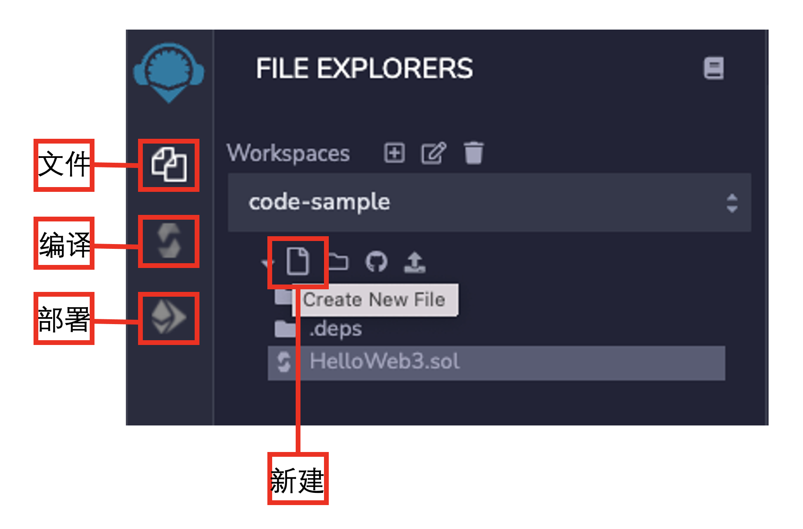
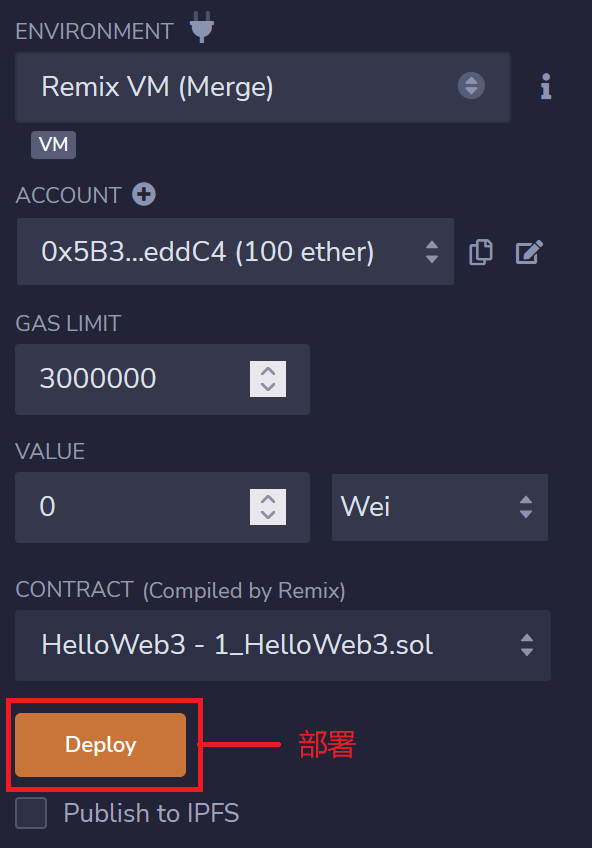

# Solidity极简入门: 1. HelloWeb3 (三行代码)

我最近在重新学solidity，巩固一下细节，也写一个“Solidity极简入门”，供小白们使用（编程大佬可以另找教程），每周更新1-3讲。

欢迎关注我的推特：[@0xAA_Science](https://twitter.com/0xAA_Science)

WTF技术社群discord，内有加微信群方法：[链接](https://discord.gg/5akcruXrsk)

所有代码和教程开源在github（1024个star发课程认证，2048个star发社群NFT）: [github.com/AmazingAng/WTFSolidity](https://github.com/AmazingAng/WTFSolidity)

-----

## Solidity简述
`Solidity`是以太坊虚拟机（`EVM`）智能合约的语言。同时，我认为`solidity`是玩链上项目必备的技能：区块链项目大部分是开源的，如果你能读懂代码，就可以规避很多亏钱项目。

`Solidity`具有两个特点：

1. 基于对象：学会之后，能帮你挣钱找对象。
2. 高级：不会`solidity`，在币圈显得很low。

## 开发工具：remix
本教程中，我会用`remix`来跑`solidity`合约。`remix`是以太坊官方推荐的智能合约开发IDE（集成开发环境），适合新手，可以在浏览器中快速部署测试智能合约，你不需要在本地安装任何程序。

网址：[remix.ethereum.org](https://remix.ethereum.org)

进入`remix`，我们可以看到最左边的菜单有三个按钮，分别对应文件（写代码的地方），编译（跑代码），部署（部署到链上）。我们点新建（`Create New File`）按钮，就可以创建一个空白的`solidity`合约。



## 第一个Solidity程序
很简单，只有1行注释+3行代码：
```solidity
// SPDX-License-Identifier: MIT
pragma solidity ^0.8.4;
contract HelloWeb3{
    string public _string = "Hello Web3!";}
```
我们拆开分析，学习solidity代码源文件的结构：
1. 第1行是注释，会写一下这个代码所用的软件许可（license），这里用的是MIT license。如果不写许可，编译时会警告（warning），但程序可以运行。solidity的注释由“//”开头，后面跟注释的内容（不会被程序运行）。
```solidity
// SPDX-License-Identifier: MIT
```
2. 第2行声明源文件所用的solidity版本，因为不同版本语法有差别。这行代码意思是源文件将不允许低于 0.8.4 版本并且不高于 0.9.0 的编译器编译（第二个条件由`^`提供）。Solidity 语句以分号（;）结尾。
```solidity
pragma solidity ^0.8.4;
```
    
3. 第3-4行是合约部分，第3行创建合约（contract），并声明合约的名字 HelloWeb3。第4行是合约的内容，我们声明了一个string（字符串）变量_string，并给他赋值 “Hello Web3!”。
```solidity
contract HelloWeb3{
    string public _string = "Hello Web3!";}
```
以后我们会更细的介绍solidity中的变量。

## 编译并部署代码
在编辑代码的页面，按ctrl+S就可以编译代码，非常方便。

编译好之后，点击左侧菜单的“部署”按钮，进入部署页面。



在默认情况下，remix会用JS虚拟机来模拟以太坊链，运行智能合约，类似在浏览器里跑一条测试链。并且remix会分配几个测试账户给你，每个里面有100 ETH（测试代币），可劲儿用。你点Deploy（黄色按钮），就可以部署咱们写好的合约了。


部署成功后，你会在下面看到名为`HelloWeb3`的合约，点击`_string`，就能看到我们代码中写的 “Hello Web3!” 了。

## 总结
这一讲，我们简单介绍了`solidity`，`remix`工具，并完成了第一个`solidity`程序--`HelloWeb3`。下面我们将继续`solidity`旅程！

### 中文solidity资料推荐：
1. [Solidity中文文档](https://solidity-cn.readthedocs.io/zh/develop/introduction-to-smart-contracts.html)（官方文档的中文翻译）

2. [崔棉大师solidity教程](https://space.bilibili.com/286084162) web3技术教学博主，我看他视频学到了很多 
