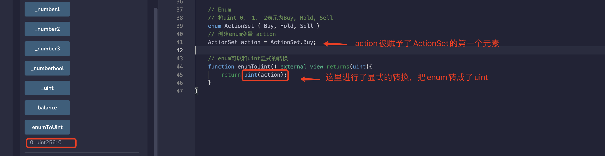

# Solidity极简入门:2. 数值类型

我最近在重新学solidity，巩固一下细节，也写一个“Solidity极简入门”，供小白们使用（编程大佬可以另找教程），每周更新1-3讲。

欢迎关注我的推特：[@0xAA_Science](https://twitter.com/0xAA_Science)

所有代码开源在github(64个star开微信交流群，已开[填表加入](https://docs.google.com/forms/d/e/1FAIpQLSe4KGT8Sh6sJ7hedQRuIYirOoZK_85miz3dw7vA1-YjodgJ-A/viewform)；128个star录教学视频): [github.com/AmazingAng/WTFSolidity](https://github.com/AmazingAng/WTFSolidity)

-----

### Solidity中的变量类型
1. **数值类型(Value Type)**：包括布尔型，整数型等等，这类变量赋值时候直接传递数值。

2. **引用类型(Reference Type)**：包括数组和结构体，这类变量占空间大，赋值时候直接传递地址（类似指针）。

3. **映射类型(Mapping Type)**: `Solidity`里的哈希表。

4. **函数类型(Function Type)**：`Solidity`文档里把函数归到数值类型，但我觉得他跟其他类型差别很大，所以单独分一类。

我们只介绍一些常用的类型，不常用的不讲。这篇介绍数值类型，第3讲介绍函数类型，第4讲介绍引用和映射。

## 数值类型
### 1. 布尔型
布尔型是二值变量，取值为`true`或`false`。
```
    // 布尔值
    bool public _bool = true;
```
布尔值的运算符，包括：

- ! （逻辑非）
- && （逻辑与， "and" ）
- || （逻辑或， "or" ）
- == （等于）
- != （不等于）

代码：

    // 布尔运算
    bool public _bool1 = !_bool; //取非
    bool public _bool2 = _bool && _bool1; //与
    bool public _bool3 = _bool || _bool1; //或
    bool public _bool4 = _bool == _bool1; //相等
    bool public _bool5 = _bool != _bool1; //不相等
上面的代码中：变量`_bool`的取值是`true`；`_bool1`是`_bool`的非，为`false`；`_bool && _bool1`为`false`；`_bool || _bool1`为`true`；`_bool == _bool1`为`false`；`_bool != _bool1`为`true`。
**值得注意的是：**`&&` 和 `||`运算符遵循短路规则，这意味着，假如存在`f(x) || g(y)`的表达式，如果`f(x)`是`true`，`g(y)`不会被计算，即使它和`f(x)`的结果是相反的

### 2. 整型
整型是`solidity`中的整数，最常用的包括
```solidity
    // 整型
    int public _int = -1; // 整数，包括负数
    uint public _uint = 1; // 正整数
    uint256 public _number = 20220330; // 256位正整数
```
常用的整型运算符包括：

- 比较运算符（返回布尔值）： `<=`， `<`， `==`， `!=`， `>=`， `>` 
- 算数运算符： `+`， `-`， 一元运算 `-`， `+`， `*`， `/`， `%`（取余），`**`（幂）

代码：
```solidity
    // 整数运算
    uint256 public _number1 = _number + 1; // +，-，*，/
    uint256 public _number2 = 2**2; // 指数
    uint256 public _number3 = 7 % 2; // 取余数
    bool public _numberbool = _number2 > _number3; // 比大小
```
大家可以跑一下代码，看看这4个变量分别是多少。答对奖励个`POAP`？

### 3. 地址类型
地址类型(address)存储一个 20 字节的值（以太坊地址的大小）。地址类型也有成员变量，并作为所有合约的基础。有普通的地址和可以转账`ETH`的地址（`payable`）。`payable`的地址拥有`balance`和`tranfer()`两个成员，方便查询`ETH`余额以及转账。

代码
```solidity
    // 地址
    address public _address = 0x7A58c0Be72BE218B41C608b7Fe7C5bB630736C71;
    address payable public _address1 = payable(_address); // payable address，可以转账、查余额
    // 地址类型的成员
    uint256 public balance = _address1.balance; // balance of address
```
下一讲介绍函数的时候，会介绍如何使用地址类型。

### 4. 定长字节数组
字节数组`bytes`分两种，一种定长（`byte`, `bytes8`, `bytes32`），另一种不定长。定长的属于数值类型，不定长的是引用类型（之后讲）。
定长`bytes`可以存一些数据，消耗`gas`比较少。

代码：
```solidity
    // 固定长度的字节数组
    bytes32 public _byte32 = "MiniSolidity"; 
    bytes1 public _byte = _byte32[0]; 
```
`MiniSolidity`变量以字节的方式存储进变量`_byte32`，转换成`16进制`为：`0x4d696e69536f6c69646974790000000000000000000000000000000000000000`

`_byte`变量存储`_byte32`的第一个字节，为`0x4d`。

### 5. 枚举 enum
枚举（`enum`）是`solidity`中用户定义的数据类型。它主要用于为`uint`分配名称，是程序易于阅读和维护。它与`C语言`中的`enum`类似，把名称从`0`开始`uint`表示：
```solidity
    // 用enum将uint 0， 1， 2表示为Buy, Hold, Sell
    enum ActionSet { Buy, Hold, Sell }
    // 创建enum变量 action
    ActionSet action = ActionSet.Buy;
```
它可以显式的和`uint`相互转换，并会检查转换的正整数是否在枚举的长度内，不然会报错：
```solidity
    // enum可以和uint显式的转换
    function enumToUint() external view returns(uint){
        return uint(action);
    }
```
`enum`的一个比较冷门的变量，几乎没什么人用。

## 在remix上验证
- 部署合约后可以查看每个类型的变量具体的数值

  
- enum和uint转换的示例


## 总结
在第二讲，我们介绍了`solidity`中4种变量类型，并详细介绍了数值变量（`value type`)中的布尔型，整型，地址，定长字节数组和枚举。之后我们会介绍其他几种类型。

