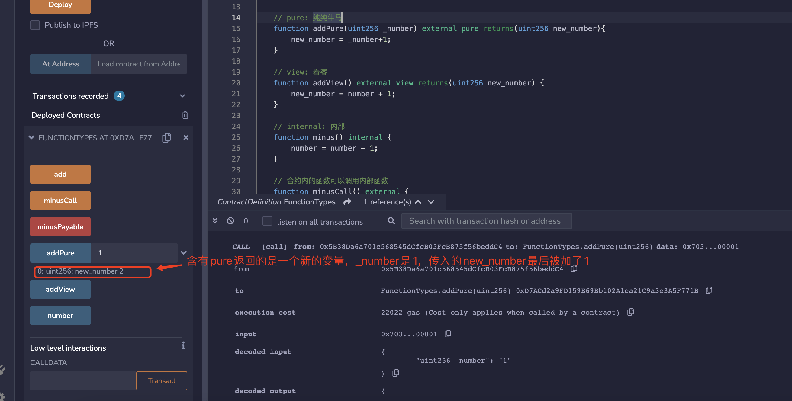
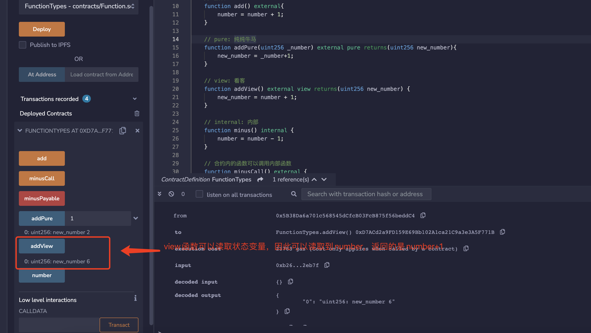
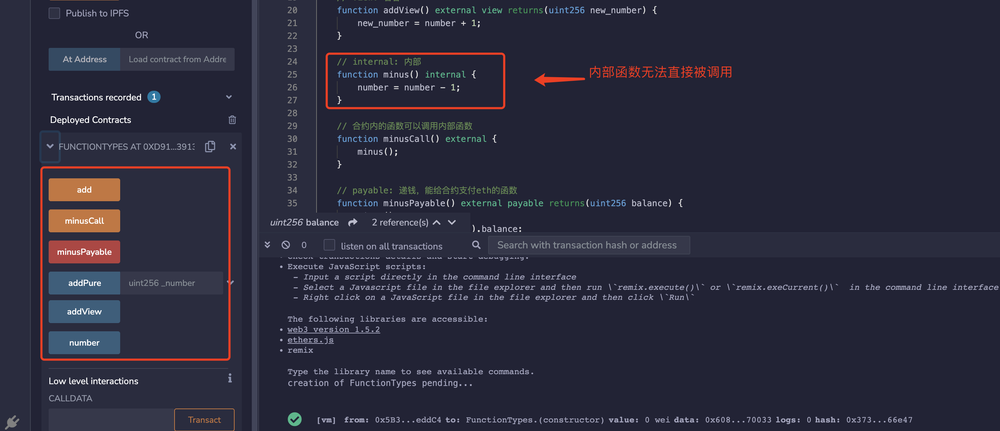
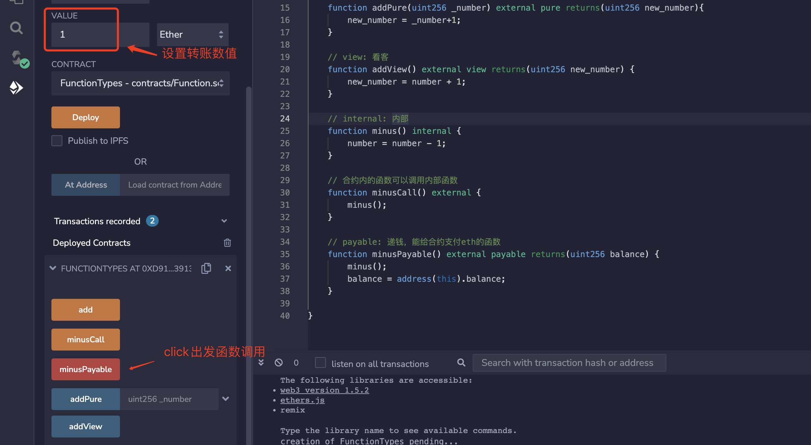

# WTF Solidity极简入门: 3. 函数

我最近在重新学 Solidity，巩固一下细节，也写一个“WTF Solidity极简入门”，供小白们使用（编程大佬可以另找教程），每周更新 1-3 讲。

推特：[@0xAA_Science](https://twitter.com/0xAA_Science)｜[@WTFAcademy_](https://twitter.com/WTFAcademy_)

社区：[Discord](https://discord.gg/5akcruXrsk)｜[微信群](https://docs.google.com/forms/d/e/1FAIpQLSe4KGT8Sh6sJ7hedQRuIYirOoZK_85miz3dw7vA1-YjodgJ-A/viewform?usp=sf_link)｜[官网 wtf.academy](https://wtf.academy)

所有代码和教程开源在 github: [github.com/AmazingAng/WTF-Solidity](https://github.com/AmazingAng/WTF-Solidity)

---

## 函数

Solidity语言的函数非常灵活，可以进行各种复杂操作。在本教程中，我们将会概述函数的基础概念，并通过一些示例演示如何使用函数。

我们先看一下 Solidity 中函数的形式:

```solidity
function <function name>([parameter types[, ...]]) {internal|external|public|private} [pure|view|payable] [virtual|override] [<modifiers>]
[returns (<return types>)]{ <function body> }
```

看着有一些复杂，让我们从前往后逐个解释(方括号中的是可写可不
写的关键字)：

1. `function`：声明函数时的固定用法。要编写函数，就需要以 `function` 关键字开头。

2. `<function name>`：函数名。

3. `([parameter types[, ...]])`：圆括号内写入函数的参数，即输入到函数的变量类型和名称。

4. `{internal|external|public|private}`：函数可见性说明符，共有4种。

    - `public`：内部和外部均可见。
    - `private`：只能从本合约内部访问，继承的合约也不能使用。
    - `external`：只能从合约外部访问（但内部可以通过 `this.f()` 来调用，`f`是函数名）。
    - `internal`: 只能从合约内部访问，继承的合约可以用。

    **注意 1**：合约中定义的函数需要明确指定可见性，它们没有默认值。

    **注意 2**：`public|private|internal` 也可用于修饰状态变量(定义可参考[WTF Solidity 第5讲的相关内容]([../05_DataStorage/readme.md#1-状态变量](https://github.com/AmazingAng/WTF-Solidity/tree/main/05_DataStorage#1-%E7%8A%B6%E6%80%81%E5%8F%98%E9%87%8F)))。`public`变量会自动生成同名的`getter`函数，用于查询数值。未标明可见性类型的状态变量，默认为`internal`。

5. `[pure|view|payable]`：决定函数权限/功能的关键字。`payable`（可支付的）很好理解，带着它的函数，运行的时候可以给合约转入 ETH。`pure` 和 `view` 的介绍见下一节。

6. `[virtual|override]`: 方法是否可以被重写，或者是否是重写方法。`virtual`用在父合约上，标识的方法可以被子合约重写。`override`用在子合约上，表名方法重写了父合约的方法。

7. `<modifiers>`: 自定义的修饰器，可以有0个或多个修饰器。

8. `[returns ()]`：函数返回的变量类型和名称。

9. `<function body>`: 函数体。

## 到底什么是 `Pure` 和`View`？

刚开始学习 `solidity` 时，`pure` 和 `view` 关键字可能令人费解，因为其他编程语言中没有类似的关键字。`solidity` 引入这两个关键字主要是因为 以太坊交易需要支付气费（gas fee）。合约的状态变量存储在链上，gas fee 很贵，如果计算不改变链上状态，就可以不用付 `gas`。包含 `pure` 和 `view` 关键字的函数是不改写链上状态的，因此用户直接调用它们是不需要付 gas 的（注意，合约中非 `pure`/`view` 函数调用 `pure`/`view` 函数时需要付gas）。

在以太坊中，以下语句被视为修改链上状态：

1. 写入状态变量。
2. 释放事件。
3. 创建其他合约。
4. 使用 `selfdestruct`.
5. 通过调用发送以太币。
6. 调用任何未标记 `view` 或 `pure` 的函数。
7. 使用低级调用（low-level calls）。
8. 使用包含某些操作码的内联汇编。

为了帮助大家理解，我画了一个马里奥插图。在这幅插图中，我将合约中的状态变量（存储在链上）比作碧琪公主，三种不同的角色代表不同的关键字。


- `pure`，中文意思是“纯”，这里可以理解为”纯打酱油的”。`pure` 函数既不能读取也不能写入链上的状态变量。就像小怪一样，看不到也摸不到碧琪公主。

- `view`，“看”，这里可以理解为“看客”。`view`函数能读取但也不能写入状态变量。类似马里奥，能看到碧琪公主，但终究是看客，不能入洞房。

- 非 `pure` 或 `view` 的函数既可以读取也可以写入状态变量。类似马里奥里的 `boss`，可以对碧琪公主为所欲为🐶。

## 代码

### 1. pure 和 view

我们在合约里定义一个状态变量 `number`，初始化为 5。

```solidity
// SPDX-License-Identifier: MIT
pragma solidity ^0.8.21;
contract FunctionTypes{
    uint256 public number = 5;
}
```

定义一个 `add()` 函数，每次调用会让 `number` 增加 1。

```solidity
// 默认function
function add() external{
    number = number + 1;
}
```

如果 `add()` 函数被标记为 `pure`，比如 `function add() external pure`，就会报错。因为 `pure` 是不配读取合约里的状态变量的，更不配改写。那 `pure` 函数能做些什么？举个例子，你可以给函数传递一个参数 `_number`，然后让他返回 `_number + 1`，这个操作不会读取或写入状态变量。

```solidity
// pure: 纯纯牛马
function addPure(uint256 _number) external pure returns(uint256 new_number){
    new_number = _number + 1;
}
```



如果 `add()` 函数被标记为 `view`，比如 `function add() external view`，也会报错。因为 `view` 能读取，但不能够改写状态变量。我们可以稍微改写下函数，读取但是不改写 `number`，返回一个新的变量。

```solidity
// view: 看客
function addView() external view returns(uint256 new_number) {
    new_number = number + 1;
}
```



### 2. internal v.s. external

```solidity
// internal: 内部函数
function minus() internal {
    number = number - 1;
}

// 合约内的函数可以调用内部函数
function minusCall() external {
    minus();
}
```

我们定义一个 `internal` 的 `minus()` 函数，每次调用使得 `number` 变量减少 1。由于 `internal` 函数只能由合约内部调用，我们必须再定义一个 `external` 的 `minusCall()` 函数，通过它间接调用内部的 `minus()` 函数。



### 3. payable

```solidity
// payable: 递钱，能给合约支付eth的函数
function minusPayable() external payable returns(uint256 balance) {
    minus();
    balance = address(this).balance;
}
```

我们定义一个 `external payable` 的 `minusPayable()` 函数，间接地调用 `minus()`，并且返回合约里的 ETH 余额（`this` 关键字可以让我们引用合约地址）。我们可以在调用 `minusPayable()` 时往合约里转入1个 ETH。


我们可以在返回的信息中看到，合约的余额变为 1 ETH。




## 总结

在这一讲，我们介绍了 `Solidity` 中的函数。`pure` 和 `view` 关键字比较难理解，在其他语言中没出现过：`view` 函数可以读取状态变量，但不能改写；`pure` 函数既不能读取也不能改写状态变量。
