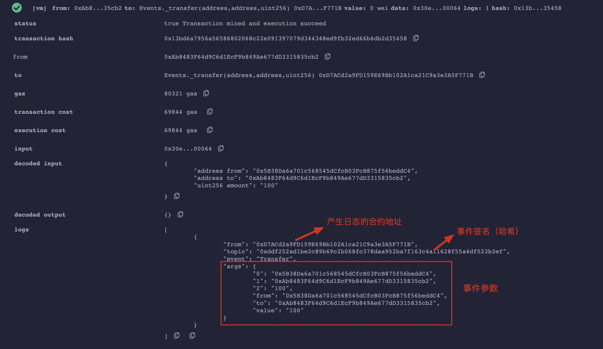

# WTF Solidity极简入门: 12. 事件

我最近在重新学Solidity，巩固一下细节，也写一个“WTF Solidity极简入门”，供小白们使用（编程大佬可以另找教程），每周更新1-3讲。

推特：[@0xAA_Science](https://twitter.com/0xAA_Science)

社区：[Discord](https://discord.gg/5akcruXrsk)｜[微信群](https://docs.google.com/forms/d/e/1FAIpQLSe4KGT8Sh6sJ7hedQRuIYirOoZK_85miz3dw7vA1-YjodgJ-A/viewform?usp=sf_link)｜[官网 wtf.academy](https://wtf.academy)

所有代码和教程开源在github: [github.com/AmazingAng/WTFSolidity](https://github.com/AmazingAng/WTFSolidity)

-----

这一讲，我们用转账ERC20代币为例来介绍`Solidity`中的事件（`event`）。

## 事件

`Solidity`中的事件（`event`）是`EVM`上日志的抽象，它具有两个特点：

- 响应：应用程序（[`ethers.js`](https://learnblockchain.cn/docs/ethers.js/api-contract.html#id18)）可以通过`RPC`接口订阅和监听这些事件，并在前端做响应。
- 经济：事件是`EVM`上比较经济的存储数据的方式，每个大概消耗2,000 `gas`；相比之下，链上存储一个新变量至少需要20,000 `gas`。

### 声明事件

事件的声明由`event`关键字开头，接着是事件名称，括号里面写好事件需要记录的变量类型和变量名。以`ERC20`代币合约的`Transfer`事件为例：

```solidity
event Transfer(address indexed from, address indexed to, uint256 value);
```

我们可以看到，`Transfer`事件共记录了3个变量`from`，`to`和`value`，分别对应代币的转账地址，接收地址和转账数量，其中`from`和`to`前面带有`indexed`关键字，他们会保存在以太坊虚拟机日志的`topics`中，方便之后检索。

### 触发事件

我们可以在函数里触发事件。在下面的例子中，每次用`_transfer()`函数进行转账操作的时候，都会触发`Transfer`事件，并记录相应的变量。

```solidity
// 定义_transfer函数，执行转账逻辑
function _transfer(
    address from,
    address to,
    uint256 amount
) external {

    _balances[from] = 10000000; // 给转账地址一些初始代币

    _balances[from] -=  amount; // from地址减去转账数量
    _balances[to] += amount; // to地址加上转账数量

    // 触发事件
    emit Transfer(from, to, amount);
}
```

## EVM日志 `Log`

以太坊虚拟机（EVM）用日志`Log`来存储`Solidity`事件，每条日志记录都包含主题`topics`和数据`data`两部分。


### 主题 `topics`

日志的第一部分是主题数组，用于描述事件，长度不能超过`4`。它的第一个元素是事件的签名（哈希）。对于上面的`Transfer`事件，它的签名就是：

```solidity
keccak256("Transfer(address,address,uint256)")

//0xddf252ad1be2c89b69c2b068fc378daa952ba7f163c4a11628f55a4df523b3ef
```

除了事件签名，主题还可以包含至多`3`个`indexed`参数，也就是`Transfer`事件中的`from`和`to`。

`indexed`标记的参数可以理解为检索事件的索引“键”，方便之后搜索。每个 `indexed` 参数的大小为固定的256比特，如果参数太大了（比如字符串），就会自动计算哈希存储在主题中。

### 数据 `data`

事件中不带 `indexed`的参数会被存储在 `data` 部分中，可以理解为事件的“值”。`data` 部分的变量不能被直接检索，但可以存储任意大小的数据。因此一般 `data` 部分可以用来存储复杂的数据结构，例如数组和字符串等等，因为这些数据超过了256比特，即使存储在事件的 `topics` 部分中，也是以哈希的方式存储。另外，`data` 部分的变量在存储上消耗的gas相比于 `topics` 更少。

## `Remix`演示

以 `Event.sol` 合约为例，编译部署。

然后调用 `_transfer` 函数。


点击右侧的交易查看详情，可以看到日志的具体内容。



### 在Etherscan上查询事件

我们尝试用`_transfer()`函数在`Rinkeby`测试网络上转账100代币，可以在`Etherscan`上查询到相应的`tx`：[网址](https://rinkeby.etherscan.io/tx/0x8cf87215b23055896d93004112bbd8ab754f081b4491cb48c37592ca8f8a36c7)。

点击`Logs`按钮，就能看到事件明细：


`Topics`里面有三个元素，`[0]`是这个事件的哈希，`[1]`和`[2]`是我们定义的两个`indexed`变量的信息，即转账的转出地址和接收地址。`Data`里面是剩下的不带`indexed`的变量，也就是转账数量。

## 总结

这一讲，我们介绍了如何使用和查询`Solidity`中的事件。很多链上分析工具包括`Nansen`和`Dune Analysis`都是基于事件工作的。
