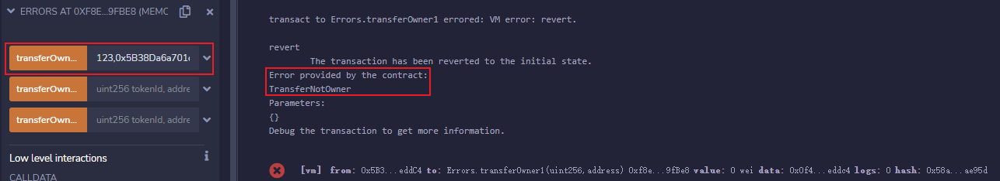
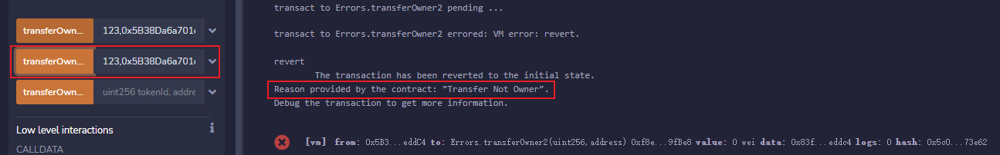

# WTF Solidity极简入门: 15. 异常

我最近在重新学 Solidity，巩固一下细节，也写一个“WTF Solidity极简入门”，供小白们使用（编程大佬可以另找教程），每周更新 1-3 讲。

推特：[@0xAA_Science](https://twitter.com/0xAA_Science)｜[@WTFAcademy_](https://twitter.com/WTFAcademy_)

社区：[Discord](https://discord.gg/5akcruXrsk)｜[微信群](https://docs.google.com/forms/d/e/1FAIpQLSe4KGT8Sh6sJ7hedQRuIYirOoZK_85miz3dw7vA1-YjodgJ-A/viewform?usp=sf_link)｜[官网 wtf.academy](https://wtf.academy)

所有代码和教程开源在 github: [github.com/AmazingAng/WTFSolidity](https://github.com/AmazingAng/WTFSolidity)

---

这一讲，我们介绍`Solidity`三种抛出异常的方法：`error`，`require`和`assert`，并比较三种方法的`gas`消耗。

## 异常

写智能合约经常会出`bug`，`Solidity`中的异常命令帮助我们`debug`。

### Error

`error`是`solidity 0.8.4版本`新加的内容，方便且高效（省`gas`）地向用户解释操作失败的原因，同时还可以在抛出异常的同时携带参数，帮助开发者更好地调试。人们可以在`contract`之外定义异常。下面，我们定义一个`TransferNotOwner`异常，当用户不是代币`owner`的时候尝试转账，会抛出错误：

```solidity
error TransferNotOwner(); // 自定义error
```

我们也可以定义一个携带参数的异常，来提示尝试转账的账户地址

```solidity
error TransferNotOwner(address sender); // 自定义的带参数的error
```

在执行当中，`error`必须搭配`revert`（回退）命令使用。

```solidity
function transferOwner1(uint256 tokenId, address newOwner) public {
    if(_owners[tokenId] != msg.sender){
        revert TransferNotOwner();
        // revert TransferNotOwner(msg.sender);
    }
    _owners[tokenId] = newOwner;
}
```

我们定义了一个`transferOwner1()`函数，它会检查代币的`owner`是不是发起人，如果不是，就会抛出`TransferNotOwner`异常；如果是的话，就会转账。

### Require

`require`命令是`solidity 0.8版本`之前抛出异常的常用方法，目前很多主流合约仍然还在使用它。它很好用，唯一的缺点就是`gas`随着描述异常的字符串长度增加，比`error`命令要高。使用方法：`require(检查条件，"异常的描述")`，当检查条件不成立的时候，就会抛出异常。

我们用`require`命令重写一下上面的`transferOwner1`函数：

```solidity
function transferOwner2(uint256 tokenId, address newOwner) public {
    require(_owners[tokenId] == msg.sender, "Transfer Not Owner");
    _owners[tokenId] = newOwner;
}
```

### Assert

`assert`命令一般用于程序员写程序`debug`，因为它不能解释抛出异常的原因（比`require`少个字符串）。它的用法很简单，`assert(检查条件）`，当检查条件不成立的时候，就会抛出异常。

我们用`assert`命令重写一下上面的`transferOwner1`函数：

```solidity
function transferOwner3(uint256 tokenId, address newOwner) public {
    assert(_owners[tokenId] == msg.sender);
    _owners[tokenId] = newOwner;
}
```

## 在remix上验证

1. 输入任意`uint256`数字和非0地址，调用`transferOwner1`，也就是`error`方法，控制台抛出了异常并显示我们自定义的`TransferNotOwner`。

   

2. 输入任意`uint256`数字和非0地址，调用`transferOwner2`，也就是`require`方法，控制台抛出了异常并打印出`require`中的字符串。

   

3. 输入任意`uint256`数字和非0地址，调用`transferOwner3`，也就是`assert`方法，控制台只抛出了异常。

   

## 三种方法的gas比较

我们比较一下三种抛出异常的`gas`消耗，通过remix控制台的Debug按钮，能查到每次函数调用的`gas`消耗分别如下：
（使用0.8.17版本编译）

1. **`error`方法`gas`消耗**：24457  (**加入参数后`gas`消耗**：24660)
2. **`require`方法`gas`消耗**：24755
3. **`assert`方法`gas`消耗**：24473

我们可以看到，`error`方法`gas`最少，其次是`assert`，`require`方法消耗`gas`最多！因此，`error`既可以告知用户抛出异常的原因，又能省`gas`，大家要多用！（注意，由于部署测试时间的不同，每个函数的`gas`消耗会有所不同，但是比较结果会是一致的。）

**备注:** Solidity 0.8.0之前的版本，`assert`抛出的是一个 `panic exception`，会把剩余的 `gas` 全部消耗，不会返还。更多细节见[官方文档](https://docs.soliditylang.org/en/v0.8.17/control-structures.html)。

## 总结

这一讲，我们介绍`Solidity`三种抛出异常的方法：`error`，`require`和`assert`，并比较了三种方法的`gas`消耗。结论：`error`既可以告知用户抛出异常的原因，又能省`gas`。
