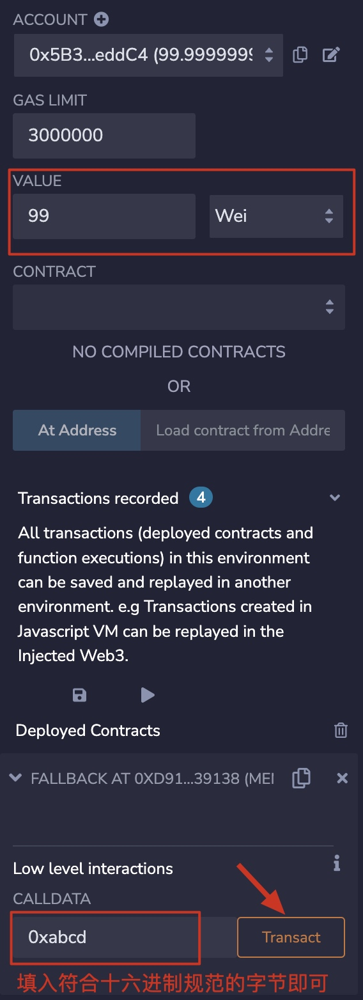

# Solidity极简入门: 16. 接收ETH receive和fallback

我最近在重新学solidity，巩固一下细节，也写一个“Solidity极简入门”，供小白们使用（编程大佬可以另找教程），每周更新1-3讲。

欢迎关注我的推特：[@0xAA_Science](https://twitter.com/0xAA_Science)

WTF技术社群discord，内有加微信群方法：[链接](https://discord.gg/5akcruXrsk)

所有代码和教程开源在github（1024个star发课程认证，2048个star发社群NFT）: [github.com/AmazingAng/WTFSolidity](https://github.com/AmazingAng/WTFSolidity)

-----

`Solidity`支持两种特殊的回调函数，`receive()`和`fallback()`，他们主要在两种情况下被使用：
1. 接收ETH
2. 处理合约中不存在的函数调用（代理合约proxy contract）

注意⚠️：在solidity 0.6.x版本之前，语法上只有 `fallback()` 函数，用来接收用户发送的ETH时调用以及在被调用函数签名没有匹配到时，来调用。
0.6版本之后，solidity才将 `fallback()` 函数拆分成 `receive()` 和 `fallback()` 两个函数。

我们这一讲主要讲接收ETH的情况。

## 接收ETH函数 receive
`receive()`只用于处理接收`ETH`。一个合约最多有一个`receive()`函数，声明方式与一般函数不一样，不需要`function`关键字：`receive() external payable { ... }`。`receive()`函数不能有任何的参数，不能返回任何值，必须包含`external`和`payable`。

当合约接收ETH的时候，`receive()`会被触发。`receive()`最好不要执行太多的逻辑因为如果别人用`send`和`transfer`方法发送`ETH`的话，`gas`会限制在`2300`，`receive()`太复杂可能会触发`Out of Gas`报错；如果用`call`就可以自定义`gas`执行更复杂的逻辑（这三种发送ETH的方法我们之后会讲到）。

我们可以在`receive()`里发送一个`event`，例如：
```solidity
    // 定义事件
    event Received(address Sender, uint Value);
    // 接收ETH时释放Received事件
    receive() external payable {
        emit Received(msg.sender, msg.value);
    }
```

有些恶意合约，会在`receive()` 函数（老版本的话，就是 `fallback()` 函数）嵌入恶意消耗`gas`的内容或者使得执行故意失败的代码，导致一些包含退款和转账逻辑的合约不能正常工作，因此写包含退款等逻辑的合约时候，一定要注意这种情况。

## 回退函数 fallback
`fallback()`函数会在调用合约不存在的函数时被触发。可用于接收ETH，也可以用于代理合约`proxy contract`。`fallback()`声明时不需要`function`关键字，必须由`external`修饰，一般也会用`payable`修饰，用于接收ETH:`fallback() external payable { ... }`。

我们定义一个`fallback()`函数，被触发时候会释放`fallbackCalled`事件，并输出`msg.sender`，`msg.value`和`msg.data`:

```solidity
    // fallback
    fallback() external payable{
        emit fallbackCalled(msg.sender, msg.value, msg.data);
    }
```

## receive和fallback的区别
`receive`和`fallback`都能够用于接收`ETH`，他们触发的规则如下：
```
触发fallback() 还是 receive()?
           接收ETH
              |
         msg.data是空？
            /  \
          是    否
          /      \
receive()存在?   fallback()
        / \
       是  否
      /     \
receive()   fallback()
```
简单来说，合约接收`ETH`时，`msg.data`为空且存在`receive()`时，会触发`receive()`；`msg.data`不为空或不存在`receive()`时，会触发`fallback()`，此时`fallback()`必须为`payable`。

`receive()`和`payable fallback()`均不存在的时候，向合约发送`ETH`将会报错。


## Remix 演示
1. 首先在 Remix 上部署合约 "Fallback.sol"。
2. "VALUE" 栏中填入要发送给合约的金额（单位是 Wei），然后点击 "Transact"。
    

3. 可以看到交易成功，并且触发了 "receivedCalled" 事件。
    

4. "VALUE" 栏中填入要发送给合约的金额（单位是 Wei），"CALLDATA" 栏中填入随意编写的`msg.data`，然后点击 "Transact"。
    
    
5. 可以看到交易成功，并且触发了 "receivedCalled" 事件。
    


## 总结
这一讲，我介绍了`Solidity`中的两种特殊函数，`receive()`和`fallback()`，他们主要在两种情况下被使用，他们主要用于处理接收`ETH`和代理合约`proxy contract`。

