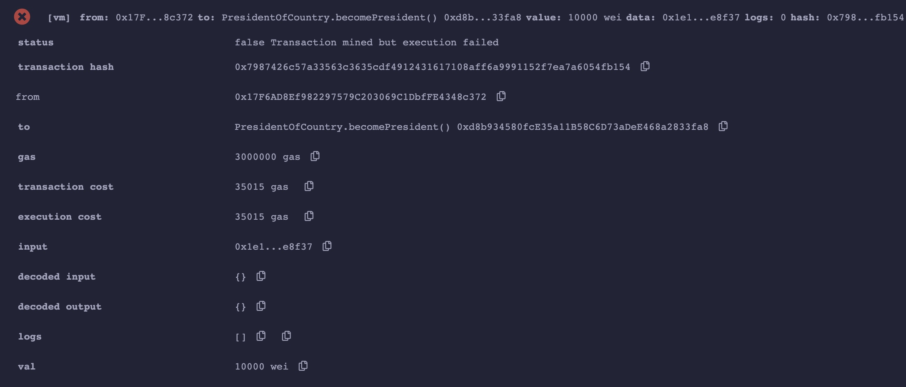

# Solidity极简入门: 16. 接收ETH receive和fallback

我最近在重新学solidity，巩固一下细节，也写一个“Solidity极简入门”，供小白们使用（编程大佬可以另找教程），每周更新1-3讲。

欢迎关注我的推特：[@0xAA_Science](https://twitter.com/0xAA_Science)

所有代码开源在github(64个star开微信交流群，已开[填表加入](https://docs.google.com/forms/d/e/1FAIpQLSe4KGT8Sh6sJ7hedQRuIYirOoZK_85miz3dw7vA1-YjodgJ-A/viewform)；128个star录教学视频): [github.com/AmazingAng/WTFSolidity](https://github.com/AmazingAng/WTFSolidity)

-----
`Solidity`支持两种特殊的回调函数，`receive()`和`fallback()`，他们主要在两种情况下被使用：
1. 接收ETH
2. 处理合约中不存在的函数调用（代理合约proxy contract）

注意⚠️：在solidity 0.6.x版本之前，语法上只有 `fallback()` 函数，用来接收用户发送的ETH时调用以及在被调用函数签名没有匹配到时，来调用。
0.6版本之后，solidity才将 `fallback()` 函数拆分成 `receive()` 和 `fallback()` 两个函数。

我们这一讲主要讲接收ETH的情况。

## 接收ETH函数 receive
`receive()`只用于处理接收`ETH`。一个合约最多有一个`receive()`函数，声明方式与一般函数不一样，不需要`function`关键字：`receive() external payable { ... }`。`receive()`函数不能有任何的参数，不能返回任何值，必须包含`external`和`payable`。

当合约接收ETH的时候，`receive()`会被触发。`receive()`最好不要执行太多的逻辑因为如果别人用`send`和`transfer`方法发送`ETH`的话，`gas`会限制在`2300`，`receive()`太复杂可能会触发`Out of Gas`报错；如果用`call`就可以自定义`gas`执行更复杂的逻辑（这三种发送ETH的方法我们之后会讲到）。

我们可以在`receive()`里发送一个`event`，例如：
```solidity
    // 定义事件
    event Received(address Sender, uint Value);
    // 接收ETH时释放Received事件
    receive() external payable {
        emit Received(msg.sender, msg.value);
    }
```

有些恶意合约，会在`receive()` 函数（老版本的话，就是 `fallback()` 函数）嵌入恶意消耗`gas`的内容或者使得执行故意失败的代码，导致一些包含退款和转账逻辑的合约不能正常工作，因此写包含退款等逻辑的合约时候，一定要注意这种情况。

例如下面一个合约示例，`King of the Ether Throne` 是一个竞选国王的合约游戏，游戏规则是如果新玩家发送的 ETH 数量大于当前指定的价格，合约就向上一个国王发送等于当前价格的 ETH，新玩家就会成为新的国王，然后合约把价格调的更高一些，等待下一位国王。


```solidity
pragma solidity ^0.4.10;

contract PresidentOfCountry {
    address public president;
    uint256 price;

    function PresidentOfCountry(uint256 _price) {
        require(_price > 0);
        price = _price;
        president = msg.sender;
    }

    function becomePresident() payable {
        require(msg.value >= price); // 金额必须高于当前价格，才能成为国王
        president.transfer(price);   // 给前任国王打钱
        president = msg.sender;      // 当选现任国王
        price = price * 2;           // 当前价格更新为上次的两倍
    }
}
```

如果竞选国王的“人”是一个合约账户，那么“给前任国王打钱”（代码中 `president.transfer(price);`）的时候会调用该合约的 `fallback()` 函数，攻击者可以将合约写成故意失败的代码逻辑：

```solidity
contract Attack {
    function () { revert(); } // 故意revert造成调用失败

    function attack(address _target) public payable {
        _target.call.value(msg.value)(bytes4(keccak256("becomePresident()"))); // 调用国王合约中的竞选国王函数
    }
}
```

因此当攻击者合约竞选国王后，此后任何账户如果试图成为国王，会触发转币给攻击者合约的 `fallback()` 函数。也就是会调用 `revert()；` 导致转币失败。如此就会阻止其他账户成为国王，导致合约逻辑永远陷入停滞。


使用remix部署测试一下，正常情况下 `PresidentOfCountry` 合约的国王如下， `0xAb8483F64d9C6d1EcF9b849Ae677dD3315835cb2` 是一个正常用户的地址。


输入大于当前价格的 `value` 值，再点击 `becomePresident` 可以正常竞选国王。可以看到国王的地址被更改为 `0x5B38Da6a701c568545dCfcB03FcB875f56beddC4`。


部署 `Attack` 合约，调用 `attack` 函数，参数填入国王合约的地址（点击下图中的 Copy 字样下方的图标即可复制国王合约的地址），**一定不要忘记 `value` 值填入大于当前价格，使得攻击合约能顺利竞选上国王，** 然后点击 `attack` 运行。


运行成功后可以发现国王合约中的地址已经被更改为攻击合约的地址。


然后再次用正常用户去竞选国王，发现交易会一直失败，国王再也不能被更替。



## 回退函数 fallback
`fallback()`函数会在调用合约不存在的函数时被触发。可用于接收ETH，也可以用于代理合约`proxy contract`。`fallback()`声明时不需要`function`关键字，必须由`external`修饰，一般也会用`payable`修饰，用于接收ETH:`fallback() external payable { ... }`。

我们定义一个`fallback()`函数，被触发时候会释放`fallbackCalled`事件，并输出`msg.sender`，`msg.value`和`msg.data`:

```solidity
    // fallback
    fallback() external payable{
        emit fallbackCalled(msg.sender, msg.value, msg.data);
    }
```

## receive和fallback的区别
`receive`和`fallback`都能够用于接收`ETH`，他们触发的规则如下：
```
触发fallback() 还是 receive()?
           接收ETH
              |
         msg.data是空？
            /  \
          是    否
          /      \
receive()存在?   fallback()
        / \
       是  否
      /     \
receive()   fallback()
```
简单来说，合约接收`ETH`时，`msg.data`为空且存在`receive()`时，会触发`receive()`；`msg.data`不为空或不存在`receive()`时，会触发`fallback()`，此时`fallback()`必须为`payable`。

`receive()`和`payable fallback()`均不存在的时候，向合约发送`ETH`将会报错。

## 总结
这一讲，我介绍了`Solidity`中的两种特殊函数，`receive()`和`fallback()`，他们主要在两种情况下被使用，他们主要用于处理接收`ETH`和代理合约`proxy contract`。

