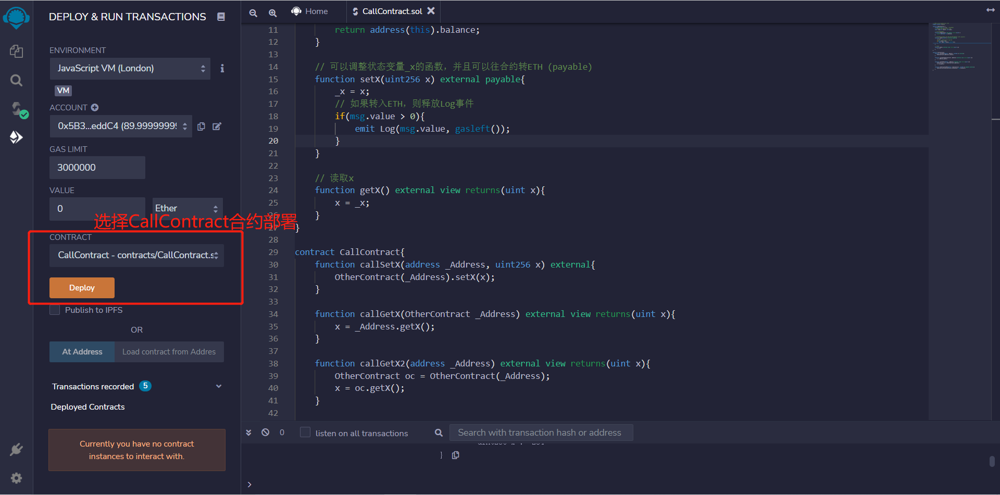

# Solidity极简入门: 21. 调用其他合约

我最近在重新学solidity，巩固一下细节，也写一个“Solidity极简入门”，供小白们使用（编程大佬可以另找教程），每周更新1-3讲。

欢迎关注我的推特：[@0xAA_Science](https://twitter.com/0xAA_Science)

WTF技术社群discord，内有加微信群方法：[链接](https://discord.gg/5akcruXrsk)

所有代码和教程开源在github（1024个star发课程认证，2048个star发社群NFT）: [github.com/AmazingAng/WTFSolidity](https://github.com/AmazingAng/WTFSolidity)

-----

## 调用已部署合约

开发者写智能合约来调用其他合约，这让以太坊网络上的程序可以复用，从而建立繁荣的生态。很多`web3`项目依赖于调用其他合约，比如收益农场（`yield farming`）。这一讲，我们介绍如何在已知合约代码（或接口）和地址情况下调用目标合约的函数。

## 目标合约
我们先写一个简单的合约`OtherContract`来调用。

```solidity
contract OtherContract {
    uint256 private _x = 0; // 状态变量_x
    // 收到eth的事件，记录amount和gas
    event Log(uint amount, uint gas);
    
    // 返回合约ETH余额
    function getBalance() view public returns(uint) {
        return address(this).balance;
    }

    // 可以调整状态变量_x的函数，并且可以往合约转ETH (payable)
    function setX(uint256 x) external payable{
        _x = x;
        // 如果转入ETH，则释放Log事件
        if(msg.value > 0){
            emit Log(msg.value, gasleft());
        }
    }

    // 读取_x
    function getX() external view returns(uint x){
        x = _x;
    }
}
```

这个合约包含一个状态变量`_x`，一个事件`Log`在收到`ETH`时触发，三个函数：
- `getBalance()`: 返回合约`ETH`余额。
- `setX()`: `external payable`函数，可以设置`_x`的值，并向合约发送`ETH`。
- `getX()`: 读取`_x`的值。

## 调用`OtherContract`合约
我们可以利用合约的地址和合约代码（或接口）来创建合约的引用：`_Name(_Address)`，其中`_Name`是合约名，`_Address`是合约地址。然后用合约的引用来调用它的函数：`_Name(_Address).f()`，其中`f()`是要调用的函数。

下面我们介绍4个调用合约的例子，在remix中编译合约后，分别部署`OtherContract`和`CallContract`：




### 1. 传入合约地址
我们可以在函数里传入目标合约地址，生成目标合约的引用，然后调用目标函数。以调用`OtherContract`合约的`setX`函数为例，我们在新合约中写一个`callSetX`函数，传入已部署好的`OtherContract`合约地址`_Address`和`setX`的参数`x`：

```solidity
    function callSetX(address _Address, uint256 x) external{
        OtherContract(_Address).setX(x);
    }
```

复制`OtherContract`合约的地址，填入`callSetX`函数的参数中，成功调用后，调用`OtherContract`合约中的`getX`验证`x`变为123


### 2. 传入合约变量
我们可以直接在函数里传入合约的引用，只需要把上面参数的`address`类型改为目标合约名，比如`OtherContract`。下面例子实现了调用目标合约的`getX()`函数。

**注意**该函数参数`OtherContract _Address`底层类型仍然是`address`，生成的`ABI`中、调用`callGetX`时传入的参数都是`address`类型

```solidity
    function callGetX(OtherContract _Address) external view returns(uint x){
        x = _Address.getX();
    }
```

复制`OtherContract`合约的地址，填入`callGetX`函数的参数中，调用后成功获取`x`的值


### 3. 创建合约变量
我们可以创建合约变量，然后通过它来调用目标函数。下面例子，我们给变量`oc`存储了`OtherContract`合约的引用：
```solidity
    function callGetX2(address _Address) external view returns(uint x){
        OtherContract oc = OtherContract(_Address);
        x = oc.getX();
    }
```

复制`OtherContract`合约的地址，填入`callGetX2`函数的参数中，调用后成功获取`x`的值


### 4. 调用合约并发送`ETH`
如果目标合约的函数是`payable`的，那么我们可以通过调用它来给合约转账：`_Name(_Address).f{value: _Value}()`，其中`_Name`是合约名，`_Address`是合约地址，`f`是目标函数名，`_Value`是要转的`ETH`数额（以`wei`为单位）。

`OtherContract`合约的`setX`函数是`payable`的，在下面这个例子中我们通过调用`setX`来往目标合约转账。
```solidity
    function setXTransferETH(address otherContract, uint256 x) payable external{
        OtherContract(otherContract).setX{value: msg.value}(x);
    }
```

复制`OtherContract`合约的地址，填入`setXTransferETH`函数的参数中，并转入10ETH


转账后，我们可以通过`Log`事件和`getBalance()`函数观察目标合约`ETH`余额的变化。


## 总结
这一讲，我们介绍了如何通过目标合约代码（或接口）和地址来创建合约的引用，从而调用目标合约的函数。
