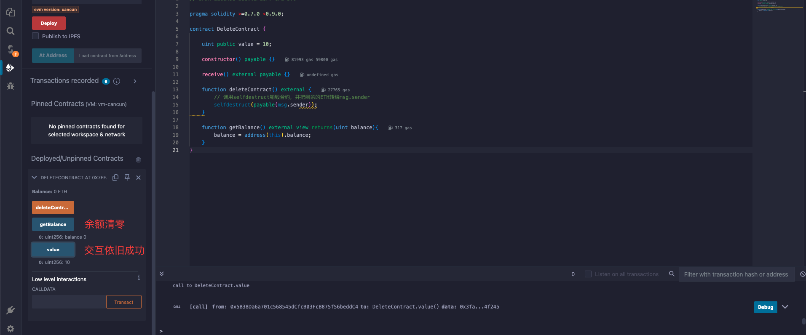
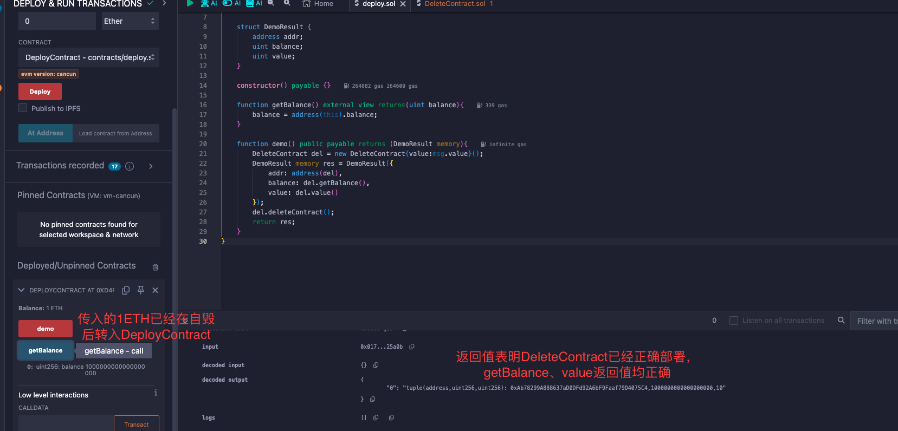
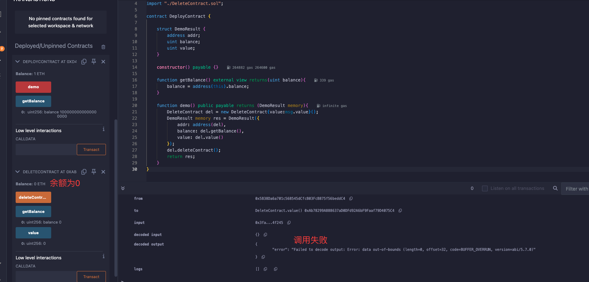

# WTF Solidity极简入门: 26. 删除合约

我最近在重新学 Solidity，巩固一下细节，也写一个“WTF Solidity极简入门”，供小白们使用（编程大佬可以另找教程），每周更新 1-3 讲。

推特：[@0xAA_Science](https://twitter.com/0xAA_Science)｜[@WTFAcademy_](https://twitter.com/WTFAcademy_)

社区：[Discord](https://discord.gg/5akcruXrsk)｜[微信群](https://docs.google.com/forms/d/e/1FAIpQLSe4KGT8Sh6sJ7hedQRuIYirOoZK_85miz3dw7vA1-YjodgJ-A/viewform?usp=sf_link)｜[官网 wtf.academy](https://wtf.academy)

所有代码和教程开源在 github: [github.com/AmazingAng/WTF-Solidity](https://github.com/AmazingAng/WTF-Solidity)

---

## `selfdestruct`

`selfdestruct`命令可以用来删除智能合约，并将该合约剩余`ETH`转到指定地址。`selfdestruct`是为了应对合约出错的极端情况而设计的。它最早被命名为`suicide`（自杀），但是这个词太敏感。为了保护抑郁的程序员，改名为`selfdestruct`；在 [v0.8.18](https://blog.soliditylang.org/2023/02/01/solidity-0.8.18-release-announcement/) 版本中，`selfdestruct` 关键字被标记为「不再建议使用」，在一些情况下它会导致预期之外的合约语义，但由于目前还没有代替方案，目前只是对开发者做了编译阶段的警告，相关内容可以查看 [EIP-6049](https://eips.ethereum.org/EIPS/eip-6049)。

然而，在以太坊坎昆（Cancun）升级中，[EIP-6780](https://eips.ethereum.org/EIPS/eip-6780)被纳入升级以实现对`Verkle Tree`更好的支持。EIP-6780减少了`SELFDESTRUCT`操作码的功能。根据提案描述，当前`SELFDESTRUCT`仅会被用来将合约中的ETH转移到指定地址，而原先的删除功能只有在`合约创建-自毁`这两个操作处在同一笔交易时才能生效。所以目前来说：

1. 已经部署的合约无法被`SELFDESTRUCT`了。
2. 如果要使用原先的`SELFDESTRUCT`功能，必须在同一笔交易中创建并`SELFDESTRUCT`。

### 如何使用`selfdestruct`

`selfdestruct`使用起来非常简单：

```solidity
selfdestruct(_addr);
```

其中`_addr`是接收合约中剩余`ETH`的地址。`_addr` 地址不需要有`receive()`或`fallback()`也能接收`ETH`。

### Demo-转移ETH功能

以下合约在坎昆升级前可以完成合约的自毁，在坎昆升级后仅能实现内部ETH余额的转移。

```solidity
contract DeleteContract {

    uint public value = 10;

    constructor() payable {}

    receive() external payable {}

    function deleteContract() external {
        // 调用selfdestruct销毁合约，并把剩余的ETH转给msg.sender
        selfdestruct(payable(msg.sender));
    }

    function getBalance() external view returns(uint balance){
        balance = address(this).balance;
    }
}
```

在`DeleteContract`合约中，我们写了一个`public`状态变量`value`，两个函数：`getBalance()`用于获取合约`ETH`余额，`deleteContract()`用于自毁合约，并把`ETH`转入给发起人。

部署好合约后，我们向`DeleteContract`合约转入1 `ETH`。这时，`getBalance()`会返回1 `ETH`，`value`变量是10。

当我们调用`deleteContract()`函数，合约将触发`selfdestruct`操作。**在坎昆升级前，合约会被自毁。但是在升级后，合约依然存在，只是将合约包含的ETH转移到指定地址，而合约依然能够调用。**

#### 在remix上验证

##### 坎昆升级之前
1. 部署合约并且转入1ETH，查看合约状态

    
   
3. 销毁合约，查看合约状态

    
   
从测试中观察合约状态可以发现合约销毁后的ETH返回给了指定的地址，在合约销毁后再次调用合约函数进行交互则会失败。

##### 坎昆升级之后
1. 部署合约并且转入1ETH，查看合约状态

    
   
3. 销毁合约，查看合约状态

    
   
从测试中观察合约状态可以发现合约包含的ETH已经清零（返回给了指定的地址），再次调用合约函数进行交互依然可以成功。


### Demo-同笔交易内实现合约创建-自毁

根据提案，原先的删除功能只有在`合约创建-自毁`这两个操作处在同一笔交易时才能生效。所以我们需要通过另一个合约进行控制。

```solidity
contract DeployContract {

    struct DemoResult {
        address addr;
        uint balance;
        uint value;
    }

    constructor() payable {}

    function getBalance() external view returns(uint balance){
        balance = address(this).balance;
    }

    function demo() public payable returns (DemoResult memory){
        DeleteContract del = new DeleteContract{value:msg.value}();
        DemoResult memory res = DemoResult({
            addr: address(del),
            balance: del.getBalance(),
            value: del.value()
        });
        del.deleteContract();
        return res;
    }
}
```
#### 在remix上验证
1. 部署`DeployContract`合约并且转入1ETH调用`demo`方法，查看合约状态，显示`DeleteContract`已被正确部署，且在`selfdestruct`后ETH已转移到`DeployContract`。

    
   
3. 选择导入返回值中的地址为`DeleteContract`。显示该地址不存有ETH，且调用合约函数进行交互均失败。

    


### 注意事项

1. 对外提供合约销毁接口时，最好设置为只有合约所有者可以调用，可以使用函数修饰符`onlyOwner`进行函数声明。
2. 当合约中有`selfdestruct`功能时常常会带来安全问题和信任问题，合约中的selfdestruct功能会为攻击者打开攻击向量(例如使用`selfdestruct`向一个合约频繁转入token进行攻击，这将大大节省了GAS的费用，虽然很少人这么做)，此外，此功能还会降低用户对合约的信心。


## 总结

`selfdestruct`是智能合约的紧急按钮，销毁合约并将剩余`ETH`转移到指定账户。当著名的`The DAO`攻击发生时，以太坊的创始人们一定后悔过没有在合约里加入`selfdestruct`来停止黑客的攻击吧。在坎昆升级后，`selfdestruct`的作用也逐渐发生了改变，什么都不是一成不变的，还是要保持学习。
