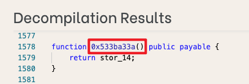
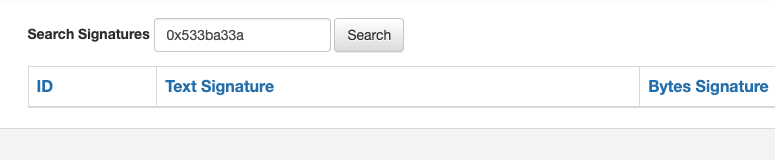

# WTF Solidity极简入门: 27. ABI编码解码

我最近在重新学 Solidity，巩固一下细节，也写一个“WTF Solidity 极简入门”，供小白们使用（编程大佬可以另找教程），每周更新 1-3 讲。

推特：[@0xAA_Science](https://twitter.com/0xAA_Science)｜[@WTFAcademy_](https://twitter.com/WTFAcademy_)

社区：[Discord](https://discord.gg/5akcruXrsk)｜[微信群](https://docs.google.com/forms/d/e/1FAIpQLSe4KGT8Sh6sJ7hedQRuIYirOoZK_85miz3dw7vA1-YjodgJ-A/viewform?usp=sf_link)｜[官网 wtf.academy](https://wtf.academy)

所有代码和教程开源在 github: [github.com/AmazingAng/WTFSolidity](https://github.com/AmazingAng/WTFSolidity)

---

`ABI` (Application Binary Interface，应用二进制接口)是与以太坊智能合约交互的标准。数据基于他们的类型编码；并且由于编码后不包含类型信息，解码时需要注明它们的类型。

`Solidity`中，`ABI编码`有4个函数：`abi.encode`, `abi.encodePacked`, `abi.encodeWithSignature`, `abi.encodeWithSelector`。而`ABI解码`有1个函数：`abi.decode`，用于解码`abi.encode`的数据。这一讲，我们将学习如何使用这些函数。

## ABI编码

我们将编码4个变量，他们的类型分别是`uint256`（别名 uint）, `address`, `string`, `uint256[2]`：

```solidity
uint x = 10;
address addr = 0x7A58c0Be72BE218B41C608b7Fe7C5bB630736C71;
string name = "0xAA";
uint[2] array = [5, 6]; 
```

### `abi.encode`

将给定参数利用[ABI规则](https://learnblockchain.cn/docs/solidity/abi-spec.html)编码。`ABI`被设计出来跟智能合约交互，他将每个参数填充为32字节的数据，并拼接在一起。如果你要和合约交互，你要用的就是`abi.encode`。

```solidity
function encode() public view returns(bytes memory result) {
    result = abi.encode(x, addr, name, array);
}
```

编码的结果为`0x000000000000000000000000000000000000000000000000000000000000000a0000000000000000000000007a58c0be72be218b41c608b7fe7c5bb630736c7100000000000000000000000000000000000000000000000000000000000000a00000000000000000000000000000000000000000000000000000000000000005000000000000000000000000000000000000000000000000000000000000000600000000000000000000000000000000000000000000000000000000000000043078414100000000000000000000000000000000000000000000000000000000`，由于`abi.encode`将每个数据都填充为32字节，中间有很多`0`。

### `abi.encodePacked`

将给定参数根据其所需最低空间编码。它类似 `abi.encode`，但是会把其中填充的很多`0`省略。比如，只用1字节来编码`uint8`类型。当你想省空间，并且不与合约交互的时候，可以使用`abi.encodePacked`，例如算一些数据的`hash`时。

```solidity
function encodePacked() public view returns(bytes memory result) {
    result = abi.encodePacked(x, addr, name, array);
}
```

编码的结果为`0x000000000000000000000000000000000000000000000000000000000000000a7a58c0be72be218b41c608b7fe7c5bb630736c713078414100000000000000000000000000000000000000000000000000000000000000050000000000000000000000000000000000000000000000000000000000000006`，由于`abi.encodePacked`对编码进行了压缩，长度比`abi.encode`短很多。

### `abi.encodeWithSignature`

与`abi.encode`功能类似，只不过第一个参数为`函数签名`，比如`"foo(uint256,address,string,uint256[2])"`。当调用其他合约的时候可以使用。

```solidity
function encodeWithSignature() public view returns(bytes memory result) {
    result = abi.encodeWithSignature("foo(uint256,address,string,uint256[2])", x, addr, name, array);
}
```

编码的结果为`0xe87082f1000000000000000000000000000000000000000000000000000000000000000a0000000000000000000000007a58c0be72be218b41c608b7fe7c5bb630736c7100000000000000000000000000000000000000000000000000000000000000a00000000000000000000000000000000000000000000000000000000000000005000000000000000000000000000000000000000000000000000000000000000600000000000000000000000000000000000000000000000000000000000000043078414100000000000000000000000000000000000000000000000000000000`，等同于在`abi.encode`编码结果前加上了4字节的`函数选择器`[^说明]。
[^说明]: 函数选择器就是通过函数名和参数进行签名处理(Keccak–Sha3)来标识函数，可以用于不同合约之间的函数调用

### `abi.encodeWithSelector`

与`abi.encodeWithSignature`功能类似，只不过第一个参数为`函数选择器`，为`函数签名`Keccak哈希的前4个字节。

```solidity
function encodeWithSelector() public view returns(bytes memory result) {
    result = abi.encodeWithSelector(bytes4(keccak256("foo(uint256,address,string,uint256[2])")), x, addr, name, array);
}
```

编码的结果为`0xe87082f1000000000000000000000000000000000000000000000000000000000000000a0000000000000000000000007a58c0be72be218b41c608b7fe7c5bb630736c7100000000000000000000000000000000000000000000000000000000000000a00000000000000000000000000000000000000000000000000000000000000005000000000000000000000000000000000000000000000000000000000000000600000000000000000000000000000000000000000000000000000000000000043078414100000000000000000000000000000000000000000000000000000000`，与`abi.encodeWithSignature`结果一样。

## ABI解码

### `abi.decode`

`abi.decode`用于解码`abi.encode`生成的二进制编码，将它还原成原本的参数。

```solidity
function decode(bytes memory data) public pure returns(uint dx, address daddr, string memory dname, uint[2] memory darray) {
    (dx, daddr, dname, darray) = abi.decode(data, (uint, address, string, uint[2]));
}
```

我们将`abi.encode`的二进制编码输入给`decode`，将解码出原来的参数：


## 在remix上验证

- 部署合约查看abi.encode方法的编码结果

    
- 对比验证四种编码方法的异同点

    
- 查看abi.decode方法的解码结果

    

## ABI的使用场景

1. 在合约开发中，ABI常配合call来实现对合约的底层调用。

    ```solidity  
    bytes4 selector = contract.getValue.selector;

    bytes memory data = abi.encodeWithSelector(selector, _x);
    (bool success, bytes memory returnedData) = address(contract).staticcall(data);
    require(success);

    return abi.decode(returnedData, (uint256));
    ```

2. ethers.js中常用ABI实现合约的导入和函数调用。

    ```solidity
    const wavePortalContract = new ethers.Contract(contractAddress, contractABI, signer);
    /*
        * Call the getAllWaves method from your Smart Contract
        */
    const waves = await wavePortalContract.getAllWaves();
    ```

3. 对不开源合约进行反编译后，某些函数无法查到函数签名，可通过ABI进行调用。
   - 0x533ba33a() 是一个反编译后显示的函数，只有函数编码后的结果，并且无法查到函数签名

    
    

   - 这种情况无法通过构造interface接口或contract来进行调用
    

    这种情况下，就可以通过ABI函数选择器来调用

    ```solidity
    bytes memory data = abi.encodeWithSelector(bytes4(0x533ba33a));

    (bool success, bytes memory returnedData) = address(contract).staticcall(data);
    require(success);

    return abi.decode(returnedData, (uint256));
    ```

## 总结

在以太坊中，数据必须编码成字节码才能和智能合约交互。这一讲，我们介绍了4种`abi编码`方法和1种`abi解码`方法。
