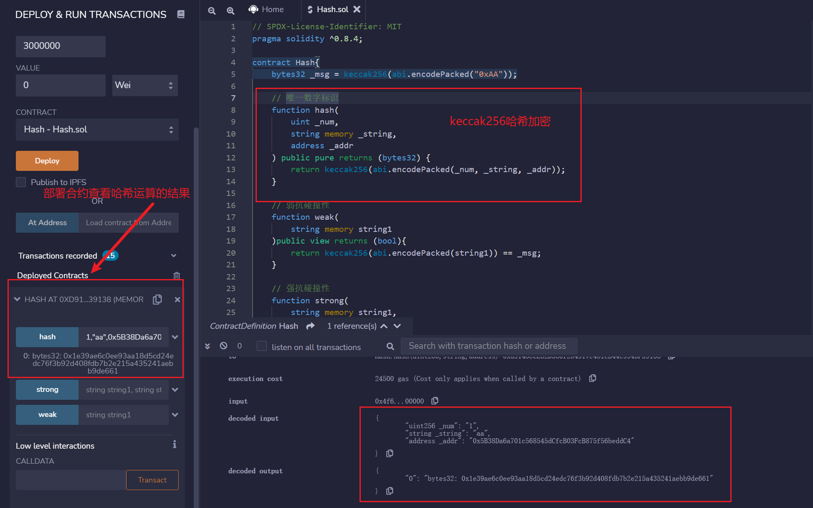

# Solidity极简入门: 27. Hash
我最近在重新学solidity，巩固一下细节，也写一个“Solidity极简入门”，供小白们使用（编程大佬可以另找教程），每周更新1-3讲。

欢迎关注我的推特：[@0xAA_Science](https://twitter.com/0xAA_Science)

欢迎加入WTF科学家社区：[discord](https://discord.gg/5akcruXrsk)

所有代码开源在github(64个star开微信交流群；128个star录教学视频): [github.com/AmazingAng/WTFSolidity](https://github.com/AmazingAng/WTFSolidity)

-----

哈希函数（hash function）是一个密码学概念，它可以将任意长度的消息转换为一个固定长度的值，这个值也称作哈希（hash）。这一讲，我们简单介绍一下哈希函数及在`solidity`的应用

## Hash的性质
一个好的哈希函数应该具有以下几个特性：
- 单向性：从输入的消息到它的哈希的正向运算简单且唯一确定，而反过来非常难，只能靠暴力枚举。
- 灵敏性：输入的消息改变一点对它的哈希改变很大。
- 高效性：从输入的消息到哈希的运算高效。
- 均一性：每个哈希值被取到的概率应该基本相等。
- 抗碰撞性：
    - 弱抗碰撞性：给定一个消息`x`，找到另一个消息`x'`使得`hash(x) = hash(x')`是困难的。
    - 强抗碰撞性：找到任意`x`和`x'`，使得`hash(x) = hash(x')`是困难的。

## Hash的应用
- 生成数据唯一标识
- 加密签名
- 安全加密

## Keccak256
`Keccak256`函数是`solidity`中最常用的哈希函数，用法非常简单：
```solidity
哈希 = keccak256(数据);
```
### Keccak256和sha3
这是一个很有趣的事情：
1. sha3由keccak标准化而来，在很多场合下Keccak和SHA3是同义词，但在2015年8月SHA3最终完成标准化时，NIST调整了填充算法。**所以SHA3就和keccak计算的结果不一样**，这点在实际开发中要注意。
2. 以太坊在开发的时候sha3还在标准化中，所以采用了keccak，所以Ethereum和Solidity智能合约代码中的SHA3是指Keccak256，而不是标准的NIST-SHA3，为了避免混淆，直接在合约代码中写成Keccak256是最清晰的。

### 生成数据唯一标识

我们可以利用`keccak256`来生成一些数据的唯一标识。比如我们有几个不同类型的数据：`uint`，`string`，`address`，我们可以先用`abi.encodePacked`方法将他们打包编码，然后再用`keccak256`来生成唯一标识：
```solidity
    function hash(
        uint _num,
        string memory _string,
        address _addr
    ) public pure returns (bytes32) {
        return keccak256(abi.encodePacked(_num, _string, _addr));
    }
```

### 弱抗碰撞性
我们用`keccak256`演示一下之前讲到的弱抗碰撞性，即给定一个消息`x`，找到另一个消息`x'`使得`hash(x) = hash(x')`是困难的。

我们给定一个消息`0xAA`，试图去找另一个消息，使得它们的哈希值相等：

```solidity
    // 弱抗碰撞性
    function weak(
        string memory string1
    )public view returns (bool){
        return keccak256(abi.encodePacked(string1)) == _msg;
    }
```

大家可以试个10次，看看能不能幸运的碰撞上。

### 强抗碰撞性
我们用`keccak256`演示一下之前讲到的强抗碰撞性，即找到任意不同的`x`和`x'`，使得`hash(x) = hash(x')`是困难的。

我们构造一个函数`strong`，接收两个不同的`string`参数`string1`和`string2`，然后判断它们的哈希是否相同：

```solidity
    // 强抗碰撞性
    function strong(
        string memory string1,
        string memory string2
    )public pure returns (bool){
        return keccak256(abi.encodePacked(string1)) == keccak256(abi.encodePacked(string2));
    }
```

大家可以试个10次，看看能不能幸运的碰撞上。

## 在remix上验证
- 部署合约查看唯一标识的生成结果


- 验证哈希函数的灵敏性，以及强、弱抗碰撞性


## 总结

这一讲，我们介绍了什么是哈希函数，以及如何使用`solidity`最常用的哈希函数`keccak256`。
