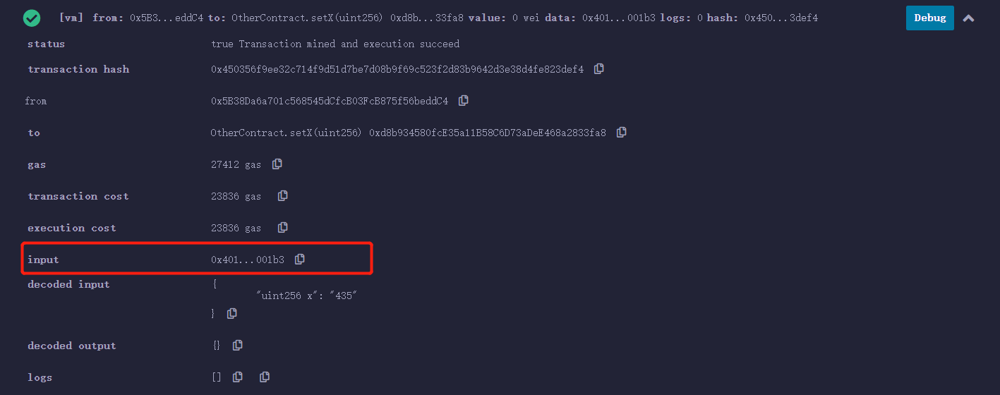
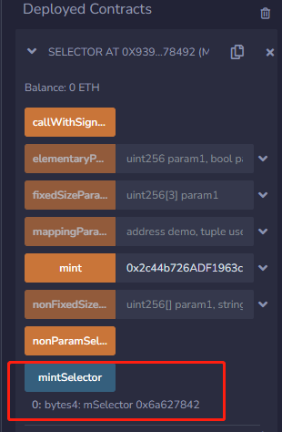

# Solidity极简入门: 29. 函数选择器Selector

我最近在重新学solidity，巩固一下细节，也写一个“Solidity极简入门”，供小白们使用（编程大佬可以另找教程），每周更新1-3讲。

欢迎关注我的推特：[@0xAA_Science](https://twitter.com/0xAA_Science)

欢迎加入WTF科学家社区，内有加微信群方法：[链接](https://discord.gg/5akcruXrsk)

所有代码和教程开源在github（1024个star发课程认证，2048个star发社群NFT）: [github.com/AmazingAng/WTFSolidity](https://github.com/AmazingAng/WTFSolidity)

-----


## `selector`
当我们调用智能合约时，本质上是向目标合约发送了一段`calldata`，在remix中发送一次交易后，可以在详细信息中看见`input`即为此次交易的`calldata`



发送的`calldata`中前4个字节是`selector`（函数选择器）。这一讲，我们将介绍`selector`是什么，以及如何使用。

### `msg.data`
`msg.data`是`solidity`中的一个全局变量，值为完整的`calldata`（调用函数时传入的数据）。

在下面的代码中，我们可以通过`Log`事件来输出调用`mint`函数的`calldata`：
```solidity
    // event 返回msg.data
    event Log(bytes data);

    function mint(address to) external{
        emit Log(msg.data);
    }
```
当参数为`0x2c44b726ADF1963cA47Af88B284C06f30380fC78`时，输出的`calldata`为
```
0x6a6278420000000000000000000000002c44b726adf1963ca47af88b284c06f30380fc78
```
这段很乱的字节码可以分成两部分：
```
前4个字节为函数选择器selector：
0x6a627842

后面32个字节为输入的参数：
0x0000000000000000000000002c44b726adf1963ca47af88b284c06f30380fc78
```
其实`calldata`就是告诉智能合约，我要调用哪个函数，以及参数是什么。

### `method id`、`selector`和`函数签名`
`method id`定义为`函数签名`的`Keccak`哈希后的前4个字节，当`selector`与`method id`相匹配时，即表示调用该函数，那么`函数签名`是什么？

其实在第21讲中，我们简单介绍了函数签名，为`"函数名（逗号分隔的参数类型)"`。举个例子，上面代码中`mint`的函数签名为`"mint(address)"`。在同一个智能合约中，不同的函数有不同的函数签名，因此我们可以通过函数签名来确定要调用哪个函数。

**注意**，在函数签名中，`uint`和`int`要写为`uint256`和`int256`。

我们写一个函数，来验证`mint`函数的`method id`是否为`0x6a627842`。大家可以运行下面的函数，看看结果。
```solidity
    function mintSelector() external pure returns(bytes4 mSelector){
        return bytes4(keccak256("mint(address)"));
    }
```

结果正是`0x6a627842`：



### 使用`selector`
我们可以利用`selector`来调用目标函数。例如我想调用`mint`函数，我只需要利用`abi.encodeWithSelector`将`mint`函数的`method id`作为`selector`和参数打包编码，传给`call`函数：

```solidity
    function callWithSignature() external returns(bool, bytes memory){
        (bool success, bytes memory data) = address(this).call(abi.encodeWithSelector(0x6a627842, "0x2c44b726ADF1963cA47Af88B284C06f30380fC78"));
        return(success, data);
    }
```

在日志中，我们可以看到`mint`函数被成功调用，并输出`Log`事件。


## 总结
这一讲，我们介绍了什么是`函数选择器`（`selector`），它和`msg.data`、`函数签名`的关系，以及如何使用它调用目标函数。
