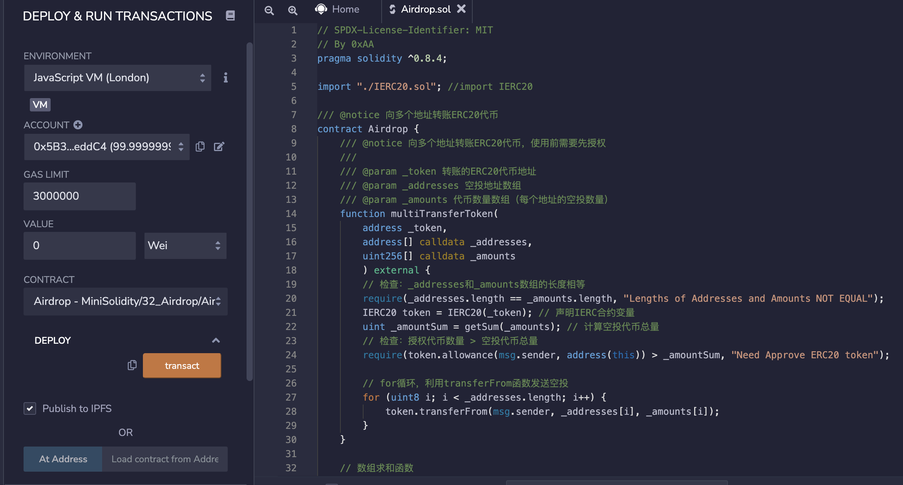

# WTF Solidity极简入门: 33. 发送空投

我最近在重新学 Solidity，巩固一下细节，也写一个“WTF Solidity极简入门”，供小白们使用（编程大佬可以另找教程），每周更新 1-3 讲。

推特：[@0xAA_Science](https://twitter.com/0xAA_Science)｜[@WTFAcademy_](https://twitter.com/WTFAcademy_)

社区：[Discord](https://discord.gg/5akcruXrsk)｜[微信群](https://docs.google.com/forms/d/e/1FAIpQLSe4KGT8Sh6sJ7hedQRuIYirOoZK_85miz3dw7vA1-YjodgJ-A/viewform?usp=sf_link)｜[官网 wtf.academy](https://wtf.academy)

所有代码和教程开源在 github: [github.com/AmazingAng/WTFSolidity](https://github.com/AmazingAng/WTFSolidity)

---

在币圈，最开心的一件事就是领空投，空手套白狼。这一讲，我们将学习如何使用智能合约发送`ERC20`代币空投。

## 空投 Airdrop

空投是币圈中一种营销策略，项目方将代币免费发放给特定用户群体。为了拿到空投资格，用户通常需要完成一些简单的任务，如测试产品、分享新闻、介绍朋友等。项目方通过空投可以获得种子用户，而用户可以获得一笔财富，两全其美。

因为每次接收空投的用户很多，项目方不可能一笔一笔的转账。利用智能合约批量发放`ERC20`代币，可以显著提高空投效率。

### 空投代币合约

`Airdrop`空投合约逻辑非常简单：利用循环，一笔交易将`ERC20`代币发送给多个地址。合约中包含两个函数

- `getSum()`函数：返回`uint`数组的和。

  ```solidity
  // 数组求和函数
  function getSum(uint256[] calldata _arr) public pure returns(uint sum)
  {
      for(uint i = 0; i < _arr.length; i++)
          sum = sum + _arr[i];
  }
  ```

- `multiTransferToken()`函数：发送`ERC20`代币空投，包含`3`个参数：

  - `_token`：代币合约地址（`address`类型）
  - `_addresses`：接收空投的用户地址数组（`address[]`类型）
  - `_amounts`：空投数量数组，对应`_addresses`里每个地址的数量（`uint[]`类型）

  该函数有两个检查：第一个`require`检查了`_addresses`和`_amounts`两个数组长度是否相等；第二个`require`检查了空投合约的授权额度大于要空投的代币数量总和。

  ```solidity
  /// @notice 向多个地址转账ERC20代币，使用前需要先授权
  ///
  /// @param _token 转账的ERC20代币地址
  /// @param _addresses 空投地址数组
  /// @param _amounts 代币数量数组（每个地址的空投数量）
  function multiTransferToken(
      address _token,
      address[] calldata _addresses,
      uint256[] calldata _amounts
      ) external {
      // 检查：_addresses和_amounts数组的长度相等
      require(_addresses.length == _amounts.length, "Lengths of Addresses and Amounts NOT EQUAL");
      IERC20 token = IERC20(_token); // 声明IERC合约变量
      uint _amountSum = getSum(_amounts); // 计算空投代币总量
      // 检查：授权代币数量 >= 空投代币总量
      require(token.allowance(msg.sender, address(this)) >= _amountSum, "Need Approve ERC20 token");

      // for循环，利用transferFrom函数发送空投
      for (uint8 i; i < _addresses.length; i++) {
          token.transferFrom(msg.sender, _addresses[i], _amounts[i]);
      }
  }
  ```

- `multiTransferETH()`函数：发送`ETH`空投，包含`2`个参数：

  - `_addresses`：接收空投的用户地址数组（`address[]`类型）
  - `_amounts`：空投数量数组，对应`_addresses`里每个地址的数量（`uint[]`类型）

  ```solidity
  /// 向多个地址转账ETH
  function multiTransferETH(
      address payable[] calldata _addresses,
      uint256[] calldata _amounts
  ) public payable {
      // 检查：_addresses和_amounts数组的长度相等
      require(_addresses.length == _amounts.length, "Lengths of Addresses and Amounts NOT EQUAL");
      uint _amountSum = getSum(_amounts); // 计算空投ETH总量
      // 检查转入ETH等于空投总量
      require(msg.value == _amountSum, "Transfer amount error");
      // for循环，利用transfer函数发送ETH
      for (uint256 i = 0; i < _addresses.length; i++) {
          // 注释代码有Dos攻击风险, 并且transfer 也是不推荐写法
          // Dos攻击 具体参考 https://github.com/AmazingAng/WTF-Solidity/blob/main/S09_DoS/readme.md
          // _addresses[i].transfer(_amounts[i]);
          (bool success, ) = _addresses[i].call{value: _amounts[i]}("");
          if (!success) {
              failTransferList[_addresses[i]] = _amounts[i];
          }
      }
  }
  ```

### 空投实践

1. 部署`ERC20`代币合约，并给自己`mint`10000 单位代币。




2. 部署`Airdrop`空投合约。


3. 利用`ERC20`代币合约中的`approve()`函数，给`Airdrop`空投合约授权 10000 单位代币。


4. 执行`Airdrop`合约的`multiTransferToken()`函数进行空投， `_token`填`ERC20`代币地址，`_addresses`和`_amounts`按照以下填写

```
// _addresses填写
["0xAb8483F64d9C6d1EcF9b849Ae677dD3315835cb2", "0x5B38Da6a701c568545dCfcB03FcB875f56beddC4"]

// _amounts填写
[100, 200]
```


5. 利用`ERC20`合约的`balanceOf()`函数查询上面用户地址的代币余额，成功变为`100`和`200`，空投成功！


## 总结

这一讲，我们介绍了如何使用`solidity`写`ERC20`代币空投合约，极大增加空投效率。我撸空投收获最大的一次是`ENS`空投，你们呢？
