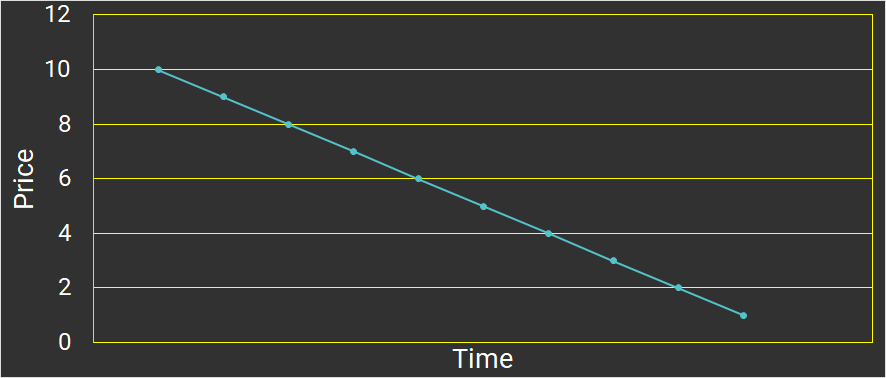

# WTF Solidity极简入门: 35. 荷兰拍卖

我最近在重新学 Solidity，巩固一下细节，也写一个“WTF Solidity极简入门”，供小白们使用（编程大佬可以另找教程），每周更新 1-3 讲。

推特：[@0xAA_Science](https://twitter.com/0xAA_Science)｜[@WTFAcademy_](https://twitter.com/WTFAcademy_)

社区：[Discord](https://discord.gg/5akcruXrsk)｜[微信群](https://docs.google.com/forms/d/e/1FAIpQLSe4KGT8Sh6sJ7hedQRuIYirOoZK_85miz3dw7vA1-YjodgJ-A/viewform?usp=sf_link)｜[官网 wtf.academy](https://wtf.academy)

所有代码和教程开源在 github: [github.com/AmazingAng/WTFSolidity](https://github.com/AmazingAng/WTFSolidity)

---

这一讲，我将介绍荷兰拍卖，并通过简化版`Azuki`荷兰拍卖代码，讲解如何通过`荷兰拍卖`发售`ERC721`标准的`NFT`。

## 荷兰拍卖

荷兰拍卖（`Dutch Auction`）是一种特殊的拍卖形式。 亦称“减价拍卖”，它是指拍卖标的的竞价由高到低依次递减直到第一个竞买人应价（达到或超过底价）时击槌成交的一种拍卖。



在币圈，很多`NFT`通过荷兰拍卖发售，其中包括`Azuki`和`World of Women`，其中`Azuki`通过荷兰拍卖筹集了超过`8000`枚`ETH`。

项目方非常喜欢这种拍卖形式，主要有两个原因

1. 荷兰拍卖的价格由最高慢慢下降，能让项目方获得最大的收入。

2. 拍卖持续较长时间（通常6小时以上），可以避免`gas war`。

## `DutchAuction`合约

代码基于`Azuki`的[代码](https://etherscan.io/address/0xed5af388653567af2f388e6224dc7c4b3241c544#code)简化而成。`DucthAuction`合约继承了之前介绍的`ERC721`和`Ownable`合约：

```solidity
// SPDX-License-Identifier: MIT
pragma solidity ^0.8.21;

import "@openzeppelin/contracts/access/Ownable.sol";
import "https://github.com/AmazingAng/WTFSolidity/blob/main/34_ERC721/ERC721.sol";

contract DutchAuction is Ownable, ERC721 {
```

### `DutchAuction`状态变量

合约中一共有`9`个状态变量，其中有`6`个和拍卖相关，他们是：

- `COLLECTOIN_SIZE`：NFT总量。
- `AUCTION_START_PRICE`：荷兰拍卖起拍价，也是最高价。
- `AUCTION_END_PRICE`：荷兰拍卖结束价，也是最低价/地板价。
- `AUCTION_TIME`：拍卖持续时长。
- `AUCTION_DROP_INTERVAL`：每过多久时间，价格衰减一次。
- `auctionStartTime`：拍卖起始时间（区块链时间戳，`block.timestamp`）。

```solidity
    uint256 public constant COLLECTOIN_SIZE = 10000; // NFT总数
    uint256 public constant AUCTION_START_PRICE = 1 ether; // 起拍价(最高价)
    uint256 public constant AUCTION_END_PRICE = 0.1 ether; // 结束价(最低价/地板价)
    uint256 public constant AUCTION_TIME = 10 minutes; // 拍卖时间，为了测试方便设为10分钟
    uint256 public constant AUCTION_DROP_INTERVAL = 1 minutes; // 每过多久时间，价格衰减一次
    uint256 public constant AUCTION_DROP_PER_STEP =
        (AUCTION_START_PRICE - AUCTION_END_PRICE) /
        (AUCTION_TIME / AUCTION_DROP_INTERVAL); // 每次价格衰减步长
    
    uint256 public auctionStartTime; // 拍卖开始时间戳
    string private _baseTokenURI;   // metadata URI
    uint256[] private _allTokens; // 记录所有存在的tokenId 
```

### `DutchAuction`函数
荷兰拍卖合约中共有`9`个函数，与`ERC721`相关的函数我们这里不再重复介绍，只介绍和拍卖相关的函数。

- 设定拍卖起始时间：我们在构造函数中会声明当前区块时间为起始时间，项目方也可以通过`setAuctionStartTime()`函数来调整：

```solidity
    constructor() ERC721("WTF Dutch Auctoin", "WTF Dutch Auctoin") {
        auctionStartTime = block.timestamp;
    }

    // auctionStartTime setter函数，onlyOwner
    function setAuctionStartTime(uint32 timestamp) external onlyOwner {
        auctionStartTime = timestamp;
    }
```

- 获取拍卖实时价格：`getAuctionPrice()`函数通过当前区块时间以及拍卖相关的状态变量来计算实时拍卖价格。

当`block.timestamp`小于起始时间，价格为最高价`AUCTION_START_PRICE`；

当`block.timestamp`大于结束时间，价格为最低价`AUCTION_END_PRICE`；

当`block.timestamp`处于两者之间时，则计算出当前的衰减价格。

```solidity
    // 获取拍卖实时价格
    function getAuctionPrice()
        public
        view
        returns (uint256)
    {
        if (block.timestamp < auctionStartTime) {
        return AUCTION_START_PRICE;
        }else if (block.timestamp - auctionStartTime >= AUCTION_TIME) {
        return AUCTION_END_PRICE;
        } else {
        uint256 steps = (block.timestamp - auctionStartTime) /
            AUCTION_DROP_INTERVAL;
        return AUCTION_START_PRICE - (steps * AUCTION_DROP_PER_STEP);
        }
    }
```

- 用户拍卖并铸造`NFT`：用户通过调用`auctionMint()`函数，支付`ETH`参加荷兰拍卖并铸造`NFT`。

该函数首先检查拍卖是否开始/铸造是否超出`NFT`总量。接着，合约通过`getAuctionPrice()`和铸造数量计算拍卖成本，并检查用户支付的`ETH`是否足够：如果足够，则将`NFT`铸造给用户，并退回超额的`ETH`；反之，则回退交易。

```solidity
    // 拍卖mint函数
    function auctionMint(uint256 quantity) external payable{
        uint256 _saleStartTime = uint256(auctionStartTime); // 建立local变量，减少gas花费
        require(
        _saleStartTime != 0 && block.timestamp >= _saleStartTime,
        "sale has not started yet"
        ); // 检查是否设置起拍时间，拍卖是否开始
        require(
        totalSupply() + quantity <= COLLECTOIN_SIZE,
        "not enough remaining reserved for auction to support desired mint amount"
        ); // 检查是否超过NFT上限

        uint256 totalCost = getAuctionPrice() * quantity; // 计算mint成本
        require(msg.value >= totalCost, "Need to send more ETH."); // 检查用户是否支付足够ETH
        
        // Mint NFT
        for(uint256 i = 0; i < quantity; i++) {
            uint256 mintIndex = totalSupply();
            _mint(msg.sender, mintIndex);
            _addTokenToAllTokensEnumeration(mintIndex);
        }
        // 多余ETH退款
        if (msg.value > totalCost) {
            payable(msg.sender).transfer(msg.value - totalCost); //注意一下这里是否有重入的风险
        }
    }
```

- 项目方取出筹集的`ETH`：项目方可以通过`withdrawMoney()`函数提走拍卖筹集的`ETH`。

```solidity
    // 提款函数，onlyOwner
    function withdrawMoney() external onlyOwner {
        (bool success, ) = msg.sender.call{value: address(this).balance}(""); // call函数的调用方式详见第22讲
        require(success, "Transfer failed.");
    }
```
## Remix演示

1. 合约部署：首先，部署`DutchAuction.sol`合约，并通过`setAuctionStartTime()`函数设置拍卖起始时间。
本例采用的起始时间为，2022年7月12日 1点30分，对应的utc时间为1658338200。实验时可以在工具网站（[比如这里](https://tool.chinaz.com/tools/unixtime.aspx)）自行查询对应时间。


2. 荷兰拍卖：随后，可以通过`getAuctionPrice()`函数获取到**当前**的拍卖价格。可以观察到，拍卖开始前的价格为`起拍价 AUCTION_START_PRICE`随着拍卖进行，拍卖价格在逐渐降低，直到降低至`地板价 AUCTION_END_PRICE`后不再变化。


3. Mint操作：通过`auctionMint()`函数，完成mint，可以看见本例中，由于时间已经超过拍卖时间，因此仅耗费了`地板价`就完成了拍卖。


4. 提取`ETH`：直接通过`withdrawMoney()`函数，便能将筹集到的`ETH`通过`call()`发送到合约创建者的地址。

## 总结

这一讲，我们介绍了荷兰拍卖，并通过简化版`Azuki`荷兰拍卖代码，讲解如何通过`荷兰拍卖`发售`ERC721`标准的`NFT`。我拍卖到的最贵的`NFT`是音乐家`Jonathan Mann`的一首音乐`NFT`，你呢？
