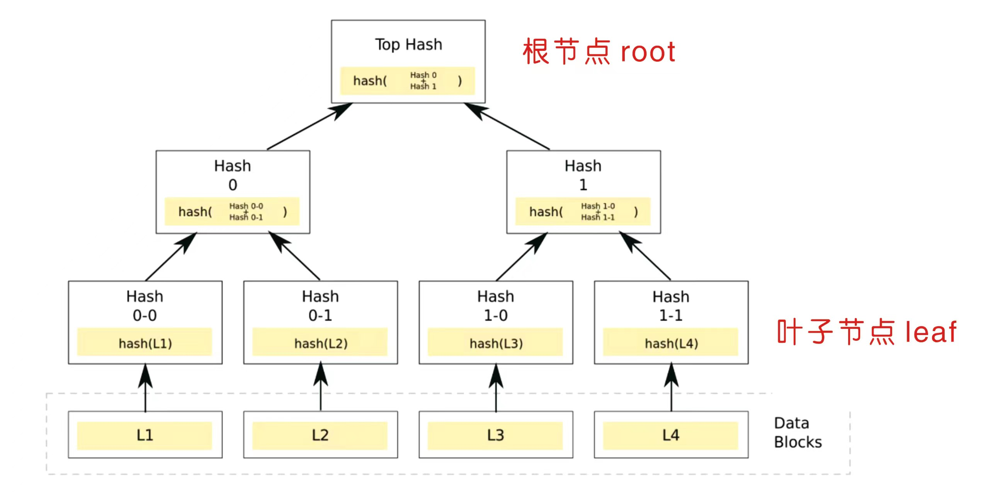
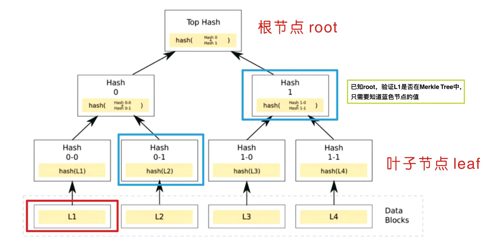
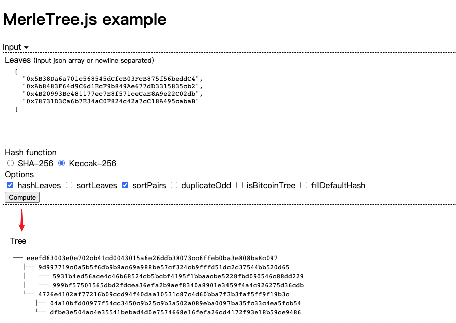
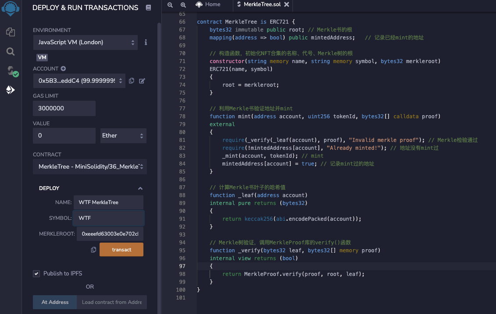
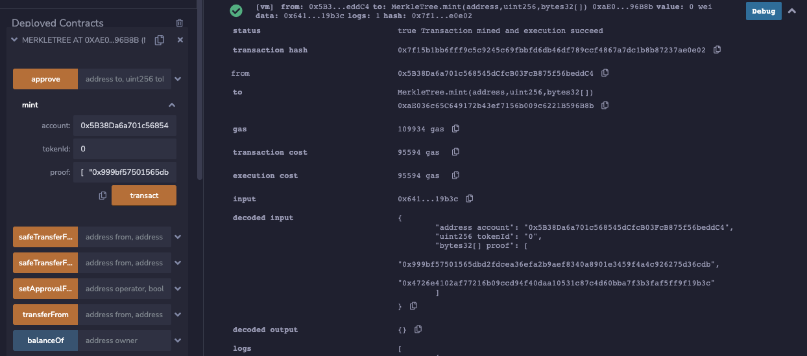

# WTF Solidity极简入门: 36. 默克尔树 Merkle Tree

我最近在重新学solidity，巩固一下细节，也写一个“WTF Solidity极简入门”，供小白们使用（编程大佬可以另找教程），每周更新1-3讲。

欢迎关注我的推特：[@0xAA_Science](https://twitter.com/0xAA_Science)

欢迎加入WTF科学家社区，内有加微信群方法：[链接](https://discord.gg/5akcruXrsk)

所有代码和教程开源在github（1024个star发课程认证，2048个star发社群NFT）: [github.com/AmazingAng/WTFSolidity](https://github.com/AmazingAng/WTFSolidity)

-----

这一讲，我将介绍`Merkle Tree`，以及如何利用`Merkle Tree`发放`NFT`白名单。

## `Merkle Tree`
`Merkle Tree`，也叫默克尔树或哈希树，是区块链的底层加密技术，被比特币和以太坊区块链广泛采用。`Merkle Tree`是一种自下而上构建的加密树，每个叶子是对应数据的哈希，而每个非叶子为它的`2`个子节点的哈希。



`Merkle Tree`允许对大型数据结构的内容进行有效和安全的验证（`Merkle Proof`）。对于有`N`个叶子结点的`Merkle Tree`，在已知`root`根值的情况下，验证某个数据是否有效（属于`Merkle Tree`叶子结点）只需要`log(N)`个数据（也叫`proof`），非常高效。如果数据有误，或者给的`proof`错误，则无法还原出`root`根植。
下面的例子中，叶子`L1`的`Merkle proof`为`Hash 0-1`和`Hash 1`：知道这两个值，就能验证`L1`的值是不是在`Merkle Tree`的叶子中。为什么呢？
因为通过叶子`L1`我们就可以算出`Hash 0-0`，我们又知道了`Hash 0-1`，那么`Hash 0-0`和`Hash 0-1`就可以联合算出`Hash 0`，然后我们又知道`Hash 1`，`Hash 0`和`Hash 1`就可以联合算出`Top Hash`，也就是root节点的hash。




## 生成`Merkle Tree`

我们可以利用[网页](https://lab.miguelmota.com/merkletreejs/example/)或者Javascript库[merkletreejs](https://github.com/miguelmota/merkletreejs)来生成`Merkle Tree`。

这里我们用网页来生成`4`个地址作为叶子结点的`Merkle Tree`。叶子结点输入：

```solidity
    [
    "0x5B38Da6a701c568545dCfcB03FcB875f56beddC4", 
    "0xAb8483F64d9C6d1EcF9b849Ae677dD3315835cb2",
    "0x4B20993Bc481177ec7E8f571ceCaE8A9e22C02db",
    "0x78731D3Ca6b7E34aC0F824c42a7cC18A495cabaB"
    ]
```

在菜单里选上`Keccak-256`, `hashLeaves`和`sortPairs`选项，然后点击`Compute`，`Merkle Tree`就生成好了。`Merkle Tree`展开为：
```
└─ 根: eeefd63003e0e702cb41cd0043015a6e26ddb38073cc6ffeb0ba3e808ba8c097
   ├─ 9d997719c0a5b5f6db9b8ac69a988be57cf324cb9fffd51dc2c37544bb520d65
   │  ├─ 叶子0：5931b4ed56ace4c46b68524cb5bcbf4195f1bbaacbe5228fbd090546c88dd229
   │  └─ 叶子1：999bf57501565dbd2fdcea36efa2b9aef8340a8901e3459f4a4c926275d36cdb
   └─ 4726e4102af77216b09ccd94f40daa10531c87c4d60bba7f3b3faf5ff9f19b3c
      ├─ 叶子2：04a10bfd00977f54cc3450c9b25c9b3a502a089eba0097ba35fc33c4ea5fcb54
      └─ 叶子3：dfbe3e504ac4e35541bebad4d0e7574668e16fefa26cd4172f93e18b59ce9486
```



## `Merkle Proof`验证
通过网站，我们可以得到`地址0`的`proof`如下，即图2中蓝色结点的哈希值：
```solidity
[
  "0x999bf57501565dbd2fdcea36efa2b9aef8340a8901e3459f4a4c926275d36cdb",
  "0x4726e4102af77216b09ccd94f40daa10531c87c4d60bba7f3b3faf5ff9f19b3c"
]
```


我们利用`MerkleProof`库来验证：

```solidity
library MerkleProof {
    /**
     * @dev 当通过`proof`和`leaf`重建出的`root`与给定的`root`相等时，返回`true`，数据有效。
     * 在重建时，叶子节点对和元素对都是排序过的。
     */
    function verify(
        bytes32[] memory proof,
        bytes32 root,
        bytes32 leaf
    ) internal pure returns (bool) {
        return processProof(proof, leaf) == root;
    }

    /**
     * @dev Returns 通过Merkle树用`leaf`和`proof`计算出`root`. 当重建出的`root`和给定的`root`相同时，`proof`才是有效的。
     * 在重建时，叶子节点对和元素对都是排序过的。
     */
    function processProof(bytes32[] memory proof, bytes32 leaf) internal pure returns (bytes32) {
        bytes32 computedHash = leaf;
        for (uint256 i = 0; i < proof.length; i++) {
            computedHash = _hashPair(computedHash, proof[i]);
        }
        return computedHash;
    }

    // Sorted Pair Hash
    function _hashPair(bytes32 a, bytes32 b) private pure returns (bytes32) {
        return a < b ? keccak256(abi.encodePacked(a, b)) : keccak256(abi.encodePacked(b, a));
    }
}
```
`MerkleProof`库有三个函数：

1. `verify()`函数：利用`proof`数来验证`leaf`是否属于根为`root`的`Merkle Tree`中，如果是，则返回`true`。它调用了`processProof()`函数。

2. `processProof()`函数：利用`proof`和`leaf`依次计算出`Merkle Tree`的`root`。它调用了`_hashPair()`函数。

3.  `_hashPair()`函数：用`keccak256()`函数计算非根节点对应的两个子节点的哈希（排序后）。

我们将`地址0`，`root`和对应的`proof`输入到`verify()`函数，将返回`true`。因为`地址0`在根为`root`的`Merkle Tree`中，且`proof`正确。如果改变了其中任意一个值，都将返回`false`。

## 利用`Merkle Tree`发放`NFT`白名单

一份拥有800个地址的白名单，更新一次所需的gas fee很容易超过1个ETH。而由于`Merkle Tree`验证时，`leaf`和`proof`可以存在后端，链上仅需存储一个`root`的值，非常节省`gas`，项目方经常用它来发放白名单。很多`ERC721`标准的`NFT`和`ERC20`标准代币的白名单/空投都是利用`Merkle Tree`发出的，比如`optimism`的空投。

这里，我们介绍如何利用`MerkleTree`合约来发放`NFT`白名单：

```solidity
contract MerkleTree is ERC721 {
    bytes32 immutable public root; // Merkle树的根
    mapping(address => bool) public mintedAddress;   // 记录已经mint的地址

    // 构造函数，初始化NFT合集的名称、代号、Merkle树的根
    constructor(string memory name, string memory symbol, bytes32 merkleroot)
    ERC721(name, symbol)
    {
        root = merkleroot;
    }

    // 利用Merkle树验证地址并完成mint
    function mint(address account, uint256 tokenId, bytes32[] calldata proof)
    external
    {
        require(_verify(_leaf(account), proof), "Invalid merkle proof"); // Merkle检验通过
        require(!mintedAddress[account], "Already minted!"); // 地址没有mint过
        _mint(account, tokenId); // mint
        mintedAddress[account] = true; // 记录mint过的地址
    }

    // 计算Merkle树叶子的哈希值
    function _leaf(address account)
    internal pure returns (bytes32)
    {
        return keccak256(abi.encodePacked(account));
    }

    // Merkle树验证，调用MerkleProof库的verify()函数
    function _verify(bytes32 leaf, bytes32[] memory proof)
    internal view returns (bool)
    {
        return MerkleProof.verify(proof, root, leaf);
    }
}
```

`MerkleTree`合约继承了`ERC721`标准，并利用了`MerkleProof`库。

### 状态变量
合约中共有两个状态变量：
- `root`存储了`Merkle Tree`的根，部署合约的时候赋值。
- `mintedAddress`是一个`mapping`，记录了已经`mint`过的地址，某地址mint成功后进行赋值。

### 函数
合约中共有4个函数：
- 构造函数：初始化`NFT`的名称和代号，还有`Merkle Tree`的`root`。
- `mint()`函数：利用白名单铸造`NFT`。参数为白名单地址`account`，铸造的`tokenId`，和`proof`。首先验证`address`是否在白名单中，验证通过则把序号为`tokenId`的`NFT`铸造给该地址，并将它记录到`mintedAddress`。此过程中调用了`_leaf()`和`_verify()`函数。
- `_leaf()`函数：计算了`Merkle Tree`的叶子地址的哈希。
- `_verify()`函数：调用了`MerkleProof`库的`verify()`函数，进行`Merkle Tree`验证。

### `remix`验证

我们使用上面例子的`4`个地址作为白名单并生成`Merkle Tree`。我们部署`MerkleTree`合约，`3`个参数分别为：
```solidity
name = "WTF MerkleTree"
symbol = "WTF"
merkleroot = 0xeeefd63003e0e702cb41cd0043015a6e26ddb38073cc6ffeb0ba3e808ba8c097
```



接下来运行`mint`函数给地址0铸造`NFT`，`3`个参数分别为：

```solidity
account = 0x5B38Da6a701c568545dCfcB03FcB875f56beddC4
tokenId = 0
proof = [   "0x999bf57501565dbd2fdcea36efa2b9aef8340a8901e3459f4a4c926275d36cdb",   "0x4726e4102af77216b09ccd94f40daa10531c87c4d60bba7f3b3faf5ff9f19b3c" ]
```



我们可以用`ownerOf`函数验证`tokenId`为0的`NFT`已经铸造给了地址0，合约运行成功！


此时，若再次调用mint函数，虽然该地址能够通过`Merkle Proof`验证，但由于地址已经记录在`mintedAddress`中，因此该交易会由于`"Already minted!"`被中止。

## 总结

这一讲，我们介绍了`Merkle Tree`的概念，如何生成简单的`Merkle Tree`，如何利用智能合约验证`Merkle Tree`，以及用它来发放`NFT`白名单。

在实际使用中，复杂的`Merkle Tree`可以利用`javascript`库`merkletreejs`来生成和管理，链上只需要存储一个根值，非常节省`gas`。很多项目方都选择利用`Merkle Tree`来发放白名单。
