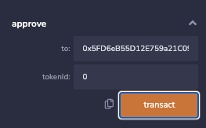
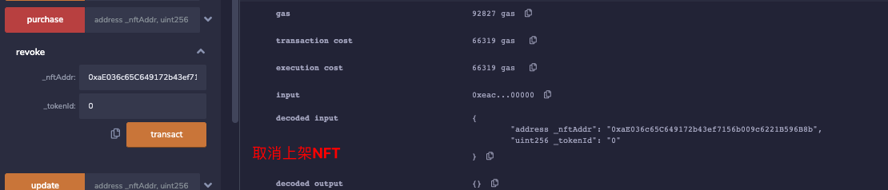
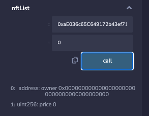
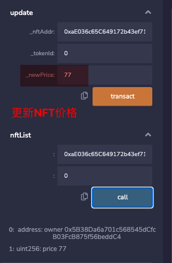
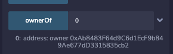

# Solidity极简入门: 38. NFT交易所

我最近在重新学solidity，巩固一下细节，也写一个“Solidity极简入门”，供小白们使用（编程大佬可以另找教程），每周更新1-3讲。

推特：[@0xAA_Science](https://twitter.com/0xAA_Science)

discord：[WTF Academy](https://discord.gg/5akcruXrsk)

所有代码和教程开源在github: [github.com/AmazingAng/WTFSolidity](https://github.com/AmazingAng/WTFSolidity)

-----

`Opensea`是以太坊上最大的`NFT`交易平台，总交易总量达到了`$300亿`。`Opensea`在交易中抽成`2.5%`，因此它通过用户交易至少获利了`$7.5亿`。另外，它的运作并不去中心化，且不准备发币补偿用户。`NFT`玩家苦`Opensea`久已，今天我们就利用智能合约搭建一个零手续费的去中心化`NFT`交易所：`NFTSwap`。

## 设计逻辑

- 卖家：出售`NFT`的一方，可以挂单`list`、撤单`revoke`、修改价格`update`。
- 买家：购买`NFT`的一方，可以购买`purchase`。
- 订单：卖家发布的`NFT`链上订单，一个系列的同一`tokenId`最多存在一个订单，其中包含挂单价格`price`和持有人`owner`信息。当一个订单交易完成或被撤单后，其中信息清零。

## `NFTSwap`合约

### 事件
合约包含`4`个事件，对应挂单`list`、撤单`revoke`、修改价格`update`、购买`purchase`这四个行为：
``` solidity
    event List(address indexed seller, address indexed nftAddr, uint256 indexed tokenId, uint256 price);
    event Purchase(address indexed buyer, address indexed nftAddr, uint256 indexed tokenId, uint256 price);
    event Revoke(address indexed seller, address indexed nftAddr, uint256 indexed tokenId);    
    event Update(address indexed seller, address indexed nftAddr, uint256 indexed tokenId, uint256 newPrice);
```

### 订单
`NFT`订单抽象为`Order`结构体，包含挂单价格`price`和持有人`owner`信息。`nftList`映射记录了订单是对应的`NFT`系列（合约地址）和`tokenId`信息。
```solidity
    // 定义order结构体
    struct Order{
        address owner;
        uint256 price; 
    }
    // NFT Order映射
    mapping(address => mapping(uint256 => Order)) public nftList;
```

### 回退函数
在`NFTSwap`中，用户使用`ETH`购买`NFT`。因此，合约需要实现`fallback()`函数来接收`ETH`。

```solidity
    fallback() external payable{}
```

### onERC721Received

`ERC721`的安全转账函数会检查接收合约是否实现了`onERC721Received()`函数，并返回正确的选择器`selector`。用户下单之后，需要将`NFT`发送给`NFTSwap`合约。因此`NFTSwap`继承`IERC721Receiver`接口，并实现`onERC721Received()`函数：

```
contract NFTSwap is IERC721Receiver{

    // 实现{IERC721Receiver}的onERC721Received，能够接收ERC721代币
    function onERC721Received(
        address operator,
        address from,
        uint tokenId,
        bytes calldata data
    ) external override returns (bytes4){
        return IERC721Receiver.onERC721Received.selector;
    }
```

### 交易

合约实现了`4`个交易相关的函数：

- 挂单`list()`：卖家创建`NFT`并创建订单，并释放`List`事件。参数为`NFT`合约地址`_nftAddr`，`NFT`对应的`_tokenId`，挂单价格`_price`（**注意：单位是`wei`**）。成功后，`NFT`会从卖家转到`NFTSwap`合约中。

```solidity
    // 挂单: 卖家上架NFT，合约地址为_nftAddr，tokenId为_tokenId，价格_price为以太坊（单位是wei）
    function list(address _nftAddr, uint256 _tokenId, uint256 _price) public{
        IERC721 _nft = IERC721(_nftAddr); // 声明IERC721接口合约变量
        require(_nft.getApproved(_tokenId) == address(this), "Need Approval"); // 合约得到授权
        require(_price > 0); // 价格大于0

        Order storage _order = nftList[_nftAddr][_tokenId]; //设置NF持有人和价格
        _order.owner = msg.sender;
        _order.price = _price;
        // 将NFT转账到合约
        _nft.safeTransferFrom(msg.sender, address(this), _tokenId);

        // 释放List事件
        emit List(msg.sender, _nftAddr, _tokenId, _price);
    }
```

- 撤单`revoke()`：卖家撤回挂单，并释放`Revoke`事件。参数为`NFT`合约地址`_nftAddr`，`NFT`对应的`_tokenId`。成功后，`NFT`会从`NFTSwap`合约转回卖家。
```solidity
    // 撤单： 卖家取消挂单
    function revoke(address _nftAddr, uint256 _tokenId) public {
        Order storage _order = nftList[_nftAddr][_tokenId]; // 取得Order        
        require(_order.owner == msg.sender, "Not Owner"); // 必须由持有人发起
        // 声明IERC721接口合约变量
        IERC721 _nft = IERC721(_nftAddr);
        require(_nft.ownerOf(_tokenId) == address(this), "Invalid Order"); // NFT在合约中
        
        // 将NFT转给卖家
        _nft.safeTransferFrom(address(this), msg.sender, _tokenId);
         delete nftList[_nftAddr][_tokenId]; // 删除order
      
        // 释放Revoke事件
        emit Revoke(msg.sender, _nftAddr, _tokenId);
    }
```
- 修改价格`update()`：卖家修改`NFT`订单价格，并释放`Update`事件。参数为`NFT`合约地址`_nftAddr`，`NFT`对应的`_tokenId`，更新后的挂单价格`_newPrice`（**注意：单位是`wei`**）。
```solidity
    // 调整价格: 卖家调整挂单价格
    function update(address _nftAddr, uint256 _tokenId, uint256 _newPrice) public {
        require(_newPrice > 0, "Invalid Price"); // NFT价格大于0
        Order storage _order = nftList[_nftAddr][_tokenId]; // 取得Order        
        require(_order.owner == msg.sender, "Not Owner"); // 必须由持有人发起
        // 声明IERC721接口合约变量
        IERC721 _nft = IERC721(_nftAddr);
        require(_nft.ownerOf(_tokenId) == address(this), "Invalid Order"); // NFT在合约中
        
        // 调整NFT价格
        _order.price = _newPrice;
      
        // 释放Update事件
        emit Update(msg.sender, _nftAddr, _tokenId, _newPrice);
    }
```

- 购买`purchase`：买家支付`ETH`购买挂单的`NFT`，并释放`Purchase`事件。参数为`NFT`合约地址`_nftAddr`，`NFT`对应的`_tokenId`。成功后，`ETH`将转给卖家，`NFT`将从`NFTSwap`合约转给买家。
```solidity
    // 购买: 买家购买NFT，合约为_nftAddr，tokenId为_tokenId，调用函数时要附带ETH
    function purchase(address _nftAddr, uint256 _tokenId) payable public {
        Order storage _order = nftList[_nftAddr][_tokenId]; // 取得Order        
        require(_order.price > 0, "Invalid Price"); // NFT价格大于0
        require(msg.value >= _order.price, "Increase price"); // 购买价格大于标价
        // 声明IERC721接口合约变量
        IERC721 _nft = IERC721(_nftAddr);
        require(_nft.ownerOf(_tokenId) == address(this), "Invalid Order"); // NFT在合约中

        // 将NFT转给买家
        _nft.safeTransferFrom(address(this), msg.sender, _tokenId);
        // 将ETH转给卖家，多余ETH给买家退款
        payable(_order.owner).transfer(_order.price);
        payable(msg.sender).transfer(msg.value-_order.price);

        delete nftList[_nftAddr][_tokenId]; // 删除order

        // 释放Purchase事件
        emit Purchase(msg.sender, _nftAddr, _tokenId, msg.value);
    }
```

## `Remix`实现

### 1. 部署NFT合约
参考 [ERC721](https://github.com/AmazingAng/WTFSolidity/tree/main/34_ERC721) 教程了解NFT，并部署`WTFApe` NFT合约。


将首个NFT mint给自己，这里mint给自己是为了之后能够上架NFT、修改价格等一系类操作。

`mint(address to, uint tokenId)`方法有2个参数:

`to`:将 NFT mint给指定的地址，这里通常是自己的钱包地址。
`tokenId`: `WTFApe`合约定义了总量为10000个NFT，图中mint它的的第一个NFT，`tokenId`为0


在`WTFApe`合约中，利用`ownerOf`确认自己已经获得`tokenId`为0的NFT。

`ownerOf(uint tokenId)`方法有1个参数:
`tokenId`: `tokenId`为NFT的id，本案例中为上述mint的`0`Id。


### 2. 部署`NFTSwap`合约
部署`NFTSwap`合约。


### 3. 将要上架的`NFT`授权给`NFTSwap`合约
在`WTFApe`合约中调用 `approve()`授权函数，将自己持有的`tokenId`为0的NFT授权给`NFTSwap`合约地址。

`approve(address to, uint tokenId)`方法有2个参数:

`to`: 将tokenId授权给 `to` 地址，本案例中将授权给`NFTSwap`合约地址。
`tokenId`: `tokenId`为NFT的id，本案例中为上述mint的`0`Id。



### 4. 上架`NFT`
调用`NFTSwap`合约的`list()`函数，将自己持有的`tokenId`为0的NFT上架到`NFTSwap`，价格设为1 `wei`。

`list(address _nftAddr, uint256 _tokenId, uint256 _price)`方法有3个参数:

`_nftAddr`: `_nftAddr`为NFT合约地址，本案例中为`WTFApe`合约地址。
`_tokenId`: `_tokenId`为NFT的id，本案例中为上述mint的`0`Id。
`_price`: `_price`为NFT的价格，本案例中为1 `wei`。


调用`NFTSwap`合约的`nftList()`函数查看上架的NFT。

`nftList`:是一个NFT Order的映射，结构如下：
`nftList[_nftAddr][_tokenId]`: 输入`_nftAddr`和`_tokenId`，返回一个NFT订单。 


调用`NFTSwap`合约的`update()`函数，将NFT价格更新为77 `wei`

`update(address _nftAddr, uint256 _tokenId, uint256 _newPrice)`方法有3个参数:

`_nftAddr`: `_nftAddr`为NFT合约地址，本案例中为`WTFApe`合约地址。
`_tokenId`: `_tokenId`为NFT的id，本案例中为上述mint的`0`Id。
`_newPrice`: `_newPrice`为NFT的新价格，本案例中为77 `wei`。


### 5. 下架NFT

调用`NFTSwap`合约的`revoke()`函数下架NFT。

`revoke(address _nftAddr, uint256 _tokenId)`方法有2个参数:

`_nftAddr`: `_nftAddr`为NFT合约地址，本案例中为`WTFApe`合约地址。
`_tokenId`: `_tokenId`为NFT的id，本案例中为上述mint的`0`Id。



调用`NFTSwap`合约的`nftList()`函数，可以看到`NFT`已经下架。再次上架需要重新授权。



### 6. 购买`NFT`

切换账号，调用`NFTSwap`合约的`purchase()`函数购买NFT，购买时需要输入`NFT`合约地址，`tokenId`，并输入支付的`ETH`。

`purchase(address _nftAddr, uint256 _tokenId, uint256 _wei)`方法有3个参数:

`_nftAddr`: `_nftAddr`为NFT合约地址，本案例中为`WTFApe`合约地址。
`_tokenId`: `_tokenId`为NFT的id，本案例中为上述mint的`0`Id。
`_wei`: `_wei`为支付的`ETH`数量，本案例中为1 `wei`。



### 7. 验证`NFT`持有人改变

购买成功之后，调用`WTFApe`合约的`ownerOf()`函数，可以看到`NFT`持有者发生变化，购买成功！



## 总结
这一讲，我们建立了一个零手续费的去中心化`NFT`交易所。`OpenSea`虽然对`NFT`的发展做了很大贡献，但它的缺点也非常明显：高手续费、不发币回馈用户、交易机制容易被钓鱼导致用户资产丢失。目前`Looksrare`和`dydx`等新的`NFT`交易平台正在挑战`OpenSea`的位置，`Uniswap`也在研究新的`NFT`交易所。相信不久的将来，我们会用到更好的`NFT`交易所。
