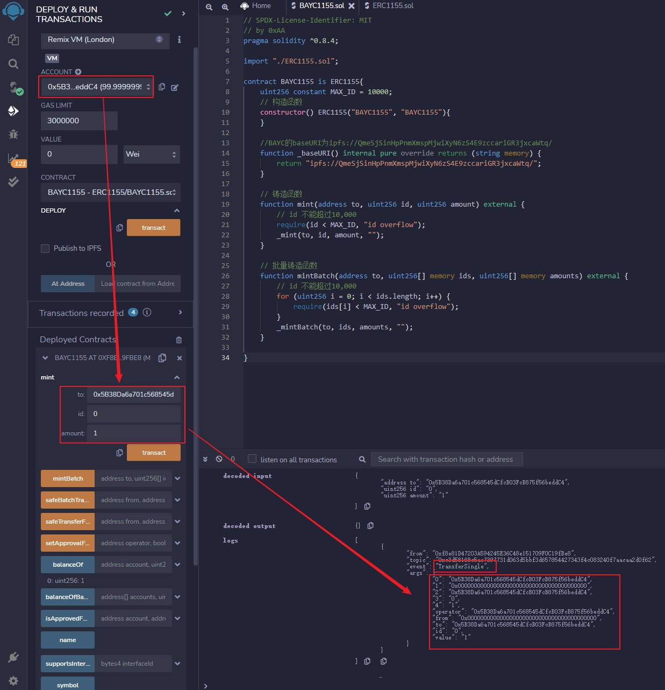

# WTF Solidity极简入门: 40. ERC1155

我最近在重新学 Solidity，巩固一下细节，也写一个“WTF Solidity极简入门”，供小白们使用（编程大佬可以另找教程），每周更新 1-3 讲。

推特：[@0xAA_Science](https://twitter.com/0xAA_Science)｜[@WTFAcademy_](https://twitter.com/WTFAcademy_)

社区：[Discord](https://discord.gg/5akcruXrsk)｜[微信群](https://docs.google.com/forms/d/e/1FAIpQLSe4KGT8Sh6sJ7hedQRuIYirOoZK_85miz3dw7vA1-YjodgJ-A/viewform?usp=sf_link)｜[官网 wtf.academy](https://wtf.academy)

所有代码和教程开源在 github: [github.com/AmazingAng/WTFSolidity](https://github.com/AmazingAng/WTFSolidity)

---

这一讲，我们将学习`ERC1155`标准，它支持一个合约包含多种代币。并且，我们会发行一个魔改的无聊猿 - `BAYC1155`：它包含`10,000`种代币，且元数据与`BAYC`一致。

## `EIP1155`
不论是`ERC20`还是`ERC721`标准，每个合约都对应一个独立的代币。假设我们要在以太坊上打造一个类似《魔兽世界》的大型游戏，这需要我们对每个装备都部署一个合约。上千种装备就要部署和管理上千个合约，这非常麻烦。因此，[以太坊EIP1155](https://eips.ethereum.org/EIPS/eip-1155)提出了一个多代币标准`ERC1155`，允许一个合约包含多个同质化和非同质化代币。`ERC1155`在GameFi应用最多，Decentraland、Sandbox等知名链游都使用它。

简单来说，`ERC1155`与之前介绍的非同质化代币标准[ERC721](https://github.com/AmazingAng/WTFSolidity/tree/main/34_ERC721)类似：在`ERC721`中，每个代币都有一个`tokenId`作为唯一标识，每个`tokenId`只对应一个代币；而在`ERC1155`中，每一种代币都有一个`id`作为唯一标识，每个`id`对应一种代币。这样，代币种类就可以非同质的在同一个合约里管理了，并且每种代币都有一个网址`uri`来存储它的元数据，类似`ERC721`的`tokenURI`。下面是`ERC1155`的元数据接口合约`IERC1155MetadataURI`：

```solidity
/**
 * @dev ERC1155的可选接口，加入了uri()函数查询元数据
 */
interface IERC1155MetadataURI is IERC1155 {
    /**
     * @dev 返回第`id`种类代币的URI
     */
    function uri(uint256 id) external view returns (string memory);
```

那么怎么区分`ERC1155`中的某类代币是同质化还是非同质化代币呢？其实很简单：如果某个`id`对应的代币总量为`1`，那么它就是非同质化代币，类似`ERC721`；如果某个`id`对应的代币总量大于`1`，那么他就是同质化代币，因为这些代币都分享同一个`id`，类似`ERC20`。

## `IERC1155`接口合约

`IERC1155`接口合约抽象了`EIP1155`需要实现的功能，其中包含`4`个事件和`6`个函数。与`ERC721`不同，因为`ERC1155`包含多类代币，它实现了批量转账和批量余额查询，一次操作多种代币。

```solidity
// SPDX-License-Identifier: MIT
pragma solidity ^0.8.0;

import "https://github.com/AmazingAng/WTFSolidity/blob/main/34_ERC721/IERC165.sol";

/**
 * @dev ERC1155标准的接口合约，实现了EIP1155的功能
 * 详见：https://eips.ethereum.org/EIPS/eip-1155[EIP].
 */
interface IERC1155 is IERC165 {
    /**
     * @dev 单类代币转账事件
     * 当`value`个`id`种类的代币被`operator`从`from`转账到`to`时释放.
     */
    event TransferSingle(address indexed operator, address indexed from, address indexed to, uint256 id, uint256 value);

    /**
     * @dev 批量代币转账事件
     * ids和values为转账的代币种类和数量数组
     */
    event TransferBatch(
        address indexed operator,
        address indexed from,
        address indexed to,
        uint256[] ids,
        uint256[] values
    );

    /**
     * @dev 批量授权事件
     * 当`account`将所有代币授权给`operator`时释放
     */
    event ApprovalForAll(address indexed account, address indexed operator, bool approved);

    /**
     * @dev 当`id`种类的代币的URI发生变化时释放，`value`为新的URI
     */
    event URI(string value, uint256 indexed id);

    /**
     * @dev 持仓查询，返回`account`拥有的`id`种类的代币的持仓量
     */
    function balanceOf(address account, uint256 id) external view returns (uint256);

    /**
     * @dev 批量持仓查询，`accounts`和`ids`数组的长度要想等。
     */
    function balanceOfBatch(address[] calldata accounts, uint256[] calldata ids)
        external
        view
        returns (uint256[] memory);

    /**
     * @dev 批量授权，将调用者的代币授权给`operator`地址。
     * 释放{ApprovalForAll}事件.
     */
    function setApprovalForAll(address operator, bool approved) external;

    /**
     * @dev 批量授权查询，如果授权地址`operator`被`account`授权，则返回`true`
     * 见 {setApprovalForAll}函数.
     */
    function isApprovedForAll(address account, address operator) external view returns (bool);

    /**
     * @dev 安全转账，将`amount`单位`id`种类的代币从`from`转账给`to`.
     * 释放{TransferSingle}事件.
     * 要求:
     * - 如果调用者不是`from`地址而是授权地址，则需要得到`from`的授权
     * - `from`地址必须有足够的持仓
     * - 如果接收方是合约，需要实现`IERC1155Receiver`的`onERC1155Received`方法，并返回相应的值
     */
    function safeTransferFrom(
        address from,
        address to,
        uint256 id,
        uint256 amount,
        bytes calldata data
    ) external;

    /**
     * @dev 批量安全转账
     * 释放{TransferBatch}事件
     * 要求：
     * - `ids`和`amounts`长度相等
     * - 如果接收方是合约，需要实现`IERC1155Receiver`的`onERC1155BatchReceived`方法，并返回相应的值
     */
    function safeBatchTransferFrom(
        address from,
        address to,
        uint256[] calldata ids,
        uint256[] calldata amounts,
        bytes calldata data
    ) external;
}
```

### `IERC1155`事件
- `TransferSingle`事件：单类代币转账事件，在单币种转账时释放。
- `TransferBatch`事件：批量代币转账事件，在多币种转账时释放。
- `ApprovalForAll`事件：批量授权事件，在批量授权时释放。
- `URI`事件：元数据地址变更事件，在`uri`变化时释放。

### `IERC1155`函数
- `balanceOf()`：单币种余额查询，返回`account`拥有的`id`种类的代币的持仓量。
- `balanceOfBatch()`：多币种余额查询，查询的地址`accounts`数组和代币种类`ids`数组的长度要相等。
- `setApprovalForAll()`：批量授权，将调用者的代币授权给`operator`地址。。
- `isApprovedForAll()`：查询批量授权信息，如果授权地址`operator`被`account`授权，则返回`true`。
- `safeTransferFrom()`：安全单币转账，将`amount`单位`id`种类的代币从`from`地址转账给`to`地址。如果`to`地址是合约，则会验证是否实现了`onERC1155Received()`接收函数。
- `safeBatchTransferFrom()`：安全多币转账，与单币转账类似，只不过转账数量`amounts`和代币种类`ids`变为数组，且长度相等。如果`to`地址是合约，则会验证是否实现了`onERC1155BatchReceived()`接收函数。

## `ERC1155`接收合约

与`ERC721`标准类似，为了避免代币被转入黑洞合约，`ERC1155`要求代币接收合约继承`IERC1155Receiver`并实现两个接收函数：

- `onERC1155Received()`：单币转账接收函数，接受ERC1155安全转账`safeTransferFrom` 需要实现并返回自己的选择器`0xf23a6e61`。

- `onERC1155BatchReceived()`：多币转账接收函数，接受ERC1155安全多币转账`safeBatchTransferFrom` 需要实现并返回自己的选择器`0xbc197c81`。

```solidity
// SPDX-License-Identifier: MIT
pragma solidity ^0.8.0;

import "https://github.com/AmazingAng/WTFSolidity/blob/main/34_ERC721/IERC165.sol";

/**
 * @dev ERC1155接收合约，要接受ERC1155的安全转账，需要实现这个合约
 */
interface IERC1155Receiver is IERC165 {
    /**
     * @dev 接受ERC1155安全转账`safeTransferFrom` 
     * 需要返回 0xf23a6e61 或 `bytes4(keccak256("onERC1155Received(address,address,uint256,uint256,bytes)"))`
     */
    function onERC1155Received(
        address operator,
        address from,
        uint256 id,
        uint256 value,
        bytes calldata data
    ) external returns (bytes4);

    /**
     * @dev 接受ERC1155批量安全转账`safeBatchTransferFrom` 
     * 需要返回 0xbc197c81 或 `bytes4(keccak256("onERC1155BatchReceived(address,address,uint256[],uint256[],bytes)"))`
     */
    function onERC1155BatchReceived(
        address operator,
        address from,
        uint256[] calldata ids,
        uint256[] calldata values,
        bytes calldata data
    ) external returns (bytes4);
}
```

## `ERC1155`主合约

`ERC1155`主合约实现了`IERC1155`接口合约规定的函数，还有单币/多币的铸造和销毁函数。

### `ERC1155`变量

`ERC1155`主合约包含`4`个状态变量：

- `name`：代币名称
- `symbol`：代币代号
- `_balances`：代币持仓映射，记录代币种类`id`下某地址`account`的持仓量`balances`。
- `_operatorApprovals`：批量授权映射，记录持有地址给另一个地址的授权情况。

### `ERC1155`函数

`ERC1155`主合约包含`16`个函数：

- 构造函数：初始化状态变量`name`和`symbol`。
- `supportsInterface()`：实现`ERC165`标准，声明它支持的接口，供其他合约检查。
- `balanceOf()`：实现`IERC1155`的`balanceOf()`，查询持仓量。与`ERC721`标准不同，这里需要输入查询的持仓地址`account`以及币种`id`。
- `balanceOfBatch()`：实现`IERC1155`的`balanceOfBatch()`，批量查询持仓量。
- `setApprovalForAll()`：实现`IERC1155`的`setApprovalForAll()`，批量授权，释放`ApprovalForAll`事件。
- `isApprovedForAll()`：实现`IERC1155`的`isApprovedForAll()`，查询批量授权信息。
- `safeTransferFrom()`：实现`IERC1155`的`safeTransferFrom()`，单币种安全转账，释放`TransferSingle`事件。与`ERC721`不同，这里不仅需要填发出方`from`，接收方`to`，代币种类`id`，还需要填转账数额`amount`。
- `safeBatchTransferFrom()`：实现`IERC1155`的`safeBatchTransferFrom()`，多币种安全转账，释放`TransferBatch`事件。
- `_mint()`：单币种铸造函数。
- `_mintBatch()`：多币种铸造函数。
- `_burn()`：单币种销毁函数。
- `_burnBatch()`：多币种销毁函数。
- `_doSafeTransferAcceptanceCheck`：单币种转账的安全检查，被`safeTransferFrom()`调用，确保接收方为合约的情况下，实现了`onERC1155Received()`函数。
- `_doSafeBatchTransferAcceptanceCheck`：多币种转账的安全检查，，被`safeBatchTransferFrom`调用，确保接收方为合约的情况下，实现了`onERC1155BatchReceived()`函数。
- `uri()`：返回`ERC1155`的第`id`种代币存储元数据的网址，类似`ERC721`的`tokenURI`。
- `baseURI()`：返回`baseURI`，`uri`就是把`baseURI`和`id`拼接在一起，需要开发重写。

```solidity
// SPDX-License-Identifier: MIT
pragma solidity ^0.8.0;

import "./IERC1155.sol";
import "./IERC1155Receiver.sol";
import "./IERC1155MetadataURI.sol";
import "https://github.com/AmazingAng/WTFSolidity/blob/main/34_ERC721/Address.sol";
import "https://github.com/AmazingAng/WTFSolidity/blob/main/34_ERC721/String.sol";
import "https://github.com/AmazingAng/WTFSolidity/blob/main/34_ERC721/IERC165.sol";

/**
 * @dev ERC1155多代币标准
 * 见 https://eips.ethereum.org/EIPS/eip-1155
 */
contract ERC1155 is IERC165, IERC1155, IERC1155MetadataURI {
    using Address for address; // 使用Address库，用isContract来判断地址是否为合约
    using Strings for uint256; // 使用String库
    // Token名称
    string public name;
    // Token代号
    string public symbol;
    // 代币种类id 到 账户account 到 余额balances 的映射
    mapping(uint256 => mapping(address => uint256)) private _balances;
    // address 到 授权地址 的批量授权映射
    mapping(address => mapping(address => bool)) private _operatorApprovals;

    /**
     * 构造函数，初始化`name` 和`symbol`, uri_
     */
    constructor(string memory name_, string memory symbol_) {
        name = name_;
        symbol = symbol_;
    }

    /**
     * @dev See {IERC165-supportsInterface}.
     */
    function supportsInterface(bytes4 interfaceId) public view virtual override returns (bool) {
        return
            interfaceId == type(IERC1155).interfaceId ||
            interfaceId == type(IERC1155MetadataURI).interfaceId ||
            interfaceId == type(IERC165).interfaceId;
    }

    /**
     * @dev 持仓查询 实现IERC1155的balanceOf，返回account地址的id种类代币持仓量。
     */
    function balanceOf(address account, uint256 id) public view virtual override returns (uint256) {
        require(account != address(0), "ERC1155: address zero is not a valid owner");
        return _balances[id][account];
    }

    /**
     * @dev 批量持仓查询
     * 要求:
     * - `accounts` 和 `ids` 数组长度相等.
     */
    function balanceOfBatch(address[] memory accounts, uint256[] memory ids)
        public view virtual override
        returns (uint256[] memory)
    {
        require(accounts.length == ids.length, "ERC1155: accounts and ids length mismatch");
        uint256[] memory batchBalances = new uint256[](accounts.length);
        for (uint256 i = 0; i < accounts.length; ++i) {
            batchBalances[i] = balanceOf(accounts[i], ids[i]);
        }
        return batchBalances;
    }

    /**
     * @dev 批量授权，调用者授权operator使用其所有代币
     * 释放{ApprovalForAll}事件
     * 条件：msg.sender != operator
     */
    function setApprovalForAll(address operator, bool approved) public virtual override {
        require(msg.sender != operator, "ERC1155: setting approval status for self");
        _operatorApprovals[msg.sender][operator] = approved;
        emit ApprovalForAll(msg.sender, operator, approved);
    }

    /**
     * @dev 查询批量授权.
     */
    function isApprovedForAll(address account, address operator) public view virtual override returns (bool) {
        return _operatorApprovals[account][operator];
    }

    /**
     * @dev 安全转账，将`amount`单位的`id`种类代币从`from`转账到`to`
     * 释放 {TransferSingle} 事件.
     * 要求:
     * - to 不能是0地址.
     * - from拥有足够的持仓量，且调用者拥有授权
     * - 如果 to 是智能合约, 他必须支持 IERC1155Receiver-onERC1155Received.
     */
    function safeTransferFrom(
        address from,
        address to,
        uint256 id,
        uint256 amount,
        bytes memory data
    ) public virtual override {
        address operator = msg.sender;
        // 调用者是持有者或是被授权
        require(
            from == operator || isApprovedForAll(from, operator),
            "ERC1155: caller is not token owner nor approved"
        );
        require(to != address(0), "ERC1155: transfer to the zero address");
        // from地址有足够持仓
        uint256 fromBalance = _balances[id][from];
        require(fromBalance >= amount, "ERC1155: insufficient balance for transfer");
        // 更新持仓量
        unchecked {
            _balances[id][from] = fromBalance - amount;
        }
        _balances[id][to] += amount;
        // 释放事件
        emit TransferSingle(operator, from, to, id, amount);
        // 安全检查
        _doSafeTransferAcceptanceCheck(operator, from, to, id, amount, data);    
    }

    /**
     * @dev 批量安全转账，将`amounts`数组单位的`ids`数组种类代币从`from`转账到`to`
     * 释放 {TransferSingle} 事件.
     * 要求:
     * - to 不能是0地址.
     * - from拥有足够的持仓量，且调用者拥有授权
     * - 如果 to 是智能合约, 他必须支持 IERC1155Receiver-onERC1155BatchReceived.
     * - ids和amounts数组长度相等
     */
    function safeBatchTransferFrom(
        address from,
        address to,
        uint256[] memory ids,
        uint256[] memory amounts,
        bytes memory data
    ) public virtual override {
        address operator = msg.sender;
        // 调用者是持有者或是被授权
        require(
            from == operator || isApprovedForAll(from, operator),
            "ERC1155: caller is not token owner nor approved"
        );
        require(ids.length == amounts.length, "ERC1155: ids and amounts length mismatch");
        require(to != address(0), "ERC1155: transfer to the zero address");

        // 通过for循环更新持仓  
        for (uint256 i = 0; i < ids.length; ++i) {
            uint256 id = ids[i];
            uint256 amount = amounts[i];

            uint256 fromBalance = _balances[id][from];
            require(fromBalance >= amount, "ERC1155: insufficient balance for transfer");
            unchecked {
                _balances[id][from] = fromBalance - amount;
            }
            _balances[id][to] += amount;
        }

        emit TransferBatch(operator, from, to, ids, amounts);
        // 安全检查
        _doSafeBatchTransferAcceptanceCheck(operator, from, to, ids, amounts, data);    
    }

    /**
     * @dev 铸造
     * 释放 {TransferSingle} 事件.
     */
    function _mint(
        address to,
        uint256 id,
        uint256 amount,
        bytes memory data
    ) internal virtual {
        require(to != address(0), "ERC1155: mint to the zero address");

        address operator = msg.sender;

        _balances[id][to] += amount;
        emit TransferSingle(operator, address(0), to, id, amount);

        _doSafeTransferAcceptanceCheck(operator, address(0), to, id, amount, data);
    }

    /**
     * @dev 批量铸造
     * 释放 {TransferBatch} 事件.
     */
    function _mintBatch(
        address to,
        uint256[] memory ids,
        uint256[] memory amounts,
        bytes memory data
    ) internal virtual {
        require(to != address(0), "ERC1155: mint to the zero address");
        require(ids.length == amounts.length, "ERC1155: ids and amounts length mismatch");

        address operator = msg.sender;

        for (uint256 i = 0; i < ids.length; i++) {
            _balances[ids[i]][to] += amounts[i];
        }

        emit TransferBatch(operator, address(0), to, ids, amounts);

        _doSafeBatchTransferAcceptanceCheck(operator, address(0), to, ids, amounts, data);
    }

    /**
     * @dev 销毁
     */
    function _burn(
        address from,
        uint256 id,
        uint256 amount
    ) internal virtual {
        require(from != address(0), "ERC1155: burn from the zero address");

        address operator = msg.sender;

        uint256 fromBalance = _balances[id][from];
        require(fromBalance >= amount, "ERC1155: burn amount exceeds balance");
        unchecked {
            _balances[id][from] = fromBalance - amount;
        }

        emit TransferSingle(operator, from, address(0), id, amount);
    }

    /**
     * @dev 批量销毁
     */
    function _burnBatch(
        address from,
        uint256[] memory ids,
        uint256[] memory amounts
    ) internal virtual {
        require(from != address(0), "ERC1155: burn from the zero address");
        require(ids.length == amounts.length, "ERC1155: ids and amounts length mismatch");

        address operator = msg.sender;

        for (uint256 i = 0; i < ids.length; i++) {
            uint256 id = ids[i];
            uint256 amount = amounts[i];

            uint256 fromBalance = _balances[id][from];
            require(fromBalance >= amount, "ERC1155: burn amount exceeds balance");
            unchecked {
                _balances[id][from] = fromBalance - amount;
            }
        }

        emit TransferBatch(operator, from, address(0), ids, amounts);
    }

    // @dev ERC1155的安全转账检查
    function _doSafeTransferAcceptanceCheck(
        address operator,
        address from,
        address to,
        uint256 id,
        uint256 amount,
        bytes memory data
    ) private {
        if (to.isContract()) {
            try IERC1155Receiver(to).onERC1155Received(operator, from, id, amount, data) returns (bytes4 response) {
                if (response != IERC1155Receiver.onERC1155Received.selector) {
                    revert("ERC1155: ERC1155Receiver rejected tokens");
                }
            } catch Error(string memory reason) {
                revert(reason);
            } catch {
                revert("ERC1155: transfer to non-ERC1155Receiver implementer");
            }
        }
    }

    // @dev ERC1155的批量安全转账检查
    function _doSafeBatchTransferAcceptanceCheck(
        address operator,
        address from,
        address to,
        uint256[] memory ids,
        uint256[] memory amounts,
        bytes memory data
    ) private {
        if (to.isContract()) {
            try IERC1155Receiver(to).onERC1155BatchReceived(operator, from, ids, amounts, data) returns (
                bytes4 response
            ) {
                if (response != IERC1155Receiver.onERC1155BatchReceived.selector) {
                    revert("ERC1155: ERC1155Receiver rejected tokens");
                }
            } catch Error(string memory reason) {
                revert(reason);
            } catch {
                revert("ERC1155: transfer to non-ERC1155Receiver implementer");
            }
        }
    }

    /**
     * @dev 返回ERC1155的id种类代币的uri，存储metadata，类似ERC721的tokenURI.
     */
    function uri(uint256 id) public view virtual override returns (string memory) {
        string memory baseURI = _baseURI();
        return bytes(baseURI).length > 0 ? string(abi.encodePacked(baseURI, id.toString())) : "";
    }

    /**
     * 计算{uri}的BaseURI，uri就是把baseURI和tokenId拼接在一起，需要开发重写.
     */
    function _baseURI() internal view virtual returns (string memory) {
        return "";
    }
}
```

## `BAYC`，但是`ERC1155`

我们魔改下`ERC721`标准的无聊猿`BAYC`，创建一个免费铸造的`BAYC1155`。我们修改`_baseURI()`函数，使得`BAYC1155`的`uri`和`BAYC`的`tokenURI`一样。这样，`BAYC1155`元数据会与无聊猿的相同：

```solidity
// SPDX-License-Identifier: MIT
// by 0xAA
pragma solidity ^0.8.21;

import "./ERC1155.sol";

contract BAYC1155 is ERC1155{
    uint256 constant MAX_ID = 10000; 
    // 构造函数
    constructor() ERC1155("BAYC1155", "BAYC1155"){
    }

    //BAYC的baseURI为ipfs://QmeSjSinHpPnmXmspMjwiXyN6zS4E9zccariGR3jxcaWtq/ 
    function _baseURI() internal pure override returns (string memory) {
        return "ipfs://QmeSjSinHpPnmXmspMjwiXyN6zS4E9zccariGR3jxcaWtq/";
    }
    
    // 铸造函数
    function mint(address to, uint256 id, uint256 amount) external {
        // id 不能超过10,000
        require(id < MAX_ID, "id overflow");
        _mint(to, id, amount, "");
    }

    // 批量铸造函数
    function mintBatch(address to, uint256[] memory ids, uint256[] memory amounts) external {
        // id 不能超过10,000
        for (uint256 i = 0; i < ids.length; i++) {
            require(ids[i] < MAX_ID, "id overflow");
        }
        _mintBatch(to, ids, amounts, "");
    }
}
```


## Remix演示

### 1. 部署`BAYC1155`合约


### 2. 查看元数据`uri`


### 3. `mint`并查看持仓变化
`mint`一栏中输入账户地址、`id`和数量，点击`mint`按钮铸造。若数量为`1`，则为非同质化代币；若数量大于`1`，则为同质化代币。



`blanceOf`一栏中输入账户地址和`id`查看对应持仓


### 4. 批量`mint`并查看持仓变化
`mintBatch`一栏中输入要铸造的`ids`数组以及对应的数量，两者数组的长度必须相等


将刚刚铸造好的代币`id`数组输入即可查看


### 5. 批量转账并查看持仓变化

与铸造类似，不过这次要从拥有相应代币的地址转到一个新的地址，这个地址可以是普通地址也可以是合约地址，如果是合约地址会验证是否实现了`onERC1155Received()`接收函数。

这里我们转给一个普通地址，输入`ids`和`amounts`数组。


对刚才转入的地址查看其持仓变化。


## 总结

这一讲我们学习了以太坊`EIP1155`提出的`ERC1155`多代币标准，它允许一个合约中包含多个同质化或非同质化代币。并且，我们创建了魔改版无聊猿 - `BAYC1155`：一个包含`10,000`种代币且元数据与`BAYC`相同的`ERC1155`代币。目前，`ERC1155`主要应用于`GameFi`中。但我相信随着元宇宙技术不断发展，这个标准会越来越流行。


