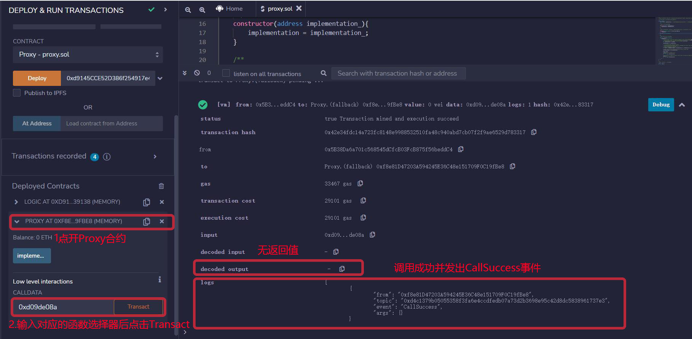

# WTF Solidity极简入门: 46. 代理合约

我最近在重新学solidity，巩固一下细节，也写一个“WTF Solidity极简入门”，供小白们使用（编程大佬可以另找教程），每周更新1-3讲。

推特：[@0xAA_Science](https://twitter.com/0xAA_Science)

社区：[Discord](https://discord.wtf.academy)｜[微信群](https://docs.google.com/forms/d/e/1FAIpQLSe4KGT8Sh6sJ7hedQRuIYirOoZK_85miz3dw7vA1-YjodgJ-A/viewform?usp=sf_link)｜[官网 wtf.academy](https://wtf.academy)

所有代码和教程开源在github: [github.com/AmazingAng/WTFSolidity](https://github.com/AmazingAng/WTFSolidity)

-----

这一讲，我们介绍代理合约（Proxy Contract）。教学代码由OpenZepplin的[Proxy合约](https://github.com/OpenZeppelin/openzeppelin-contracts/blob/master/contracts/proxy/Proxy.sol)简化而来。

## 代理模式

`Solidity`合约部署在链上之后，代码是不可变的（immutable）。这样既有优点，也有缺点：

- 优点：安全，用户知道会发生什么（大部分时候）。
- 坏处：就算合约中存在bug，也不能修改或升级，只能部署新合约。但是新合约的地址与旧的不一样，且合约的数据也需要花费大量gas进行迁移。

有没有办法在合约部署后进行修改或升级呢？答案是有的，那就是**代理模式**。


代理模式将合约数据和逻辑分开，分别保存在不同合约中。我们拿上图中简单的代理合约为例，数据（状态变量）存储在代理合约中，而逻辑（函数）保存在另一个逻辑合约中。代理合约（Proxy）通过`delegatecall`，将函数调用全权委托给逻辑合约（Implementation）执行，再把最终的结果返回给调用者（Caller）。

代理模式主要有两个好处：
1. 可升级：当我们需要升级合约的逻辑时，只需要将代理合约指向新的逻辑合约。
2. 省gas：如果多个合约复用一套逻辑，我们只需部署一个逻辑合约，然后再部署多个只保存数据的代理合约，指向逻辑合约。

**提示**：对`delegatecall`不熟悉的朋友可以看下本教程[第23讲Delegatecall](https://github.com/AmazingAng/WTFSolidity/tree/main/23_Delegatecall)。

## 代理合约

下面我们介绍一个简单的代理合约，它由OpenZepplin的[Proxy合约](https://github.com/OpenZeppelin/openzeppelin-contracts/blob/master/contracts/proxy/Proxy.sol)简化而来。它有三个部分：代理合约`Proxy`，逻辑合约`Logic`，和一个调用示例`Caller`。它的逻辑并不复杂：

- 首先部署逻辑合约`Logic`。
- 创建代理合约`Proxy`，状态变量`implementation`记录`Logic`合约地址。
- `Proxy`合约利用回调函数`fallback`，将所有调用委托给`Logic`合约
- 最后部署调用示例`Caller`合约，调用`Proxy`合约。
- **注意**：`Logic`合约和`Proxy`合约的状态变量存储结构相同，不然`delegatecall`会产生意想不到的行为，有安全隐患。

### 代理合约`Proxy`

`Proxy`合约不长，但是用到了内联汇编，因此比较难理解。它只有一个状态变量，一个构造函数，和一个回调函数。状态变量`implementation`，在构造函数中初始化，用于保存`Logic`合约地址。

```solidity
contract Proxy {
    address public implementation; // 逻辑合约地址。implementation合约同一个位置的状态变量类型必须和Proxy合约的相同，不然会报错。

    /**
     * @dev 初始化逻辑合约地址
     */
    constructor(address implementation_){
        implementation = implementation_;
    }
```

`Proxy`的回调函数将外部对本合约的调用委托给 `Logic` 合约。这个回调函数很别致，它利用内联汇编（inline assembly），让本来不能有返回值的回调函数有了返回值。其中用到的内联汇编操作码：

- `calldatacopy(t, f, s)`：将calldata（输入数据）从位置`f`开始复制`s`字节到mem（内存）的位置`t`。
- `delegatecall(g, a, in, insize, out, outsize)`：调用地址`a`的合约，输入为`mem[in..(in+insize))` ，输出为`mem[out..(out+outsize))`， 提供`g`wei的以太坊gas。这个操作码在错误时返回`0`，在成功时返回`1`。
- `returndatacopy(t, f, s)`：将returndata（输出数据）从位置`f`开始复制`s`字节到mem（内存）的位置`t`。
- `switch`：基础版`if/else`，不同的情况`case`返回不同值。可以有一个默认的`default`情况。
- `return(p, s)`：终止函数执行, 返回数据`mem[p..(p+s))`。
- `revert(p, s)`：终止函数执行, 回滚状态，返回数据`mem[p..(p+s))`。

```solidity
/**
* @dev 回调函数，将本合约的调用委托给 `implementation` 合约
* 通过assembly，让回调函数也能有返回值
*/
fallback() external payable {
    address _implementation = implementation;
    assembly {
        // 将msg.data拷贝到内存里
        // calldatacopy操作码的参数: 内存起始位置，calldata起始位置，calldata长度
        calldatacopy(0, 0, calldatasize())

        // 利用delegatecall调用implementation合约
        // delegatecall操作码的参数：gas, 目标合约地址，input mem起始位置，input mem长度，output area mem起始位置，output area mem长度
        // output area起始位置和长度位置，所以设为0
        // delegatecall成功返回1，失败返回0
        let result := delegatecall(gas(), _implementation, 0, calldatasize(), 0, 0)

        // 将return data拷贝到内存
        // returndata操作码的参数：内存起始位置，returndata起始位置，returndata长度
        returndatacopy(0, 0, returndatasize())

        switch result
        // 如果delegate call失败，revert
        case 0 {
            revert(0, returndatasize())
        }
        // 如果delegate call成功，返回mem起始位置为0，长度为returndatasize()的数据（格式为bytes）
        default {
            return(0, returndatasize())
        }
    }
}
```

### 逻辑合约`Logic`

这是一个非常简单的逻辑合约，只是为了演示代理合约。它包含`2`个变量，`1`个事件，`1`个函数：
- `implementation`：占位变量，与`Proxy`合约保持一致，防止插槽冲突。
- `x`：`uint`变量，被设置为`99`。
- `CallSuccess`事件：在调用成功时释放。
- `increment()`函数：会被`Proxy`合约调用，释放`CallSuccess`事件，并返回一个`uint`，它的`selector`为`0xd09de08a`。如果直接调用`increment()`回返回`100`，但是通过`Proxy`调用它会返回`1`，大家可以想想为什么？

```solidity
/**
 * @dev 逻辑合约，执行被委托的调用
 */
contract Logic {
    address public implementation; // 与Proxy保持一致，防止插槽冲突
    uint public x = 99; 
    event CallSuccess(); // 调用成功事件

    // 这个函数会释放CallSuccess事件并返回一个uint。
    // 函数selector: 0xd09de08a
    function increment() external returns(uint) {
        emit CallSuccess();
        return x + 1;
    }
}
```

### 调用者合约`Caller`

`Caller`合约会演示如何调用一个代理合约，它也非常简单。但是要理解它，你需要先学习本教程的[第22讲 Call](https://github.com/AmazingAng/WTFSolidity/tree/main/22_Call/readme.md)和[第27讲 ABI编码](https://github.com/AmazingAng/WTFSolidity/tree/main/27_ABIEncode/readme.md)。

它有`1`个变量，`2`个函数：
- `proxy`：状态变量，记录代理合约地址。
- 构造函数：在部署合约时初始化`proxy`变量。
- `increase()`：利用`call`来调用代理合约的`increment()`函数，并返回一个`uint`。在调用时，我们利用`abi.encodeWithSignature()`获取了`increment()`函数的`selector`。在返回时，利用`abi.decode()`将返回值解码为`uint`类型。

```solidity
/**
 * @dev Caller合约，调用代理合约，并获取执行结果
 */
contract Caller{
    address public proxy; // 代理合约地址

    constructor(address proxy_){
        proxy = proxy_;
    }

    // 通过代理合约调用increment()函数
    function increment() external returns(uint) {
        ( , bytes memory data) = proxy.call(abi.encodeWithSignature("increment()"));
        return abi.decode(data,(uint));
    }
}
```

## `Remix`演示

1. 部署`Logic`合约。


2. 调用`Logic`合约的`increment()`函数，返回`100`。


3. 部署`Proxy`合约，初始化时填入`Logic`合约地址。


4. 调用`Proxy`合约`increment()`函数，无返回值。
    
    调用方法：在`Remix`部署面板中点`Proxy`合约，在最下面的`Low level interaction`中填入`increment()`函数的选择器`0xd09de08a`，并点击`Transact`。
    
    



5. 部署`Caller`合约，初始化时填入`Proxy`合约地址。


6. 调用`Caller`合约`increment()`函数，返回`1`。


## 总结

这一讲，我们介绍了代理模式和简单的代理合约。代理合约利用`delegatecall`将函数调用委托给了另一个逻辑合约，使得数据和逻辑分别由不同合约负责。并且，它利用内联汇编黑魔法，让没有返回值的回调函数也可以返回数据。前面留给大家的问题是：为什么通过Proxy调用`increment()`会返回1呢？按照我们在[第23讲Delegatecall](https://github.com/AmazingAng/WTF-Solidity/tree/main/23_Delegatecall)中所说的，当Caller合约通过Proxy合约来`delegatecall` Logic合约的时候，如果Logic合约函数改变或读取一些状态变量的时候都会在Proxy的对应变量上操作，而这里Proxy合约的`x`变量的值是0（因为从来没有设置过`x`这个变量，即Proxy合约的storage区域所对应位置值为0），所以通过Proxy调用`increment()`会返回1。

下一讲，我们会介绍可升级代理合约。

代理合约虽然很强大，但是它非常容易出`bug`，用的时候最好直接复制[OpenZepplin](https://github.com/OpenZeppelin/openzeppelin-contracts/tree/master/contracts/proxy)的模版合约。
