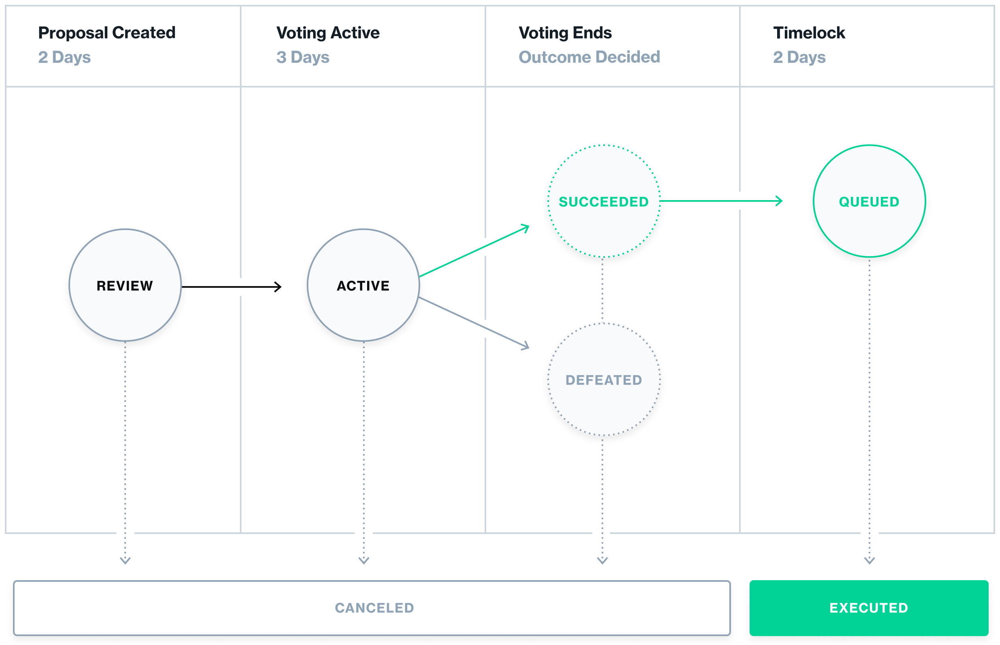

# 介绍

Governance 顾名思义，即为治理。区块链的出现，让去中心化的治理成为一个新的方向，即我们所说的DAO(Decentralized Autonomous Organization)。

链上治理可以让社区的成员参与到治理中来，让社区的成员更加的自治，更加的去中心化。提案的种类也有很多，比如参数修改、合约升级、资源管理等。

这一讲我们将首先分析链上治理的过程，让大家了解治理的过程，然后通过一道赛题来了解到链上治理可能面临的风险漏洞。

# Compound Governance protocol

作为经典的治理协议，openzeppelin的治理也沿用了Compound的治理协议，具体文档为：[https://docs.openzeppelin.com/contracts/4.x/api/governance](https://docs.openzeppelin.com/contracts/4.x/api/governance)

在这里我们简要介绍一下协议。

## ERC20Votes

ERC20Votes 是 ERC20 token的一个拓展，ERC20Votes token 即代表了**投票权**，其最大特点就是维护了一个checkpoint数组，记录了用户余额快照，这允许将**投票权映射到过去余额的快照而不是当前余额**，这有助于防止知道有重要提案即将出现并试图通过购买更多代币然后抛售它们来增加他们的投票权的成员投票。

同时还拥有delegate()委托函数：传入delegatee参数，**将自己的投票权委托给delegatee**

## Governor

治理者合约决定了法定人数所需的投票数量的百分比(例如，如果法定人数是4%，那么只有4%的选民需要投票支持提案通过)，投票期限，即投票持续多长时间，投票延迟，即提案创建后多长时间允许成员更改他们拥有的代币数量。治理合约还提供创建提案、投票和执行提案的功能。

而一个提案的生命周期，可以用下图表示。

这里介绍几个关键函数

- propose() 提案函数：满足代币持有量的可以提案，须传入address, value, signature, calldata等参数

- castVote() 投票函数：传入proposalId, support参数，含有for, against, abstain三种选择

- queue() 队列函数：提案成功后，任何人可以调用，传入proposalId参数，将提案加入队列

- execute() 执行函数：当时间满足要求后，任何人都可以调用，传入proposalId参数，将提案从队列中取出执行

## Timelock

- delay(延时)：一个提案被接受后，需要等待多少天之后才能被执行。这个时间可以由治理合约改变为2至30天之间。目前设置为2天。
- 提案执行期限(grace period)：在延时到达时间之后，如果超过了grace period期，那么提案将不能再执行，被设置为14天。

