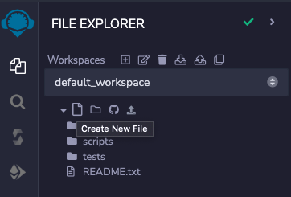
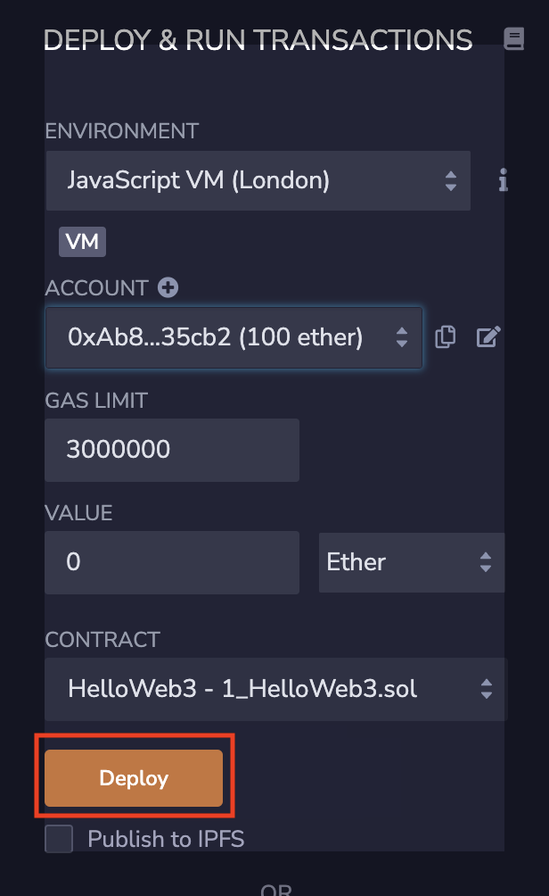

# WTF Solidity Tutorial: 1. HelloWeb3 (Solidity in 3 lines)

Recently, I have been relearning Solidity, consolidating the finer details, and also writing a "WTF Solidity Tutorial" for newbies to learn. Lectures are updated 1~3 times weekly. 

Everyone is welcomed to follow my Twitter: [@0xAA_Science](https://twitter.com/0xAA_Science)

WTF Academy Discord: [Link](https://discord.gg/5akcruXrsk)

All codebase and tutorial notes are open source and available on GitHub (At 1024 repo stars, course certification is unlocked. At 2048 repo stars, community NFT is unlocked.): [github.com/AmazingAng/WTFSolidity](https://github.com/AmazingAng/WTFSolidity)

-----

## What is Solidity?

Solidity is the programming language for Ethereum's virtual machine (EVM), used in smart contract development. I believe that Solidity is an important skill to master in order to navigate the on-chain ecosystems and projects. Blockchain projects are mostly open sourced and once you understand its underlying source code, you are better equipped to avoid rugpull and shady projects. 

Solidity has 2 distinct features:

1. Mastering Solidity helps you get rich and afford a girlfriend.
2. Ignorance towards Solidity puts you at the bottom of the cryptocurrency community hierarchy.

## Development tool: Remix

I will use Remix to demostrate smart contract development with Solidity. Remix is Ethereum's recommended integrated development environment (IDE) - highly recommended for programming freshies. The IDE allows you to quickly deploy and test smart contracts in the browser, there is no need to download any application to your local storage. 

Website: [remix.ethereum.org](https://remix.ethereum.org)

Within Remix, we can see that there are four buttons on the leftmost vertical menu, corresponding to FILE EXPLORER (where to write code), SEARCH IN FILES (find and replace files), SOLIDITY COMPILER (to run code), and DEPLOY & RUN TRANSACTIONS (on-chain deployment). We can create a blank Solidity contract by clicking the `Create New File` button.

   

## The first Solidity program

This one is easy, the program runs on 1 line of comment and 3 lines of code:

```solidity
// SPDX-License-Identifier: MIT
pragma solidity ^0.8.4;
contract HelloWeb3{
    string public _string = "Hello Web3!";}
```

Now, we will breakdown and analyze the source code in detail, understanding the basic strucutre: 
The first line is a comment, which denotes the software license (license identifier) used by this code. We are using the MIT license. If you do not indicate the license used, the program can compile successfully but will report an error during compilation. Solidity's comments are denoted with "//", followed by the content of the comment (which will not be run by the program).

```solidity
// SPDX-License-Identifier: MIT
```

2. The second line declares the Solidity version used by the source file, because the syntax of different versions is different. This line of code means that the source file will not allow compilation by compilers version lower than v0.8.4 and not higher than v0.9.0 (the second condition is provided by `^`).

```solidity
pragma solidity ^0.8.4;
```
    
3. Lines 3 and 4 are the smart contract part. Line 3 creates a contract and assigns the contract with the name HelloWeb3. Line 4 is the content of the contract. Here, we created a string variable called `_string` and assign to it "Hello Web3!" as value.

```solidity
contract HelloWeb3{
    string public _string = "Hello Web3!";}
```
Later on, we will introduce the different variables within the Solidity programming language.

## Code compilation and deployment

On the code editor page, pressing CTRL+S is a convenient way to compile the code.

After compiling, click the `Deploy` button on the left menu to enter the deployment page.

   

By default, Remix uses the JavaScript virtual machine to simulate the Ethereum chain and run smart contracts, similar to running a testnet on the browser. Remix will allocate several test accounts to you, each with 100 ETH (test tokens), which can be used at your disposal. You click on `Deploy` (yellow button) to deploy the contract we have written.

   

After a successful deployment, you will see a contract named `HelloWeb3` below, clicking on the variable `_string`, you can see "Hello Web3!" written in the code.

## Summary

In the first tutorial, we briefly introduced the Solidity programming language, Remix tools and IDE, and completed the first Solidity program - `HelloWeb3`. Going forward, we will explore further topics on our Solidity journey.

### Recommended materials on Solidity：

1. [Solidity Documentation](https://docs.soliditylang.org/en/latest/)
2. [Solidity Tutorial by freeCodeCamp](https://www.youtube.com/watch?v=ipwxYa-F1uY)
