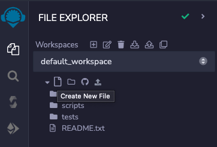
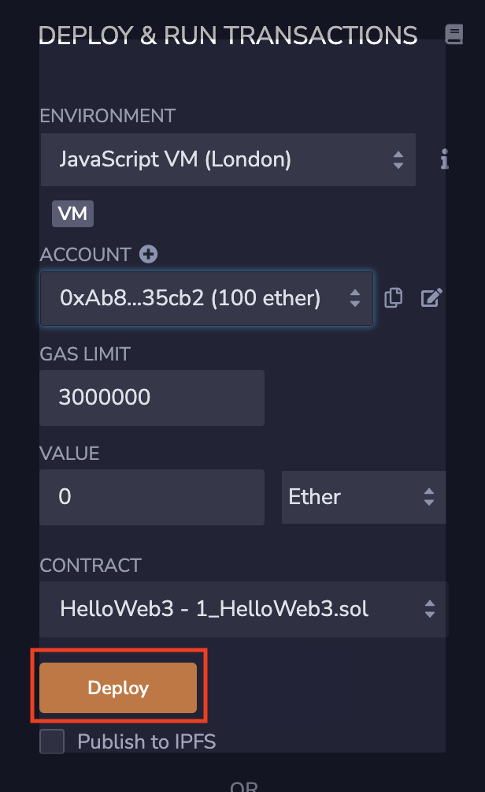
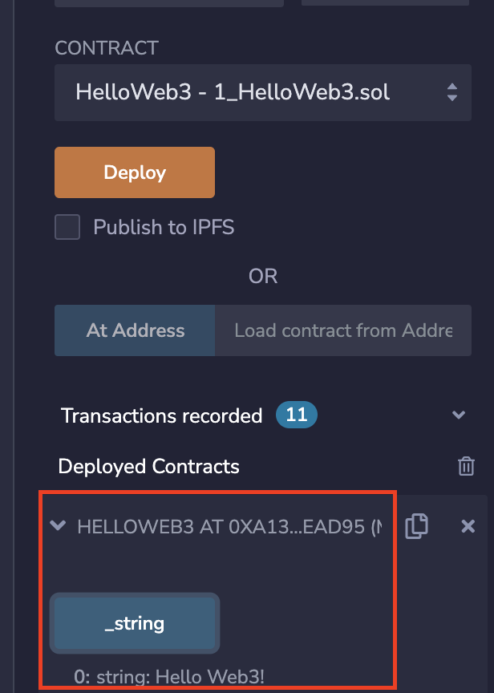

# WTF Solidity Tutorial: 1. HelloWeb3 (Solidity in 3 lines)

Recently, I have been revisiting Solidity, consolidating the finer details, and writing "WTF Solidity" tutorials for newbies.

Twitter: [@0xAA_Science](https://twitter.com/0xAA_Science) | [@WTFAcademy_](https://twitter.com/WTFAcademy_)

Community: [Discord](https://discord.gg/5akcruXrsk)｜[Wechat](https://docs.google.com/forms/d/e/1FAIpQLSe4KGT8Sh6sJ7hedQRuIYirOoZK_85miz3dw7vA1-YjodgJ-A/viewform?usp=sf_link)｜[Website wtf.academy](https://wtf.academy)

Codes and tutorials are open source on GitHub: [github.com/AmazingAng/WTF-Solidity](https://github.com/AmazingAng/WTF-Solidity)

-----

## WTF is Solidity?

`Solidity` is an object-oriented programming language for writing smart contracts on the Ethereum Virtual Machine (EVM). Mastering Solidity is a crucial skill for participating in blockchain projects. Since most blockchain projects are open-source, understanding the code allows you to evaluate project risks and avoid potential scams.

`Solidity` has two key characteristics:

1. "Object-oriented": Mastering Solidity can help you land a good job in the blockchain industry, helping you earn money and potentially find a partner (a play on "objects").
2. "Advanced": Not knowing Solidity can make you seem out of touch in the crypto world.

## Development tool: Remix

In this tutorial, we will use `Remix` to run `Solidity` contracts. `Remix` is the official Integrated Development Environment (IDE) recommended by the Ethereum Foundation. It is beginner-friendly and allows for quick development and deployment of smart contracts directly in the browser without local installation.

Website: [remix.ethereum.org](https://remix.ethereum.org)

On the Remix interface, the left-hand menu has three main buttons: File Explorer (for writing code), Solidity Compiler (for compiling code), and Deploy & Run Transactions (for deploying to the chain). Click the "Create New File" button to start a blank `Solidity` contract.



## The first Solidity program

This simple program consists of just 1 line of comment and 3 lines of code:

```solidity
// SPDX-License-Identifier: MIT
pragma solidity ^0.8.21;
contract HelloWeb3{
    string public _string = "Hello Web3!";
}
```

Let's break down the source code to understand its structure:

1. The first line is a comment specifying the software license (SPDX license identifier). Here, we use the MIT license. If no license is specified, the compiler will issue a warning, though the program will still run. Solidity comments start with `//`, and their content is ignored by the compiler.

   ```solidity
   // SPDX-License-Identifier: MIT
   ```

2. The second line declares the Solidity version required for the source file, as syntax varies between versions. This line specifies that the code is compatible with compiler versions greater than or equal to `0.8.21` and less than `0.9.0` (indicated by `^`). Solidity statements end with a semicolon (`;`).

   ```solidity
   pragma solidity ^0.8.21;
   ```

3. Lines 3-4 define the contract. Line 3 declares a contract named `HelloWeb3`. Line 4 defines the contract's content, where we declare a public string variable named `_string` and initialize it with the value "Hello Web3!".

   ```solidity
   contract HelloWeb3 {
       string public _string = "Hello Web3!";
   }
   ```

We will cover Solidity variables in more detail in future lessons.

## Code compilation and deployment

In the Remix editor, press `Ctrl + S` to compile the code.

Once compiled, click the "Deploy & Run Transactions" button in the left menu to enter the deployment interface.



By default, Remix uses the "Remix VM" (formerly JavaScript VM) to simulate an Ethereum chain. This acts like a local testnet in your browser. Remix provides several test accounts, each loaded with 100 ETH (test tokens). Click the yellow "Deploy" button to deploy your contract.



After successful deployment, you will see the `HelloWeb3` contract under "Deployed Contracts". Clicking on the `_string` button will display its value: "Hello Web3!".

## Summary

In this lesson, we briefly introduced `Solidity` and the `Remix` IDE, and wrote our first `Solidity` program, `HelloWeb3`. We will dive deeper into `Solidity` in the upcoming tutorials!

### Recommended materials on Solidity：

1. [Solidity Documentation](https://docs.soliditylang.org/en/latest/)
2. [Solidity Tutorial by freeCodeCamp](https://www.youtube.com/watch?v=ipwxYa-F1uY)
