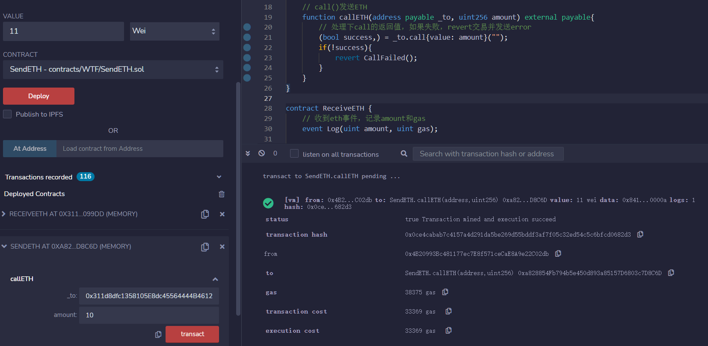

# WTF Solidity Tutorial: 20. Sending ETH

Recently, I have been revisiting Solidity, consolidating the finer details, and writing "WTF Solidity" tutorials for newbies. 

Twitter: [@0xAA_Science](https://twitter.com/0xAA_Science) | [@WTFAcademy_](https://twitter.com/WTFAcademy_)

Community: [Discord](https://discord.gg/5akcruXrsk)｜[Wechat](https://docs.google.com/forms/d/e/1FAIpQLSe4KGT8Sh6sJ7hedQRuIYirOoZK_85miz3dw7vA1-YjodgJ-A/viewform?usp=sf_link)｜[Website wtf.academy](https://wtf.academy)

Codes and tutorials are open source on GitHub: [github.com/AmazingAng/WTFSolidity](https://github.com/AmazingAng/WTFSolidity)

-----
There are three ways of sending `ETH` in `Solidity`: `transfer()`, `send()` and `call()`, in which `call()` is recommended. 

## Contract of Receiving ETH
Let's deploy a contract `ReceiveETH` to receive `ETH`. `ReceiveETH` has an event `Log`, which logs the received `ETH` amount and the remaining `gas`. Along with two other functions, one is the `receive()` function, which is executed when receiving `ETH`, and emit the `Log` event; the other is  the `getBalance()` function that is used to get the balance of the contract. 
```solidity
contract ReceiveETH {
    // Receiving ETH event, log the amount and gas
    event Log(uint amount,  uint gas);
    
    // receive() is executed when receiving ETH
    receive() external payable{
        emit Log(msg.value,  gasleft());
    }
    
    // return the balance of the contract
    function getBalance() view public returns(uint) {
        return address(this).balance;
    }
}
```

After deploying `ReceiveETH`, call `getBalance()` function, we can see the balance is `0 Ether`. 


## Contract of Sending ETH
We will implement three ways to send `ETH` to the `ReceiveETH` contract. First thing first, let's make the `constructor` of the `SendETH` contract `payable`, and add the `receive()` function, so we can transfer `ETH` to our contract at deployment and after.
```solidity
contract SendETH {
    // constructor, make it payable so we can transfer ETH at deployment
    constructor() payable{}
    // receive() function, called when receiving ETH
    receive() external payable{}
}
```
### transfer
- Usage: `receiverAddress.transfer(value in Wei)`. 
- The `gas` limit of `transfer()` is `2300`, which is enough to make transfer, but not if the receiving contract has a gas consuming `fallback()` or `receive()`. 
- If `transfer()` fails, the transaction will `revert`. 

Sample code: note that `_to` is the address of `ReceiveETH` contract, and `amount` is the value you want to send.
```solidity
// sending ETH with transfer()
function transferETH(address payable _to,  uint256 amount) external payable{
	_to.transfer(amount);
}
```

After deploying `SendETH` contract, we can send `ETH` to `ReceiveETH` contract, if `amount` is 10, and `value` is 0, `amount`>`value`, transaction failed and get `reverted`. 


If `amount` is 10, and `value` is 10, `amount`<=`value`, then the transaction will go through. 


In `ReceiveETH` contract, when we call `getBalance()`, we can see the balance of the contract is `10` Wei. 


### send

- Usage: `receiverAddress.send(value in Wei)`. 
- The `gas` limit of `send()` is `2300`, which is enough to make transfer, but not if the receiving contract has a gas consuming `fallback()` or `receive()`. 
- If `send()` fails, the transaction will be `reverted`. 
- The return value of `send()` is `bool`, which is the status of the transaction, you can choose to act on that. 

Sample Code:
```solidity
// sending ETH with send()
function sendETH(address payable _to,  uint256 amount) external payable{
    // check result of send()，revert with error when failed
    bool success = _to.send(amount);
    if(!success){
    	revert SendFailed();
    }
}
```

Now we send `ETH` to `ReceiveETH` contract, if `amount` is 10, and `value` is 0, `amount`>`value`, so the transaction failed, since we handled the return value, transaction will be `reverted`. 


If `amount` is 10, and `value` is 11, `amount`<=`value`, so the transaction succeeded. 


### call

- Usage: `receiverAddress.call{value: value in Wei}("")`. 
- There is no `gas` limit for `call()`, so it supports more operations in `fallback()` or `receive()` of the receiving contract. 
- If `call()` fails, the transaction will not be `reverted`. 
- The return value of `call()` is `(bool,  data)`, in which `bool` is the status of transaction, you can choose to act on that. 

Sample Code:
```solidity
// sending ETH with call()
function callETH(address payable _to,  uint256 amount) external payable{
    // check result of call()，revert with error when failed
    (bool success, ) = _to.call{value: amount}("");
    if(!success){
    	revert CallFailed();
    }
}
```

Now we send `ETH` to `ReceiveETH` contract, if `amount` is 10, and `value` is 0, `amount`>`value`, so the transaction failed, since we handled the return value, transaction will be `reverted`. 


If `amount` is 10, and `value` is 11, `amount`<=`value`, so the transaction succeeded. 



With any of these three methods, we send `ETH` to `ReceiveETH` contract successfully.

## Summary
In this tutorial, we talked about three ways of sending `ETH` in `solidity`:
`transfer`, `send` and `call`. 
- There is no `gas` limit for `call`, which is the most flexible and recommended way;
- The `gas` limit of `transfer` is `2300 gas`, transaction will be `reverted` if it fails, which makes it the second choice;
- The `gas` limit of `send` is `2300`, transaction will not be `reverted` if it fails, which makes it the worst choice. 


