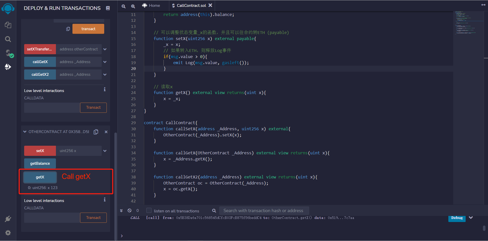

# WTF Solidity Tutorial: 21. Interact with other Contract

Recently, I have been relearning Solidity, consolidating the finer details, and also writing a "WTF Solidity Tutorial" for newbies to learn. Lectures are updated 1~3 times weekly. 

Everyone is welcomed to follow my Twitter: [@0xAA_Science](https://twitter.com/0xAA_Science)

WTF Academy Discord, where you can find the way to join WeChat group: [Link](https://discord.gg/5akcruXrsk)

All codebase and tutorial notes are open source and available on GitHub (At 1024 repo stars,   course certification is unlocked. At 2048 repo stars, community NFT is unlocked.): [github.com/AmazingAng/WTFSolidity](https://github.com/AmazingAng/WTFSolidity)

-----

## Interact with deployed contract

Interactions between contracts not only make the programs re-usable on the blockchain, also enrich the Ethereum ecosystem. Many `web3` Dapps rely on other contract to work, for example `yield farming`. In this tutorial, we will talk about how to interact with contract that source code (or ABI) and address are available.

## Target Contract
Lets write a simple contract `OtherContract` to work with.

```solidity
contract OtherContract {
    uint256 private _x = 0; // state variable x
    // Receiving ETH event, log the amount and gas
    event Log(uint amount, uint gas);
    
    // get the balance of the contract
    function getBalance() view public returns(uint) {
        return address(this).balance;
    }

    // set the value of x, as well as receiving ETH (payable)
    function setX(uint256 x) external payable{
        _x = x;
        // emit Log event when receiving ETH
        if(msg.value > 0){
            emit Log(msg.value, gasleft());
        }
    }

    // read the value of x
    function getX() external view returns(uint x){
        x = _x;
    }
}
```

This contract includes a state variable `_x`, a `Log` event which will emit when receiving `ETH`, and three functions:
- `getBalance()`: return the balance of the contract.
- `setX()`: `external payable` function, set the value of `_x`, as well as receiving `ETH`.
- `getX()`: read the value of `_x`

## Interact with `OtherContract`
We can create a reference to the contract with the contract address and source code (or ABI): `_Name(_Address)`, `_Name` is the contract name which should be consistent with the contract source code (or ABI), `_Address` is the contract address. Then we can call the functions in the contract like this: `_Name(_Address).f()`, `f()` is the function you want to call.

Here are four examples of interacting with contracts, compile and deploy these two contracts: `OtherContract` and `CallContract`:


### 1. Pass the contract address
We can pass the contract address as parameter and create a reference of `OtherContract`, then call the function of `OtherContract`. For example, here we create a `callSetX` function which will call `setX` from `OtherContract`, pass the deployed contract address `_Address` and the `x` value as parameter:

```solidity
    function callSetX(address _Address, uint256 x) external{
        OtherContract(_Address).setX(x);
    }
```

Copy the address of `OtherContract`, and pass it as the first parameter of `callSetX`, after the transaction succeeded, we can call `getX` from `OtherContract` and the value of `x` is 123.




### 2. Pass the contract variable
We can also pass the reference of the contract as parameter, just change the type from `address` to the contract name, i.e. `OtherContract`. The following example shows how to call `getX()` from `OtherContract`.

**Note:** The parameter `OtherContract _Address` is still `address` type behind the scene. You will find it's `address` type in the generated `ABI` and when passing the parameter to `callGetX`.

```solidity
    function callGetX(OtherContract _Address) external view returns(uint x){
        x = _Address.getX();
    }
```

Copy the address of `OtherContract`, and pass it as the parameter of `callGetX`, after the transaction succeeded, we can get the value of `x`.


### 3. Create contract variable
We can create a contract variable and call its functions. The following example shows how to create a reference of `OtherContract` and save to `oc`:

```solidity
    function callGetX2(address _Address) external view returns(uint x){
        OtherContract oc = OtherContract(_Address);
        x = oc.getX();
    }
```
Copy the address of `OtherContract`, and pass it as the parameter of `callGetX2 `, after the transaction succeeded, we can get the value of `x`.


### 4. Interact with contract and send `ETH`
If the target function is `payable`, then we can also send `ETH` to that contract: `_Name(_Address).f{value: _Value}()`, `_Name`is the contract name, `_Address` is the contract address, `f` is the function to call, and `_Value` is the value of `ETH` to send (in `wei`).

`OtherContract` has a `payable` function `setX`, in the following example we will send `ETH` to the contract by calling `setX`.
```solidity
    function setXTransferETH(address otherContract, uint256 x) payable external{
        OtherContract(otherContract).setX{value: msg.value}(x);
    }
```

Copy the address of `OtherContract`, and pass it as the parameter of `setXTransferETH `, in addition we send 10ETH.


After the transaction is confirmed, we can check the balance of the contract by reading the `Log` event or by calling `getBalance()`.


## Summary
In this tutorial, we talked about how to create contract reference with its source code (or ABI) and address, then call its functions. 
