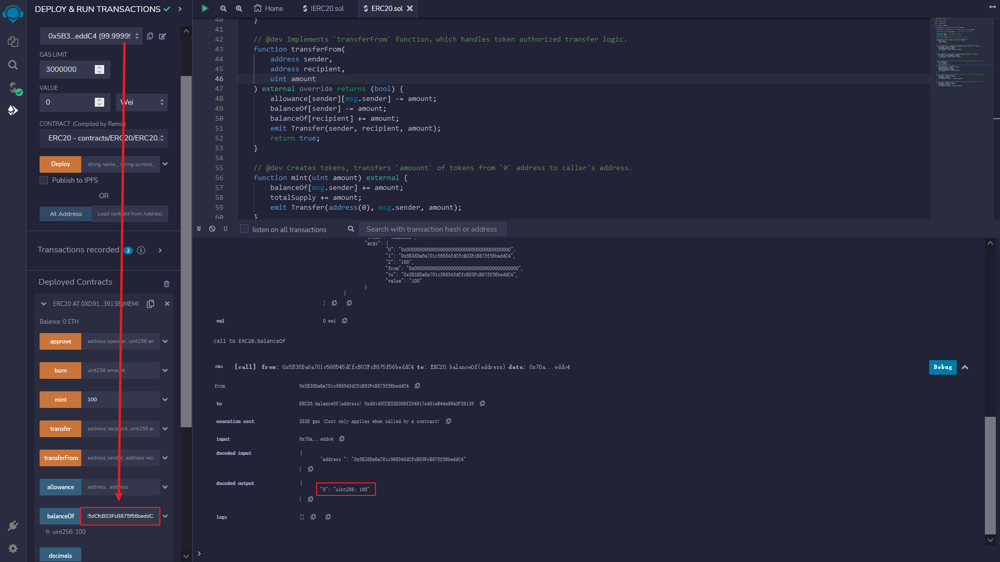

# WTF Solidity Quick Start: 31. ERC20

I'm currently relearning Solidity to reinforce my understanding of the details and to write a "WTF Solidity Primers" for beginners (programming experts can find other tutorials), updated weekly with 1-3 lectures.

Don't forget to follow me on Twitter: [@0xAA_Science](https://twitter.com/0xAA_Science)

Join the WTF Scientists community, where you can find a way to add a WeChat group: [link](https://discord.gg/5akcruXrsk).

All code and tutorials are open-source on GitHub (1024 stars for course certification, 2048 stars for community NFTs): [github.com/AmazingAng/WTFSolidity](https://github.com/AmazingAng/WTFSolidity)

-----

In this lecture, we will introduce the ERC20 token standard on Ethereum and issue our own test tokens.

## ERC20

ERC20 is a token standard on Ethereum, which originated from the `EIP20` proposed by Vitalik Buterin in November 2015. It implements the basic logic of token transfer:

- Account balance
- Transfer
- Approve transfer
- Total token supply
- Token Information (optional): name, symbol, decimal

## IERC20
IERC20 is the interface contract of the ERC20 token standard, which specifies the functions and events that ERC20 tokens need to implement. The reason for defining an interface is that with the standard, there are universal function names, input and output parameters for all ERC20 tokens. In the interface functions, only the function name, input parameters, and output parameters need to be defined, and it does not matter how the function is implemented internally. Therefore, the functions are divided into two contents: internal implementation and external interface, focusing on implementation and shared data through agreement. This is why we need two files `ERC20.sol` and `IERC20.sol` to implement a contract.

### Event

The `IERC20` defines two events: the `Transfer` event and the `Approval` event, which are emitted during token transfers and approvals, respectively.

```solidity
    /**
     * @dev Triggered when `value` tokens are transferred from `from` to `to`.
     */
    event Transfer(address indexed from, address indexed to, uint256 value);

    /**
     * @dev Triggered whenever `value` tokens are approved by `owner` to be spent by `spender`.
     */
    event Approval(address indexed owner, address indexed spender, uint256 value);
```

### Functions
`IERC20` defines `6` functions, providing basic functionalities for transferring tokens, and allowing tokens to be approved for use by other third parties on the chain.

- `totalSupply()` returns the total token supply.

```solidity
    /**
     * @dev 返回代币总供给.
     */
    function totalSupply() external view returns (uint256);
```

`balanceOf()` returns the account balance.

```solidity
    /**
     * @dev 返回账户`account`所持有的代币数.
     */
    function balanceOf(address account) external view returns (uint256);
```

- `transfer()` means transfer of funds.

```solidity
    /**
     * @dev Transfers `amount` tokens from the caller's account to the recipient `to`.
     *
     * Returns a boolean value indicating whether the operation succeeded.
     *
     * Emits a {Transfer} event.
     */
    function transfer(address to, uint256 amount) external returns (bool);
```

The `allowance()` function returns the authorized amount.

```solidity
    /**
     * @dev 返回`owner`账户授权给`spender`账户的额度，默认为0。
     *
     * 当{approve} 或 {transferFrom} 被调用时，`allowance`会改变.
     */
    function allowance(address owner, address spender) external view returns (uint256);
```

- `approve()` Authorization

```solidity
/**
 * @dev Allows `spender` to spend `amount` tokens from caller's account.
 *
 * Returns a boolean value indicating whether the operation succeeded or not.
 *
 * Emits an {Approval} event.
 */
function approve(address spender, uint256 amount) external returns (bool);
```

- `transferFrom()` authorized transfer.

```solidity
/**
 * @dev Transfer `amount` of tokens from `from` account to `to` account, subject to the caller's
 * allowance. The caller must have allowance for `from` account balance.
 *
 * Returns `true` if the operation was successful.
 *
 * Emits a {Transfer} event.
 */
function transferFrom(
    address from,
    address to,
    uint256 amount
) external returns (bool);
```

## Implementation of ERC20

Now we will write an `ERC20` contract and implement the functions defined in `IERC20` interface.

### State Variables
We need state variables to record account balances, allowances, and token information. Among them, `balanceOf`, `allowance`, and `totalSupply` are of type `public`, which will automatically generate a same-name `getter` function, implementing `balanceOf()`, `allowance()`, and `totalSupply()` functions defined in `IERC20`. `name`, `symbol`, and `decimals` correspond to the name, symbol, and decimal places of tokens.

**Note**: adding `override` modifier to `public` variables will override the same-name `getter` function inherited from the parent contract, such as `balanceOf()` function in `IERC20`.

This is a contract written in Solidity language for a token. 

The code defines two mappings which are used to keep track of the balance of each address that holds this token and the allowance for a certain address from another address. 

The total supply of the token is also defined as a public variable. 

Additionally, the name and symbol of the token are also defined as public variables. 

Lastly, the decimals variable is set to 18, which means that the token has 18 decimal places.

### Functions
- Constructor Function: Initializes the token name and symbol.

```solidity
    constructor(string memory name_, string memory symbol_){
        name = name_;
        symbol = symbol_;
    }
```

- `transfer()` function: Implements the `transfer` function in `IERC20`, which handles token transfers. The caller deducts `amount` tokens and the recipient receives the corresponding tokens. Shiba Inu Coin will modify this function to include logic such as taxation, dividends, lottery, etc.

```solidity
    function transfer(address recipient, uint amount) external override returns (bool) {
        balanceOf[msg.sender] -= amount;
        balanceOf[recipient] += amount;
        emit Transfer(msg.sender, recipient, amount);
        return true;
    }
```

- `approve()` function: Implements the `approve` function in `IERC20`, which handles token authorization logic. The `spender` specified in the function can spend the authorized `amount` of tokens from the authorizer. The `spender` can be an EOA account or a contract account, for example, when you trade tokens on `Uniswap`, you need to authorize tokens to the `Uniswap` contract.

```solidity
    function approve(address spender, uint amount) external override returns (bool) {
        allowance[msg.sender][spender] = amount;
        emit Approval(msg.sender, spender, amount);
        return true;
    }
```

- `transferFrom()` function: Implements the `transferFrom` function in `IERC20`, which is the logic for authorized transfer. The authorized party transfers `amount` of tokens from sender `sender` to recipient `recipient`.

This function transfers tokens from one address to another, given that the sender has previously granted permission to the caller to do so. The `sender` parameter specifies the address to transfer from, `recipient` specifies the address to receive the tokens, and `amount` specifies the amount of tokens to transfer. 

The function first subtracts the `amount` from the allowance granted by the `sender` to the caller `msg.sender`. Then, it subtracts the `amount` from the `balanceOf` the `sender`, and adds it to the `balanceOf` the `recipient`. Finally, it emits a `Transfer` event to indicate the transfer, and returns `true` to signify that the transfer was successful.

- `mint()` function: Token minting function, not included in the `IERC20` standard. For the sake of the tutorial, anyone can mint any amount of tokens. In actual applications, permission management will be added, and only the `owner` can mint tokens.

```solidity
    function mint(uint amount) external {
        balanceOf[msg.sender] += amount;
        totalSupply += amount;
        emit Transfer(address(0), msg.sender, amount);
    }
```

- `burn()` function: Function to destroy tokens, not included in the `IERC20` standard.

```solidity
    function burn(uint amount) external {
        balanceOf[msg.sender] -= amount;
        totalSupply -= amount;
        emit Transfer(msg.sender, address(0), amount);
    }
```

## Issuing ERC20 Tokens

With the `ERC20` standard in place, it is very easy to issue tokens on the `ETH` chain. Now, let's issue our first token.

Compile the `ERC20` contract in `Remix`, enter the constructor's parameters in the deployment section, set `name_` and `symbol_` to `WTF`, and then click the `transact` button to deploy.


Now, we have created the `WTF` token. We need to run the `mint()` function to mint some tokens for ourselves. Open up the `ERC20` contract in the `Deployed Contract` section, enter `100` in the `mint` function area, and click the `mint` button to mint `100` `WTF` tokens for ourselves.

You can click on the Debug button on the right to view the logs below.

There are four key pieces of information:
- The `Transfer` event
- The minting address `0x0000000000000000000000000000000000000000`
- The receiving address `0x5B38Da6a701c568545dCfcB03FcB875f56beddC4`
- The token amount `100`


We use the `balanceOf()` function to check the account balance. By inputting our current account, we can see the balance change to `100` and the minting is successful.

The account information is shown on the left side of the image, and the details of the function execution are indicated on the right side.



## Summary

In this lesson, we learned about the ERC20 standard and its implementation on the Ethereum network, and issued our own test token. The ERC20 token standard proposed at the end of 2015 greatly lowered the threshold for issuing tokens on the Ethereum network and ushered in the era of ICOs. When investing, carefully read the project's token contract to effectively avoid risks and increase investment success rate.