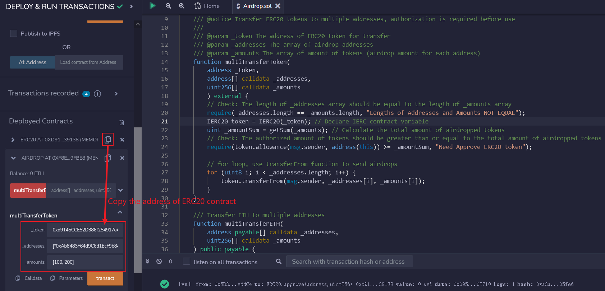

# WTF Solidity Quick Start: 33. Sending Airdrops

I am currently relearning Solidity to strengthen my understanding of the details, and I am writing a "WTF Solidity Quick Start" for beginners (experienced programmers may seek other tutorials). I will update 1-3 lessons every week.

Welcome to follow my Twitter: [@0xAA_Science](https://twitter.com/0xAA_Science)

Welcome to join the WTF Scientist community where you can find instructions on how to join our WeChat group: [link](https://discord.gg/5akcruXrsk)

All code and tutorials are open source on GitHub (a course certification will be issued for 1024 stars, and a community NFT will be issued for 2048 stars): [github.com/AmazingAng/WTFSolidity](https://github.com/AmazingAng/WTFSolidity)

-----

In the world of cryptocurrency, one of the most exciting things is receiving an airdrop of free tokens. In this tutorial, we will learn how to use a smart contract to send ERC20 tokens as an airdrop.

## Airdrop 

An airdrop is a marketing strategy used in the cryptocurrency industry where a project distributes tokens for free to a specific group of users. To qualify for an airdrop, users are usually required to complete simple tasks such as testing a product, sharing news, or referring friends. The project gains seed users through the airdrop, while users receive a sum of wealth, making it a win-win situation.

Since there are usually a large number of users receiving an airdrop, it is not practical for the project to send each transfer one by one. By using a smart contract to batch-send ERC20 tokens, the efficiency of the airdrop can be significantly increased.

### Airdrop Token Contract

The logic of the airdrop contract is simple: by using a loop, a single transaction sends ERC20 tokens to multiple addresses. The contract contains two functions:

- The `getSum()` function: returns the sum of a `uint` array.

    ```solidity
    // 数组求和函数
    function getSum(uint256[] calldata _arr) public pure returns(uint sum)
    {
        for(uint i = 0; i < _arr.length; i++)
            sum = sum + _arr[i];
    }
    ```

- Function `multiTransferToken()`: Send airdrop of `ERC20` tokens, including `3` parameters:
   - `_token`: Address of the token contract (`address` type)
   - `_addresses`: Array of user addresses receiving the airdrop (`address[]` type)
   - `_amounts`: Array of airdrop amounts that correspond to the quantity of each address in `_addresses` (`uint[]` type)

   This function contains two checks: The first `require` checks if the length of `_addresses` array is equal to `_amounts` array length. The second `require` checks if the authorization limit of the airdrop contract is greater than the total amount of tokens to be airdropped.

```solidity
/// @notice Transfer ERC20 tokens to multiple addresses, authorization is required before use
///
/// @param _token The address of ERC20 token for transfer
/// @param _addresses The array of airdrop addresses
/// @param _amounts The array of amount of tokens (airdrop amount for each address)
function multiTransferToken(
    address _token,
    address[] calldata _addresses,
    uint256[] calldata _amounts
    ) external {
    // Check: The length of _addresses array is equal to the length of _amounts array
    require(_addresses.length == _amounts.length, "Lengths of Addresses and Amounts NOT EQUAL");
    IERC20 token = IERC20(_token); // Declare IERC contract variable
    uint _amountSum = getSum(_amounts); // Calculate the total amount of airdropped tokens
    // Check: The authorized amount of tokens is greater than or equal to the total amount of airdropped tokens
    require(token.allowance(msg.sender, address(this)) >= _amountSum, "Need Approve ERC20 token");
    
    // For loop, use transferFrom function to send airdrops
    for (uint8 i; i < _addresses.length; i++) {
        token.transferFrom(msg.sender, _addresses[i], _amounts[i]);
    }
}
```

- `multiTransferETH()` function: Send `ETH` airdrop, with two parameters:
    - `_addresses`: An array of user addresses that receive the airdrop (`address[]` type)
    - `_amounts`: An array of airdrop amounts, corresponding to the quantity for each address in `_addresses` (`uint[]` type)

```solidity
/// Transfer ETH to multiple addresses
function multiTransferETH(
    address payable[] calldata _addresses,
    uint256[] calldata _amounts
) public payable {
    // Check: _addresses and _amounts arrays have the same length
    require(_addresses.length == _amounts.length, "Lengths of Addresses and Amounts NOT EQUAL");
    // Calculate total amount of ETH to airdrop
    uint _amountSum = getSum(_amounts);
    // Check: transferred ETH equals total amount
    require(msg.value == _amountSum, "Transfer amount error");
    // Use a for loop to transfer ETH using transfer function
    for (uint256 i = 0; i < _addresses.length; i++) {
        _addresses[i].transfer(_amounts[i]);
    }
}
```

### Airdrop Practice

1. Deploy the `ERC20` token contract and mint 10,000 units of the token for yourself.


2. Deploy the `Airdrop` contract.


3. Use the `approve()` function in the `ERC20` contract to grant authorization of 10,000 units of the token to the `Airdrop` contract.


4. Execute the `multiTransferToken()` function in the `Airdrop` contract to perform the airdrop. Set `_token` as the `ERC20` token address, and fill in `_addresses` and `_amounts` as follows:

```
// _addresses填写
["0xAb8483F64d9C6d1EcF9b849Ae677dD3315835cb2", "0x5B38Da6a701c568545dCfcB03FcB875f56beddC4"]

// _amounts填写
[100, 200]
```



5. Use the `balanceOf()` function of the `ERC20` contract to check the token balance of the user address above. The airdrop is successful if the balance becomes `100` and `200` respectively!


## Conclusion

In this lesson, we introduced how to use `solidity` to write an `ERC20` token airdrop contract, greatly increasing the efficiency of airdrops. The biggest airdrop I ever received was from `ENS`, how about you?