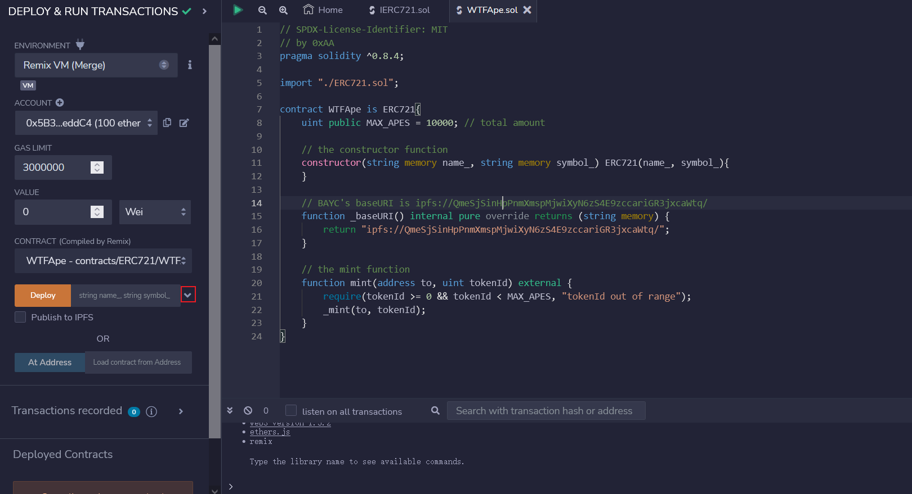
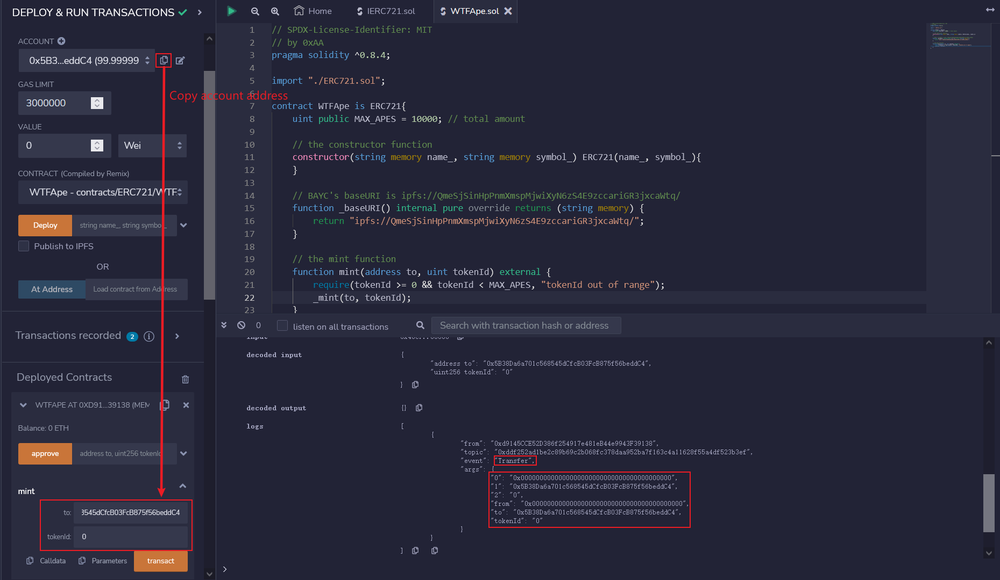
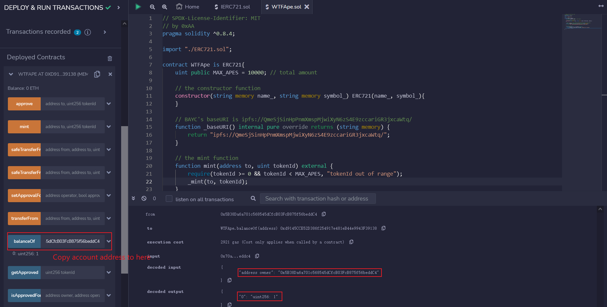

# WTF Solidity Beginner's Guide: 34. ERC721

Recently, I have been revisiting Solidity, consolidating the finer details, and writing "WTF Solidity" tutorials for newbies. 

Twitter: [@0xAA_Science](https://twitter.com/0xAA_Science) | [@WTFAcademy_](https://twitter.com/WTFAcademy_)

Community: [Discord](https://discord.gg/5akcruXrsk)｜[Wechat](https://docs.google.com/forms/d/e/1FAIpQLSe4KGT8Sh6sJ7hedQRuIYirOoZK_85miz3dw7vA1-YjodgJ-A/viewform?usp=sf_link)｜[Website wtf.academy](https://wtf.academy)

Codes and tutorials are open source on GitHub: [github.com/AmazingAng/WTFSolidity](https://github.com/AmazingAng/WTFSolidity)

-----

Tokens such as `BTC` and `ETH` belong to homogeneous tokens, and the first `BTC` mined is no different from the 10,000th `BTC` mined, and they are equivalent. However, many items in the world are heterogeneous, including real estate, antiques, virtual artworks, and so on. Such items cannot be abstracted using homogeneous tokens. Therefore, the `ERC721` standard was proposed in [Ethereum EIP721](https://eips.ethereum.org/EIPS/eip-721) to abstract non-homogeneous items. In this section, we will introduce the `ERC721` standard and issue an `NFT` based on it.

## EIP and ERC

One point to understand here is that the title of this section is `ERC721`, but `EIP721` also is mentioned here. What is the relationship between the two?

`EIP` stands for `Ethereum Improvement Proposals`, which are improvement suggestions proposed by the Ethereum developer community. They are a series of documents arranged by numbers, similar to IETF's RFC on the Internet.

`EIP` can be any improvement in the Ethereum ecosystem, such as new features, ERC standards, protocol improvements, programming tools, etc.

`ERC` stands for Ethereum Request For Comment and is used to record various application-level development standards and protocols on Ethereum. Typical token standards (`ERC20`, `ERC721`), name registration (`ERC26`, `ERC13`), URI paradigms (`ERC67`), Library/Package formats (`EIP82`), wallet formats (`EIP75`, `EIP85`), etc.

`ERC` protocol standards are important factors affecting the development of Ethereum. ERC20, ERC223, ERC721, ERC777, etc. have had a significant impact on the Ethereum ecosystem.

So the final conclusion: `EIP` contains `ERC`.

**After completing this section of learning, you can understand why we start with `ERC165` rather than `ERC721`. If you want to see the conclusion, you can directly move to the bottom**

Through the [ERC165 standard](https://eips.ethereum.org/EIPS/eip-165), smart contracts can declare the interfaces they support, for other contracts to check. Simply put, `ERC165` is used to check whether a smart contract supports the interfaces of `ERC721` or `ERC1155`.

The interface contract `IERC165` only declares a `supportsInterface` function. When given an `interfaceId` to query, it returns `true` if the contract implements that interface id.

```solidity
interface IERC165 {
    /**
     * @dev Returns true if contract implements the `interfaceId` for querying.
     * See https://eips.ethereum.org/EIPS/eip-165#how-interfaces-are-identified[EIP section] for the definition of what an interface is.
     */
    function supportsInterface(bytes4 interfaceId) external view returns (bool);
}
```

We can see how the `supportsInterface()` function is implemented in `ERC721`:

```solidity
    function supportsInterface(bytes4 interfaceId) external pure override returns (bool)
    {
        return
            interfaceId == type(IERC721).interfaceId ||
            interfaceId == type(IERC165).interfaceId;
    }
```

When querying the interface ID of `IERC721` or `IERC165`, it will return `true`; otherwise, it will return `false`.

## IERC721

`IERC721` is an interface contract for the `ERC721` standard, which specifies the basic functions that `ERC721` must implement. It uses `tokenId` to represent specific non-fungible tokens, and authorization or transfer requires an explicit `tokenId`; while `ERC20` only requires an explicit transfer amount.

```solidity
/**
 * @dev ERC721 standard interface.
 */
interface IERC721 is IERC165 {
    event Transfer(address indexed from, address indexed to, uint256 indexed tokenId);
    event Approval(address indexed owner, address indexed approved, uint256 indexed tokenId);
    event ApprovalForAll(address indexed owner, address indexed operator, bool approved);

    function balanceOf(address owner) external view returns (uint256 balance);

    function ownerOf(uint256 tokenId) external view returns (address owner);

    function safeTransferFrom(
        address from,
        address to,
        uint256 tokenId,
        bytes calldata data
    ) external;

    function safeTransferFrom(
        address from,
        address to,
        uint256 tokenId
    ) external;

    function transferFrom(
        address from,
        address to,
        uint256 tokenId
    ) external;

    function approve(address to, uint256 tokenId) external;

    function setApprovalForAll(address operator, bool _approved) external;

    function getApproved(uint256 tokenId) external view returns (address operator);

    function isApprovedForAll(address owner, address operator) external view returns (bool);
}
```

### IERC721 Events
`IERC721` has three events, `Transfer` and `Approval` events are also in `ERC20`.
- `Transfer` event: emitted during transfer, records the sender `from` address, receiver `to` address, and token `tokenid`.
- `Approval` event: emitted during approval, records the owner `owner` of the approval, the approved `approved` address, and the `tokenid`.
- `ApprovalForAll` event: emitted during bulk approval, records the sender `owner` of the bulk approval, the `operator` address to be authorized, and the flag `approved` to identify whether the `operator` is approved or not.

### IERC721 Functions
- `balanceOf`: returns the NFT holding `balance` of an address.
- `ownerOf`: returns the `owner` of a certain `tokenId`.
- `transferFrom`: normal transfer, with the parameters of the sender `from`, receiver `to` and `tokenId`.
- `safeTransferFrom`: safe transfer, which requires the implementation of the `ERC721Receiver` interface if the destination address is a contract address. With the parameters of the sender `from`, receiver `to` and `tokenId`.
- `approve`: authorizes another address to use your NFT. With the parameters of the authorized `to` address and `tokenId`.
- `getApproved`: returns the address to which the `tokenId` is approved.
- `setApprovalForAll`: authorizes the `operator` address to hold the NFTs owned by the sender in batch.
- `isApprovedForAll`: returns whether a certain address's NFTs are authorized to be held by another `operator` address.
- `safeTransferFrom`: an overloaded function for safe transfer, with `data` included in the parameters.

## IERC721Receiver

If a contract does not implement the relevant functions of `ERC721`, the incoming NFT will be stuck and unable to be transferred out, causing a loss of the token. In order to prevent accidental transfers, `ERC721` implements the `safeTransferFrom()` function, and the target contract must implement the `IERC721Receiver` interface in order to receive `ERC721` tokens, otherwise, it will `revert`. The `IERC721Receiver` interface only includes an `onERC721Received()` function.

```solidity
// ERC721 receiver interface: Contracts must implement this interface to receive ERC721 tokens via safe transfers.
interface IERC721Receiver {
    function onERC721Received(
        address operator,
        address from,
        uint tokenId,
        bytes calldata data
    ) external returns (bytes4);
}
```

Let's take a look at how `ERC721` uses `_checkOnERC721Received` to ensure that the target contract implements the `onERC721Received()` function (returning the `selector` of `onERC721Received`).

```solidity
    function _checkOnERC721Received(
        address from,
        address to,
        uint tokenId,
        bytes memory _data
    ) private returns (bool) {
        if (to.isContract()) {
            return
                IERC721Receiver(to).onERC721Received(
                    msg.sender,
                    from,
                    tokenId,
                    _data
                ) == IERC721Receiver.onERC721Received.selector;
        } else {
            return true;
        }
    }
```

## IERC721Metadata
`IERC721Metadata` is an extended interface of `ERC721`, which implements `3` commonly used functions for querying `metadata`:

- `name()`: Returns the name of the token.
- `symbol()`: Returns the symbol of the token.
- `tokenURI()`: Returns the URL of the `metadata` by querying through `tokenId`, a unique function of `ERC721`.

```solidity
interface IERC721Metadata is IERC721 {
    function name() external view returns (string memory);

    function symbol() external view returns (string memory);

    function tokenURI(uint256 tokenId) external view returns (string memory);
}
```

## ERC721 Main Contract
The `ERC721` main contract implements all the functionalities defined by `IERC721`, `IERC165` and `IERC721Metadata`. It includes `4` state variables and `17` functions. The implementation is rather simple, the functionality of each function is explained in the code comments:

```solidity
// SPDX-License-Identifier: MIT
// by 0xAA
pragma solidity ^0.8.21;

import "./IERC165.sol";
import "./IERC721.sol";
import "./IERC721Receiver.sol";
import "./IERC721Metadata.sol";
import "./Address.sol";
import "./String.sol";

contract ERC721 is IERC721, IERC721Metadata{
    using Address for address; // Uses Address library and uses isContract to check whether an address is a contract
    using Strings for uint256; // Uses String library

    // Token name
    string public override name;
    // Token symbol
    string public override symbol;
    // Mapping from token ID to owner address
    mapping(uint => address) private _owners;
    // Mapping owner address to balance of the token
    mapping(address => uint) private _balances;
    // Mapping from tokenId to approved address
    mapping(uint => address) private _tokenApprovals;
    //  Mapping from owner to operator addresses' batch approvals
    mapping(address => mapping(address => bool)) private _operatorApprovals;

    /**
     * Initializes the contract by setting a `name` and a `symbol` to the token collection.
     */
    constructor(string memory name_, string memory symbol_) {
        name = name_;
        symbol = symbol_;
    }

    // Implements the supportsInterface of IERC165
    function supportsInterface(bytes4 interfaceId)
        external
        pure
        override
        returns (bool)
    {
        return
            interfaceId == type(IERC721).interfaceId ||
            interfaceId == type(IERC165).interfaceId ||
            interfaceId == type(IERC721Metadata).interfaceId;
    }

    // Implements the balanceOf function of IERC721, which uses `_balances` variable to check the balance of tokens in `owner`'s account.
    function balanceOf(address owner) external view override returns (uint) {
        require(owner != address(0), "owner = zero address");
        return _balances[owner];
    }

    // Implements the ownerOf function of IERC721, which uses the `_owners` variable to check `tokenId`'s owner.
    function ownerOf(uint tokenId) public view override returns (address owner) {
        owner = _owners[tokenId];
        require(owner != address(0), "token doesn't exist");
    }

    // Implements the isApprovedForAll function of IERC721, which uses the `_operatorApprovals` variable to check whether the `owner` address's NFTs are authorized in batch to be held by another `operator` address.    
    function isApprovedForAll(address owner, address operator)
        external
        view
        override
        returns (bool)
    {
        return _operatorApprovals[owner][operator];
    }

    // Implements the setApprovalForAll function of IERC721, which approves all holding tokens to the `operator` address. Invokes `_setApprovalForAll` function.
    function setApprovalForAll(address operator, bool approved) external override {
        _operatorApprovals[msg.sender][operator] = approved;
        emit ApprovalForAll(msg.sender, operator, approved);
    }

    // Implements the getApproved function of IERC721, which uses the `_tokenApprovals` variable to check the authorized address of `tokenId`.
    function getApproved(uint tokenId) external view override returns (address) {
        require(_owners[tokenId] != address(0), "token doesn't exist");
        return _tokenApprovals[tokenId];
    }
     
    // The approve function, which updates the `_tokenApprovals` variable to approve `to` address to use `tokenId` and emits an Approval event.
    function _approve(
        address owner,
        address to,
        uint tokenId
    ) private {
        _tokenApprovals[tokenId] = to;
        emit Approval(owner, to, tokenId);
    }

    // Implements the approve function of IERC721, which approves `tokenId` to `to` address. 
    // Requirements: `to` is not `owner` and msg.sender is `owner` or an approved address. Invokes the _approve function.
    function approve(address to, uint tokenId) external override {
        address owner = _owners[tokenId];
        require(
            msg.sender == owner || _operatorApprovals[owner][msg.sender],
            "not owner nor approved for all"
        );
        _approve(owner, to, tokenId);
    }

    // Checks whether the `spender` address can use `tokenId` or not. (`spender` is `owner` or an approved address)
    function _isApprovedOrOwner(
        address owner,
        address spender,
        uint tokenId
    ) private view returns (bool) {
        return (spender == owner ||
            _tokenApprovals[tokenId] == spender ||
            _operatorApprovals[owner][spender]);
    }

    /*
     * The transfer function, which transfers `tokenId` from `from` address to `to` address by updating the `_balances` and `_owner` variables, emits a Transfer event.
     * Requirements:
     * 1. `tokenId` token must be owned by `from`.
     * 2. `to` cannot be the zero address.
     * 3. `from` cannot be the zero address.
     */
    function _transfer(
        address owner,
        address from,
        address to,
        uint tokenId
    ) private {
        require(from == owner, "not owner");
        require(to != address(0), "transfer to the zero address");

        _approve(owner, address(0), tokenId);

        _balances[from] -= 1;
        _balances[to] += 1;
        _owners[tokenId] = to;

        emit Transfer(from, to, tokenId);
    }
    
    // Implements the transferFrom function of IERC721, we should not use it as it is not a safe transfer. Invokes the _transfer function.
    function transferFrom(
        address from,
        address to,
        uint tokenId
    ) external override {
        address owner = ownerOf(tokenId);
        require(
            _isApprovedOrOwner(owner, msg.sender, tokenId),
            "not owner nor approved"
        );
        _transfer(owner, from, to, tokenId);
    }

    /**
     * Safely transfers `tokenId` token from `from` to `to`, this function will check that contract recipients
     * are aware of the ERC721 protocol to prevent tokens from being forever locked. It invokes the _transfer 
     * and _checkOnERC721Received functions. 
     * Requirements:     
     * 1. `from` cannot be the zero address.
     * 2. `to` cannot be the zero address.
     * 3. `tokenId` token must exist and be owned by `from`.
     * 4. If `to` refers to a smart contract, it must support {IERC721Receiver-onERC721Received}.
     */
    function _safeTransfer(
        address owner,
        address from,
        address to,
        uint tokenId,
        bytes memory _data
    ) private {
        _transfer(owner, from, to, tokenId);
        require(_checkOnERC721Received(from, to, tokenId, _data), "not ERC721Receiver");
    }

    /**
     * Implements the safeTransferFrom function of IERC721 to safely transfer. It invokes the _safeTransfe function.
     */
    function safeTransferFrom(
        address from,
        address to,
        uint tokenId,
        bytes memory _data
    ) public override {
        address owner = ownerOf(tokenId);
        require(
            _isApprovedOrOwner(owner, msg.sender, tokenId),
            "not owner nor approved"
        );
        _safeTransfer(owner, from, to, tokenId, _data);
    }

    // an overloaded function for safeTransferFrom
    function safeTransferFrom(
        address from,
        address to,
        uint tokenId
    ) external override {
        safeTransferFrom(from, to, tokenId, "");
    }

    /** 
     * The mint function, which updates `_balances` and `_owners` variables to mint `tokenId` and transfers it to `to`. It emits a Transfer event.
     * This mint function can be used by anyone, developers need to rewrite this function and add some requirements in practice.
     * Requirements: 
     * 1. `tokenId` must not exist.
     * 2. `to` cannot be the zero address.
     */
    function _mint(address to, uint tokenId) internal virtual {
        require(to != address(0), "mint to zero address");
        require(_owners[tokenId] == address(0), "token already minted");

        _balances[to] += 1;
        _owners[tokenId] = to;

        emit Transfer(address(0), to, tokenId);
    }

    // The destroy function, which destroys `tokenId` by updating `_balances` and `_owners` variables. It emits an Transfer event. Requirements: `tokenId` must exist.
    function _burn(uint tokenId) internal virtual {
        address owner = ownerOf(tokenId);
        require(msg.sender == owner, "not owner of token");

        _approve(owner, address(0), tokenId);

        _balances[owner] -= 1;
        delete _owners[tokenId];

        emit Transfer(owner, address(0), tokenId);
    }

    // It invokes IERC721Receiver-onERC721Received when `to` address is a contract to prevent `tokenId` from being forever locked.    
    function _checkOnERC721Received(
        address from,
        address to,
        uint tokenId,
        bytes memory _data
    ) private returns (bool) {
        if (to.isContract()) {
            return
                IERC721Receiver(to).onERC721Received(
                    msg.sender,
                    from,
                    tokenId,
                    _data
                ) == IERC721Receiver.onERC721Received.selector;
        } else {
            return true;
        }
    }

    /**
     * Implements the tokenURI function of IERC721Metadata to query metadata.
     */
    function tokenURI(uint256 tokenId) public view virtual override returns (string memory) {
        require(_owners[tokenId] != address(0), "Token Not Exist");

        string memory baseURI = _baseURI();
        return bytes(baseURI).length > 0 ? string(abi.encodePacked(baseURI, tokenId.toString())) : "";
    }

    /**
     * Base URI for computing {tokenURI}, which is the combination of `baseURI` and `tokenId`. Developers should rewrite this function accordingly.
     * BAYC's baseURI is ipfs://QmeSjSinHpPnmXmspMjwiXyN6zS4E9zccariGR3jxcaWtq/ 
     */
    function _baseURI() internal view virtual returns (string memory) {
        return "";
    }
}
```

## Write a Free Minting APE
Let's use `ERC721` to write a free minting `WTF APE`, with a total quantity of `10000`. We just need to rewrite the `mint()` and `baseURI()` functions. The `baseURI()` will be set the same as `BAYC`, where the metadata will directly obtain the information of the uninteresting apes, similar to [RRBAYC](https://rrbayc.com/):

```solidity
// SPDX-License-Identifier: MIT
// by 0xAA
pragma solidity ^0.8.21;

import "./ERC721.sol";

contract WTFApe is ERC721{
    uint public MAX_APES = 10000; // total amount

    // the constructor function
    constructor(string memory name_, string memory symbol_) ERC721(name_, symbol_){
    }

    // BAYC's baseURI is ipfs://QmeSjSinHpPnmXmspMjwiXyN6zS4E9zccariGR3jxcaWtq/
    function _baseURI() internal pure override returns (string memory) {
        return "ipfs://QmeSjSinHpPnmXmspMjwiXyN6zS4E9zccariGR3jxcaWtq/";
    }
    
    // the mint function
    function mint(address to, uint tokenId) external {
        require(tokenId >= 0 && tokenId < MAX_APES, "tokenId out of range");
        _mint(to, tokenId);
    }
}
```

## Issuing `ERC721` NFT

With the `ERC721` standard, issuing NFTs on the `ETH` chain has become very easy. Now, let's issue our own NFT.

After compiling the `ERC721` contract and the `WTFApe` contract in `Remix` (in order), click the button in the deployment column, enter the parameters of the constructor function, set `name_` and `symbol_` to `WTF`, and then click the `transact` button to deploy.




This way, we have created the `WTF` NFT. We need to run the `mint()` function to mint some tokens for ourselves. In the `mint` function panel, click the right button to input the account address and token ID, and then click the `mint` button to mint the `0`-numbered `WTF` NFT for ourselves.

You can click the Debug button on the right to view the logs below.

It includes four key pieces of information:
- Event `Transfer`
- Minting address `0x0000000000000000000000000000000000000000`
- Receiving address `0x5B38Da6a701c568545dCfcB03FcB875f56beddC4`
- Token id `0`



We use the `balanceOf()` function to query the account balance. By inputting our current account, we can see that an `NFT` has been successfully minted, as indicated on the right-hand side of the image.



We can also use the `ownerOf()` function to check which account an NFT belongs to. By inputting the `tokenid`, we can see that the address is correct.


## ERC165 and ERC721 explained
As mentioned earlier, in order to prevent an NFT from being transferred to a contract that is incapable of handling NFTs, the destination address must correctly implement the ERC721TokenReceiver interface:

```solidity
interface ERC721TokenReceiver {
    function onERC721Received(address _operator, address _from, uint256 _tokenId, bytes _data) external returns(bytes4);
}
```

Expanding into the world of programming languages, whether it's Java's interface or Rust's Trait (of course, in solidity, it's more like a library than a trait), whenever it relates to interfaces, it implies that an interface is a collection of certain behaviours (in solidity, interfaces are equivalent to a collection of function selectors). If a certain type implements a certain interface, it means that the type has a certain functionality. Therefore, as long as a certain contract type implements the above `ERC721TokenReceiver` interface (specifically, it implements the `onERC721Received` function), the contract type indicates to the outside world that it has the ability to manage NFTs. Of course, the logic of operating NFTs is implemented in other functions of the contract.

When executing `safeTransferFrom` in the ERC721 standard, it will check whether the target contract implements the `onERC721Received` function, which is an operation based on the `ERC165` idea.

So, what exactly is `ERC165`?

`ERC165` is a technical standard to indicate which interfaces have been implemented externally. As mentioned above, implementing an interface means that the contract has a special ability. When some contracts interact with other contracts, they expect the target contract to have certain capabilities, so that contracts can query each other through the `ERC165` standard to check whether the other party has the corresponding abilities.

Taking the `ERC721` contract as an example, how does it check whether a contract implements `ERC721`? According to [how-to-detect-if-a-contract-implements-erc-165](https://eips.ethereum.org/EIPS/eip-165#how-to-detect-if-a-contract-implements-erc-165), the checking steps should be to first check whether the contract implements `ERC165`, and then check specific interfaces implemented by the contract. At this point, the specific interface is `IERC721`. `IERC721` is the basic interface of `ERC721` (why say basic? Because there are other extensions, such as `ERC721Metadata` and `ERC721Enumerable`).

```solidity
/// Please note this **0x80ac58cd**
///  **⚠⚠⚠ Note: the ERC-165 identifier for this interface is 0x80ac58cd. ⚠⚠⚠**
interface ERC721 /* is ERC165 */ {
    event Transfer(address indexed _from, address indexed _to, uint256 indexed _tokenId);

    event Approval(address indexed _owner, address indexed _approved, uint256 indexed _tokenId);

    event ApprovalForAll(address indexed _owner, address indexed _operator, bool _approved);

    function balanceOf(address _owner) external view returns (uint256);

    function ownerOf(uint256 _tokenId) external view returns (address);

    function safeTransferFrom(address _from, address _to, uint256 _tokenId, bytes data) external payable;

    function safeTransferFrom(address _from, address _to, uint256 _tokenId) external payable;

    function transferFrom(address _from, address _to, uint256 _tokenId) external payable;

    function approve(address _approved, uint256 _tokenId) external payable;

    function setApprovalForAll(address _operator, bool _approved) external;

    function getApproved(uint256 _tokenId) external view returns (address);

    function isApprovedForAll(address _owner, address _operator) external view returns (bool);
}
```

The value **0x80ac58cd** is obtained by calculating `bytes4(keccak256(ERC721.Transfer.selector) ^ keccak256(ERC721.Approval.selector) ^ ··· ^keccak256(ERC721.isApprovedForAll.selector))`, which is the computation method specified by `ERC165`.

Similarly, one can calculate the interface of `ERC165` itself (which contains only one function `function supportsInterface(bytes4 interfaceID) external view returns (bool);`) by using `bytes4(keccak256(supportsInterface.selector))`, which results in **0x01ffc9a7**. Additionally, ERC721 defines some extended interfaces, such as `ERC721Metadata`. It looks like this:

```solidity
///  Note: the ERC-165 identifier for this interface is 0x5b5e139f.
interface ERC721Metadata /* is ERC721 */ {
    function name() external view returns (string _name);
    function symbol() external view returns (string _symbol);
    function tokenURI(uint256 _tokenId) external view returns (string); // This is very important as the urls of NFT's images showing in the website are returned by this function.
}
```

The calculation of **0x5b5e139f** is:

```solidity
IERC721Metadata.name.selector ^ IERC721Metadata.symbol.selector ^ IERC721Metadata.tokenURI.selector
```

How does the ERC721.sol implemented by Solamte fulfil these features required by `ERC165`?

```solidity
function supportsInterface(bytes4 interfaceId) public view virtual returns (bool) {
        return
            interfaceId == 0x01ffc9a7 || // ERC165 Interface ID for ERC165
            interfaceId == 0x80ac58cd || // ERC165 Interface ID for ERC721
            interfaceId == 0x5b5e139f; // ERC165 Interface ID for ERC721Metadata
}
```

Yes, it's that simple. When the outside world follows the steps in [link1](https://eips.ethereum.org/EIPS/eip-165#how-to-detect-if-a-contract-implements-erc-165) to perform the check, if they want to check whether this contract implements 165, it's easy. The `supportsInterface` function must return true when the input parameter is `0x01ffc9a7`, and false when the input parameter is `0xffffffff`. The above implementation perfectly meets the requirements.

When the outside world wants to check whether this contract is `ERC721`, it's easy. When the input parameter is **0x80ac58cd**, it indicates that the outside world wants to do this check. Return true.

When the outside world wants to check whether this contract implements the `ERC721` extension `ERC721Metadata` interface, the input parameter is `0x5b5e139f`. It's easy, just return true.

And because this function is virtual, users of the contract can inherit the contract and then continue to implement the `ERC721Enumerable` interface. After implementing functions like `totalSupply`, they can re-implement the inherited `supportsInterface` as:

```solidity
function supportsInterface(bytes4 interfaceId) public view virtual returns (bool) {
        return
            interfaceId == 0x01ffc9a7 || // ERC165 Interface ID for ERC165
            interfaceId == 0x80ac58cd || // ERC165 Interface ID for ERC721
            interfaceId == 0x5b5e139f || // ERC165 Interface ID for ERC721Metadata
            interfaceId == 0x780e9d63;   // ERC165 Interface ID for ERC721Enumerable
}
```

**Elegance, conciseness, and scalability are maximized.**

## Summary
In this lesson, I introduced the `ERC721` standard, interface, and implementation, and added English comments to the contract code. We also used `ERC721` to create a free `WTF APE` NFT, with metadata directly called from `BAYC`. The `ERC721` standard is still evolving, with the currently popular versions being `ERC721Enumerable` (improving NFT accessibility) and `ERC721A` (saving `gas` in minting).
