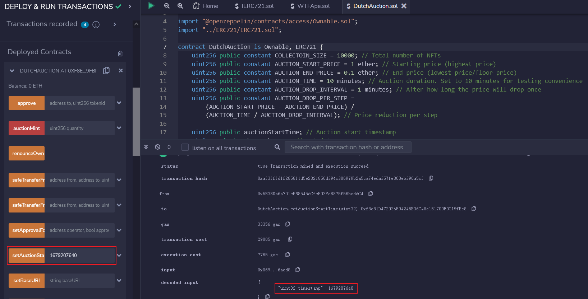
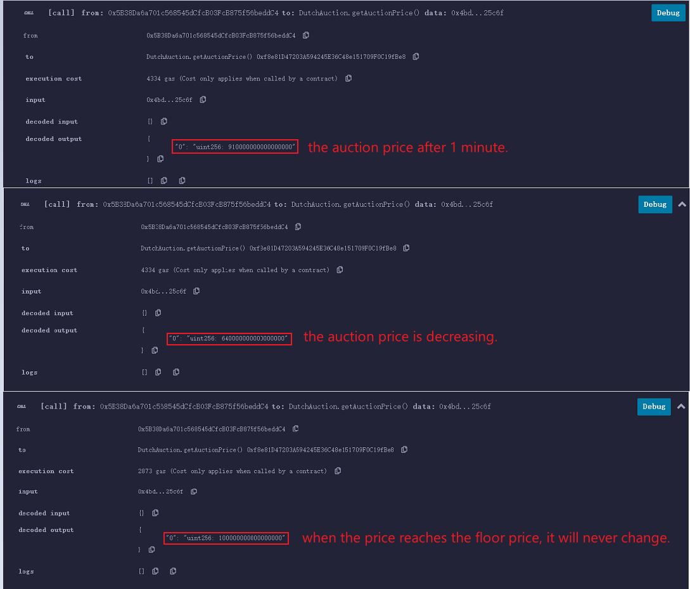
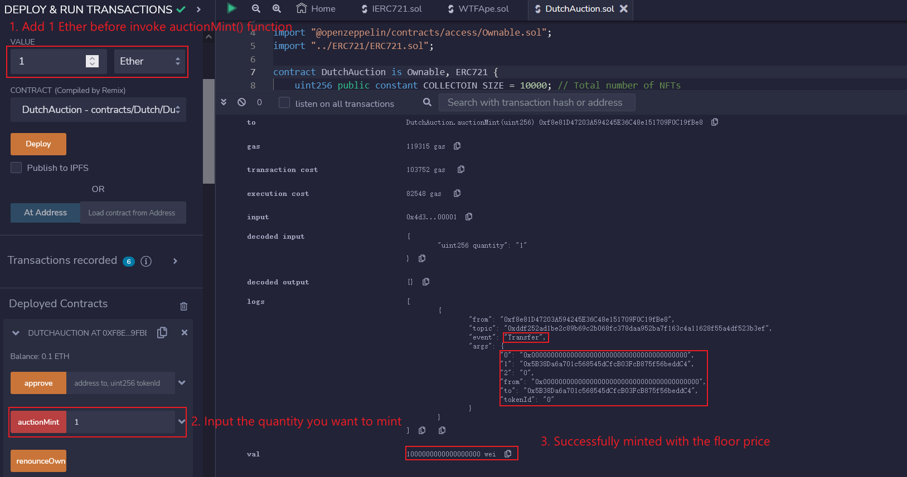

# WTF Solidity Beginner's Guide: 35. Dutch Auction

Recently, I have been revisiting Solidity, consolidating the finer details, and writing "WTF Solidity" tutorials for newbies. 

Twitter: [@0xAA_Science](https://twitter.com/0xAA_Science) | [@WTFAcademy_](https://twitter.com/WTFAcademy_)

Community: [Discord](https://discord.gg/5akcruXrsk)｜[Wechat](https://docs.google.com/forms/d/e/1FAIpQLSe4KGT8Sh6sJ7hedQRuIYirOoZK_85miz3dw7vA1-YjodgJ-A/viewform?usp=sf_link)｜[Website wtf.academy](https://wtf.academy)

Codes and tutorials are open source on GitHub: [github.com/AmazingAng/WTFSolidity](https://github.com/AmazingAng/WTFSolidity)

----

In this lecture, I will introduce the Dutch Auction and explain how to issue an `NFT` using the `ERC721` standard through a simplified version of the `Azuki` Dutch Auction code.

## Dutch Auction

The Dutch Auction is a special type of auction. Also known as a "descending price auction," it refers to an auction where the bidding for the item being auctioned starts high and decreases sequentially until the first bidder bids (reaches or exceeds the bottom price) and it is sold.


In the cryptocurrency world, many NFTs are sold through Dutch auctions, including `Azuki` and `World of Women`, with `Azuki` raising over `8000` `ETH` through a Dutch auction.

The project team likes this type of auction for two main reasons:

1. The price of the Dutch auction slowly decreases from the highest price, allowing the project party to receive the maximum revenue.

2. The auction lasts a long time (usually more than 6 hours), which can avoid gas wars.

## DutchAuction Contract

The code is simplified based on the [code](https://etherscan.io/address/0xed5af388653567af2f388e6224dc7c4b3241c544#code) of `Azuki`. The `DutchAuction` contract inherits the `ERC721` and `Ownable` contracts previously introduced:

```solidity
// SPDX-License-Identifier: MIT
pragma solidity ^0.8.4;

import "@openzeppelin/contracts/access/Ownable.sol";
import "https://github.com/AmazingAng/WTFSolidity/blob/main/34_ERC721/ERC721.sol";

contract DutchAuction is Ownable, ERC721 {
```

### `DutchAuction` State Variables

There are a total of `9` state variables in the contract, of which `6` are related to the auction. They are:

- `COLLECTION_SIZE`: Total number of NFTs.
- `AUCTION_START_PRICE`: Starting price of the Dutch auction, is also the highest price.
- `AUCTION_END_PRICE`: Ending price of the Dutch auction, also the lowest price/floor price.
- `AUCTION_TIME`: Duration of the auction.
- `AUCTION_DROP_INTERVAL`: Time interval when the price drops.
- `auctionStartTime`: Starting time of the auction (blockchain timestamp, `block.timestamp`).

```solidity
    uint256 public constant COLLECTOIN_SIZE = 10000; // Total number of NFTs 
    uint256 public constant AUCTION_START_PRICE = 1 ether; // Starting price (highest price)
    uint256 public constant AUCTION_END_PRICE = 0.1 ether; // End price (lowest price/floor price)
    uint256 public constant AUCTION_TIME = 10 minutes; // Auction duration. Set to 10 minutes for testing convenience
    uint256 public constant AUCTION_DROP_INTERVAL = 1 minutes; // After how long the price will drop once
    uint256 public constant AUCTION_DROP_PER_STEP =
        (AUCTION_START_PRICE - AUCTION_END_PRICE) /
        (AUCTION_TIME / AUCTION_DROP_INTERVAL); // Price reduction per step

    uint256 public auctionStartTime; // Auction start timestamp
    string private _baseTokenURI; // metadata URI
    uint256[] private _allTokens; // Record all existing tokenIds
```

### `DutchAuction` Function

There are a total of `9` functions in the Dutch auction contract. We will only introduce the functions related to the auction and not cover the functions related to `ERC721`.

- Set auction start time: We declare the current block time as the start time in the constructor. The project owner can also adjust the start time through the `setAuctionStartTime()` function.

The `constructor` function initializes a new `ERC721` token with the name "WTF Dutch Auction" and the symbol "WTF Dutch Auction". It sets the `auctionStartTime` to the current block timestamp.

The `setAuctionStartTime` function is a setter function that updates the `auctionStartTime` variable. It can only be called by the owner of the contract.

- Get the real-time auction price: The function `getAuctionPrice()` calculates the real-time auction price based on the current block time and relevant auction state variables.

If `block.timestamp` is less than the start time, the price is the highest price `AUCTION_START_PRICE`;

If `block.timestamp` is greater than the end time, the price is the lowest price `AUCTION_END_PRICE`;

If `block.timestamp` is between the start and end times, the current decay price is calculated.

```solidity
    // Get real-time auction price
    function getAuctionPrice()
        public
        view
        returns (uint256)
    {
        if (block.timestamp < auctionStartTime) {
        return AUCTION_START_PRICE;
        }else if (block.timestamp - auctionStartTime >= AUCTION_TIME) {
        return AUCTION_END_PRICE;
        } else {
        uint256 steps = (block.timestamp - auctionStartTime) /
            AUCTION_DROP_INTERVAL;
        return AUCTION_START_PRICE - (steps * AUCTION_DROP_PER_STEP);
        }
    }
```

- User auctions and mints `NFT`: Users participate in a Dutch auction and mint `NFT` by calling the `auctionMint()` function to pay `ETH`.

First, the function checks if the auction has started or if the number of `NFTs` has exceeded the limit. Then, the contract calculates the auction cost based on the number of minted `NFTs` and uses the `getAuctionPrice()` function. It also checks if the user has enough `ETH` to participate. If the user has enough `ETH`, the contract mints `NFTs` and refunds any excess `ETH`. Otherwise, the transaction is reverted.

```solidity
    // the auction mint function
    function auctionMint(uint256 quantity) external payable{
        uint256 _saleStartTime = uint256(auctionStartTime); // uses local variable to reduce gas
        require(
        _saleStartTime != 0 && block.timestamp >= _saleStartTime,
        "sale has not started yet"
        ); // checks if the start time of auction has been set and auction has started
        require(
        totalSupply() + quantity <= COLLECTOIN_SIZE,
        "not enough remaining reserved for auction to support desired mint amount"
        ); // checks if the number of NFTs has exceeded the limit

        uint256 totalCost = getAuctionPrice() * quantity; // calculates the cost of mint
        require(msg.value >= totalCost, "Need to send more ETH."); // checks if the user has enough ETH to pay
        
        // Mint NFT
        for(uint256 i = 0; i < quantity; i++) {
            uint256 mintIndex = totalSupply();
            _mint(msg.sender, mintIndex);
            _addTokenToAllTokensEnumeration(mintIndex);
        }
        // refund excess ETH
        if (msg.value > totalCost) {
            payable(msg.sender).transfer(msg.value - totalCost); //please check is there any risk of reentrancy attack
        }
    }
```

- Withdrawal of raised `ETH` by the project owner: The project owner can withdraw the `ETH` raised in the auction by using the function `withdrawMoney()`.

```solidity
    // the withdraw function, onlyOwner modifier
    function withdrawMoney() external onlyOwner {
        (bool success, ) = msg.sender.call{value: address(this).balance}(""); // how to use call function please see lession #22
        require(success, "Transfer failed.");
    }
```

## Demo of Remix

1. Contract Deployment: First, deploy the `DutchAuction.sol` contract and set the auction start time through the `setAuctionStartTime()` function. In this example, the start time is March 19, 2023, 14:34 am, corresponding to UTC time 1679207640. You can search for the corresponding time on a tool website (such as [here](https://tool.chinaz.com/tools/unixtime.aspx)) during the experiment.


2. Dutch Auction: Then, you can use the `getAuctionPrice()` function to get the **current** auction price. It can be observed that the price before the auction starts is `starting price AUCTION_START_PRICE`. As the auction proceeds, the auction price gradually decreases until it reaches the `reserve price AUCTION_END_PRICE`, after which it no longer changes.


3. Mint Operation: Complete mint through the `auctionMint()` function. In this example, because the time has exceeded the auction time, only the `reserve price` was spent to complete the auction.


4. Withdrawal of `ETH`: You can directly send the raised `ETH` to the contract creator's address through the `withdrawMoney()` function.

## Summary

In this lecture, we introduced the Dutch auction and explained how to issue `ERC721` standard `NFT` through `Dutch auction` using a simplified version of the `Azuki` Dutch auction code. The most expensive `NFT` I auctioned was a piece of music `NFT` by musician `Jonathan Mann`. What about you?
