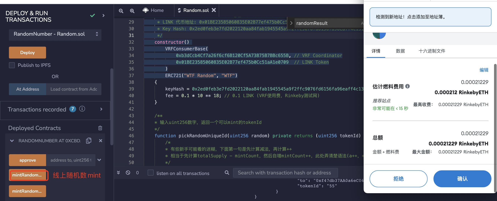
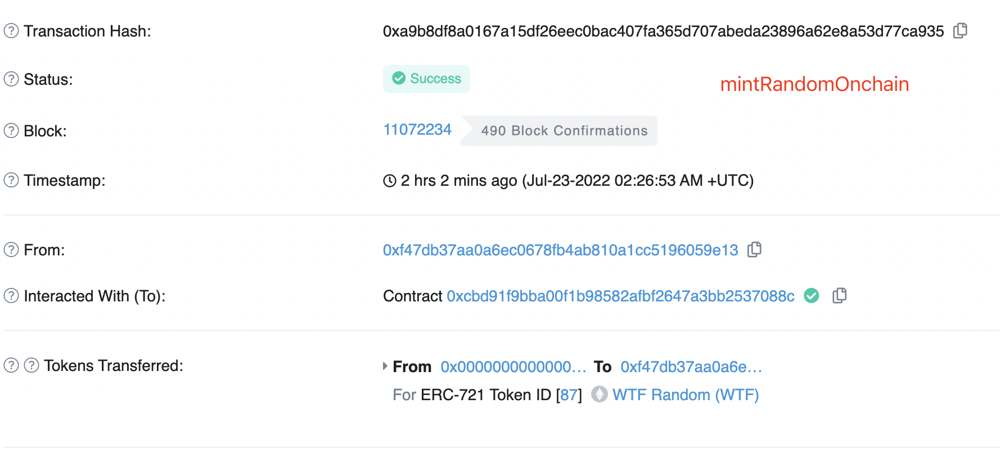

# WTF Solidity Quick Start: 39. Chainlink Randomness

I am currently re-learning Solidity to sharpen my skills and writing a "WTF Solidity Quick Start" guide for beginners to use (advanced programmers can look for other tutorials). I will update 1-3 lectures every week.

Twitter: [@0xAA_Science](https://twitter.com/0xAA_Science)

Discord: [WTF Academy](https://discord.gg/5akcruXrsk)

All code and tutorials are open source on GitHub: [github.com/AmazingAng/WTFSolidity](https://github.com/AmazingAng/WTFSolidity)

Many Ethereum applications require the use of random numbers, such as NFT random tokenId selection, blind box drawing, and randomly determining the winner in gamefi battles. However, since all data on Ethereum is public and deterministic, it cannot provide developers with a method of generating random numbers like other programming languages. In this tutorial, we will introduce two methods of on-chain (hash function) and off-chain (Chainlink oracle) random number generation, and use them to create a tokenId random minting NFT.

## On-chain Random Number Generation

We can use some on-chain global variables as seeds and use the `keccak256()` hash function to obtain pseudo-random numbers. This is because the hash function has sensitivity and uniformity, and can generate "apparently" random results. The `getRandomOnchain()` function below uses the global variables `block.timestamp`, `msg.sender`, and `blockhash(block.number-1)` as seeds to obtain random numbers:

```solidity
/** 
 * Generating pseudo-random numbers on the chain.
 * Using keccak256() to pack some on-chain global variables/custom variables.
 * Converted to uint256 type when returned.
*/
function getRandomOnchain() public view returns(uint256){
     // Generating blockhash in Remix will result in an error.
     bytes32 randomBytes = keccak256(abi.encodePacked(block.timestamp, msg.sender, blockhash(block.number-1)));
        
     return uint256(randomBytes);
}
```

**Note**: This method is not secure: 
- Firstly, variables such as `block.timestamp`, `msg.sender`, and `blockhash(block.number-1)` are all publicly visible. Users can predict the random number generated by these seeds and select the output they want to execute the smart contract.
- Secondly, miners can manipulate `blockhash` and `block.timestamp` to generate a random number that suits their interests.

However, this method is the most convenient on-chain random number generation method, and many project parties rely on it to generate insecure random numbers, including well-known projects such as `meebits` and `loots`. Of course, all these projects have been attacked: attackers can forge any rare `NFT` they want, instead of randomly drawing them.

## Off-chain random number generation

We can generate random numbers off-chain and upload them to the chain through oracles. Chainlink provides a VRF (Verifiable Random Function) service, and on-chain developers can pay the LINK token to obtain a random number. Chainlink VRF has two versions. Since the second version requires registration on the official website and prepaid fees, and the usage is similar, only the first version VRF v1 is introduced here.

### Steps to use `Chainlink VRF`


We will use a simple contract to introduce the steps to use Chainlink VRF. The `RandomNumberConsumer` contract can request a random number from the VRF and store it in the state variable `randomResult`.

**1. The user contract inherits from `VRFConsumerBase` and transfers the `LINK` token**

To use VRF to obtain a random number, the contract needs to inherit the `VRFConsumerBase` contract and initialize the `VRF Coordinator` address, `LINK` token address, unique identifier `Key Hash`, and usage fee `fee` in the constructor.

**Note:** Different chains correspond to different parameters, please refer to [here](https://docs.chain.link/docs/vrf-contracts/v1/) to find out.

In the tutorial, we use the `Rinkeby` testnet. After deploying the contract, users need to transfer some `LINK` tokens to the contract. Testnet `LINK` tokens can be obtained from the [LINK faucet](https://faucets.chain.link/).

```solidity
// SPDX-License-Identifier: MIT
pragma solidity ^0.8.4;

import "@chainlink/contracts/src/v0.8/VRFConsumerBase.sol";

contract RandomNumberConsumer is VRFConsumerBase {
    
    bytes32 internal keyHash; // VRF唯一标识符
    uint256 internal fee; // VRF使用手续费
    
    uint256 public randomResult; // 存储随机数
    
    /**
     * 使用chainlink VRF，构造函数需要继承 VRFConsumerBase 
     * 不同链参数填的不一样
     * 网络: Rinkeby测试网
     * Chainlink VRF Coordinator 地址: 0xb3dCcb4Cf7a26f6cf6B120Cf5A73875B7BBc655B
     * LINK 代币地址: 0x01BE23585060835E02B77ef475b0Cc51aA1e0709
     * Key Hash: 0x2ed0feb3e7fd2022120aa84fab1945545a9f2ffc9076fd6156fa96eaff4c1311
     */
    constructor() 
        VRFConsumerBase(
            0xb3dCcb4Cf7a26f6cf6B120Cf5A73875B7BBc655B, // VRF Coordinator
            0x01BE23585060835E02B77ef475b0Cc51aA1e0709  // LINK Token
        )
    {
        keyHash = 0x2ed0feb3e7fd2022120aa84fab1945545a9f2ffc9076fd6156fa96eaff4c1311;
        fee = 0.1 * 10 ** 18; // 0.1 LINK (VRF使用费，Rinkeby测试网)
    }
```

**2. User requests random number through contract**

Users can call `requestRandomness()` inherited from the `VRFConsumerBase` contract to request a random number and receive a request identifier `requestId`. This request will be passed on to the `VRF` contract.

```solidity
    /** 
     * Request a random number from the VRF contract 
     */
    function getRandomNumber() public returns (bytes32 requestId) {
        // The contract needs to have sufficient LINK
        require(LINK.balanceOf(address(this)) >= fee, "Not enough LINK - fill contract with faucet");

        return requestRandomness(keyHash, fee);
    }
```

3. The `Chainlink` node generates a random number and a digital signature off-chain, and sends them to the `VRF` contract.
 
4. The `VRF` contract verifies the validity of the signature.
 
5. The user contract receives and uses the random number.
 
After verifying the validity of the signature in the `VRF` contract, the fallback function `fulfillRandomness()` of the user contract will be automatically called, and the off-chain generated random number will be sent over. The logic of consuming the random number should be implemented in this function.
 
Note: The `requestRandomness()` function called by the user to request a random number and the fallback function `fulfillRandomness()` called when the `VRF` contract returns the random number are two separate transactions, with the user contract and the `VRF` contract being the callers, respectively. The latter will be a few minutes later than the former (with different chain delays).

```solidity
    /**
     * VRF合约的回调函数，验证随机数有效之后会自动被调用
     * 消耗随机数的逻辑写在这里
     */
    function fulfillRandomness(bytes32 requestId, uint256 randomness) internal override {
        randomResult = randomness;
    }
```

## `tokenId` Randomly Minted `NFT`

In this section, we will use on-chain and off-chain random numbers to create a `tokenId` randomly minted `NFT`. The `Random` contract inherits from both the `ERC721` and `VRFConsumerBase` contracts.

```Solidity
// SPDX-License-Identifier: MIT
pragma solidity ^0.8.4;

import "https://github.com/AmazingAng/WTFSolidity/blob/main/34_ERC721/ERC721.sol";
import "@chainlink/contracts/src/v0.8/VRFConsumerBase.sol";

contract Random is ERC721, VRFConsumerBase{
```

### State Variables

- `NFT` related
    - `totalSupply`: Total supply of `NFT`.
    - `ids`: Array used for calculating `tokenId`s that can be `minted`, see `pickRandomUniqueId()` function.
    - `mintCount`: Number of NFTs that have been `minted`.
- `Chainlink VRF` related
    - `keyHash`: Unique identifier for `VRF`.
    - `fee`: `VRF` fee.
    - `requestToSender`: Records the user address that applied for `VRF` for minting.

```solidity
    // NFT Related
    uint256 public totalSupply = 100; // Total supply
    uint256[100] public ids; // Used to calculate the tokenId that can be minted
    uint256 public mintCount; // Number of minted tokens
    // Chainlink VRF Related
    bytes32 internal keyHash; // Key hash for Chainlink VRF
    uint256 internal fee; // Fee for Chainlink VRF
    // Records the mint address corresponding to the VRF request identifier
    mapping(bytes32 => address) public requestToSender; 
```

### Constructor
Initialize the relevant variables of the inherited `VRFConsumerBase` and `ERC721` contracts.

```
/**
  * Using Chainlink VRF, the constructor needs to inherit from VRFConsumerBase
  * Different chain parameters are filled differently
  * Network: Rinkeby Testnet
  * Chainlink VRF Coordinator address: 0xb3dCcb4Cf7a26f6cf6B120Cf5A73875B7BBc655B
  * LINK token address: 0x01BE23585060835E02B77ef475b0Cc51aA1e0709
  * Key Hash: 0x2ed0feb3e7fd2022120aa84fab1945545a9f2ffc9076fd6156fa96eaff4c1311
**/
constructor()
    VRFConsumerBase(
        0xb3dCcb4Cf7a26f6cf6B120Cf5A73875B7BBc655B, // VRF Coordinator
        0x01BE23585060835E02B77ef475b0Cc51aA1e0709  // LINK Token
    )
    ERC721("WTF Random", "WTF")
{
    keyHash = 0x2ed0feb3e7fd2022120aa84fab1945545a9f2ffc9076fd6156fa96eaff4c1311;
    fee = 0.1 * 10 ** 18; // 0.1 LINK (VRF usage fee, Rinkeby test network)
}
```

### Other Functions
In addition to the constructor function, the contract defines 5 other functions:

- `pickRandomUniqueId()`: takes in a random number and returns a `tokenId` that can be used for minting.

- `getRandomOnchain()`: returns an on-chain random number (insecure).

- `mintRandomOnchain()`: mints an NFT using an on-chain random number, and calls `getRandomOnchain()` and `pickRandomUniqueId()`.

- `mintRandomVRF()`: requests a random number from `Chainlink VRF` to mint an NFT. Since the logic for minting with a random number is in the callback function `fulfillRandomness()`, which is called by the `VRF` contract, not the user minting the NFT, the function here must use the `requestToSender` state variable to record the user address corresponding to the `VRF` request identifier.

- `fulfillRandomness()`: the callback function for `VRF`, which is automatically called by the `VRF` contract after verifying the authenticity of the random number. It uses the returned off-chain random number to mint an NFT.

```solidity
    /** 
    * 输入uint256数字，返回一个可以mint的tokenId
    * 算法过程可理解为：totalSupply个空杯子（0初始化的ids）排成一排，每个杯子旁边放一个球，编号为[0, totalSupply - 1]。
    每次从场上随机拿走一个球（球可能在杯子旁边，这是初始状态；也可能是在杯子里，说明杯子旁边的球已经被拿走过，则此时新的球从末尾被放到了杯子里）
    再把末尾的一个球（依然是可能在杯子里也可能在杯子旁边）放进被拿走的球的杯子里，循环totalSupply次。相比传统的随机排列，省去了初始化ids[]的gas。
    */
    function pickRandomUniqueId(uint256 random) private returns (uint256 tokenId) {
        uint256 len = totalSupply - mintCount++; // 可mint数量
        require(len > 0, "mint close"); // 所有tokenId被mint完了
        uint256 randomIndex = random % len; // 获取链上随机数
        
        //随机数取模，得到tokenId，作为数组下标，同时记录value为len-1，如果取模得到的值已存在，则tokenId取该数组下标的value
        tokenId = ids[randomIndex] != 0 ? ids[randomIndex] : randomIndex; // 获取tokenId
        ids[randomIndex] = ids[len - 1] == 0 ? len - 1 : ids[len - 1]; // 更新ids 列表
        ids[len - 1] = 0; // 删除最后一个元素，能返还gas
    }

    /** 
    * 链上伪随机数生成
    * keccak256(abi.encodePacked()中填上一些链上的全局变量/自定义变量
    * 返回时转换成uint256类型
    */
    function getRandomOnchain() public view returns(uint256){
        // remix跑blockhash会报错
        bytes32 randomBytes = keccak256(abi.encodePacked(block.number, msg.sender, blockhash(block.timestamp-1)));
        return uint256(randomBytes);
    }

    // 利用链上伪随机数铸造NFT
    function mintRandomOnchain() public {
        uint256 _tokenId = pickRandomUniqueId(getRandomOnchain()); // 利用链上随机数生成tokenId
        _mint(msg.sender, _tokenId);
    }

    /** 
     * 调用VRF获取随机数，并mintNFT
     * 要调用requestRandomness()函数获取，消耗随机数的逻辑写在VRF的回调函数fulfillRandomness()中
     * 调用前，把LINK代币转到本合约里
     */
    function mintRandomVRF() public returns (bytes32 requestId) {
        // 检查合约中LINK余额
        require(LINK.balanceOf(address(this)) >= fee, "Not enough LINK - fill contract with faucet");
        // 调用requestRandomness获取随机数
        requestId = requestRandomness(keyHash, fee);
        requestToSender[requestId] = msg.sender;
        return requestId;
    }

    /**
     * VRF的回调函数，由VRF Coordinator调用
     * 消耗随机数的逻辑写在本函数中
     */
    function fulfillRandomness(bytes32 requestId, uint256 randomness) internal override {
        address sender = requestToSender[requestId]; // 从requestToSender中获取minter用户地址
        uint256 _tokenId = pickRandomUniqueId(randomness); // 利用VRF返回的随机数生成tokenId

        _mint(sender, _tokenId);
    }
```

## `remix` Verification

### 1. Deploy the `Random` contract on the `Rinkeby` testnet


### 2. Get `LINK` and `ETH` on the `Rinkeby` testnet using `Chainlink` faucet


### 3. Transfer `LINK` tokens into the `Random` contract

After the contract is deployed, copy the contract address, and transfer `LINK` to the contract address just as you would for a normal transfer.


### 4. Mint NFTs using onchain random numbers

In the `remix` interface, click on the orange function `mintRandomOnchain` on the left side , then click confirm in the pop-up `Metamask` to start minting the transaction using onchain random numbers.



### 5. Mint NFTs using `Chainlink VRF` offchain random numbers

Similarly, in the `remix` interface, click on the orange function `mintRandomVRF` on the left and click confirm in the pop-up little fox wallet. The transaction of minting an `NFT` using `Chainlink VRF` off-chain random number has started.

Note: when using `VRF` to mint `NFT`, initiating the transaction and the success of minting are not in the same block.


### 6. Verify that the `NFT` has been minted

From the above screenshots, it can be seen that in this example, the `NFT` with `tokenId=87` has been randomly minted on-chain, and the `NFT` with `tokenId=77` has been minted using `VRF`.

## Conclusion

Generating a random number in `Solidity` is not as straightforward as in other programming languages. In this tutorial, we introduced two methods of generating random numbers on-chain (using hash functions) and off-chain (`Chainlink` oracle), and used them to create an `NFT` with a randomly assigned `tokenId`. Both methods have their own advantages and disadvantages: using on-chain random numbers is efficient but insecure, while generating off-chain random numbers relies on third-party oracle services, which is relatively safe but not as easy and economical. Project teams should choose the appropriate method according to their specific business needs.

Apart from these methods, there are other organizations that are trying new ways of RNG (Random Number Generation), such as [randao](https://github.com/randao/randao), which proposes to provide an on-chain and true randomness service in a DAO pattern.