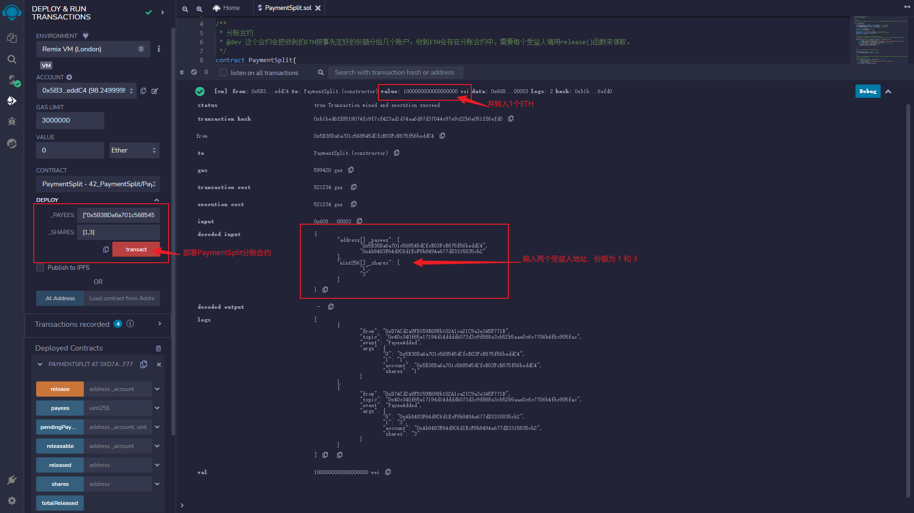
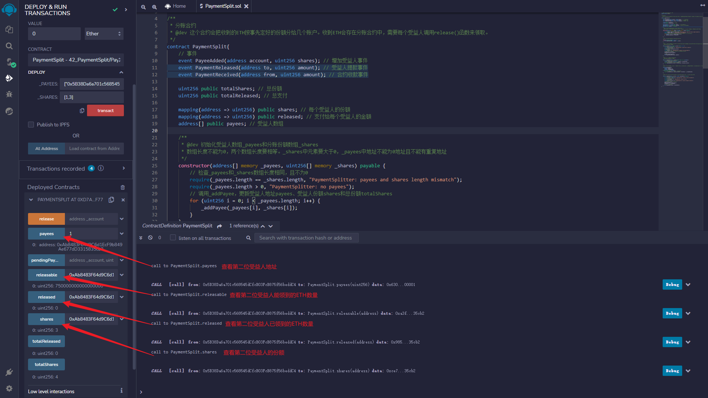
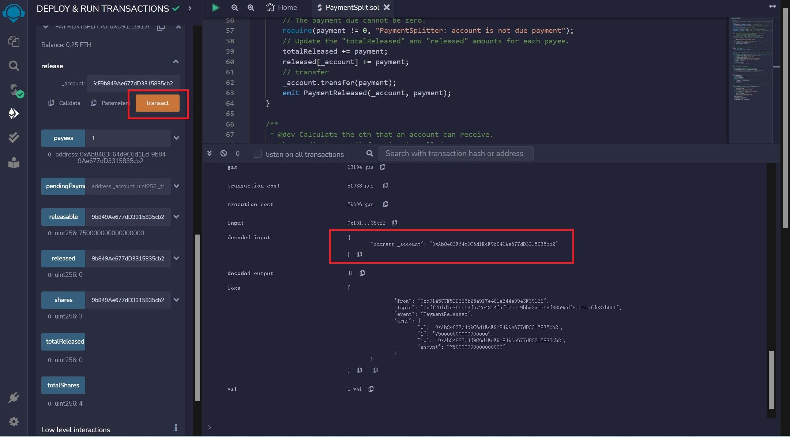
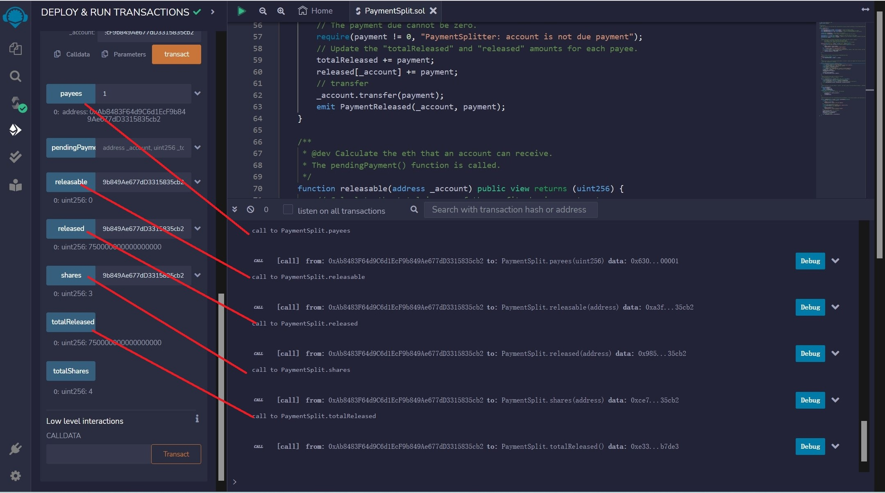

# WTF Solidity Crash Course: 42. Payment Splitting

I have been relearning solidity recently to solidify some of the details and to create a "WTF Solidity Crash Course" for beginners (advanced programmers can seek other tutorials). New lectures will be updated every week, ranging from 1 to 3.

Twitter: [@0xAA_Science](https://twitter.com/0xAA_Science)

Discord: [WTF Academy](https://discord.gg/5akcruXrsk)

All codes and tutorials are open-sourced on Github: [github.com/AmazingAng/WTFSolidity](https://github.com/AmazingAng/WTFSolidity)

---

In this lecture, we'll introduce the payment splitting contract, which allows the transfer of `ETH` to a group of accounts according to their respective weights for payment splitting purposes. The code section is a simplification of the PaymentSplitter contract provided by the OpenZeppelin library, which can be found on [Github](https://github.com/OpenZeppelin/openzeppelin-contracts/blob/master/contracts/finance/PaymentSplitter.sol).

## Payment Split

Payment split is the act of dividing money according to a certain ratio. In real life, it is common to encounter situations where the spoils are not divided equally. However, in the world of blockchain, `Code is Law`, we can write the proportion that each person should get in the smart contract in advance, and let the smart contract handle the split of income.


## Payment Split Contract

The Payment Split contract (`PaymentSplit`) has the following features:

1. When creating the contract, the beneficiaries `payees` and their share `shares` are predetermined.
2. The shares can be equal or in any other proportions.
3. From all the ETH that the contract receives, each beneficiary is able to withdraw the amount proportional to their allocated share.
4. The Payment Split contract follows the `Pull Payment` pattern, where payments are not automatically transferred to the account, but are kept in the contract. Beneficiaries trigger the actual transfer by calling the `release()` function.

```solidity
// SPDX-License-Identifier: MIT
pragma solidity ^0.8.4;

/**
 * PaymentSplit
 * @dev This contract will distribute the received ETH to several accounts according to the pre-determined share.Received ETH will be stored in PaymentSplit, and each beneficiary needs to call the release() function to claim it.
 */
contract PaymentSplit {
```

### Events

There are a total of `3` events in the Splitter Contract:

- `PayeeAdded`: Event for adding a payee.
- `PaymentReleased`: Event for payee withdrawing funds.
- `PaymentReceived`: Event for Splitter Contract receiving funds.

```solidity
    // event
    event PayeeAdded(address account, uint256 shares); // Event for adding a payee
    event PaymentReleased(address to, uint256 amount); // Event for releasing payment to a payee
    event PaymentReceived(address from, uint256 amount); // Event for receiving payment to the contract
```

### State Variables

There are `5` state variables in the revenue splitting contract, used to record beneficiary addresses, shares, and paid out `ETH`:

- `totalShares`: Total shares, which is the sum of `shares`.
- `totalReleased`: The amount of `ETH` paid out from the revenue splitting contract to beneficiaries, which is the sum of `released`.
- `payees`: An `address` array that records the addresses of beneficiaries.
- `shares`: An `address` to `uint256` mapping that records the shares of each beneficiary.
- `released`: An `address` to `uint256` mapping that records the amount paid to each beneficiary by the revenue splitting contract.

```solidity
    uint256 public totalShares; // Total shares of the contract
    uint256 public totalReleased; // Total amount of payments released from the contract

    mapping(address => uint256) public shares; // Mapping to store the shares of each payee
    mapping(address => uint256) public released; // Mapping to store the amount of payments released to each payee
    address[] public payees; // Array  of payees
```

### Functions

There are `6` functions in the revenue sharing contract:

- Constructor: initializes the beneficiary array `_payees` and the revenue sharing array `_shares`, where the length of both arrays must not be 0 and their lengths must be equal. Elements of the \_shares array must be greater than 0, and the addresses in the \_payees array can't be the zero address and can't have a duplicate address.
- `receive()`: callback function, releases the `PaymentReceived` event when the revenue sharing contract receives `ETH`.
- `release()`: revenue sharing function, distributes the corresponding `ETH` to the valid beneficiary address `_account`. Anyone can trigger this function, but the `ETH` will be transferred to the beneficiary address `_account`. Calls the releasable() function.
- `releasable()`: calculates the amount of `ETH` that a beneficiary address should receive. Calls the `pendingPayment()` function.
- `pendingPayment()`: calculates the amount of `ETH` that the beneficiary should receive based on their address `_account`, the revenue sharing contract's total income `_totalReceived`, and the money they have already received `_alreadyReleased`.
- `_addPayee()`: function to add a new beneficiary and their sharing percentage. It is called during the initialization of the contract and cannot be modified afterwards.

```solidity

    /**
     * @dev Constructor to initialize the payees array (_payees) and their shares (_shares).
     *      The length of both arrays cannot be 0 and must be equal.
            Each element in the _shares array must be greater than 0,
            and each address in _payees must not be a zero address and must be unique.
     */
    constructor(address[] memory _payees, uint256[] memory _shares) payable {
        // Check that the length of _payees and _shares arrays are equal and not empty
        require(
            _payees.length == _shares.length,
            "PaymentSplitter: payees and shares length mismatch"
        );
        require(_payees.length > 0, "PaymentSplitter: no payees");
        //  Call the _addPayee function to update the payees addresses (payees), their shares (shares), and the total shares (totalShares)
        for (uint256 i = 0; i < _payees.length; i++) {
            _addPayee(_payees[i], _shares[i]);
        }
    }

    /**
     * @dev Callback function, receive ETH emit PaymentReceived event
     */
    receive() external payable virtual {
        emit PaymentReceived(msg.sender, msg.value);
    }

    /**
     * @dev Splits funds to the designated payee address "_account". Anyone can trigger this function, but the funds will be transferred to the "_account" address.
     * Calls the "releasable()" function.
     */
    function release(address payable _account) public virtual {
        // The "_account" address must be a valid payee.
        require(shares[_account] > 0, "PaymentSplitter: account has no shares");
        // Calculate the payment due to the "_account" address.
        uint256 payment = releasable(_account);
        // The payment due cannot be zero.
        require(payment != 0, "PaymentSplitter: account is not due payment");
        // Update the "totalReleased" and "released" amounts for each payee.
        totalReleased += payment;
        released[_account] += payment;
        // transfer
        _account.transfer(payment);
        emit PaymentReleased(_account, payment);
    }

    /**
     * @dev Calculate the eth that an account can receive.
     * The pendingPayment() function is called.
     */
    function releasable(address _account) public view returns (uint256) {
        // Calculate the total income of the profit-sharing contract
        uint256 totalReceived = address(this).balance + totalReleased;
        // Call _pendingPayment to calculate the amount of ETH that account is entitled to
        return pendingPayment(_account, totalReceived, released[_account]);
    }

    /**
     * @dev According to the payee address `_account`, the total income of the distribution contract `_totalReceived` and the money received by the address `_alreadyReleased`, calculate the `ETH` that the payee should now distribute.
     */
    function pendingPayment(
        address _account,
        uint256 _totalReceived,
        uint256 _alreadyReleased
    ) public view returns (uint256) {
        // ETH due to account = Total ETH due - ETH received
        return
            (_totalReceived * shares[_account]) /
            totalShares -
            _alreadyReleased;
    }

    /**
     * @dev Add payee_account and corresponding share_accountShares. It can only be called in the constructor and cannot be modified.
     */
    function _addPayee(address _account, uint256 _accountShares) private {
        // Check that _account is not 0 address
        require(
            _account != address(0),
            "PaymentSplitter: account is the zero address"
        );
        // Check that _accountShares is not 0
        require(_accountShares > 0, "PaymentSplitter: shares are 0");
        // Check that _account is not duplicated
        require(
            shares[_account] == 0,
            "PaymentSplitter: account already has shares"
        );
        // Update payees, shares and totalShares
        payees.push(_account);
        shares[_account] = _accountShares;
        totalShares += _accountShares;
        // emit add payee event
        emit PayeeAdded(_account, _accountShares);
    }
}
```

## Remix Demo

### 1. Deploy the `PaymentSplit` contract and transfer `1 ETH`

In the constructor, enter two beneficiary addresses with shares of `1` and `3`.



### 2. View beneficiary addresses, shares, and `ETH` to be distributed




### 3. Call `release` function to claim `ETH`



### 4. View overall expenses, beneficiary balances, and changes in `ETH` to be distributed



## Summary

In this lecture, we introduced the revenue sharing contract. In the world of blockchain, `Code is Law`, we can write the proportion that each person should receive in the smart contract beforehand. After receiving revenue, the smart contract will handle revenue sharing to avoid the issue of "unequal distribution of shares" afterwards.
