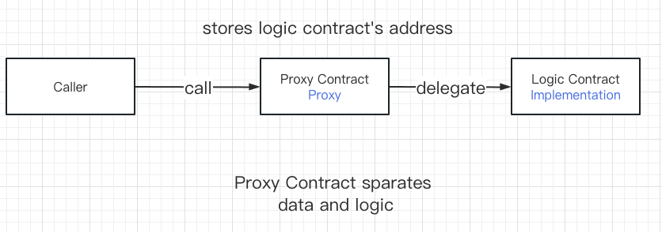
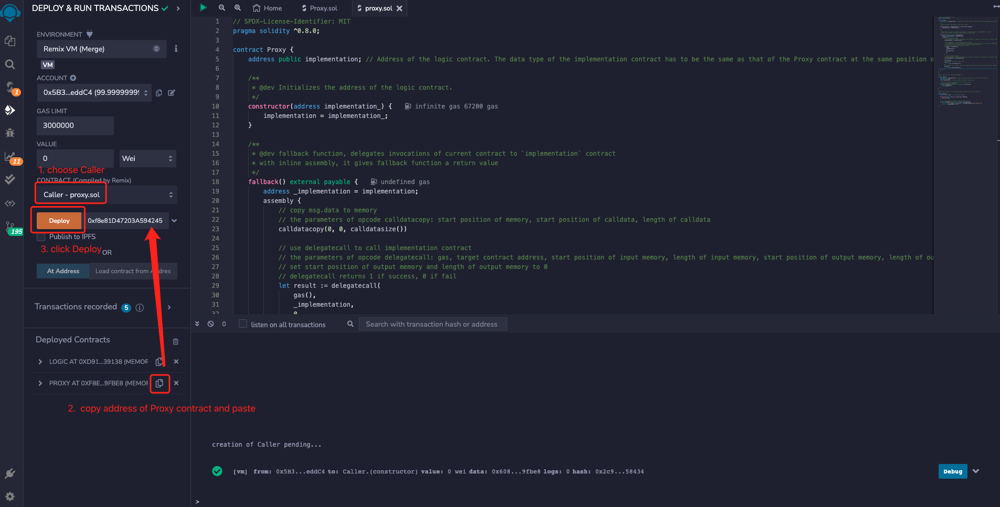

# WTF Solidity Quick Start: 46. Proxy Contract

Recently, I have been re-learning Solidity to review the details and write a "WTF Solidity Quick Start" for beginners to use (programmer gurus can find other tutorials). The tutorial will be updated with 1-3 lectures per week. 

Twitter: [@0xAA_Science](https://twitter.com/0xAA_Science)

Community: [Discord](https://discord.gg/5akcruXrsk) ｜ [WeChat group](https://docs.google.com/forms/d/e/1FAIpQLSe4KGT8Sh6sJ7hedQRuIYirOoZK_85miz3dw7vA1-YjodgJ-A/viewform?usp=sf_link) ｜ [Official website wtf.academy](https://wtf.academy)

All code and tutorials are open source on GitHub: [github.com/AmazingAng/WTFSolidity](https://github.com/AmazingAng/WTFSolidity)

-----

In this lesson, we introduce the Proxy Contract. The teaching code is simplified from the OpenZeppelin Proxy contract.

## Proxy Pattern

After the `Solidity` contract is deployed on the chain, the code is immutable. There are advantages and disadvantages:

- Advantages: it is secure and users know what will happen (most of the time).
- Disadvantages: even if there are bugs in the contract, it cannot be modified or upgraded, and only a new contract can be deployed. However, the address of the new contract is different from the old one, and the contract's data also requires a lot of gas to migrate.

Is there a way to modify or upgrade the contract after it is deployed? The answer is YES, and that is the **Proxy Pattern**.



The proxy pattern separates contract data and logic, and saves them in different contracts. Taking the simple proxy contract in the above figure as an example, the data (state variable) is stored in the proxy contract, and the logic (function) is stored in another logic contract. The proxy contract (Proxy) delegates the function call to the logic contract (Implementation) through `delegatecall`, and then returns the final result to the caller(Caller).

The proxy pattern has two main benefits:
1. Upgradeable: When we need to upgrade the logic of the contract, we only need to point the proxy contract to a new logic contract.
2. Gas saving: If multiple contracts reuse a set of logic, we only need to deploy one logic contract, and then deploy multiple proxy contracts that only save data and point to the logic contract.

**Tip**: If you are not familiar with `delegatecall`, you can refer to this tutorial [Lesson 23 Delegatecall](https://github.com/AmazingAng/WTFSolidity/tree/main/Languages/en/23_Delegatecall_en).

## Proxy Contract

Here, we introduce a simple proxy contract that is simplified from OpenZeppelin's [Proxy contract](https://github.com/OpenZeppelin/openzeppelin-contracts/blob/master/contracts/proxy/Proxy.sol). It consists of three parts: the proxy contract `Proxy`, the logic contract `Logic`, and a calling example `Caller`. Its logic is not complicated:

- Firstly, deploy the logic contract `Logic`.
- Create the proxy contract `Proxy`, and the state variable `implementation` records the address of the `Logic` contract.
- The `Proxy` contract delegates all calls to the `Logic` contract using the fallback function.
- Finally, deploy the calling example `Caller` contract and call the `Proxy` contract.
- **Note**: the state variable storage structure of the `Logic` contract and the `Proxy` contract is the same, otherwise `delegatecall` will cause unexpected behavior and pose security risks.

### Proxy Contract `Proxy`

The `Proxy` contract is not long, but it uses inline assembly, so it may be difficult to understand. It has only one state variable, one constructor, and one fallback function. The state variable `implementation` is initialized in the constructor and is used to save the address of the `Logic` contract.

```solidity
contract Proxy {
    address public implementation; // Address of the logic contract. The data type of the implementation contract has to be the same as that of the Proxy contract at the same position or an error will occur.

    /**
     * @dev Initializes the address of the logic contract.
     */
    constructor(address implementation_){
        implementation = implementation_;
    }
}
```

The fallback function of `Proxy` delegates external calls to the `Logic` contract. This fallback function is unique, it uses inline assembly to give a return value to a function that was previously unable to do so. The inline assembly code utilizes the following operations:

- `calldatacopy(t, f, s)`: copies `s` bytes of calldata (input data) starting at position `f` to memory (`mem`) position `t`.
- `delegatecall(g, a, in, insize, out, outsize)`: calls the contract at address `a`, using `mem[in..(in+insize))` as input and returning results in `mem[out..(out+outsize))`, providing `g`wei of gas. This operation returns `1` on success and `0` on error.
- `returndatacopy(t, f, s)`: copies `s` bytes of returndata (output data) starting at position `f` to memory (`mem`) position `t`.
- `switch`: a basic version of `if/else` that returns different values depending on the cases. It can have a default case as well.
- `return(p,s)`: terminates execution of the function and returns data `mem[p..(p+s))`.
- `revert(p, s)`: terminates execution of the function, rolls back the state and returns data `mem[p..(p+s))`.

```solidity
/**
* @dev fallback function, delegates invocations of current contract to `implementation` contract
* with inline assembly, it gives fallback function a return value
*/
fallback() external payable {
    address _implementation = implementation;
    assembly {
        // copy msg.data to memory
        // the parameters of opcode calldatacopy: start position of memory, start position of calldata, length of calldata
        calldatacopy(0, 0, calldatasize())

        // use delegatecall to call implementation contract
        // the parameters of opcode delegatecall: gas, target contract address, start position of input memory, length of input memory, start position of output memory, length of output memory
        // set start position of output memory and length of output memory to 0
        // delegatecall returns 1 if success, 0 if fail
        let result := delegatecall(gas(), _implementation, 0, calldatasize(), 0, 0)
        
        // copy returndata to memory
        // the parameters of opcode returndata: start position of memory, start position of returndata, length of retundata
        returndatacopy(0, 0, returndatasize())

        switch result
        // if delegate call fails, then revert
        case 0 {
            revert(0, returndatasize())
        }

        // if delegate call succeeds, then return memory data(as bytes format) starting from 0 with length of returndatasize()
        default {
            return(0, returndatasize())
        }
    }
}
```

### Logic Contract

This is a very simple logic contract designed to demonstrate a proxy contract. It contains two variables, one event and one function:

- `implementation`: A placeholder variable that keeps consistency with the `Proxy` contract to prevent slot conflicts.
- `x`: A `uint` variable that is set to `99`.
- `CallSuccess` event: Released upon successful invocation. 
- `increment()` function: Called by the `Proxy` contract, releases the `CallSuccess` event, and returns a `uint` whose selector is `0xd09de08a`. Directly calling `increment()` will return `100`, but calling it through `Proxy` will return `1`. Can you guess why?

```solidity
/**
 * @dev Logic contract, executes delegated calls
 */
contract Logic {
    address public implementation; // Keep consistency with the Proxy to prevent slot collision
    uint public x = 99;
    event CallSuccess(); // Event emitted on successful function call

    // This function emits CallSuccess event and returns a uint
    // Function selector: 0xd09de08a
    function increment() external returns(uint) {
        emit CallSuccess();
        return x + 1;
    }
}
```

### Caller contract

The `Caller` contract demonstrates how to call a proxy contract, it's very simple. However, to understand it, you need to first learn about [Lesson 22: Call](https://github.com/AmazingAng/WTFSolidity/tree/main/Languages/en/22_Call_en/readme.md) and [Lesson 27: ABI encoding](https://github.com/AmazingAng/WTFSolidity/tree/main/Languages/en/27_ABIEncode_en/readme.md) in this tutorial.

There are 1 variable and 2 functions:
- `proxy`: a state variable that records the proxy contract address.
- Constructor: initializes the `proxy` variable when the contract is deployed.
- `increase()`: calls the proxy contract's `increment()` function using `call` and returns a `uint`. When calling, we use `abi.encodeWithSignature()` to obtain the `selector` of the `increment()` function. When returning, `abi.decode()` is used to decode the return value as a `uint` type.

```solidity
/**
 * @dev Caller contract, call the proxy contract and get the result of execution
 */
contract Caller{
    address public proxy; // proxy contract address

    constructor(address proxy_){
        proxy = proxy_;
    }

    // Call the increment() function using the proxy contract
    function increment() external returns(uint) {
        ( , bytes memory data) = proxy.call(abi.encodeWithSignature("increment()"));
        return abi.decode(data,(uint));
    }
}
```

## `Remix` Demo

1. Deploy the `Logic` contract.


2. Call the `increment()` function of the `Logic` contract, which returns `100`.


3. Deploy the `Proxy` contract and fill in the address of the `Logic` contract during initialization.


4. Call the `increment()` function of the `Proxy` contract, which has no return value.

   Call method: click on the `Proxy` contract in the `Remix` deployment panel, fill in the selector of the `increment()` function `0xd09de08a` in the `Low level interaction` at the bottom, and click `Transact`.


5. Deploy the `Caller` contract and fill in the `Proxy` contract address during initialization. 


6. Call the `increment()` function of the `Caller` contract and return `1`. 


### Summary

In this lesson, we introduced the proxy pattern and simple proxy contracts. The proxy contract uses `delegatecall` to delegate function calls to another logic contract, allowing data and logic to be responsible for different contracts. In addition, it uses inline assembly magic to allow fallback functions without return values to return data. 

The question we left for everyone earlier was: why does a call to `increment()` through Proxy return 1? According to what we said in [Lesson 23: Delegatecall](https://github.com/AmazingAng/WTF-Solidity/tree/main/Languages/en/23_Delegatecall_en), when the Caller contract `delegatecall`s the Logic contract through the Proxy contract, if the Logic contract function changes or reads some state variables, it will operate on the corresponding variables of the Proxy, and the value of the `x` variable of the Proxy contract here is 0 (because `x` has never been set, i.e. the value at the corresponding position of the storage area of the Proxy contract is 0), so calling `increment()` through Proxy will return 1.

In the next lesson, we will introduce upgradeable proxy contracts.

Although the proxy contract is very powerful, it is prone to bugs. When using it, you'd better directly copy the template contract from [OpenZeppelin](https://github.com/OpenZeppelin/openzeppelin-contracts/tree/master/contracts/proxy).