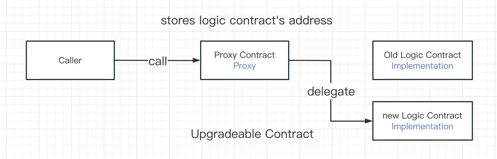
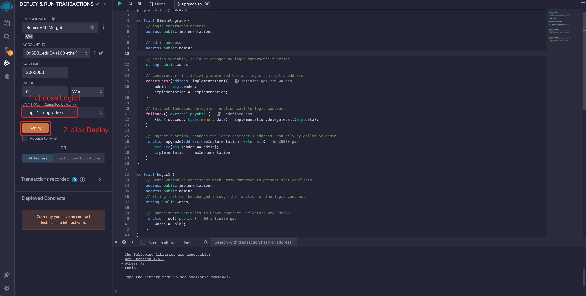
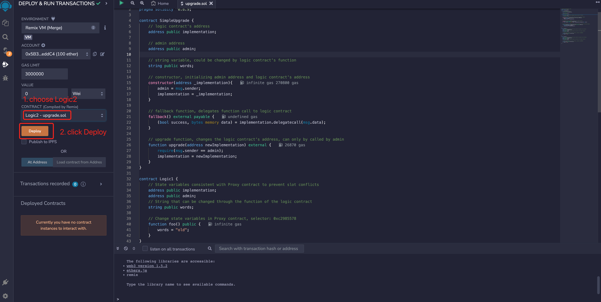

# WTF Solidity Crash Course: 47. Upgradeable Contract

I have recently been revising Solidity to consolidate the details, and am writing a "WTF Simplified Introduction to Solidity" for beginners to use (programming experts can find other tutorials), with weekly updates of 1-3 lectures.

Twitter: [@0xAA_Science](https://twitter.com/0xAA_Science)

Community: [Discord](https://discord.gg/5akcruXrsk)｜[WeChat group](https://docs.google.com/forms/d/e/1FAIpQLSe4KGT8Sh6sJ7hedQRuIYirOoZK_85miz3dw7vA1-YjodgJ-A/viewform?usp=sf_link)｜[Official website wtf.academy](https://wtf.academy)

All code and tutorials are open source on GitHub: [github.com/AmazingAng/WTFSolidity](https://github.com/AmazingAng/WTFSolidity)

-----

in this lesson, we'll introduce Upgradeable Contract, the sample contracts used for teaching are simplified from `OpenZeppelin` contracts, they may pose security issues, DO NOT USE IN PRODUCTION.

## Upgradeable Contract

If you understand proxy contracts, it is easy to understand upgradeable contracts. It is a proxy contract that can change the logic contract.



## Simple Implementation

Below we implement a simple upgradeable contract that includes 3 contracts: the proxy contract, the old logic contract, and the new logic contract.

### Proxy Contract

This proxy contract is simpler than that in [Lecture 46](https://github.com/AmazingAng/WTFSolidity/blob/main/Languages/en/46_ProxyContract_en/readme.md). We didn't use inline assembly in its `fallback()` function, but only used `implementation.delegatecall(msg.data);`. Therefore, the callback function does not return a value, but it is sufficient for teaching purposes.

It contains 3 variables:
- `implementation`: The logic contract address.
- `admin`: Admin address.
- `words`: String that can be changed through a function in the logic contract.

It contains `3` functions:

- Constructor: Initializes admin and logic contract addresses.
- `fallback()`: Callback function, delegates the call to the logic contract.
- `upgrade()`: The upgrade function, changes the logic contract's address, and can only be called by `admin`.

```solidity
// SPDX-License-Identifier: MIT
// wtf.academy
pragma solidity ^0.8.4;

// simple upgradeable contract, the admin could change the logic contract's address by calling the upgrade function, thus changing the contract logic
// FOR TEACHING PURPOSE ONLY, DO NOT USE IN PRODUCTION
contract SimpleUpgrade {
    // logic contract's address
    address public implementation; 

    // admin address
    address public admin;

    // string variable, could be changed by the logic contract's function
    string public words; 

    // constructor, initializing admin address and logic contract's address
    constructor(address _implementation){
        admin = msg.sender;
        implementation = _implementation;
    }

    // fallback function, delegates function call to logic contract
    fallback() external payable {
        (bool success, bytes memory data) = implementation.delegatecall(msg.data);
    }

    // upgrade function, changes the logic contract's address, can only be called by admin
    function upgrade(address newImplementation) external {
        require(msg.sender == admin);
        implementation = newImplementation;
    }
}
```

### Old Logic Contract

This logic contract includes `3` state variables and is consistent with the proxy contract to prevent slot conflicts. It only has one function `foo()`, which changes the value of `words` in the proxy contract to `"old"`.

```solidity
// Logic contract 1
contract Logic1 {
    // State variables consistent with Proxy contract to prevent slot conflicts
    address public implementation; 
    address public admin;
    // String that can be changed through the function of the logic contract  
    string public words; 

    // Change state variables in Proxy contract, selector: 0xc2985578
    function foo() public {
        words = "old";
    }
}
```

### New Logic Contract

This logic contract contains `3` state variables, consistent with the proxy contract to prevent slot conflicts. It has only one function, `foo()`, which changes the value of `words` in the proxy contract to `"new"`.

```solidity
// Logic Contract 2
contract Logic2 {
    // State variables consistent with a proxy contract to prevent slot collisions
    address public implementation; 
    address public admin;
    // String that can be changed through the function of the logic contract  
    string public words; 

    // Change state variables in Proxy contract, selector: 0xc2985578
    function foo() public{
        words = "new";
    }
}
```

## Implementation with `Remix`

1. Deploy the old and new logic contracts `Logic1` and `Logic2`.



2. Deploy the upgradeable contract `SimpleUpgrade` and set the `implementation` address to the address of the old logic contract.


3. Use the selector `0xc2985578` to call the `foo()` function of the old logic contract `Logic1` in the proxy contract and change the value of `words` to `"old"`.


4. Call `upgrade()` to set the `implementation` address to the address of the new logic contract `Logic2`.


5. Use the selector `0xc2985578` to call the `foo()` function of the new logic contract `Logic2` in the proxy contract and change the value of `words` to `"new"`.


## Summary

In this lesson, we introduced a simple upgradeable contract. It is a proxy contract that can change the logic contract and add upgrade functionality to immutable smart contracts. However, this contract has a problem of selector conflict and poses security risks. Later, we will introduce the upgradeable contract standards that solve this vulnerability: Transparent Proxy and UUPS.
