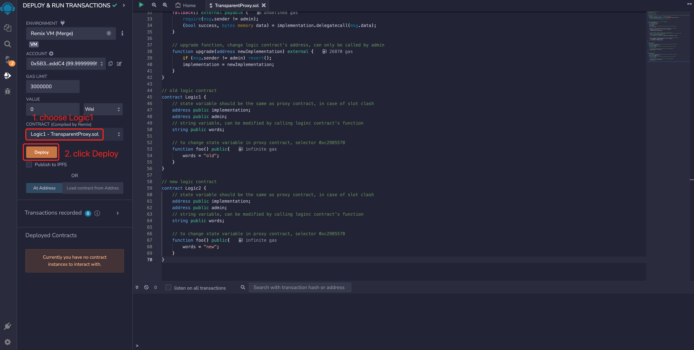
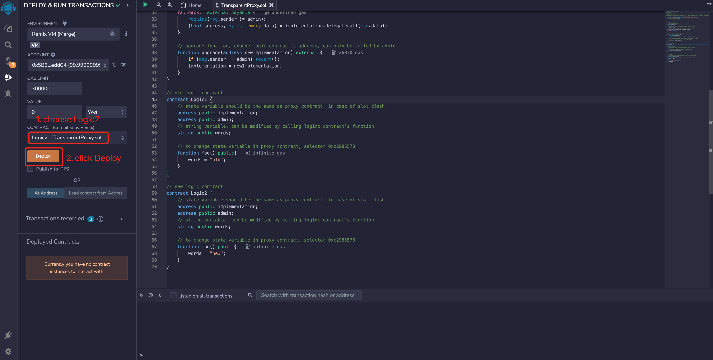
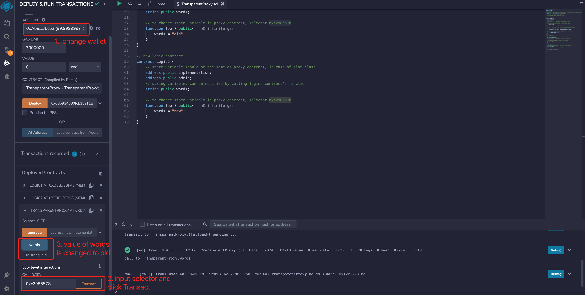
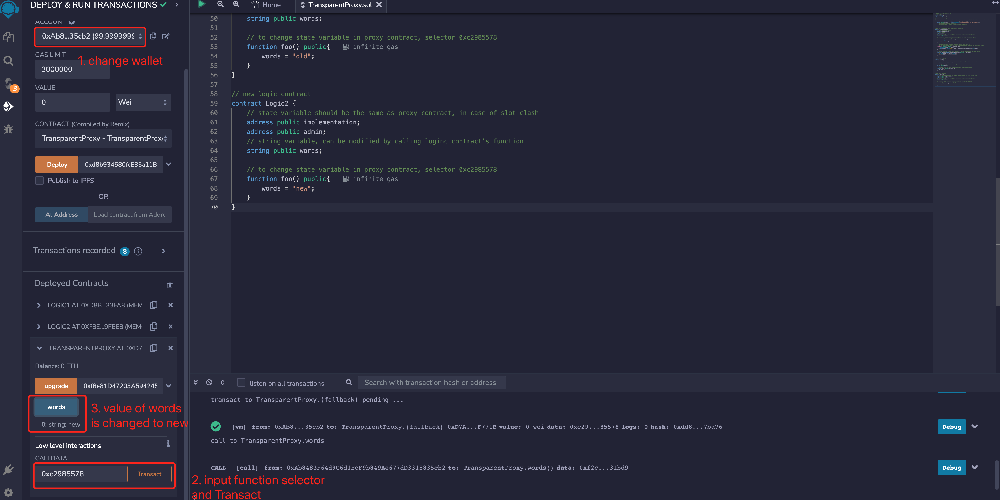

# WTF Solidity Crash Course: 48. Transparent Proxy

I've been relearning Solidity lately to solidify some details and create a "WTF Solidity Crash Course" for beginners (advanced programmers might want to look for other tutorials). I'll be updating with 1-3 lessons per week.

Twitter: [@0xAA_Science](https://twitter.com/0xAA_Science)

Community: [Discord](https://discord.gg/5akcruXrsk) | [WeChat group](https://docs.google.com/forms/d/e/1FAIpQLSe4KGT8Sh6sJ7hedQRuIYirOoZK_85miz3dw7vA1-YjodgJ-A/viewform?usp=sf_link) | [Official website wtf.academy](https://wtf.academy)

All code and tutorials are open source on GitHub: [github.com/AmazingAng/WTFSolidity](https://github.com/AmazingAng/WTFSolidity)

-----

In this lesson, we will introduce the selector clash issue in proxy contracts, and the solution to this problem: transparent proxies. The teaching code is simplified from `OpenZeppelin's` [TransparentUpgradeableProxy](https://github.com/OpenZeppelin/openzeppelin-contracts/blob/master/contracts/proxy/transparent/TransparentUpgradeableProxy.sol) and should not be applied in production.

## Selector Clash

In smart contracts, a function selector is the hash of a function signature's first 4 bytes. For example, the selector of function `mint(address account)` is `bytes4(keccak256("mint(address)"))`, which is `0x6a627842`. More about function selectors see [WTF Solidity Tutorial #29: Function Selectors](https://github.com/AmazingAng/WTFSolidity/blob/main/29_Selector/readme.md).

Because a function selector has only 4 bytes, its range is very small. Therefore, two different functions may have the same selector, such as the following two functions:

```solidity
// 选择器冲突的例子
contract Foo {
    function burn(uint256) external {}
    function collate_propagate_storage(bytes16) external {}
}
```

In the example, both the `burn()` and `collate_propagate_storage()` functions have the selector `0x42966c68`, which is the same. This situation is called "selector conflict". In this case, the EVM cannot differentiate which function the user is calling based on the function selector, so the contract cannot be compiled.

Since the proxy contract and the logic contract are two separate contracts, they can be compiled normally even if there is a "selector conflict" between them, which may lead to serious security accidents. For example, if the selector of the `a` function in the logic contract is the same as the upgrade function in the proxy contract, the administrator will upgrade the proxy contract to a black hole contract when calling the `a` function, which is a disastrous consequence.

Currently, there are two upgradeable contract standards that solve this problem: Transparent Proxy and Universal Upgradeable Proxy System (UUPS).

## Transparent Proxy

The logic of the transparent proxy is very simple: administrators may mistakenly call the upgradable functions of the proxy contract when calling the functions of the logic contract because of the "selector conflict". Restricting the administrator's privileges can solve the conflict:

- The administrator becomes a tool person and can only upgrade the contract by calling the upgradable function of the proxy contract, without calling the callback function to call the logic contract.
- Other users cannot call upgradable functions, but can call functions of the logic contract.

### Proxy Contract

The proxy contract here is very similar to the one in Lecture 47, except that the `fallback()` function restricts the call by the administrator address.

It contains three variables:

- `implementation`: The address of the logic contract.
- `admin`: The admin address.
- `words`: A string that can be changed by calling functions in the logic contract.

It contains `3` functions:

- Constructor: Initializes the admin and logic contract addresses.
- `fallback()`: A callback function that delegates the call to the logic contract and cannot be called by the `admin`.
- `upgrade()`: An upgrade function that changes the logic contract address and can only be called by the `admin`.

```solidity
// 透明可升级合约的教学代码，不要用于生产。
contract TransparentProxy {
    address implementation; // logic合约地址
    address admin; // 管理员
    string public words; // 字符串，可以通过逻辑合约的函数改变

    // 构造函数，初始化admin和逻辑合约地址
    constructor(address _implementation){
        admin = msg.sender;
        implementation = _implementation;
    }

    // fallback函数，将调用委托给逻辑合约
    // 不能被admin调用，避免选择器冲突引发意外
    fallback() external payable {
        require(msg.sender != admin);
        (bool success, bytes memory data) = implementation.delegatecall(msg.data);
    }

    // 升级函数，改变逻辑合约地址，只能由admin调用
    function upgrade(address newImplementation) external {
        if (msg.sender != admin) revert();
        implementation = newImplementation;
    }
}
```

### Logic Contract

The new and old logic contracts here are the same as in [Lesson 47](https://github.com/AmazingAng/WTFSolidity/blob/main/47_Upgrade/readme.md). The logic contracts contain `3` state variables, consistent with the proxy contract to prevent slot conflicts. It also contains a function `foo()`, where the old logic contract will change the value of `words` to `"old"`, and the new one will change it to `"new"`.

```solidity
// 旧逻辑合约
contract Logic1 {
    // 状态变量和proxy合约一致，防止插槽冲突
    address public implementation; 
    address public admin; 
    string public words; // 字符串，可以通过逻辑合约的函数改变

    // 改变proxy中状态变量，选择器： 0xc2985578
    function foo() public{
        words = "old";
    }
}

// 新逻辑合约
contract Logic2 {
    // 状态变量和proxy合约一致，防止插槽冲突
    address public implementation; 
    address public admin; 
    string public words; // 字符串，可以通过逻辑合约的函数改变

    // 改变proxy中状态变量，选择器：0xc2985578
    function foo() public{
        words = "new";
    }
}
```

## Implementation with `Remix`

1. Deploy new and old logic contracts `Logic1` and `Logic2`.



2. Deploy a transparent proxy contract `TransparentProxy`, and set the `implementation` address to the address of the old logic contract.


3. Using the selector `0xc2985578`, call the `foo()` function of the old logic contract `Logic1` in the proxy contract. The call will fail because only the administrator can call the logic contract.


4. Switch to a new wallet, use the selector `0xc2985578` to call the `foo()` function of the old logic contract `Logic1` in the proxy contract, and change the value of `words` to `"old"`. The call will be successful.


5. Switch back to the administrator wallet and call `upgrade()`, setting the `implementation` address to the new logic contract `Logic2`.


6. Switch to the new wallet, use the selector `0xc2985578` to call the `foo()` function of the new logic contract `Logic2` in the proxy contract, and change the value of `words` to `"new"`.


## Summary

In this lecture, we introduced the "selector conflict" in proxy contracts and how to avoid this problem using transparent proxies. The logic of transparent proxies is simple, solving the "selector conflict" problem by restricting the administrator's access to the logic contract. However, it has a drawback that every time a user calls a function, there is an additional check for whether or not the caller is the administrator, which consumes more gas. Nevertheless, transparent proxies are still the solution chosen by most project teams.

In the next lecture, we will introduce the Generic Universal Upgradeable Proxy Standard (UUPS), which is more complex but consumes less gas.