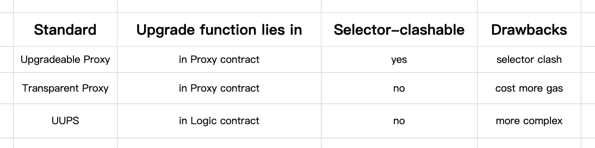
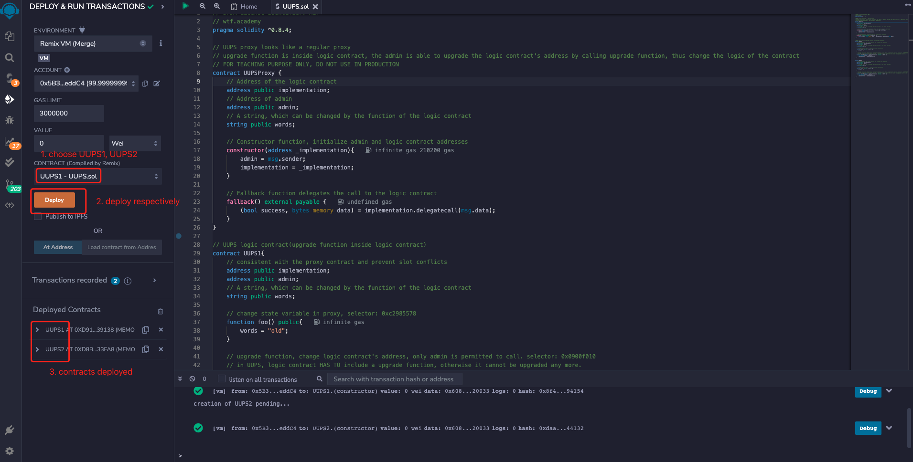
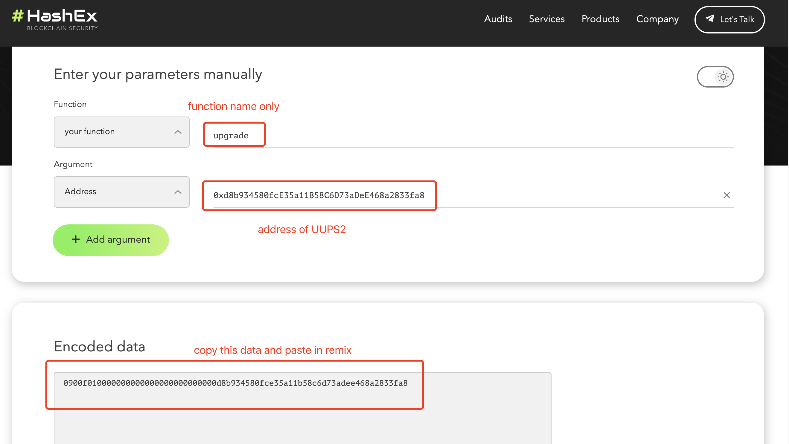

# WTF Solidity Crash Course: 49. UUPS

I am currently relearning Solidity to solidify some of the details and create a "WTF Solidity Crash Course" for beginners (advanced programmers may want to find another tutorial). I will update 1-3 lessons weekly.

Twitter: [@0xAA_Science](https://twitter.com/0xAA_Science)

Community: [Discord](https://discord.gg/5akcruXrsk)｜[WeChat Group](https://docs.google.com/forms/d/e/1FAIpQLSe4KGT8Sh6sJ7hedQRuIYirOoZK_85miz3dw7vA1-YjodgJ-A/viewform?usp=sf_link)｜[Official website wtf.academy](https://wtf.academy)

All code and tutorials are open source on Github: [github.com/AmazingAng/WTFSolidity](https://github.com/AmazingAng/WTFSolidity)

-----

In this lesson, we will introduce another solution to the selector clash problem in proxy contracts: the Universal Upgradeable Proxy Standard (UUPS). The teaching code is simplified from `UUPSUpgradeable` provided by `OpenZeppelin` and should NOT BE USED IN PRODUCTION.

## UUPS

In the previous lesson, we learned about "selector clash", which refers to the presence of two functions with the same selector in a contract, which can cause serious consequences. As an alternative to transparent proxies, UUPS can also solve this problem.

UUPS (Universal Upgradeable Proxy Standard) puts the upgrade function in the logic contract. This way, if there is a "selector clash" between the upgrade function and other functions, an error will occur during compilation.

The following table summarizes the differences between regular upgradeable contracts, transparent proxies, and UUPS:



## UUPS contract

First, let's review [WTF Solidity Minimalist Tutorial Lesson 23: Delegatecall](https://github.com/AmazingAng/WTFSolidity/blob/main/Languages/en/23_Delegatecall_en/readme.md). If user A `delegatecall`s contract C (logic contract) through contract B (proxy contract), the context is still the context of contract B, and `msg.sender` is still user A rather than contract B. Therefore, the UUPS contract can place the upgrade function in the logical contract and check whether the caller is an admin.


### UUPS proxy contract

The UUPS proxy contract looks like an un-upgradable proxy contract and is very simple because the upgrade function is placed in the logic contract. It contains three variables:

- `implementation`: address of the logic contract.
- `admin`: address of the admin.
- `words`: a string that can be changed by functions in the logic contract.

It contains `2` functions:
- Constructor: initializes the admin and logic contract address.
- `fallback()`: a callback function that delegates the call to the logic contract.

```solidity
contract UUPSProxy {
    // Address of the logic contract
    address public implementation; 
    // Address of admin
    address public admin;
    // A string, which can be changed by the function of the logic contract 
    string public words; 

    // Constructor function, initialize admin and logic contract addresses
    constructor(address _implementation){
        admin = msg.sender;
        implementation = _implementation;
    }

    // Fallback function delegates the call to the logic contract
    fallback() external payable {
        (bool success, bytes memory data) = implementation.delegatecall(msg.data);
    }
}
```

### UUPS Logic Contract

The UUPS logic contract is different from the one in [Lesson 47](https://github.com/AmazingAng/WTFSolidity/blob/main/Languages/en/47_Upgrade_en/readme.md) in that it includes an upgrade function. The UUPS logic contract contains `3` state variables to be consistent with the proxy contract and prevent slot conflicts. It includes `2` functions: 
- `upgrade()`: an upgrade function that changes the logic contract address `implementation`, which can only be called by the `admin`.
- `foo()`: The old UUPS logic contract will change the value of `words` to `"old"`, and the new one will change it to `"new"`.

```solidity
// UUPS logic contract(upgrade function inside logic contract)
contract UUPS1{
    // consistent with the proxy contract and prevent slot conflicts
    address public implementation; 
    address public admin; 
    // A string, which can be changed by the function of the logic contract 
    string public words;

    // change state variable in proxy, selector: 0xc2985578
    function foo() public{
        words = "old";
    }

    // upgrade function, change logic contract's address, only admin is permitted to call. selector: 0x0900f010
    // in UUPS, logic contract HAS TO include a upgrade function, otherwise it cannot be upgraded any more.
    function upgrade(address newImplementation) external {
        require(msg.sender == admin);
        implementation = newImplementation;
    }
}

// new UUPS logic contract
contract UUPS2{
    // consistent with the proxy contract and prevent slot conflicts
    address public implementation; 
    address public admin; 
    // A string, which can be changed by the function of the logic contract 
    string public words; 

    // change state variable in proxy, selector: 0xc2985578
    function foo() public{
        words = "new";
    }

    // upgrade function, change logic contract's address, only admin is permitted to call. selector: 0x0900f010
    // in UUPS, logic contract HAS TO include a upgrade function, otherwise it cannot be upgraded any more.。
    function upgrade(address newImplementation) external {
        require(msg.sender == admin);
        implementation = newImplementation;
    }
}
```

## Implementation with `Remix`

1. Deploy the upgradeable implementation contracts `UUPS1` and `UUPS2`.
 


2. Deploy the upgradeable proxy contract `UUPSProxy` and point the `implementation` address to the old logic contract `UUPS1`.


3. Use the selector `0xc2985578` to call the `foo()` function in the proxy contract, which will delegate the call to the old logic contract `UUPS1` and change the value of `words` to `"old"`.


4. Use an online ABI encoder, like [HashEx](https://abi.hashex.org/), to get the binary encoding and call the upgrade function `upgrade()`, which will change the `implementation` address to the new logic contract `UUPS2`.




5. Using the selector `0xc2985578`, call the `foo()` function of the new logic contract `UUPS2` in the proxy contract, and change the value of `words` to `"new"`.


Summary:
In this lesson, we introduced another solution to the "selector clash" in proxy contracts: UUPS. Unlike transparent proxies, UUPS places upgrade functions in the logic contract, making "selector clash" unable to pass compilation. Compared to transparent proxies, UUPS is more gas-efficient but also more complex.
