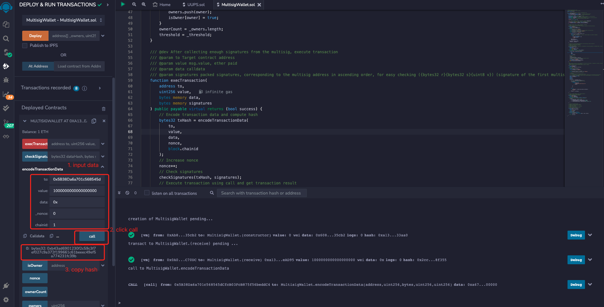

# WTF Solidity Crash Course: 50. Multisignature Wallet

I am currently relearning Solidity to solidify some of the details and create a "WTF Solidity Crash Course" for beginners (advanced programmers may want to find another tutorial). I will update 1-3 lessons weekly.

Twitter: [@0xAA_Science](https://twitter.com/0xAA_Science)

Community: [Discord](https://discord.gg/5akcruXrsk)｜[WeChat Group](https://docs.google.com/forms/d/e/1FAIpQLSe4KGT8Sh6sJ7hedQRuIYirOoZK_85miz3dw7vA1-YjodgJ-A/viewform?usp=sf_link)｜[Official website wtf.academy](https://wtf.academy)

All code and tutorials are open source on Github: [github.com/AmazingAng/WTFSolidity](https://github.com/AmazingAng/WTFSolidity)

-----

Vitalik once said that a multisig wallet is safer than a hardware wallet ([tweet](https://twitter.com/VitalikButerin/status/1558886893995134978?s=20&t=4WyoEWhwHNUtAuABEIlcRw)). In this talk, we'll introduce multisig wallets and write a simple version of a multisig wallet contract. The teaching code (150 lines of code) is simplified from the Gnosis Safe contract (several thousand lines of code).


## Multisig Wallet

A multisig wallet is an electronic wallet where transactions require authorization from multiple private key holders (multisig owners) before they can be executed. For example, if a wallet is managed by three multisig owners, each transaction requires authorization from at least two of them. Multisig wallets can prevent single point failure (loss of private keys, individual misbehavior), have greater decentralized characteristics, and provide increased security. It is used by many DAOs.

Gnosis Safe is the most popular multisig wallet on Ethereum, managing nearly $40 billion in assets. The contract has undergone auditing and practical testing, supports multiple chains (Ethereum, BSC, Polygon, etc.), and provides comprehensive DAPP support. For more information, you can read the [Gnosis Safe tutorial](https://peopledao.mirror.xyz/nFCBXda8B5ZxQVqSbbDOn2frFDpTxNVtdqVBXGIjj0s) I wrote in December 2021.

## Multisig Wallet Contract

A multisig wallet on Ethereum is actually a smart contract, and it is a contract wallet. We'll write a simple version of the MultisigWallet contract, which has a simple logic:

1. Set multisig owners and threshold (on-chain): When deploying a multisig contract, we need to initialize a list of multisig owners and the execution threshold (at least n multisig owners need to sign and authorize a transaction before it can be executed). Gnosis Safe supports adding/removing multisig owners and changing the execution threshold, but we will not consider this feature in our simplified version.

2. Create transactions (off-chain): A transaction waiting for authorization contains the following information:
    - `to`: Target contract.
    - `value`: The amount of Ether sent in the transaction.
    - `data`: Calldata, which contains the function selector and parameters for the function call.

- `nonce`: Initially set to `0`, the value of the nonce increases with each successfully executed transaction of the multisig contract, which can prevent replay attacks.
- `chainid`: The chain id helps prevent replay attacks across different chains.

3. Collect multisig signatures (off-chain): The previous transaction is encoded using ABI and hashed to obtain the transaction hash. Then, the multisig individuals sign it and concatenate the signatures together to obtain the final signed transaction. For those who are not familiar with ABI encoding and hashing, you can refer to the WTF Solidity Primer [Lesson 27](https://github.com/AmazingAng/WTFSolidity/blob/main/27_ABIEncode/readme.md) and [Lesson 28](https://github.com/AmazingAng/WTFSolidity/blob/main/28_Hash/readme.md).

```solidity
Transaction hash: 0xc1b055cf8e78338db21407b425114a2e258b0318879327945b661bfdea570e66

Multisig person A signature: 0xd6a56c718fc16f283512f90e16f2e62f888780a712d15e884e300c51e5b100de2f014ad71bcb6d97946ef0d31346b3b71eb688831abedaf41b33486b416129031c

Multisig person B signature: 0x2184f70a17f14426865bda8ebe391508b8e3984d16ce6d90905ae8beae7d75fd435a7e51d837881d820414ebaf0ff16074204c75b33d66928edcf8dd398249861b

Packaged signatures:
0xd6a56c718fc16f283512f90e16f2e62f888780a712d15e884e300c51e5b100de2f014ad71bcb6d97946ef0d31346b3b71eb688831abedaf41b33486b416129031c2184f70a17f14426865bda8ebe391508b8e3984d16ce6d90905ae8beae7d75fd435a7e51d837881d820414ebaf0ff16074204c75b33d66928edcf8dd398249861b
```

4. Call the execution function of the multi-signature contract, verify the signature and execute the transaction (on-chain). If you are not familiar with verifying signatures and executing transactions, you can refer to the 22nd and 37th lectures of the WTF Solidity Crash Course.

### Events

The `MultisigWallet` contract has two events, `ExecutionSuccess` and `ExecutionFailure`, which are triggered when the transaction is successfully executed or failed, respectively. The parameters are the transaction hash.

```solidity
    event ExecutionSuccess(bytes32 txHash);    // 交易成功事件
    event ExecutionFailure(bytes32 txHash);    // 交易失败事件
```

### State Variables

The `MultisigWallet` contract has five state variables:

1. `owners`: An array of multisig holders.
2. `isOwner`: A mapping from `address` to `bool` which tracks whether an address is a multisig holder.
3. `ownerCount`: The total number of multisig holders.
4. `threshold`: The minimum number of multisig holders required to execute a transaction.
5. `nonce`: Initially set to 0, this variable increments with each successful transaction executed by the multisig contract, which can prevent signature replay attacks.

```solidity
    address[] public owners;                   // 多签持有人数组 
    mapping(address => bool) public isOwner;   // 记录一个地址是否为多签持有人
    uint256 public ownerCount;                 // 多签持有人数量
    uint256 public threshold;                  // 多签执行门槛，交易至少有n个多签人签名才能被执行。
    uint256 public nonce;                      // nonce，防止签名重放攻击
```

### Functions

The `MultisigWallet` contract has `6` functions:

1. Constructor: calls `_setupOwners()` to initialize variables related to multisignature holders and execution thresholds.

    ```solidity
    // 构造函数，初始化owners, isOwner, ownerCount, threshold 
    constructor(        
        address[] memory _owners,
        uint256 _threshold
    ) {
        _setupOwners(_owners, _threshold);
    }
    ```

2. `_setupOwners()`: Called by the constructor during contract deployment to initialize the `owners`, `isOwner`, `ownerCount`, `threshold` state variables. The passed-in parameters must have a threshold greater than or equal to `1` and less than or equal to the number of multisignature owners. The multisignature addresses cannot be the zero address and cannot be duplicated.

```solidity
/// @dev Initialize owners, isOwner, ownerCount, threshold
/// @param _owners: Array of multi-signature holders
/// @param _threshold: Minimum number of signatures required for multi-signature execution
function _setupOwners(address[] memory _owners, uint256 _threshold) internal {
    // If threshold was not initialized
    require(threshold == 0, "WTF5000");
    // Multi-signature execution threshold is less than the number of multi-signature holders
    require(_threshold <= _owners.length, "WTF5001");
    // Multi-signature execution threshold is at least 1
    require(_threshold >= 1, "WTF5002");

    for (uint256 i = 0; i < _owners.length; i++) {
        address owner = _owners[i];
        // Multi-signature holders cannot be zero address, contract address, and cannot be repeated
        require(owner != address(0) && owner != address(this) && !isOwner[owner], "WTF5003");
        owners.push(owner);
        isOwner[owner] = true;
    }
    ownerCount = _owners.length;
    threshold = _threshold;
}
```

`execTransaction()`: After collecting enough multi-signature signatures, it verifies the signatures and executes the transaction. The parameters passed in include the target address `to`, the amount of Ethereum sent `value`, the data `data`, and the packaged signatures `signatures`. The packaged signature is the signature of the transaction hash collected by the multi-signature parties, packaged into a [bytes] data in the order of the multi-signature holders' addresses from small to large. This step calls `encodeTransactionData()` to encode the transaction and calls `checkSignatures()` to verify the validity of the signatures and whether the number of signatures reaches the execution threshold.

```solidity
/// @dev After collecting enough signatures from the multisig, execute transaction
/// @param to Target contract address
/// @param value msg.value, ether paid
/// @param data calldata
/// @param signatures packed signatures, corresponding to the multisig address in ascending order, for easy checking ({bytes32 r}{bytes32 s}{uint8 v}) (signature of the first multisig, signature of the second multisig...)
function execTransaction(
    address to,
    uint256 value,
    bytes memory data,
    bytes memory signatures
) public payable virtual returns (bool success) {
    // Encode transaction data and compute hash
    bytes32 txHash = encodeTransactionData(to, value, data, nonce, block.chainid);
    nonce++;  // Increase nonce
    checkSignatures(txHash, signatures); // Check signatures
    // Execute transaction using call and get transaction result
    (success, ) = to.call{value: value}(data);
    require(success , "WTF5004");
    if (success) emit ExecutionSuccess(txHash);
    else emit ExecutionFailure(txHash);
}
```

4. `checkSignatures()`: checks if the hash of the signature and transaction data matches, and if the number of signatures exceeds the threshold. If not, the transaction will revert. The length of a single signature is 65 bytes, so the length of the packed signatures must be greater than `threshold * 65`. This function roughly works in the following way:
    - Get signature address using ecdsa.
    - Determine if the signature comes from a different multisignature using `currentOwner > lastOwner` (multisignature addresses increase).
    - Determine if the signer is a multisignature holder using `isOwner[currentOwner]`.

    ```solidity
    /**
     * @dev 检查签名和交易数据是否对应。如果是无效签名，交易会revert
     * @param dataHash 交易数据哈希
     * @param signatures 几个多签签名打包在一起
     */
    function checkSignatures(
        bytes32 dataHash,
        bytes memory signatures
    ) public view {
        // 读取多签执行门槛
        uint256 _threshold = threshold;
        require(_threshold > 0, "WTF5005");

        // 检查签名长度足够长
        require(signatures.length >= _threshold * 65, "WTF5006");

        // 通过一个循环，检查收集的签名是否有效
        // 大概思路：
        // 1. 用ecdsa先验证签名是否有效
        // 2. 利用 currentOwner > lastOwner 确定签名来自不同多签（多签地址递增）
        // 3. 利用 isOwner[currentOwner] 确定签名者为多签持有人
        address lastOwner = address(0); 
        address currentOwner;
        uint8 v;
        bytes32 r;
        bytes32 s;
        uint256 i;
        for (i = 0; i < _threshold; i++) {
            (v, r, s) = signatureSplit(signatures, i);
            // 利用ecrecover检查签名是否有效
            currentOwner = ecrecover(keccak256(abi.encodePacked("\x19Ethereum Signed Message:\n32", dataHash)), v, r, s);
            require(currentOwner > lastOwner && isOwner[currentOwner], "WTF5007");
            lastOwner = currentOwner;
        }
    }
    ```

`signatureSplit()` function: Separates a single signature from a packed signature. The function takes two arguments: the packed signature `signatures` and the position of the signature to be read `pos`. The function uses inline assembly to separate the `r`, `s`, and `v` values of the signature.

```solidity
/// Separates a single signature from a packed signature.
/// @param signatures Packed signatures.
/// @param pos Index of the multisig.
function signatureSplit(bytes memory signatures, uint256 pos)
    internal
    pure
    returns (
        uint8 v,
        bytes32 r,
        bytes32 s
    )
{
    // The signature format: {bytes32 r}{bytes32 s}{uint8 v}
    assembly {
        let signaturePos := mul(0x41, pos)
        r := mload(add(signatures, add(signaturePos, 0x20)))
        s := mload(add(signatures, add(signaturePos, 0x40)))
        v := and(mload(add(signatures, add(signaturePos, 0x41))), 0xff)
    }
}
```

This function separates a single signature from a packed signature. The input parameter is a `bytes` type variable containing multiple signatures that need to be separated. The `pos` parameter indicates which multisig (a specific group of signers) to read. The signature format is `{bytes32 r}{bytes32 s}{uint8 v}`. The `assembly` block reads the signature from `signatures` and splits it into its `r`, `s`, and `v` components. The separated signature is then returned as a tuple `(v, r, s)`.

6. `encodeTransactionData()`: Packs and calculates the hash of transaction data using the `abi.encode()` and `keccak256()` functions. This function can calculate the hash of a transaction, then allow the multisig to sign and collect it off-chain, and finally call the `execTransaction()` function to execute it.

    ```solidity
    /// @dev 编码交易数据
    /// @param to 目标合约地址
    /// @param value msg.value，支付的以太坊
    /// @param data calldata
    /// @param _nonce 交易的nonce.
    /// @param chainid 链id
    /// @return 交易哈希bytes.
    function encodeTransactionData(
        address to,
        uint256 value,
        bytes memory data,
        uint256 _nonce,
        uint256 chainid
    ) public pure returns (bytes32) {
        bytes32 safeTxHash =
            keccak256(
                abi.encode(
                    to,
                    value,
                    keccak256(data),
                    _nonce,
                    chainid
                )
            );
        return safeTxHash;
    }
    ```

## Demo of `Remix`

1. Deploy a multi-sig contract with 2 multi-sig addresses and set the execution threshold to `2`.

    ```solidity
    多签地址1: 0x5B38Da6a701c568545dCfcB03FcB875f56beddC4
    多签地址2: 0xAb8483F64d9C6d1EcF9b849Ae677dD3315835cb2
    ```

1. Deploy the contract as shown in the image `50-2.png`.

2. Transfer `1 ETH` to the multisig contract address.

    

3. Call `encodeTransactionData()`, encode and calculate the transaction hash for transferring `1 ETH` to the address of the multisig with index 1.

```solidity
Parameter
to: 0x5B38Da6a701c568545dCfcB03FcB875f56beddC4
value: 1000000000000000000
data: 0x
_nonce: 0
chainid: 1

Result
Transaction hash: 0xb43ad6901230f2c59c3f7ef027c9a372f199661c61beeec49ef5a774231fc39b
```



4. Use the note icon next to the ACCOUNT in Remix to sign the transaction. Input the above transaction hash and obtain the signature. Both wallets must be signed.

    ```
    多签地址1的签名: 0xa3f3e4375f54ad0a8070f5abd64e974b9b84306ac0dd5f59834efc60aede7c84454813efd16923f1a8c320c05f185bd90145fd7a7b741a8d13d4e65a4722687e1b

    多签地址2的签名: 0x6b228b6033c097e220575f826560226a5855112af667e984aceca50b776f4c885e983f1f2155c294c86a905977853c6b1bb630c488502abcc838f9a225c813811c

    讲两个签名拼接到一起，得到打包签名:  0xa3f3e4375f54ad0a8070f5abd64e974b9b84306ac0dd5f59834efc60aede7c84454813efd16923f1a8c320c05f185bd90145fd7a7b741a8d13d4e65a4722687e1b6b228b6033c097e220575f826560226a5855112af667e984aceca50b776f4c885e983f1f2155c294c86a905977853c6b1bb630c488502abcc838f9a225c813811c
    ```


5. Call the `execTransaction()` function to execute the transaction, passing in the transaction parameters from step 3 and the packaged signature as parameters. You can see that the transaction was executed successfully and `ETH` was transferred from the multi-sig wallet.

    

## Summary

In this section, we introduced the concept of a multi-sig wallet and wrote a minimal implementation of a multi-sig wallet contract, which is less than 150 lines of code.

I have had many opportunities to work with multi-sig wallets. In 2021, I learned about Gnosis Safe and wrote a tutorial on its usage in both Chinese and English because of the creation of the national treasury by PeopleDAO. Afterwards, I was lucky enough to maintain the assets of three treasury multi-sig wallets and now I am deeply involved in governing Safes as a guardian. I hope that everyone's assets will be even more secure.