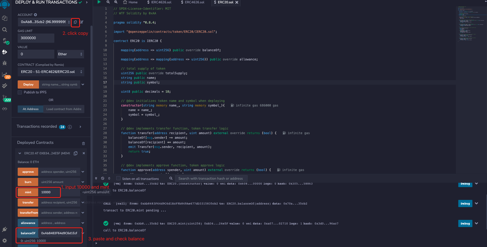
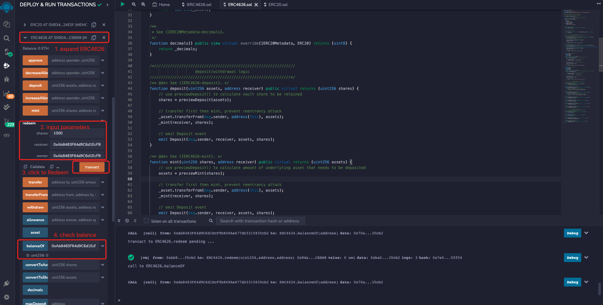

# WTF Simplified Introduction to Solidity: 51. ERC4626 Tokenization of Vault Standard

I have recently been revising Solidity to consolidate the details, and am writing a "WTF Simplified Introduction to Solidity" for beginners to use (programming experts can find other tutorials), with weekly updates of 1-3 lectures.

Twitter: [@0xAA_Science](https://twitter.com/0xAA_Science)

Community: [Discord](https://discord.gg/5akcruXrsk)｜[WeChat group](https://docs.google.com/forms/d/e/1FAIpQLSe4KGT8Sh6sJ7hedQRuIYirOoZK_85miz3dw7vA1-YjodgJ-A/viewform?usp=sf_link)｜[Official website wtf.academy](https://wtf.academy)

All code and tutorials are open source on GitHub: [github.com/AmazingAng/WTFSolidity](https://github.com/AmazingAng/WTFSolidity)

-----

We often say that DeFi is like LEGO blocks, where you can create new protocols by combining multiple protocols. However, due to the lack of standards in DeFi, its composability is severely affected. ERC4626 extends the ERC20 token standard and aims to standardize yield vaults. In this talk, we will introduce the new generation DeFi standard - ERC4626 and write a simple vault contract. The teaching code reference comes from the ERC4626 contract in Openzeppelin and Solmate and is for teaching purposes only.

## Vault

The vault contract is the foundation of DeFi LEGO blocks. It allows you to stake basic assets (tokens) to the contract in exchange for certain returns, including the following scenarios:

- Yield farming: In Yearn Finance, you can stake USDT to earn interest.
- Borrow/Lend: In AAVE, you can supply ETH to earn deposit interest and get a loan.
- Stake: In Lido, you can stake ETH to participate in ETH 2.0 staking and obtain stETH that can be used to earn interest.

## ERC4626


Since the vault contract lacks standards, there are various ways of implementation. A yield aggregator needs to write many interfaces to connect with different DeFi projects. The ERC4626 Tokenized Vault Standard has emerged to enable easy expansion of DeFi with the following advantages:

1. Tokenization: ERC4626 inherits ERC20. When depositing to the vault, you will receive vault shares that are also compliant with the ERC20 standard. For example, when staking ETH, you will automatically get stETH as your share.

2. Better liquidity: Due to tokenization, you can use vault shares to do other things without withdrawing the underlying assets. For example, you can use Lido's stETH to provide liquidity or trade on Uniswap, without withdrawing any ETH.

3. Better composability: With the standard in place, a single set of interfaces can interact with all ERC4626 vaults, making it easier to develop applications, plugins, and tools based on vaults.

In summary, the importance of ERC4626 for DeFi is no less than that of ERC721 for NFTs.

### Key Points of ERC4626

The ERC4626 standard mainly implements the following logic:

1. ERC20: ERC4626 inherits ERC20, and the vault shares are represented by ERC20 tokens: users deposit specific ERC20 underlying assets (such as WETH) into the vault, and the contract mints a specific number of vault share tokens for them; When users withdraw underlying assets from the vault, the corresponding number of vault share tokens will be destroyed. The `asset()` function returns the token address of the vault's underlying asset.
2. Deposit logic: allows users to deposit underlying assets and mint the corresponding number of vault shares. Related functions are `deposit()` and `mint()`. The `deposit(uint assets, address receiver)` function allows users to deposit `assets` units of assets and mint the corresponding number of vault shares to the `receiver` address. `mint(uint shares, address receiver)` is similar, except that it takes the minted vault shares as a parameter.
3. Withdrawal logic: allows users to destroy vault share tokens and withdraw the corresponding number of underlying assets from the vault. Related functions are `withdraw()` and `redeem()`, the former taking the amount of underlying assets to be withdrawn as a parameter, and the latter taking the number of destroyed vault share tokens as a parameter.
4. Accounting and limit logic: other functions in the ERC4626 standard are for asset accounting in the vault, deposit and withdrawal limits and the number of underlying assets and vault shares for deposit and withdrawal.

### IERC4626 Interface Contract

The IERC4626 interface contract includes a total of `2` events:
- `Deposit` event: triggered when depositing.
- `Withdraw` event: triggered when withdrawing.

The IERC4626 interface contract also includes `16` functions, which are classified into `4` categories according to their functionality: metadata functions, deposit/withdrawal logic functions, accounting logic functions, and deposit/withdrawal limit logic functions.

- Metadata
    - `asset()`: returns the address of the underlying asset token of the vault, which is used for deposit and withdrawal.
- Deposit/Withdrawal Logic
    - `deposit()`: a function that allows users to deposit `assets` units of the underlying asset into the vault, and the contract mints `shares` units of the vault's shares to the `receiver` address. It releases a `Deposit` event.
    - `mint()`: a minting function (also a deposit function) that allows users to deposit `assets` units of the underlying asset and the contract mints the corresponding amount of the vault's shares to the `receiver` address. It releases a `Deposit` event.
    - `withdraw()`: a function that allows the `owner` address to burn `share` units of the vault's shares, and the contract sends the corresponding amount of the underlying asset to the `receiver` address.
    - `redeem()`: a redemption function (also a withdrawal function) that allows the `owner` address to burn `share` units of the vault's shares and the contract sends the corresponding amount of the underlying asset to the `receiver` address.
- Accounting Logic
    - `totalAssets()`: returns the total amount of underlying asset tokens managed in the vault.
    - `convertToShares()`: returns the amount of vault shares that can be obtained by using a certain amount of the underlying asset.
    - `convertToAssets()`: returns the amount of underlying asset that can be obtained by using a certain amount of vault shares.
    - `previewDeposit()`: used by users to simulate the amount of vault shares they can obtain by depositing a certain amount of the underlying asset in the current on-chain environment.
    - `previewMint()`: used by users to simulate the amount of underlying asset needed to mint a certain amount of vault shares in the current on-chain environment.
    - `previewWithdraw()`: used by users to simulate the amount of vault shares they need to redeem to withdraw a certain amount of the underlying asset in the current on-chain environment.
    - `previewRedeem()`: used by on-chain and off-chain users to simulate the amount of underlying asset they can redeem by burning a certain amount of vault shares in the current on-chain environment.
- Deposit/Withdrawal Limit Logic
    - `maxDeposit()`: returns the maximum amount of the underlying asset that a certain user address can deposit in a single deposit.
    - `maxMint()`: returns the maximum amount of vault shares that a certain user address can mint in a single mint.
    - `maxWithdraw()`: returns the maximum amount of the underlying asset that a certain user address can withdraw in a single withdrawal.

- `maxRedeem()`: Returns the maximum vault quota that can be destroyed in a single redemption for a given user address.

```solidity
// SPDX-License-Identifier: MIT
// Author: 0xAA from WTF Academy

pragma solidity ^0.8.0;

import "@openzeppelin/contracts/token/ERC20/IERC20.sol";
import "@openzeppelin/contracts/token/ERC20/extensions/IERC20Metadata.sol";

/**
 * @dev ERC4626 "Tokenized Vaults Standard" interface contract
 * https://eips.ethereum.org/EIPS/eip-4626.
 */
interface IERC4626 is IERC20, IERC20Metadata {
    /*//////////////////////////////////////////////////////////////
                                 event
    //////////////////////////////////////////////////////////////*/
    // triggered when depositing
    event Deposit(address indexed sender, address indexed owner, uint256 assets, uint256 shares);

    // triggered when withdrawing
    event Withdraw(
        address indexed sender,
        address indexed receiver,
        address indexed owner,
        uint256 assets,
        uint256 shares
    );

    /*//////////////////////////////////////////////////////////////
                            metadata
    //////////////////////////////////////////////////////////////*/
    /**
     * @dev returns the address of the underlying asset token of the vault (used for deposit and withdrawal)
     * - has to be ERC20 token contract address
     * - cannot revert
     */
    function asset() external view returns (address assetTokenAddress);

    /*//////////////////////////////////////////////////////////////
                        deposit/withdraw logic
    //////////////////////////////////////////////////////////////*/
    /**
     * @dev deposit function: user deposit ${assets} units of underlying asset to vault, 
     * and the contract mints ${shares} unit vault share to receiver's address
     *
     * - has to emit Deposit event
     * - if asset cannot be deposited succuessfully, must revert. e.g. when deposit amount exceeds limit
     */
    function deposit(uint256 assets, address receiver) external returns (uint256 shares);

    /**
     * @dev mint function: users deposit ${assets} units of the underlying asset 
     *      and the contract mints the corresponding amount of the vault's shares to the receiver's address
     * - has to emit Deposit event 
     * - if it cannot mint, must revert. e.g. minting amount exceeds limit
     */
    function mint(uint256 shares, address receiver) external returns (uint256 assets);

    /**
     * @dev withdraw function: owner address burns ${share} units of the vault's shares, 
     *      and the contract transfers the corresponding amount of the underlying asset to the receiver address
     *
     * - emit Withdraw event
     * - if all assets cannot be withdrew, it will revert
     */
    function withdraw(uint256 assets, address receiver, address owner) external returns (uint256 shares);

    /**
     * @dev redeem function: owner address burns ${share} units of the vault's shares, 
     *      and the contract transfers the corresponding amount of the underlying asset to the receiver address
     *
     * - emit Withdraw event
     * - if vault's share cannot be redeemed, then revert
     */
    function redeem(uint256 shares, address receiver, address owner) external returns (uint256 assets);

    /*//////////////////////////////////////////////////////////////
                            Accounting Logic
    //////////////////////////////////////////////////////////////*/

    /**
     * @dev returns the total amount of underlying asset tokens managed in the vault
     *
     * - include interest
     * - include fee
     * - cannot revert
     */
    function totalAssets() external view returns (uint256 totalManagedAssets);

    /**
     * @dev returns the amount of vault shares that can be obtained by using a certain amount of the underlying asset

     * - do not include fee
     * - do not include slippage
     * - cannot revert
     */
    function convertToShares(uint256 assets) external view returns (uint256 shares);

    /**
     * @dev returns the amount of underlying asset that can be obtained by using a certain amount of vault shares
     *
     * - do not include fee
     * - do not include slippage
     * - cannot revert
     */
    function convertToAssets(uint256 shares) external view returns (uint256 assets);

    /**
     * @dev used by both on-chain and off-chain users to simulate the amount of vault shares they can obtain by depositing a certain amount of the underlying asset in the current on-chain environment
     *
     * - the return value should be close to and not greater than the vault amount obtained by depositing in the same transaction
     * - do not consider about restrictions like maxDeposit, assume that user deposit will succeed
     * - consider fee
     * - cannot revert
     * NOTE: use the difference of the return values of convertToAssets and previewDeposit to calculate slippage
     */
    function previewDeposit(uint256 assets) external view returns (uint256 shares);

    /**
     * @dev used by both on-chain and off-chain users to simulate the amount of underlying asset needed to mint a certain amount of vault shares in the current on-chain environment
     * - the return value should be close to and not less than the deposit amount required to mint a certain amount of vault amount in the same transaction.
     * - do not consider about restrictions like maxMint, assume that user mint transaction will succeed
     * - consider fee
     * - cannot revert
     */
    function previewMint(uint256 shares) external view returns (uint256 assets);

    /**
     * @dev used by both on-chain and off-chain users to simulate the amount of vault shares they need to redeem to withdraw a certain amount of the underlying asset in the current on-chain environment
     * - the return value should be close to and not greater than the vault share needed to redeem a certain amount of underlying asset withdrawn in the same transaction.
     * - do not consider about restrictions like maxWithdraw, assume that user withdraw transaction will succeed
     * - consider fee
     * - cannot revert
     */
    function previewWithdraw(uint256 assets) external view returns (uint256 shares);

    /**
     * @dev used by on-chain and off-chain users to simulate the amount of underlying asset they can redeem by burning a certain amount of vault shares in the current on-chain environment
     * - the return value should be close to and not less than the amount of underlying asset that can be redeemed by the vault amount burnt in the same transaction.
     * - do not consider about restrictions like maxRedeem, assume that user redeem transaction will succeed
     * - consider fee
     * - cannot revert
     */
    function previewRedeem(uint256 shares) external view returns (uint256 assets);

    /*//////////////////////////////////////////////////////////////
                    deposit/widthdrawal limit logic
    //////////////////////////////////////////////////////////////*/
    /**
     * @dev returns the maximum amount of underlying asset that can be deposited in a single transaction for a given user address.
     * - if there is max deposit limit, return value should be a finite value
     * - return value should not be greater than 2 ** 256 - 1 
     * - cannot revert
     */
    function maxDeposit(address receiver) external view returns (uint256 maxAssets);

    /**
     * @dev returns the maximum vault amount that can be minted in a single transaction for a given user address.
     * - f there is max mint limit, return value should be a finite value
     * - return value should not be greater than 2 ** 256 - 1 
     * - cannot revert
     */
    function maxMint(address receiver) external view returns (uint256 maxShares);

    /**
     * @dev returns the maximum amount of underlying asset that can be withdrawn in a single transaction for a given user address.
     * - return value should be a finite value
     * - cannot revert
     */
    function maxWithdraw(address owner) external view returns (uint256 maxAssets);

    /**
     * @dev returns the maximum vault amount that can be redeemed in a single transaction for a given user address.
     * - return value should be a finite value
     * - if there are no other restrictions, the return value should be balanceOf(owner)
     * - cannot revert
     */
    function maxRedeem(address owner) external view returns (uint256 maxShares);
}
```

### ERC4626 Contract

Here, we are implementing an extremely simple version of tokenized vault contract:
- The constructor initializes the address of the underlying asset contract, the name, and symbol of the vault shares token. Note that the name and symbol of the vault shares token should be associated with the underlying asset. For example, if the underlying asset is called `WTF`, the vault shares should be called `vWTF`.
- When a user deposits `x` units of the underlying asset into the vault, `x` units (equivalent) of vault shares will be minted.
- When a user withdraws `x` units of vault shares from the vault, `x` units (equivalent) of the underlying asset will be withdrawn as well.

**Note**: In actual use, special care should be taken to consider whether the accounting logic related functions should be rounded up or rounded down. You can refer to the implementations of [OpenZeppelin](https://github.com/OpenZeppelin/openzeppelin-contracts/blob/master/contracts/token/ERC20/extensions/ERC4626.sol) and [Solmate](https://github.com/transmissions11/solmate/blob/main/src/mixins/ERC4626.sol). However, this is not considered in the teaching example in this section.

```solidity
// SPDX-License-Identifier: MIT
pragma solidity >=0.8.0;

import {IERC4626} from "./IERC4626.sol";
import {ERC20, IERC20Metadata} from "@openzeppelin/contracts/token/ERC20/ERC20.sol";

/**
 * @dev ERC4626 "Tokenized Vaults Standard" contract. 
 * FOR TEACHING PURPOSE ONLY, DO NOT USE IN PRODUCTION
 */
contract ERC4626 is ERC20, IERC4626 {
    /*//////////////////////////////////////////////////////////////
                            state variables
    //////////////////////////////////////////////////////////////*/
    ERC20 private immutable _asset; // 
    uint8 private immutable _decimals;

    constructor(
        ERC20 asset_,
        string memory name_,
        string memory symbol_
    ) ERC20(name_, symbol_) {
        _asset = asset_;
        _decimals = asset_.decimals();

    }

    /** @dev See {IERC4626-asset}. */
    function asset() public view virtual override returns (address) {
        return address(_asset);
    }

    /**
     * See {IERC20Metadata-decimals}.
     */
    function decimals() public view virtual override(IERC20Metadata, ERC20) returns (uint8) {
        return _decimals;
    }

    /*//////////////////////////////////////////////////////////////
                        deposit/withdrawal logic
    //////////////////////////////////////////////////////////////*/
    /** @dev See {IERC4626-deposit}. */
    function deposit(uint256 assets, address receiver) public virtual returns (uint256 shares) {
        // use previewDeposit() to calculate vault share to be retained
        shares = previewDeposit(assets);
        
        // transfer first then mint, prevent reentrancy attack
        _asset.transferFrom(msg.sender, address(this), assets);
        _mint(receiver, shares);

        // emit Deposit event
        emit Deposit(msg.sender, receiver, assets, shares);
    }

    /** @dev See {IERC4626-mint}. */
    function mint(uint256 shares, address receiver) public virtual returns (uint256 assets) {
        // use previewDeposit() to calculate amount of underlyting asset that needs to be deposited
        assets = previewMint(shares);

        // transfer first then mint, prevent reentrancy attack
        _asset.transferFrom(msg.sender, address(this), assets);
        _mint(receiver, shares);

        // emit Deposit event
        emit Deposit(msg.sender, receiver, assets, shares);

    }

    /** @dev See {IERC4626-withdraw}. */
    function withdraw(
        uint256 assets,
        address receiver,
        address owner
    ) public virtual returns (uint256 shares) {
        // use previewWithdraw() to calculate vault share that will be burnt
        shares = previewWithdraw(assets);

        // if caller is not owner,  check and update allownance
        if (msg.sender != owner) {
            _spendAllowance(owner, msg.sender, shares);
        }

        // burn first then transfer, prevent reentrancy attack
        _burn(owner, shares);
        _asset.transfer(receiver, assets);

        // emit Withdraw event
        emit Withdraw(msg.sender, receiver, owner, assets, shares);
    }

    /** @dev See {IERC4626-redeem}. */
    function redeem(
        uint256 shares,
        address receiver,
        address owner
    ) public virtual returns (uint256 assets) {
        // use previewRedeem() to calculate the amount of underlying asset that can be redeemed
        assets = previewRedeem(shares);

        // if caller is not owner, check and update allownance
        if (msg.sender != owner) {
            _spendAllowance(owner, msg.sender, shares);
        }

        // burn first then transfer, prevent reentrancy attack
        _burn(owner, shares);
        _asset.transfer(receiver, assets);

        // emit Withdraw event
        emit Withdraw(msg.sender, receiver, owner, assets, shares);
    }

    /*//////////////////////////////////////////////////////////////
                            accounting logic
    //////////////////////////////////////////////////////////////*/
    /** @dev See {IERC4626-totalAssets}. */
    function totalAssets() public view virtual returns (uint256){
        // returns balance of underlying asset for this contract
        return _asset.balanceOf(address(this));
    }

    /** @dev See {IERC4626-convertToShares}. */
    function convertToShares(uint256 assets) public view virtual returns (uint256) {
        uint256 supply = totalSupply();
        // if supply is 0, then mint vault share at 1:1 ratio
        // if supply is not 0, then mint vault share at actual ratio
        return supply == 0 ? assets : assets * supply / totalAssets();
    }

    /** @dev See {IERC4626-convertToAssets}. */
    function convertToAssets(uint256 shares) public view virtual returns (uint256) {
        uint256 supply = totalSupply();
        // if supply is 0, then redeem underlying asset at 1:1 ratio
        // if supply is not 0, then redeem underlying asset at actual ratio
        return supply == 0 ? shares : shares * totalAssets() / supply;
    }

    /** @dev See {IERC4626-previewDeposit}. */
    function previewDeposit(uint256 assets) public view virtual returns (uint256) {
        return convertToShares(assets);
    }

    /** @dev See {IERC4626-previewMint}. */
    function previewMint(uint256 shares) public view virtual returns (uint256) {
        return convertToAssets(shares);
    }

    /** @dev See {IERC4626-previewWithdraw}. */
    function previewWithdraw(uint256 assets) public view virtual returns (uint256) {
        return convertToShares(assets);
    }

    /** @dev See {IERC4626-previewRedeem}. */
    function previewRedeem(uint256 shares) public view virtual returns (uint256) {
        return convertToAssets(shares);
    }

    /*//////////////////////////////////////////////////////////////
                     DEPOSIT/WITHDRAWAL LIMIT LOGIC
    //////////////////////////////////////////////////////////////*/
    /** @dev See {IERC4626-maxDeposit}. */
    function maxDeposit(address) public view virtual returns (uint256) {
        return type(uint256).max;
    }

    /** @dev See {IERC4626-maxMint}. */
    function maxMint(address) public view virtual returns (uint256) {
        return type(uint256).max;
    }
    
    /** @dev See {IERC4626-maxWithdraw}. */
    function maxWithdraw(address owner) public view virtual returns (uint256) {
        return convertToAssets(balanceOf(owner));
    }
    
    /** @dev See {IERC4626-maxRedeem}. */
    function maxRedeem(address owner) public view virtual returns (uint256) {
        return balanceOf(owner);
    }
}
```

## `Remix` Demo

**Note:** the demo show below uses the second remix account, which is `0xAb8483F64d9C6d1EcF9b849Ae677dD3315835cb2`, to deploy and call functions.

1. Deploy an `ERC20` token contract with the token name and symbol both set to `WTF`, and mint yourself `10000` tokens.


2. Deploy an `ERC4626` token contract with the underlying asset contract address set to the address of `WTF`, and set the name and symbol to `vWTF`.

3. Call the `approve()` function of the `ERC20` contract to authorize the `ERC4626` contract.


4. Call the `deposit()` function of the `ERC4626` contract to deposit `1000` tokens. Then call the `balanceOf()` function to check that your vault share has increased to `1000`.


5. Call the `mint()` function of the `ERC4626` contract to deposit another `1000` tokens. Then call `balanceOf()` function to check that your vault share has increased to `2000`.


6. Call the `withdraw()` function of the `ERC4626` contract to withdraw `1000` tokens. Then call the `balanceOf()` function to check that your vault share has decreased to `1000`.


7. Call the `redeem()` function of the `ERC4626` contract to withdraw `1000` tokens. Then call the `balanceOf()` function to check that your vault share has decreased to `0`.


## Summary

In this lesson, we introduced the ERC4626 tokenized vault standard and wrote a simple vault contract that converts underlying assets to 1:1 vault share tokens. The ERC4626 standard improves the liquidity and composability of DeFi and it will gradually become more popular in the future. What applications would you build with ERC4626?
