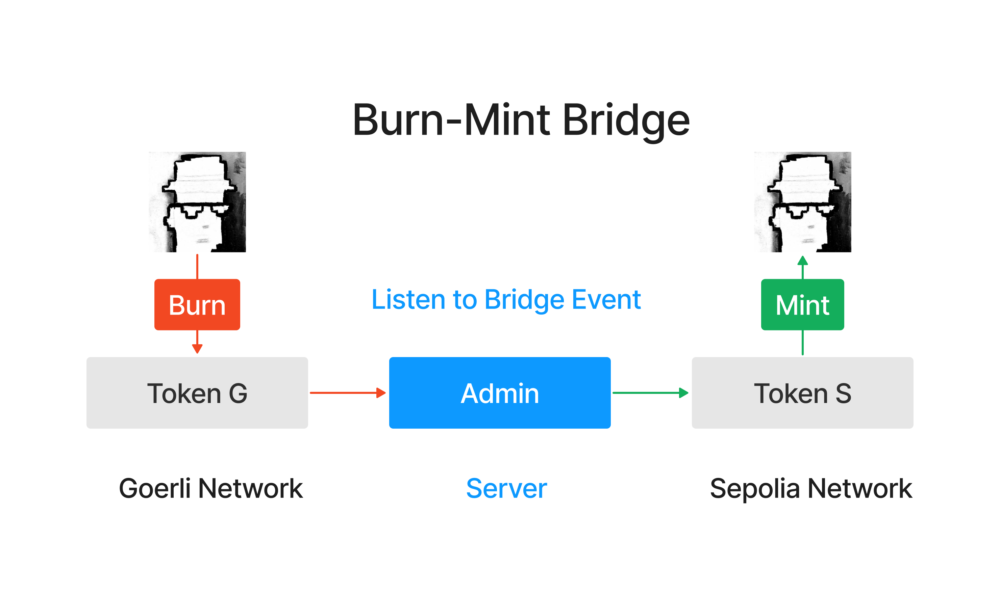

# WTF Minimalist introduction to Solidity: 54. Cross-chain bridge

I'm recently re-learning solidity, consolidating the details, and writing a "WTF Solidity Minimalist Introduction" for novices (programming experts can find another tutorial), updating 1-3 lectures every week.

Twitter: [@0xAA_Science](https://twitter.com/0xAA_Science)

Community: [Discord](https://discord.gg/5akcruXrsk)｜[WeChat Group](https://docs.google.com/forms/d/e/1FAIpQLSe4KGT8Sh6sJ7hedQRuIYirOoZK_85miz3dw7vA1-YjodgJ-A/viewform?usp=sf_link) |[Official website wtf.academy](https://wtf.academy)

All codes and tutorials are open source on github: [github.com/AmazingAng/WTFSolidity](https://github.com/AmazingAng/WTFSolidity)
-----

In this lecture, we introduce cross-chain bridges, infrastructure that can transfer assets from one blockchain to another, and implement a simple cross-chain bridge.


## 1. What is a cross-chain bridge?

A cross-chain bridge is a blockchain protocol that allows digital assets and information to be moved between two or more blockchains. For example, an ERC20 token running on the Ethereum mainnet can be transferred to other Ethereum-compatible sidechains or independent chains through cross-chain bridges.

At the same time, cross-chain bridges are not natively supported by the blockchain, and cross-chain operations require a trusted third party to perform, which also brings risks. In the past two years, attacks on cross-chain bridges have caused more than **$2 billion** in user asset losses.

## 2. Types of cross-chain bridges

There are three main types of cross-chain bridges:

- **Burn/Mint**: Destroy (burn) tokens on the source chain, and then create (mint) the same number of tokens on the target chain. The advantage of this method is that the total supply of tokens remains unchanged, but the cross-chain bridge needs to have the permission to mint the tokens, which is suitable for project parties to build their own cross-chain bridges.



- **Stake/Mint**: Lock (stake) tokens on the source chain, and then create (mint) the same number of tokens (certificates) on the target chain. Tokens on the source chain are locked and unlocked when the tokens are moved from the target chain back to the source chain. This is a solution commonly used by cross-chain bridges. It does not require any permissions, but the risk is also high. When the assets of the source chain are hacked, the credentials on the target chain will become air.

     

- **Stake/Unstake**: Lock (stake) tokens on the source chain, and then release (unstake) the same number of tokens on the target chain. The tokens on the target chain can be exchanged back to the tokens on the source chain at any time. currency. This method requires the cross-chain bridge to have locked tokens on both chains, and the threshold is high. Users generally need to be encouraged to lock up on the cross-chain bridge.

    

## 3. Build a simple cross-chain bridge

In order to better understand this cross-chain bridge, we will build a simple cross-chain bridge and implement ERC20 token transfer between the Goerli test network and the Sepolia test network. We use the burn/mint method, the tokens on the source chain will be destroyed and created on the target chain. This cross-chain bridge consists of a smart contract (deployed on both chains) and an Ethers.js script.

> **Please note**, this is a very simple cross-chain bridge implementation and is for educational purposes only. It does not deal with some possible problems, such as transaction failure, chain reorganization, etc. In a production environment, it is recommended to use a professional cross-chain bridge solution or other fully tested and audited frameworks.

### 3.1 Cross-chain token contract

First, we need to deploy an ERC20 token contract, `CrossChainToken`, on the Goerli and Sepolia testnets. This contract defines the name, symbol, and total supply of the token, as well as a `bridge()` function for cross-chain transfers.

```solidity
// SPDX-License-Identifier: MIT
pragma solidity ^0.8.10;

import "@openzeppelin/contracts/token/ERC20/ERC20.sol";
import "@openzeppelin/contracts/access/Ownable.sol";

contract CrossChainToken is ERC20, Ownable {
    
    // Bridge event
    event Bridge(address indexed user, uint256 amount);
    // Mint event
    event Mint(address indexed to, uint256 amount);

    /**
     * @param name Token Name
     * @param symbol Token Symbol
     * @param totalSupply Token Supply
     */
    constructor(
        string memory name,
        string memory symbol,
        uint256 totalSupply
    ) payable ERC20(name, symbol) {
        _mint(msg.sender, totalSupply);
    }

    /**
     * Bridge function
     * @param amount: burn amount of token on the current chain and mint on the other chain
     */
    function bridge(uint256 amount) public {
        _burn(msg.sender, amount);
        emit Bridge(msg.sender, amount);
    }

    /**
     * Mint function
     */
    function mint(address to, uint amount) external onlyOwner {
        _mint(to, amount);
        emit  Mint(to, amount);
    }
}
```

This contract has three main functions:

- `constructor()`: The constructor, which will be called once when deploying the contract, is used to initialize the name, symbol and total supply of the token.

- `bridge()`: The user calls this function to perform cross-chain transfer. It will destroy the number of tokens specified by the user and release the `Bridge` event.

- `mint()`: Only the owner of the contract can call this function to handle cross-chain events and release the `Mint` event. When the user calls the `bridge()` function on another chain to destroy the token, the script will listen to the `Bridge` event and mint the token for the user on the target chain.

### 3.2 Cross-chain script

With the token contract in place, we need a server to handle cross-chain events. We can write an ethers.js script (v6 version) to listen to the `Bridge` event, and when the event is triggered, create the same number of tokens on the target chain. If you don’t know Ethers.js, you can read [WTF Ethers Minimalist Tutorial](https://github.com/WTFAcademy/WTF-Ethers).

```javascript
import { ethers } from "ethers";

//Initialize the providers of the two chains
const providerGoerli = new ethers.JsonRpcProvider("Goerli_Provider_URL");
const providerSepolia = new ethers.JsonRpcProvider("Sepolia_Provider_URL://eth-sepolia.g.alchemy.com/v2/RgxsjQdKTawszh80TpJ-14Y8tY7cx5W2");

//Initialize the signers of the two chains
// privateKey fills in the private key of the administrator's wallet
const privateKey = "Your_Key";
const walletGoerli = new ethers.Wallet(privateKey, providerGoerli);
const walletSepolia = new ethers.Wallet(privateKey, providerSepolia);

//Contract address and ABI
const contractAddressGoerli = "0xa2950F56e2Ca63bCdbA422c8d8EF9fC19bcF20DD";
const contractAddressSepolia = "0xad20993E1709ed13790b321bbeb0752E50b8Ce69";

const abi = [
    "event Bridge(address indexed user, uint256 amount)",
    "function bridge(uint256 amount) public",
    "function mint(address to, uint amount) external",
];

//Initialize contract instance
const contractGoerli = new ethers.Contract(contractAddressGoerli, abi, walletGoerli);
const contractSepolia = new ethers.Contract(contractAddressSepolia, abi, walletSepolia);

const main = async () => {
     try{
         console.log(`Start listening to cross-chain events`)

         // Listen to the Bridge event of chain Sepolia, and then perform the mint operation on Goerli to complete the cross-chain
         contractSepolia.on("Bridge", async (user, amount) => {
             console.log(`Bridge event on Chain Sepolia: User ${user} burned ${amount} tokens`);

             // Performing burn operation
             let tx = await contractGoerli.mint(user, amount);
             await tx.wait();

             console.log(`Minted ${amount} tokens to ${user} on Chain Goerli`);
         });

       // Listen to the Bridge event of chain Sepolia, and then perform the mint operation on Goerli to complete the cross-chain
         contractGoerli.on("Bridge", async (user, amount) => {
             console.log(`Bridge event on Chain Goerli: User ${user} burned ${amount} tokens`);

             // Performing burn operation
            let tx = await contractSepolia.mint(user, amount);
            await tx.wait();

            console.log(`Minted ${amount} tokens to ${user} on Chain Sepolia`);
        });

    }catch(e){
        console.log(e);
    
    } 
}

main();
```

## Remix Reappearance

1. Deploy the `CrossChainToken` contract on the Goerli and Sepolia test chains respectively. The contract will automatically mint 10,000 tokens for us.

     

2. Complete the RPC node URL and administrator private key in the cross-chain script `crosschain.js`, fill in the token contract addresses deployed in Goerli and Sepolia into the corresponding locations, and run the script.

3. Call the `bridge()` function of the token contract on the Goerli chain to cross-chain 100 tokens.

     

4. The script listens to the cross-chain event and mints 100 tokens on the Sepolia chain.

     

5. Call `balance()` on the Sepolia chain to check the balance, and find that the token balance has changed to 10,100. The cross-chain is successful!

     

## Summary

In this lecture, we introduced the cross-chain bridge, which allows digital assets and information to be moved between two or more blockchains, making it convenient for users to operate assets on multiple chains. At the same time, it also carries great risks. Attacks on cross-chain bridges in the past two years have caused more than **2 billion US dollars** in user asset losses. In this tutorial, we build a simple cross-chain bridge and implement ERC20 token transfer between Goerli testnet and Sepolia testnet. I believe that through this tutorial, you will have a deeper understanding of cross-chain bridges.
