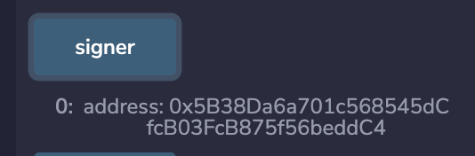

# WTF Solidity S06. Signature Replay

Recently, I have been revisiting Solidity, consolidating the finer details, and writing "WTF Solidity" tutorials for newbies.

Twitter: [@0xAA_Science](https://twitter.com/0xAA_Science) | [@WTFAcademy\_](https://twitter.com/WTFAcademy_)

Community: [Discord](https://discord.gg/5akcruXrsk)｜[Wechat](https://docs.google.com/forms/d/e/1FAIpQLSe4KGT8Sh6sJ7hedQRuIYirOoZK_85miz3dw7vA1-YjodgJ-A/viewform?usp=sf_link)｜[Website wtf.academy](https://wtf.academy)

Codes and tutorials are open source on GitHub: [github.com/AmazingAng/WTF-Solidity](https://github.com/AmazingAng/WTF-Solidity)

English translations by: [@to_22X](https://twitter.com/to_22X)

---

In this lesson, we will introduce the Signature Replay attack and how to prevent in smart contracts, which indirectly led to the theft of 20 million $OP tokens from the famous market maker Wintermute.

## Signature Replay

When I was in school, teachers often asked parents to sign documents. Sometimes, when parents were busy, I would "helpfully" copy their previous signatures. In a sense, this is similar to signature replay.

In blockchain, digital signatures can be used to identify the signer of data and verify data integrity. When sending transactions, users sign the transactions with their private keys, allowing others to verify that the transaction was sent by the corresponding account. Smart contracts can also use the `ECDSA` algorithm to verify signatures created off-chain by users and then execute logic such as minting or transferring tokens. For more information about digital signatures, please refer to [WTF Solidity 37: Digital Signatures](https://github.com/AmazingAng/WTF-Solidity/blob/main/Languages/en/37_Signature_en/readme.md).

There are generally two common types of replay attacks on digital signatures:

1. Regular replay: Reusing a signature that should have been used only once. The NBA's "The Association" series of NFTs were freely minted thousands of times due to this type of attack.
2. Cross-chain replay: Reusing a signature intended for use on one chain on another chain. Wintermute, the market maker, lost 20 million $OP tokens due to a cross-chain replay attack.


## Vulnerable Contract Example

The `SigReplay` contract below is an `ERC20` token contract that has a signature replay vulnerability in its minting function. It uses off-chain signatures to allow whitelisted address `to` to mint a corresponding amount `amount` of tokens. The contract stores the `signer` address to verify the validity of the signature.

```solidity
// SPDX-License-Identifier: MIT
// english translation by 22X
pragma solidity ^0.8.21;

import "@openzeppelin/contracts/token/ERC20/ERC20.sol";
import "@openzeppelin/contracts/access/Ownable.sol";
import "@openzeppelin/contracts/utils/cryptography/ECDSA.sol";

// Access control bad example
contract SigReplay is ERC20 {

    address public signer;

    // Constructor: initialize token name and symbol
    constructor() ERC20("SigReplay", "Replay") {
        signer = msg.sender;
    }

    /**
     * Mint function with signature replay vulnerability
     * to: 0x5B38Da6a701c568545dCfcB03FcB875f56beddC4
     * amount: 1000
     * Signature: 0x5a4f1ad4d8bd6b5582e658087633230d9810a0b7b8afa791e3f94cc38947f6cb1069519caf5bba7b975df29cbfdb4ada355027589a989435bf88e825841452f61b
     */
    function badMint(address to, uint amount, bytes memory signature) public {
        bytes32 _msgHash = toEthSignedMessageHash(getMessageHash(to, amount));
        require(verify(_msgHash, signature), "Invalid Signer!");
        _mint(to, amount);
    }

    /**
     * Concatenate the 'to' address (address type) and 'amount' (uint256 type) to form the message 'msgHash'
     * to: 0x5B38Da6a701c568545dCfcB03FcB875f56beddC4
     * amount: 1000
     * Corresponding message 'msgHash': 0xb4a4ba10fbd6886a312ec31c54137f5714ddc0e93274da8746a36d2fa96768be
     */
    function getMessageHash(address to, uint256 amount) public pure returns(bytes32){
        return keccak256(abi.encodePacked(to, amount));
    }

    /**
     * @dev Get the Ethereum signed message hash
     * `hash`: Message hash
     * Follows the Ethereum signature standard: https://eth.wiki/json-rpc/API#eth_sign[`eth_sign`]
     * and `EIP191`: https://eips.ethereum.org/EIPS/eip-191`
     * Adds the "\x19Ethereum Signed Message:\n32" field to prevent signing of executable transactions.
     */
    function toEthSignedMessageHash(bytes32 hash) public pure returns (bytes32) {
        // 32 is the length in bytes of hash,
        // enforced by the type signature above
        return keccak256(abi.encodePacked("\x19Ethereum Signed Message:\n32", hash));
    }

    // ECDSA verification
    function verify(bytes32 _msgHash, bytes memory _signature) public view returns (bool){
        return ECDSA.recover(_msgHash, _signature) == signer;
    }
```

**Note:** The `badMint()` function does not check for duplicate `signature`, allowing the same signature to be used multiple times, resulting in unlimited token minting.

```solidity
    function badMint(address to, uint amount, bytes memory signature) public {
        bytes32 _msgHash = toEthSignedMessageHash(keccak256(abi.encodePacked(to, amount)));
        require(verify(_msgHash, signature), "Invalid Signer!");
        _mint(to, amount);
    }
```

## Reproduce on `Remix`

**1.** Deploy the `SigReplay` contract, where the signer address `signer` is initialized with the deploying wallet address.



**2.** Use the `getMessageHash` function to obtain the message.


**3.** Click the signature button in the Remix deployment panel to sign the message using the private key.


**4.** Repeatedly call `badMint` to perform signature replay attacks and mint a large amount of tokens.


## How to Prevent

There are two main methods to prevent signature replay attacks:

1. Keep a record of used signatures, such as recording the addresses that have already minted tokens in the `mintedAddress` mapping, to prevent the reuse of signatures:

   ```solidity
   mapping(address => bool) public mintedAddress;   // Records addresses that have already minted

   function goodMint(address to, uint amount, bytes memory signature) public {
       bytes32 _msgHash = toEthSignedMessageHash(getMessageHash(to, amount));
       require(verify(_msgHash, signature), "Invalid Signer!");
       // Check if the address has already minted
       require(!mintedAddress[to], "Already minted");
       // Record the address minted
       mintedAddress[to] = true;
       _mint(to, amount);
   }
   ```

2. Include `nonce` (incremented for each transaction) and `chainid` (chain ID) in the signed message to prevent both regular replay and cross-chain replay attacks:

   ```solidity
   uint nonce;

   function nonceMint(address to, uint amount, bytes memory signature) public {
       bytes32 _msgHash = toEthSignedMessageHash(keccak256(abi.encodePacked(to, amount, nonce, block.chainid)));
       require(verify(_msgHash, signature), "Invalid Signer!");
       _mint(to, amount);
       nonce++;
   }
   ```

## Summary

In this lesson, we discussed the signature replay vulnerability in smart contracts and introduced two methods to prevent:

1. Keep a record of used signatures to prevent their reuse.

2. Include `nonce` and `chainid` in the signed message.
