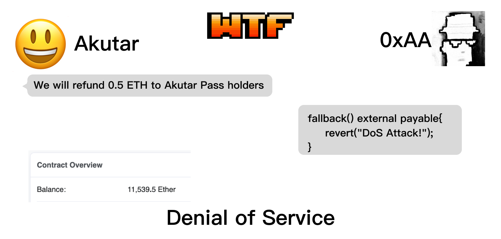

# WTF Solidity S09. Denial of Service (DoS)

Recently, I have been revisiting Solidity, consolidating the finer details, and writing "WTF Solidity" tutorials for newbies. 

Twitter: [@0xAA_Science](https://twitter.com/0xAA_Science) | [@WTFAcademy_](https://twitter.com/WTFAcademy_)

Community: [Discord](https://discord.gg/5akcruXrsk)｜[Wechat](https://docs.google.com/forms/d/e/1FAIpQLSe4KGT8Sh6sJ7hedQRuIYirOoZK_85miz3dw7vA1-YjodgJ-A/viewform?usp=sf_link)｜[Website wtf.academy](https://wtf.academy)

Codes and tutorials are open source on GitHub: [github.com/AmazingAng/WTF-Solidity](https://github.com/AmazingAng/WTF-Solidity)

English translations by: [@to_22X](https://twitter.com/to_22X)

---

In this lesson, we will introduce the Denial of Service (DoS) vulnerability in smart contracts and discuss methods for prevention. The NFT project Akutar once suffered a loss of 11,539 ETH, worth $34 million at the time, due to a DoS vulnerability.

## DoS

In Web2, a Denial of Service (DoS) attack refers to the phenomenon of overwhelming a server with a large amount of junk or disruptive information, rendering it unable to serve legitimate users. In Web3, it refers to exploiting vulnerabilities that prevent a smart contract from functioning properly.

In April 2022, a popular NFT project called Akutar raised 11,539.5 ETH through a Dutch auction for its public launch, achieving great success. Participants who held their community Pass were supposed to receive a refund of 0.5 ETH. However, when they attempted to process the refunds, they discovered that the smart contract was unable to function correctly, resulting in all funds being permanently locked in the contract. Their smart contract had a DoS vulnerability.



## Vulnerability Example

Now let's study a simplified version of the Akutar contract called `DoSGame`. This contract has a simple logic: when the game starts, players call the `deposit()` function to deposit funds into the contract, and the contract records the addresses of all players and their corresponding deposits. When the game ends, the `refund()` function is called to refund ETH to all players in sequence.

```solidity
// SPDX-License-Identifier: MIT
// english translation by 22X
pragma solidity ^0.8.21;

// Game with DoS vulnerability, players deposit money and call refund to withdraw it after the game ends.
contract DoSGame {
    bool public refundFinished;
    mapping(address => uint256) public balanceOf;
    address[] public players;
    
    // All players deposit ETH into the contract
    function deposit() external payable {
        require(!refundFinished, "Game Over");
        require(msg.value > 0, "Please donate ETH");
        // Record the deposit
        balanceOf[msg.sender] = msg.value;
        // Record the player's address
        players.push(msg.sender);
    }

    // Game ends, refund starts, all players receive refunds one by one
    function refund() external {
        require(!refundFinished, "Game Over");
        uint256 pLength = players.length;
        // Loop through all players to refund them
        for(uint256 i; i < pLength; i++){
            address player = players[i];
            uint256 refundETH = balanceOf[player];
            (bool success, ) = player.call{value: refundETH}("");
            require(success, "Refund Fail!");
            balanceOf[player] = 0;
        }
        refundFinished = true;
    }

    function balance() external view returns(uint256){
        return address(this).balance;
    }
}
```

The vulnerability here lies in the `refund()` function, where a loop is used to refund the players using the `call` function, which triggers the fallback function of the target address. If the target address is a malicious contract and contains malicious logic in its fallback function, the refund process will not be executed properly.

```
(bool success, ) = player.call{value: refundETH}("");
```

Below, we write an attack contract where the `attack()` function calls the `deposit()` function of the `DoSGame` contract to deposit funds and participate in the game. The `fallback()` fallback function reverts all transactions sending ETH to this contract, attacking the DoS vulnerability in the `DoSGame` contract. As a result, all refunds cannot be executed properly, and the funds are locked in the contract, just like the over 11,000 ETH in the Akutar contract.

```solidity
contract Attack {
    // DoS attack during refund
    fallback() external payable{
        revert("DoS Attack!");
    }

    // Participate in the DoS game and deposit
    function attack(address gameAddr) external payable {
        DoSGame dos = DoSGame(gameAddr);
        dos.deposit{value: msg.value}();
    }
}
```

## Reproduce on `Remix`

**1.** Deploy the `DoSGame` contract.
**2.** Call the `deposit()` function of the `DoSGame` contract to make a deposit and participate in the game.

**3.** At this point, if the game is over and `refund()` is called, the refund will be executed successfully.

**3.** Redeploy the `DoSGame` contract and deploy the `Attack` contract.
**4.** Call the `attack()` function of the `Attack` contract to make a deposit and participate in the game.

**5.** Call the `refund()` function of the `DoSGame` contract to initiate a refund, but it fails to execute properly, indicating a successful attack.


## How to Prevent

Many logic errors can lead to denial of service in smart contracts, so developers need to be extremely cautious when writing smart contracts. Here are some areas that require special attention:

1. Failure of external contract function calls (e.g., `call`) should not result in the blocking of important functionality. For example, removing the `require(success, "Refund Fail!");` statement in the vulnerable contract allows the refund process to continue even if a single address fails.
2. Contracts should not unexpectedly self-destruct.
3. Contracts should not enter infinite loops.
4. Parameters for `require` and `assert` should be set correctly.
5. When refunding, allow users to claim funds from the contract (push) instead of sending funds to users in batch (pull).
6. Ensure that callback functions do not interfere with the normal operation of the contract.
7. Ensure that the main business of the contract can still function properly even when participants (e.g., `owner`) are absent.

## Summary

In this lesson, we introduced the denial of service vulnerability in smart contracts, which caused the Akutar project to lose over 10,000 ETH. Many logic errors can lead to DoS attacks, so developers need to be extremely cautious when writing smart contracts. For example, refunds should be claimed by users individually instead of being sent in batch by the contract.
