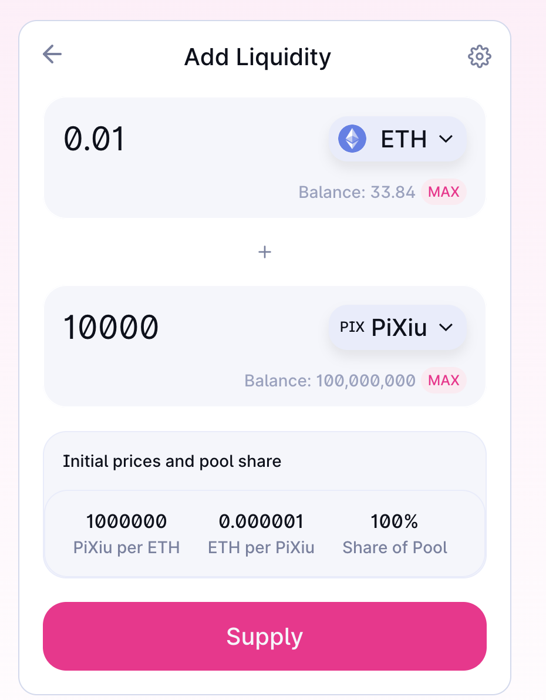

# WTF Solidity S10. Honeypot / Pixiu

Recently, I have been revisiting Solidity, consolidating the finer details, and writing "WTF Solidity" tutorials for newbies.

Twitter: [@0xAA_Science](https://twitter.com/0xAA_Science) | [@WTFAcademy\_](https://twitter.com/WTFAcademy_)

Community: [Discord](https://discord.gg/5akcruXrsk)｜[Wechat](https://docs.google.com/forms/d/e/1FAIpQLSe4KGT8Sh6sJ7hedQRuIYirOoZK_85miz3dw7vA1-YjodgJ-A/viewform?usp=sf_link)｜[Website wtf.academy](https://wtf.academy)

Codes and tutorials are open source on GitHub: [github.com/AmazingAng/WTF-Solidity](https://github.com/AmazingAng/WTF-Solidity)

English translations by: [@to_22X](https://twitter.com/to_22X)

---

In this lesson, we will introduce the Pixiu contract and stay away from Pixiu tokens.

> Note: In English, a "Pixiu" token is usually referred to as a "Honeypot" token. In the following sections, we will use the term "Pixiu" to refer to honeypot tokens.

## Introduction to Pixiu

[Pixiu](https://en.wikipedia.org/wiki/Pixiu) is a mythical creature in Chinese culture. In Web3, Pixiu has transformed into an unknown beast and become the nemesis of investors. The characteristics of a Pixiu scam are that investors can only buy tokens and the project owner is the only one who can sell.

Typically, a Pixiu scam follows the following lifecycle:

1. Malicious project owner deploys the Pixiu token contract.
2. Promote the Pixiu token to retail investors, and due to the inability to sell, the token price keeps rising.
3. The project owner performs a "rug pull" and runs away with the funds.


Understanding the principles of the Pixiu contract is essential for identifying and avoiding being scammed, allowing you to become a resilient investor!

## The Pixiu Contract

Here, we introduce a simple ERC20 token contract called `Pixiu`. In this contract, only the contract owner can sell the tokens on Uniswap, while other addresses cannot.

`Pixiu` has a state variable called `pair`, which records the address of the `Pixiu-ETH LP` pair on Uniswap. It mainly consists of three functions:

1. Constructor: Initializes the token's name and symbol, and calculates the LP contract address based on the principles of Uniswap and `create2`. For more details, you can refer to [WTF Solidity 25: Create2](https://github.com/AmazingAng/WTF-Solidity/blob/main/Languages/en/25_Create2_en/readme.md). This address will be used in the `_beforeTokenTransfer()` function.
2. `mint()`: A minting function that can only be called by the `owner` address to mint `Pixiu` tokens.
3. `_beforeTokenTransfer()`: A function called before an ERC20 token transfer. In this function, we restrict the transfer when the destination address `to` is the LP address, which represents selling by investors. The transaction will `revert` unless the caller is the `owner`. This is the core of the Pixiu contract.

```solidity
// Simple Honeypot ERC20 token, can only be bought, not sold
contract HoneyPot is ERC20, Ownable {
    address public pair;
    // Constructor: Initialize token name and symbol
    constructor() ERC20("HoneyPot", "Pi Xiu") {
        address factory = 0x5C69bEe701ef814a2B6a3EDD4B1652CB9cc5aA6f; // goerli uniswap v2 factory
        address tokenA = address(this); // Honeypot token address
        address tokenB = 0xB4FBF271143F4FBf7B91A5ded31805e42b2208d6; // goerli WETH
        (address token0, address token1) = tokenA < tokenB ? (tokenA, tokenB) : (tokenB, tokenA); // Sort tokenA and tokenB in ascending order
        bytes32 salt = keccak256(abi.encodePacked(token0, token1));
        // calculate pair address
        pair = address(uint160(uint(keccak256(abi.encodePacked(
        hex'ff',
        factory,
        salt,
        hex'96e8ac4277198ff8b6f785478aa9a39f403cb768dd02cbee326c3e7da348845f'
        )))));
    }

    /**
     * Mint function, can only be called by the contract owner
     */
    function mint(address to, uint amount) public onlyOwner {
        _mint(to, amount);
    }

    /**
     * @dev See {ERC20-_beforeTokenTransfer}.
     * Honeypot function: Only the contract owner can sell
     */
    function _beforeTokenTransfer(
        address from,
        address to,
        uint256 amount
    ) internal virtual override {
        super._beforeTokenTransfer(from, to, amount);
        // Revert if the transfer target address is the LP contract
        if(to == pair){
            require(from == owner(), "Can not Transfer");
        }
    }
}
```

## Reproduce on `Remix`

We will deploy the `Pixiu` contract on the `Goerli` testnet and demonstrate it on the `uniswap` exchange.

1. Deploy the `Pixiu` contract.
   

2. Call the `mint()` function to mint `100000` Pixiu tokens for yourself.
   

3. Go to the [uniswap](https://app.uniswap.org/#/add/v2/ETH) exchange, create liquidity for Pixiu tokens (v2), and provide `10000` Pixiu tokens and `0.1` ETH.
   

4. Sell `100` Pixiu tokens, the operation is successful.
   

5. Switch to another account and buy Pixiu tokens with `0.01` ETH, the operation is successful.
   

6. When selling Pixiu tokens, the transaction cannot be executed.
   

## How to Prevent

Pixiu tokens are the most common scam that retail investors encounter on the blockchain, and they come in various forms, making prevention very difficult. We have the following suggestions to reduce the risk of falling victim to Pixiu scams:

1. Check if the contract is open source on a blockchain explorer (e.g., [etherscan](https://etherscan.io/)). If it is open source, analyze its code for Pixiu vulnerabilities.

2. If you don't have programming skills, you can use Pixiu identification tools such as [Token Sniffer](https://tokensniffer.com/) and [Ave Check](https://ave.ai/check). If the score is low, it is likely to be a Pixiu token.

3. Look for audit reports of the project.

4. Carefully examine the project's official website and social media.

5. Only invest in projects you understand and do thorough research (DYOR).

## Conclusion

In this lesson, we introduced the Pixiu contract and methods to prevent falling victim to Pixiu scams. Pixiu scams are a common experience for retail investors, and we all despise them. Additionally, there have been Pixiu NFTs recently, where malicious project owners modify the transfer or approval functions of ERC721 tokens, preventing ordinary investors from selling them. Understanding the principles of the Pixiu contract and how to prevent can significantly reduce the chances of encountering Pixiu scams, making your funds more secure. Keep learning and stay safe.
