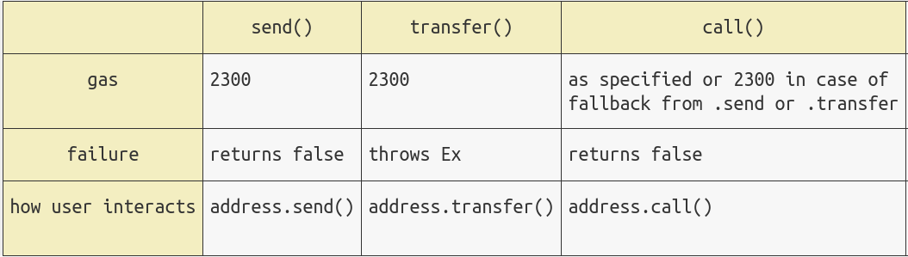

# WTF Solidity S13. Unchecked Low-Level Calls

Recently, I have been revisiting Solidity, consolidating the finer details, and writing "WTF Solidity" tutorials for newbies. 

Twitter: [@0xAA_Science](https://twitter.com/0xAA_Science) | [@WTFAcademy_](https://twitter.com/WTFAcademy_)

Community: [Discord](https://discord.gg/5akcruXrsk)｜[Wechat](https://docs.google.com/forms/d/e/1FAIpQLSe4KGT8Sh6sJ7hedQRuIYirOoZK_85miz3dw7vA1-YjodgJ-A/viewform?usp=sf_link)｜[Website wtf.academy](https://wtf.academy)

Codes and tutorials are open source on GitHub: [github.com/AmazingAng/WTF-Solidity](https://github.com/AmazingAng/WTF-Solidity)

English translations by: [@to_22X](https://twitter.com/to_22X)

-----

In this lesson, we will discuss the unchecked low-level calls in smart contracts. Failed low-level calls will not cause the transaction to roll back. If the contract forgets to check its return value, serious problems will often occur.

## Low-Level Calls

Low-level calls in Ethereum include `call()`, `delegatecall()`, `staticcall()`, and `send()`. These functions are different from other functions in Solidity. When an exception occurs, they do not pass it to the upper layer, nor do they cause the transaction to revert; they only return a boolean value `false` to indicate that the call failed. Therefore, if the return value of the low-level function call is not checked, the code of the upper layer function will continue to run regardless of whether the low-level call fails or not. For more information about low-level calls, please read [WTF Solidity 20-23](https://github.com/AmazingAng/WTF-Solidity)

Calling `send()` is the most error-prone: some contracts use `send()` to send `ETH`, but `send()` limits the gas to be less than 2300, otherwise it will fail. When the callback function of the target address is more complicated, the gas spent will be higher than 2300, which will cause `send()` to fail. If the return value is not checked in the upper layer function at this time, the transaction will continue to execute, and unexpected problems will occur. In 2016, there was a chain game called `King of Ether`, which caused the refund to fail to be sent normally due to this vulnerability (["autopsy" report](https://www.kingoftheether.com/postmortem.html)).



## Vulnerable Contract Example

### Bank Contract

This contract is modified based on the bank contract in the `S01 Reentrancy Attack` tutorial. It contains `1` state variable `balanceOf` to record the Ethereum balance of all users; and contains `3` functions:
- `deposit()`: deposit function, deposit `ETH` into the bank contract, and update the user's balance.
- `withdraw()`: withdrawal function, transfer the caller's balance to it. The specific steps are the same as the story above: check the balance, update the balance, and transfer. **Note: This function does not check the return value of `send()`, the withdrawal fails but the balance will be cleared!**
- `getBalance()`: Get the `ETH` balance in the bank contract.

```solidity
contract UncheckedBank {
    mapping (address => uint256) public balanceOf;    // Balance mapping

    // Deposit ether and update balance
    function deposit() external payable {
        balanceOf[msg.sender] += msg.value;
    }

    // Withdraw all ether from msg.sender
    function withdraw() external {
        // Get the balance
        uint256 balance = balanceOf[msg.sender];
        require(balance > 0, "Insufficient balance");
        balanceOf[msg.sender] = 0;
        // Unchecked low-level call
        bool success = payable(msg.sender).send(balance);
    }

    // Get the balance of the bank contract
    function getBalance() external view returns (uint256) {
        return address(this).balance;
    }
}
```

## Attack Contract

We constructed an attack contract, which depicts an unlucky depositor whose withdrawal failed but the bank balance was cleared: the `revert()` in the contract callback function `receive()` will roll back the transaction, so it cannot receive `ETH`; but the withdrawal function `withdraw()` can be called normally and clear the balance.

```solidity
contract Attack {
    UncheckedBank public bank; // Bank contract address

    // Initialize the Bank contract address
    constructor(UncheckedBank _bank) {
        bank = _bank;
    }
    
    // Callback function, transfer will fail
    receive() external payable {
        revert();
    }

    // Deposit function, set msg.value as the deposit amount
    function deposit() external payable {
        bank.deposit{value: msg.value}();
    }

    // Withdraw function, although the call is successful, the withdrawal actually fails
    function withdraw() external payable {
        bank.withdraw();
    }

    // Get the balance of this contract
    function getBalance() external view returns (uint256) {
        return address(this).balance;
    }
}
```

## Reproduce on `Remix`

1. Deploy the `UncheckedBank` contract.

2. Deploy the `Attack` contract, and fill in the `UncheckedBank` contract address in the constructor.

3. Call the `deposit()` deposit function of the `Attack` contract to deposit `1 ETH`.

4. Call the `withdraw()` withdrawal function of the `Attack` contract to withdraw, the call is successful.

5. Call the `balanceOf()` function of the `UncheckedBank` contract and the `getBalance()` function of the `Attack` contract respectively. Although the previous call was successful and the depositor's balance was cleared, the withdrawal failed.

## How to Prevent

You can use the following methods to prevent the unchecked low-level call vulnerability:

1. Check the return value of the low-level call. In the bank contract above, we can correct `withdraw()`:
    ```solidity
    bool success = payable(msg.sender).send(balance);
    require(success, "Failed Sending ETH!")
    ```

2. When transferring `ETH` in the contract, use `call()` and do reentrancy protection.
   
3. Use the `Address` [library](https://github.com/OpenZeppelin/openzeppelin-contracts/blob/master/contracts/utils/Address.sol) of `OpenZeppelin`, which encapsulates the low-level call that checks the return value.

## Summary

We introduced the vulnerability of unchecked low-level calls and how to prevent. Ethereum's low-level calls (`call`, `delegatecall`, `staticcall`, `send`) will return a boolean value `false` when they fail, but they will not cause the entire transaction to revert. If the developer does not check it, an accident will occur.