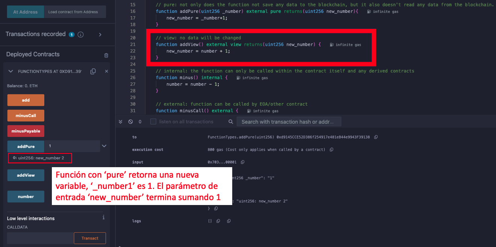
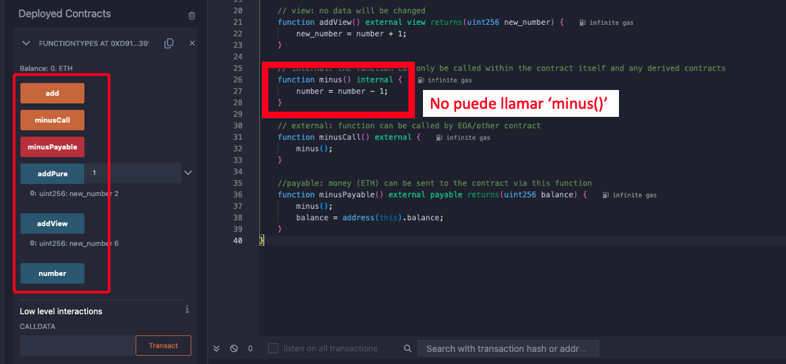
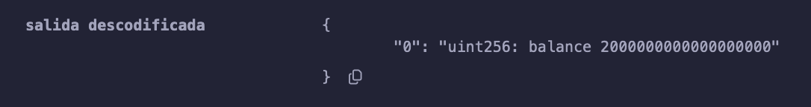
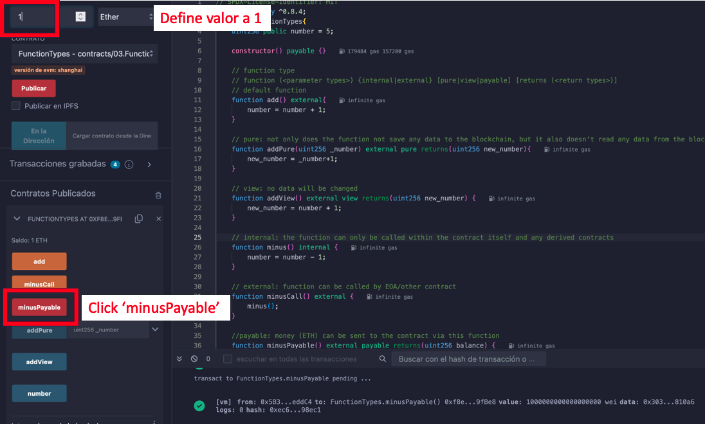

#  WTF Tutorial Solidity: 3. Función

Recientemente, he estado revisando Solidity, consolidando detalles y escribiendo tutoriales "WTF Solidity" para principiantes.

Twitter: [@0xAA_Science](https://twitter.com/0xAA_Science) | [@WTFAcademy_](https://twitter.com/WTFAcademy_)

Comunidad: [Discord](https://discord.gg/5akcruXrsk)｜[Wechat](https://docs.google.com/forms/d/e/1FAIpQLSe4KGT8Sh6sJ7hedQRuIYirOoZK_85miz3dw7vA1-YjodgJ-A/viewform?usp=sf_link)｜[Website wtf.academy](https://wtf.academy)

Los códigos y tutoriales están como código abierto en GitHub: [github.com/AmazingAng/WTFSolidity](https://github.com/AmazingAng/WTFSolidity)


---

## Función (Function)

Este es el formato de una función en Solidity:

```solidity
    function <nombre de la función>(<tipos de los parámetros>) [internal|external] [pure|view|payable] [returns (<tipos de retorno>)]
```

Puede parecer complejo, pero desglosémoslo pieza por pieza (los corchetes cuadrados indican palabras clave opcionales):


1. `function`: Para escribir una función, necesitas comenzar con la palabra clave `function`.

2. `<function name>`: El nombre de la función.

3. `(<parameter types>)`: Los tipos y nombres de los parámetros de entrada.

3. `[internal|external|public|private]`: Especificadores de visibilidad de la función. Especificar explicitamente la visibilidad es una buena práctica, por lo que debes especificarla para cada función. Hay 4 tipos de ellos:

   - `public`: Visible para todos.

   - `private`: Solo puede ser accedido dentro de este contrato, los contratos derivados no pueden usarlo.

   - `external`: Solo puede ser llamado desde otros contratos. Pero también puede ser llamado por `this.f()` dentro del contrato, donde `f` es el nombre de la función.

   - `internal`: Solo puede ser accedido internamente y por contratos que derivan de él.

    **Nota 1**: `public` es la visibilidad predeterminada para las funciones.
    
    **Nota 2**: `public|private|internal` también puede ser usado en variables de estado. Las variables públicas generarán automáticamente funciones `getter` para consultar valores.
    
    **Note 3**: La visibilidad predeterminada para las variables de estado es `internal`.

4. `[pure|view|payable]`: Son palabras clave que dictan el comportamiento de las funciones de Solidity. `payable` (pagable) is facil de entender. Se puede enviar `ETH` a un contrato con funciones `payable` (pagables). `pure` y `view` se introducen en la próxima sección.

5. `[returns (<tipos de retorno>)]`: Tipos y nombres de las variables de retorno.

## WTF es `Pure` y `View`?

Cuando empecé a aprender `Solidity`, no entendía en absoluto las palabras clave `pure` y `view`, ya que no son comunes en otros lenguajes. `Solidity` agregó estas dos palabras clave debido al costo del gas `(gas fee)`. Las variables de estado del contrato se almacenan en la cadena de bloques, y el costo del gas `(gas fee)` es muy elevado. Si no reescribes estas variables, no necesitas pagar `gas`. No necesitas pagar gas por llamar a funciones `pure` y `view`.

Las siguientes acciones se consideran modificaciones del estado:

1. Escribir en variables de estado.

2. Emitir eventos.

3. Crear otros contratos.

4. Usar `selfdestruct`.

5. Enviar Ether mediante llamadas.

6. Llamar a cualquier función que no esté marcada como view o pure.

7. Usar llamadas de bajo nivel.

8. Usar código assembly en líneas de código que contienen ciertos `opcodes`.


Hice un dibujo para visualizar `pure` and `view`. En la imagen, la variable de estado está representada por la Princesa Peach, y las palabras clave están representadas por tres personajes diferentes.


- `pure` : Las funciones que contienen la palabra clave `pure` no pueden leer ni escribir variables de estado en la cadena de bloques. Al igual que el pequeño monstruo, no puede ver ni tocar a la Princesa Peach.

- `view` : Las funciones que contienen la palabra clave `view` pueden leer, pero no escribir, variables de estado en la cadena de bloques. Similar a Mario, capaz de ver a la Princesa pero no puede tocarla.

- Sin `pure` y `view`: Las funciones pueden leer y escribir variables de estado. Como el `jefe`, que puede hacer lo que quiera.

## Código

### 1. pure v.s. view

Definimos una variable de estado como `number = 5`

```solidity
    // SPDX-License-Identifier: MIT
    pragma solidity ^0.8.4;
    contract FunctionTypes{
        uint256 public number = 5;
```

Define una función `add()`, que añade 1 a `number` en cada llamado.

```solidity
    // default
    function add() external{
        number = number + 1;
    }
```

Si `add()` contiene la palabra clave `pure`, por ejemplo, `function add() pure external`, resultará en un error. Esto se debe a que `pure` no puede leer ni escribir variables de estado en el contrato. Entonces, ¿qué puede hacer `pure`? Por ejemplo, puedes pasar un parámetro `_number` a la función, y dejar que la función devuelva `_number + 1`.

```solidity
    // pure
    function addPure(uint256 _number) external pure returns(uint256 new_number){
        new_number = _number+1;
    }
```

**Ejemplo:**


Si `add()` contiene `view`, es decir, `function add() view external`, también resultará en un error. Esto se debe a que `view` puede leer, pero no puede escribir variables de estado. Podemos modificar la función de la siguiente manera:

```solidity
    // view
    function addView() external view returns(uint256 new_number) {
        new_number = number + 1;
    }
```

**Example:**


### 2. Internal v.s. external

```solidity
    // internal
    function minus() internal {
        number = number - 1;
    }

    // external
    function minusCall() external {
        minus();
    }
```

Aquí definimos una función `internal minus()`, `number` disminuirá en 1 cada vez que se llame a la función. Dado que la función `internal` solo puede ser llamada dentro del propio contrato, necesitamos definir una función `external minusCall()` para llamar internamente a `minus()`.

**Ejemplo:**


### 3. Payable

```solidity
    // payable: money (ETH) can be sent to the contract via this function
    function minusPayable() external payable returns(uint256 balance) {
        minus();
        balance = address(this).balance;
    }
```

Definimos una función `external payable minusPayable()`, la cual llama a `minus()` y devuelve el `balance de ETH` del contrato actual (la palabra clave`this` nos permite consultar la dirección del contrato actual). Dado que la función es `payable`, podemos enviar 1 `ETH` al contrato al llamar a `minusPayable()`.


Podemos ver que el balance del contrato es 1 `ETH` en el mensaje de retorno.



**Ejemplo:**


## Resumen

En esta sección, introducimos el tipo de función en `Solidity`. Las palabras clave `pure` y `view` son difíciles de entender, ya que no son comunes en otros lenguajes de programación. No necesitas pagar tarifas de gas por llamar a funciones `pure` o `view`, ya que no modifican los datos en la cadena de bloques.