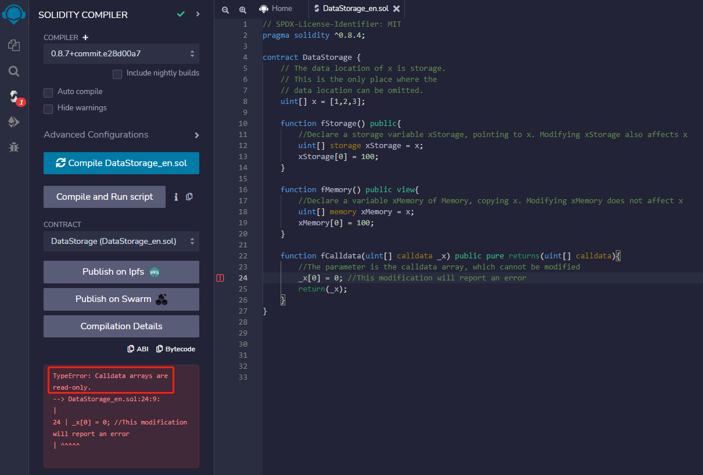
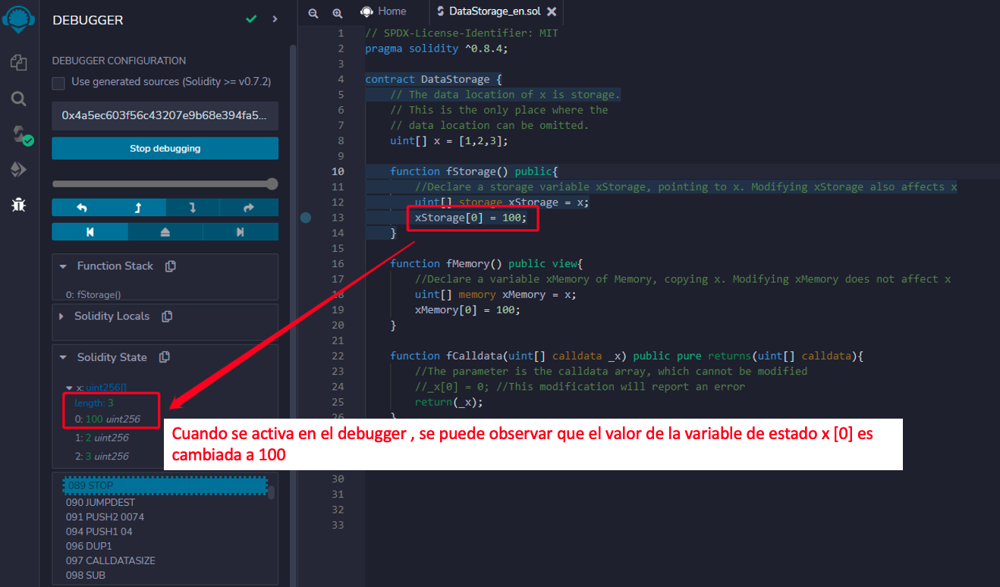
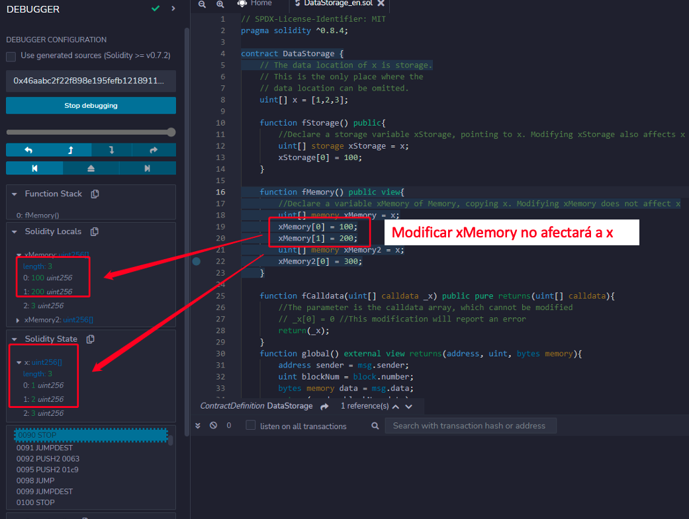
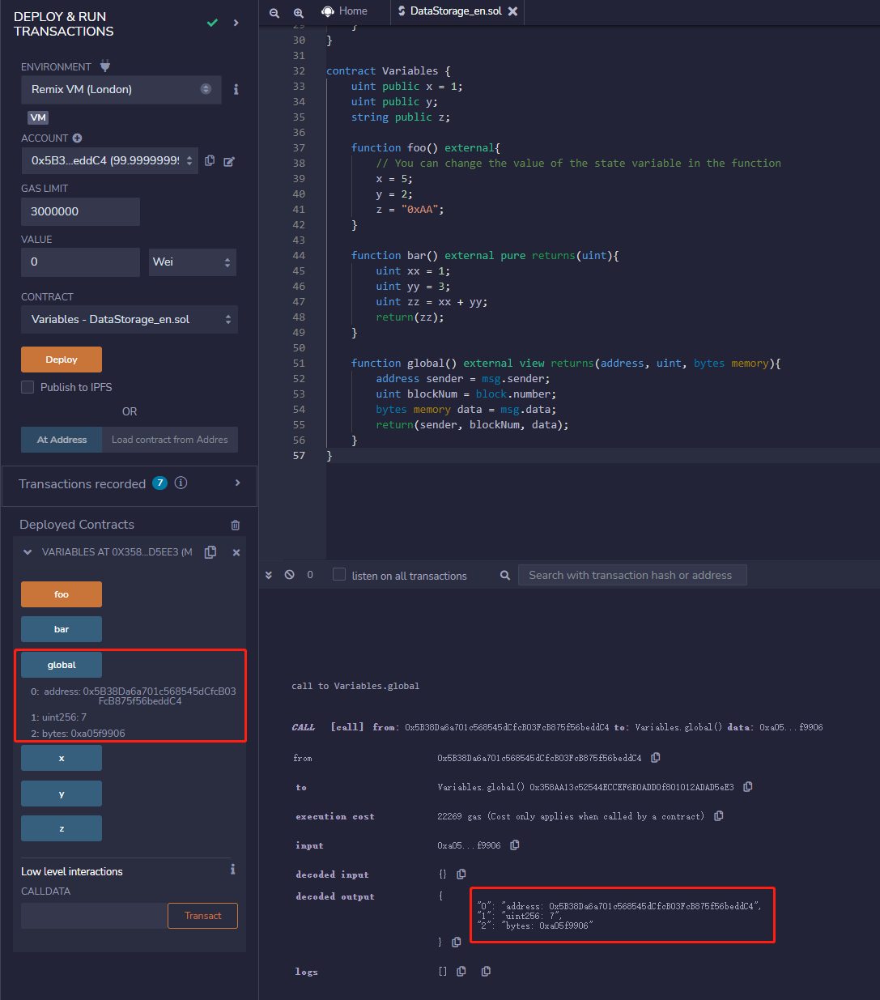

# Tutorial WTF Solidity : 5. Almacenamiento de Datos y Alcance

Recientemente, he estado revisando Solidity, consolidando detalles y escribiendo tutoriales "WTF Solidity" para principiantes.

Twitter: [@0xAA_Science](https://twitter.com/0xAA_Science) | [@WTFAcademy_](https://twitter.com/WTFAcademy_)

Comunidad: [Discord](https://discord.gg/5akcruXrsk)｜[Wechat](https://docs.google.com/forms/d/e/1FAIpQLSe4KGT8Sh6sJ7hedQRuIYirOoZK_85miz3dw7vA1-YjodgJ-A/viewform?usp=sf_link)｜[Website wtf.academy](https://wtf.academy)

La traducción al español ha sido realizada por Angela Ocando con el objetivo de hacer estos recursos accesibles a la comunidad de habla hispana.

Twitter: [@ocandocrypto](https://twitter.com/ocandocrypto)

Los códigos y tutoriales están como código abierto en GitHub: [github.com/AmazingAng/WTFSolidity](https://github.com/AmazingAng/WTFSolidity)

-----

## Tipos de referencia en Solidity
**Tipo de Referencia**: Reference types differ from value types in that they do not store values directly on their own. Instead, reference types store the address/pointer of the data’s location and do not directly share the data. You can modify the underlying data with different variable names. Reference types `array`, `struct` and `mapping`, which take up a lot of storage space. We need to deal with the location of the data storage when using them. 
Los tipos de referencia difieren de los tipos de valor en que no almacenan valores directamente por sí mismos. En su lugar, los tipos de referencia almacenan la dirección/puntero de la ubicación de los datos y no comparten directamente los datos. Puedes modificar los datos subyacentes con diferentes nombres de variables. Los tipos de referencia `array`, `struct` y `mapping`, que ocupan mucho espacio de almacenamiento. Se deben usar por medio de la ubicación del almacenamiento de datos.

## Ubicación de datos
Hay tres tipos de ubicaciones de almacenamiento de datos en solidity: `storage`, `memory` y `calldata`. Los costos de gas son diferentes para cada tipo de almacenamiento.

Los datos de una variable tipo `storage` se almacenan en la `blockchain`, similar al disco duro de una computadora, y consume mucho `gas`; mientras que los datos de las variables `memory` y `calldata` se almacenan temporalmente en memoria, y consumen menos gas.

Uso general:

1. `storage`: The state variables are `storage` by default, which are stored on-chain. Las variables de estado son `storage` por defecto, es decir, se almacenan `on-chain`.

2. `memory`: The parameters and temporary variables in the function generally use `memory` label, which is stored in memory and not on-chain.  Los parámetros y variables temporales en la función generalmente usan la etiqueta `memory`, que se almacena en memoria (`off-chain`) y no `on-chain`.

3. `calldata`: Similar a `memory`, es almacenado en memoria, no `on-chain`. La diferencia de `memory` es que las variables `calldata` no pueden ser modificadas, y generalmente se usan para parámetros de función. Ejemplo:

```solidity
    function fCalldata(uint[] calldata _x) public pure returns(uint[] calldata){
        //El parámetro es el arreglo calldata, que no puede ser modificado.
        // _x[0] = 0 //Esta modificación reportará un error.
        return(_x);
    }
```

**Ejemplo:**


### Ubicación de datos y comportamiento de asignación

Las ubicaciones de datos no solo son relevantes para la persistencia de datos, sino también para la semántica de las asignaciones:

1. Cuando `storage` (una variable de estado del contrato) se asigna al local `storage` (en una función), se creará una referencia, y cambiar el valor de la nueva variable afectará a la original. Ejemplo:
```solidity
    uint[] x = [1,2,3]; // variable de estado: arreglo x

    function fStorage() public{
        //Declara una variable de almacenamiento xStorage, apuntando a x. Modificar xStorage también afectará a x
        uint[] storage xStorage = x;
        xStorage[0] = 100;
    }
```
**Ejemplo:**


2. Asignar `storage` a `memory` crea copias independientes, y los cambios en uno no afectarán al otro; y viceversa. Ejemplo:
```solidity
    uint[] x = [1,2,3]; // variable de estado: arreglo x
    
    function fMemory() public view{
        //Declara una variable xMemory de Memory, copia x. Modificar xMemory no afectará a x
        uint[] memory xMemory = x;
        xMemory[0] = 100;
    }
```
**Ejemplo:**


3. Asignar `memory` a `memory` creará una referencia, y cambiar la nueva variable afectará a la variable original.

4. Al contrario, asignar una variable a `storage` creará copias independientes, y modificar una no afectará a la otra.

## Alcance de la variable
Hay tres tipos de variables en `Solidity` según su ámbito: variables de estado, variables locales y variables globales.

### 1. Variables de estado
Las variables de estado son variables cuyos datos se almacenan en cadena y pueden ser accedidas por funciones dentro del contrato, pero su consumo de `gas` es alto.

Las variables de estado se declaran dentro del contrato y fuera de las funciones:
```solidity
contract Variables {
    uint public x = 1;
    uint public y;
    string public z;
```

Podemos cambiar el valor de la variable de estado en una función:

```solidity
    function foo() external{
        // Puedes cambiar el valor de la variable de estado en la función
        x = 5;
        y = 2;
        z = "0xAA";
    }
```

### 2. Variable local
Las variables locales son variables que solo son válidas durante la ejecución de la función; son inválidas después de la salida de la función. Los datos de las variables locales se almacenan en memoria, no en cadena, y su consumo de `gas` es bajo.

Las variables locales se declaran dentro de una función:
```solidity
    function bar() external pure returns(uint){
        uint xx = 1;
        uint yy = 3;
        uint zz = xx + yy;
        return(zz);
    }
```

### 3. Variable global
Las variables globales son variables que funcionan en el ámbito global y son palabras reservadas para `Solidity`. Pueden usarse directamente en funciones sin declararlas:

```solidity
    function global() external view returns(address, uint, bytes memory){
        address sender = msg.sender;
        uint blockNum = block.number;
        bytes memory data = msg.data;
        return(sender, blockNum, data);
    }
```
En el ejemplo anterior, usamos tres variables globales: `msg.sender`, `block.number` y `msg.data`, que representan al remitente del mensaje (llamada actual), altura del bloque actual y datos completos de calldata, respectivamente. 

Below are some commonly used global variables:

- `blockhash(uint blockNumber)`: (`bytes32`)          El hash del bloque dado - solo aplica para los 256 bloques más recientes.
- `block.coinbase`             : (`address payable`) La dirección del minero del bloque actual
- `block.gaslimit`             : (`uint`)            El límite de gas del bloque actual
- `block.number`               : (`uint`)            Número de bloque actual
- `block.timestamp`            : (`uint`)            El sello de tiempo del bloque actual, en segundos desde la época unix
- `gasleft()`                  : (`uint256`)         Gas restante
- `msg.data`                   : (`bytes calldata`)  Calldata completa
- `msg.sender`                 : (`address payable`) Remitente del mensaje (llamador actual)
- `msg.sig`                    : (`bytes4`)          Primeros cuatro bytes del calldata (es decir, identificador de función)
- `msg.value`                  : (`bytes4`)          Número de wei enviados con el mensaje

**Ejemplo:**


## Resumen
En este capítulo, introducimos los tipos de referencia, ubicaciones de almacenamiento de datos y ámbitos de variables en `Solidity`. Hay tres tipos de ubicaciones de almacenamiento de datos: `storage`, `memory` y `calldata`. Los costos de gas son diferentes para diferentes ubicaciones de almacenamiento. El ámbito de la variable incluye variables de estado, variables locales y variables globales.

