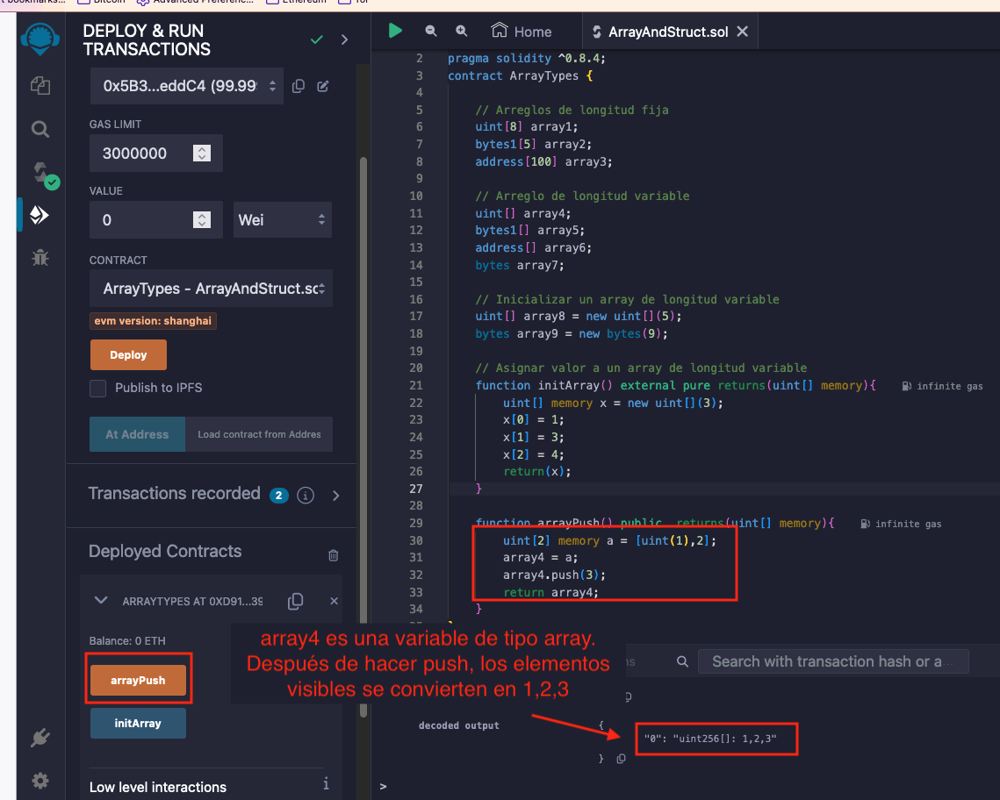

# Tutorial WTF Solidity: 6. Arreglos y Estructuras

Recientemente, he estado revisando Solidity y escribiendo tutoriales en "WTF Solidity" para principiantes.

Twitter: [@0xAA_Science](https://twitter.com/0xAA_Science) | [@WTFAcademy_](https://twitter.com/WTFAcademy_)

Comunidad: [Discord](https://discord.gg/5akcruXrsk)｜[Wechat](https://docs.google.com/forms/d/e/1FAIpQLSe4KGT8Sh6sJ7hedQRuIYirOoZK_85miz3dw7vA1-YjodgJ-A/viewform?usp=sf_link)｜[Sitio web wtf.academy](https://wtf.academy)

La traducción al español ha sido realizada por Angela Ocando con el objetivo de hacer estos recursos accesibles a la comunidad de habla hispana.

Twitter: [@ocandocrypto](https://twitter.com/ocandocrypto)

Los códigos y tutoriales están como código abierto en GitHub: [github.com/AmazingAng/WTFSolidity](https://github.com/AmazingAng/WTFSolidity)


-----

En esta lección, se introducirá dos importantes tipos de variables en Solidity: `array` y `struct`

## Arreglos

Un `Array` es un tipo de variable comúnmente utilizado en Solidity para almacenar conjuntos de datos (enteros, bytes, direcciones, etc.).

Hay dos tipos de arreglos: Arreglos de tamaño fijo y arreglos de tamaño dinámico:

- Arreglos de tamaño fijo: La longitud del arreglo se especifica en el momento de la declaración. Un `array` se declara usando el formato `T[k]` donde `T` es el tipo de variable y `k` es la longitud.

```solidity
    // Arreglos de longitud fija
    uint[8] array1;
    byte[5] array2;
    address[100] array3;
```

- Arreglos de tamaño dinámico (dynamic array): La longitud del arreglo no se especifica durante la declaración. Se utiliza el formato `T[]`, donde `T` es el tipo de variable.

```solidity
    // Arreglo de longitud variable
    uint[] array4;
    byte[] array5;
    address[] array6;
    bytes array7;
```

**Aviso**: `bytes` es un caso especial, es un array dinámico, pero no se necesita añadir `[]` en su declaración. Se puede usar `bytes` o `bytes1[]` para declarar un array de bytes, pero no `byte[]`. Se recomienda usar `bytes` ya que consume menos gas que `bytes1[]`.

### Reglas para crear arreglos 

En Solidity, hay algunas reglas para crear arreglos:

- Para un arreglo dinámico que es almacenado en `memory`, se puede crear el arreglo usando el operador `new`, pero se debe asignar la longitud del arreglo la cual no puede ser cambiada después. Por ejemplo:

```solidity
    // arreglo dinámico en memoria
    uint[] memory array8 = new uint[](5);
    bytes memory array9 = new bytes(9);
```

- Los arreglos literales son arreglos en forma de una o más expresiones, y no se asignan inmediatamente a variables; como `[uint(1),2,3]` (el tipo de variable del primer elemento necesita ser declaro, de lo contrario se usa el tipo con el espacio de almacenamiento más pequeño por defecto).

- Al crear un arreglo dinámico, se necesita asignar cada elemento del arreglo.

```solidity
    uint[] memory x = new uint[](3);
    x[0] = 1;
    x[1] = 3;
    x[2] = 4;
```

### Funciones y atributos de un arreglo

- `length`: Los arreglos tienen un atributo `length` que contiene el número de elementos del arreglo, la longitud de un arreglo en `memory` es fija después de su creación.
- `push()`: Los arreglos dinámicos tienen una función `push()` que añade un elemento `0` al final del arreglo.
- `push(x)`: Los arreglos dinámicos tienen una función `push(x)` que puede añadir un elemento `x` al final del arreglo.
- `pop()`: Los arreglos dinámicos tienen una función `pop()` que elimina el último elemento del arreglo.

**Ejemplo:**



## Estructuras

Se pueden definir nuevos tipos de datos usando `struct` en Solidity. Los elementos de un `struct` pueden ser tipos primitivos o tipos de referencia. Y un `struct` puede ser el elemento para `array` o `mapping`

```solidity
    struct Student{
        uint256 id;
        uint256 score; 
    }

    Student student; // Iniciar un struct de estudiante
```

Hay 4 maneras de asignar valores a un `struct`:

```solidity
    // Asignar el valor a una struct
    // Método 1: Se crea una referencia storage struct en la función
    function initStudent1() external{
        Student storage _student = student; // Asigna una copia de student
        _student.id = 11;
        _student.score = 100;
    }
```

**Ejemplo:**


```solidity
     // Método 2: Referir directamente al struct de la variable de estado
    function initStudent2() external{
        student.id = 1;
        student.score = 80;
    }
```

**Ejemplo:**


```solidity
    // Método 3: Constructor struct
    function initStudent3() external {
        student = Student(3, 90);
    }
    
    // Método 4: clave valor
    function initStudent4() external {
        student = Student({id: 4, score: 60});
    }
```


## Resumen

En esta lección, se introdujo el uso básico de `array` y `struct` en Solidity. En la próxima lección, se presentará la tabla hash en Solidity - `mapping`.
