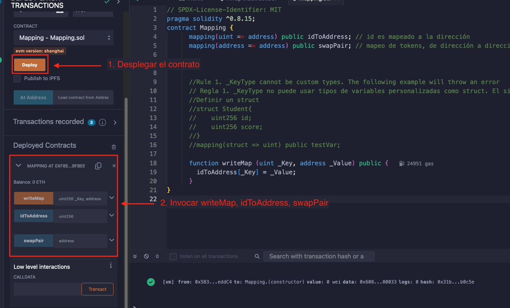
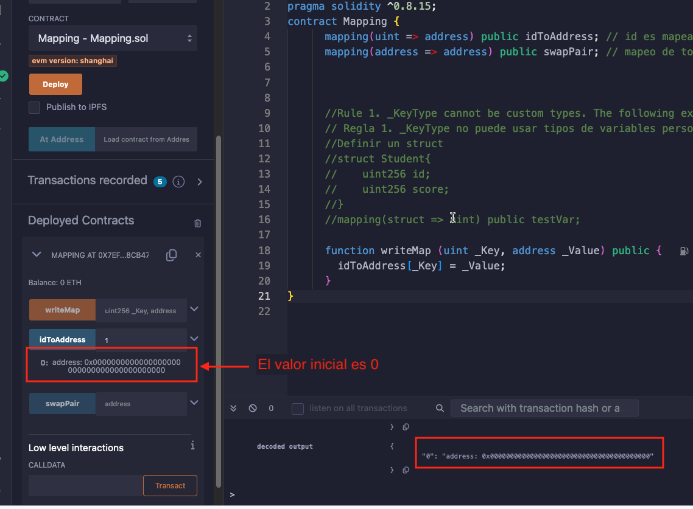

# Tutorial WTF Solidity: 7. Mapeo (Mapping)

Recientemente, he estado revisando Solidity y escribiendo tutoriales en "WTF Solidity" para principiantes.

Twitter: [@0xAA_Science](https://twitter.com/0xAA_Science) | [@WTFAcademy_](https://twitter.com/WTFAcademy_)

Comunidad: [Discord](https://discord.gg/5akcruXrsk)｜[Wechat](https://docs.google.com/forms/d/e/1FAIpQLSe4KGT8Sh6sJ7hedQRuIYirOoZK_85miz3dw7vA1-YjodgJ-A/viewform?usp=sf_link)｜[Sitio web wtf.academy](https://wtf.academy)

La traducción al español ha sido realizada por Angela Ocando con el objetivo de hacer estos recursos accesibles a la comunidad de habla hispana.

Twitter: [@ocandocrypto](https://twitter.com/ocandocrypto)

Los códigos y tutoriales están como código abierto en GitHub: [github.com/AmazingAng/WTFSolidity](https://github.com/AmazingAng/WTFSolidity)


-----

En esta sección, se introducirá la tabla de hashes en Solidity: Tipo `mapping`.


## Mapeo (Mapping)

Con el tipo de variable `mapping`, las personas pueden consultar el `Value` utilizando la `Key` del `mapping`. Por ejemplo, se puede consultar la dirección de la billetera de una persona por su `id`.

El formato para declarar las variables de tipo `mapping` es `mapping(_KeyType => _ValueType)`, donde `_KeyType` y `_ValueType` son los tipos de variable `Key` y `Value` respectivamente. Por ejemplo:

```solidity
    mapping(uint => address) public idToAddress; // id es mapeado a la dirección
    mapping(address => address) public swapPair; // mapeo de tokens, de dirección a dirección
```

## Reglas de `mapping`

- **Regla 1**: El `_KeyType` debe ser seleccionado entre los tipos predeterminados en `solidity` como `uint`, `address`, etc. No se puede usar un `struct` personalizado. Sin embargo, `_ValueType` puede ser de cualquier tipo personalizado. El siguiente ejemplo genera un error por que `_KeyType` usa un struct personalizado:

```solidity
      // definir un struct
      struct Student{
          uint256 id;
          uint256 score;
      }
      mapping(Student => uint) public testVar;
```

- **Regla 2**: La ubicación de almacenamiento del mapeo debe ser `storage`: puede servir como variable de estado o variable `storage` dentro de la función. Pero no se puede usar en argumentos o resultados de retorno de funciones `public`.

- **Regla 3**: Si la variable de tipo `mapping` se declara como `public`, Solidity automáticamente creará una función `getter` para que se pueda consultar el `Value` usando la `Key`

- **Regla 4**: La sintaxis para agregar un par clave-valor a un mapeo es `_Var[Key] = _Value`, donde `_Var` es el nombre de la variable, y `_Key` y `_Value` corresponden al nuevo par clave-valor. Por ejemplo:

```solidity
    function writeMap (uint _Key, address _Value) public {
        idToAddress[_Key] = _Value;
      }
```

## Principios de `mapping`

- **Principio 1**: El mapeo no almacena ninguna `key` ni información de longitud.

- **Principio 2**: Mapping usa `keccak256(key)` como desplazamiento para acceder al valor.

- **Principio 3**: Dado que Ethereum define todo espacio no usado como 0, toda `key` que no se le asigne un `value` tendrá un valor inicial de 0.


## Demo en Remix (usa `Mapping.sol` como ejemplo)

- Desplegar `Mapping.sol`

    

- Verificar el valor inicial del map `idToAddress`.

    

- Escribir un nuevo par clave-valor

    


## Resumen

En esta sección, se introdujo el tipo de variable `mapping` en Solidity. Hasta ahora, se han aprendido los tipos de variables más comunes Solidity.

