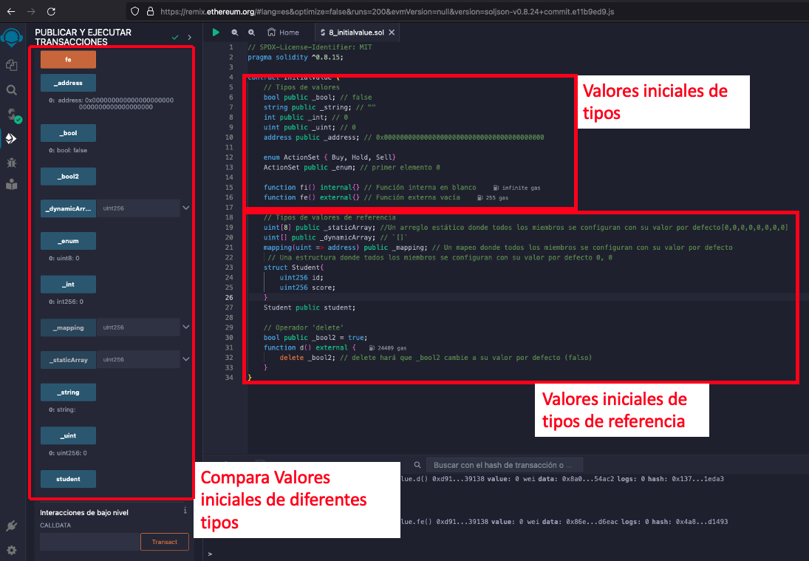
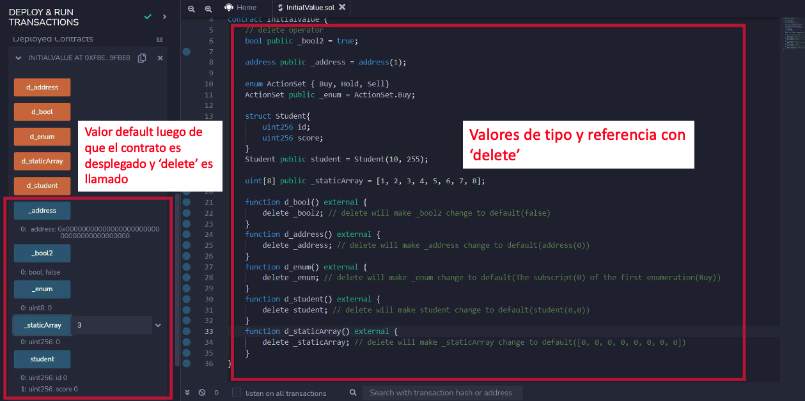

# WTF Tutorial Solidity: 8. Valor inicial de las variables

Recientemente, he estado revisando Solidity, consolidando detalles y escribiendo tutoriales "WTF Solidity" para principiantes.

Twitter: [@0xAA_Science](https://twitter.com/0xAA_Science) | [@WTFAcademy_](https://twitter.com/WTFAcademy_)

Comunidad: [Discord](https://discord.gg/5akcruXrsk)｜[Wechat](https://docs.google.com/forms/d/e/1FAIpQLSe4KGT8Sh6sJ7hedQRuIYirOoZK_85miz3dw7vA1-YjodgJ-A/viewform?usp=sf_link)｜[Website wtf.academy](https://wtf.academy)

La traducción al español ha sido realizada por Sebas G con el objetivo de hacer estos recursos accesibles a la comunidad de habla hispana.

Twitter: [@scguaquetam](https://twitter.com/scguaquetam)

Los códigos y tutoriales están como código abierto en GitHub: [github.com/AmazingAng/WTFSolidity](https://github.com/AmazingAng/WTFSolidity)


-----

## Valores iniciales de las variables

En Solidity, las variables que son declaradas pero no asignadas tienen valores definidos por defecto. En este tutorial, introduciremos los valores iniciales de tipos comunes de variables.

### Valores de variables por defecto

- `boolean`: `false`
- `string`: `""`
- `int`: `0`
- `uint`: `0`
- `enum`: el valor por defecto es el primer elemento de la enumeración
- `address`: `0x0000000000000000000000000000000000000000` (o conocida cómo `address(0)`)
- `function`
    - `internal`: función vacía
    - `external`: función vacía

Puedes usar la función `getter` de una variable `pública` para confirmar los valores iniciales anteriores:

```solidity
    bool public _bool; // false
    string public _string; // ""
    int public _int; // 0
    uint public _uint; // 0
    address public _address; // 0x0000000000000000000000000000000000000000

    enum ActionSet {Buy, Hold, Sell}
    ActionSet public _enum; // primer elemento 0

    function fi() internal{} // función interna en blanco
    function fe() external{} // función externa en blanco
```

### Valores iniciales de tipos de referencia

- `mapping`: En un `mapping` todos los elementos se establecen en sus valores por defecto dependiendo del tipo de variable de la clave y valor del mismo. Por ejemplo un mapping de UINT tendrá todos sus valores en 0.
- `struct`: En un `struct` todos los elementos se establecen en sus valores por defecto dependiendo del tipo de variable de la clave y valor del mismo. Por ejemplo un struct con dos variables de tipo UINT tendrá todos sus valores en 0. 

- `array`
    - arreglo dinámico: `[]` vacío por defecto.
    - arreglo estático（de longitud fija): un arreglo estático donde todos los miembros se establecen en sus valores por defecto.

Puedes usar la función `getter` de una variable `pública` para confirmar los valores iniciales anteriores:

```solidity
    // tipos de referencia
    uint[8] public _staticArray; // un arreglo estático donde todos los miembros se establecen en sus valores por defecto [0,0,0,0,0,0,0,0]
    uint[] public _dynamicArray; // `[]`
    mapping(uint => address) public _mapping; // un mapping donde todos los miembros se establecen en sus valores por defecto
    // un struct donde todos los miembros se establecen en sus valores por defecto 0, 0
    struct Student{
        uint256 id;
        uint256 score; 
    }
    Student public student;
```

### Operador `delete`

`delete a` cambiará el valor de la variable a a su valor inicial.

```solidity
    // operador delete
    bool public _bool2 = true; 
    function d() external {
        delete _bool2; // delete hará que _bool2 cambie a su valor por defecto (false)
    }
```

## Verificar en Remix

- Despliega `InitialValue.sol` y verifica los valores iniciales de los diferentes tipos.

    

- Después de usar el operador `delete`, el valor de las variables se restablece a sus valores iniciales.

    

## Resumen

En esta sección, introducimos los valores iniciales de las variables en Solidity. Cuando una variable es declarada pero no asignada, su valor por defecto es el valor inicial, que es equivalente a `0` representado en su tipo. El operador `delete` puede restablecer el valor de la variable a su valor inicial.
