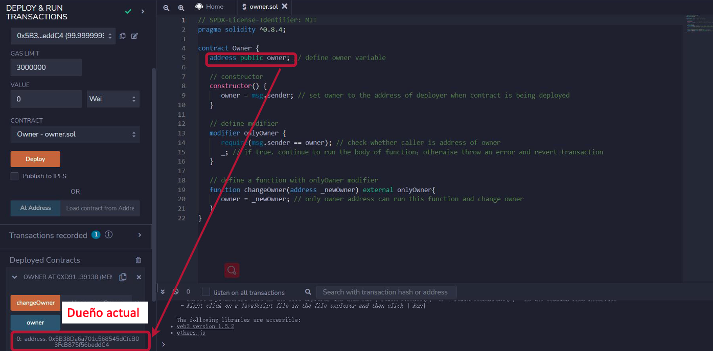
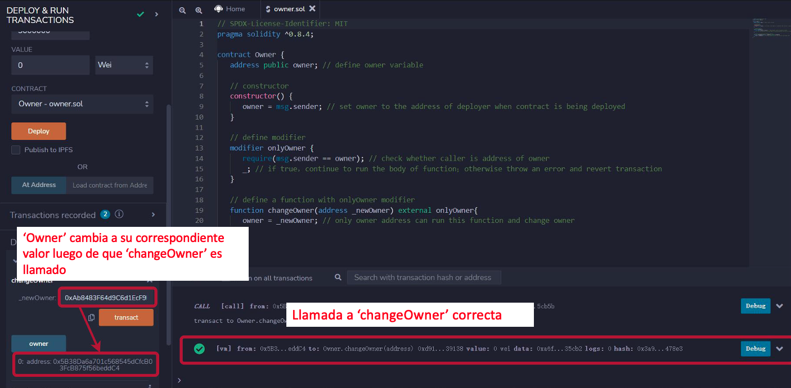
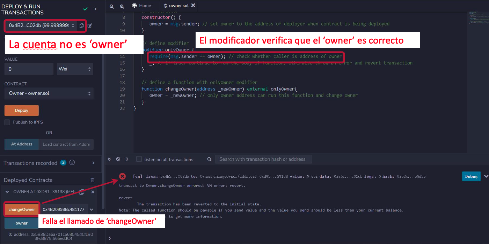

# Tutorial WTF Solidity: 11. Constructor & Modificador

Recientemente, he estado revisando Solidity, consolidando detalles y escribiendo tutoriales "WTF Solidity" para principiantes.

Twitter: [@0xAA_Science](https://twitter.com/0xAA_Science) | [@WTFAcademy_](https://twitter.com/WTFAcademy_)

Comunidad: [Discord](https://discord.gg/5akcruXrsk)｜[Wechat](https://docs.google.com/forms/d/e/1FAIpQLSe4KGT8Sh6sJ7hedQRuIYirOoZK_85miz3dw7vA1-YjodgJ-A/viewform?usp=sf_link)｜[Website wtf.academy](https://wtf.academy)

La traducción al español ha sido realizada por Sebas G con el objetivo de hacer estos recursos accesibles a la comunidad de habla hispana.

Twitter: [@scguaquetam](https://twitter.com/scguaquetam)

Los códigos y tutoriales están como código abierto en GitHub: [github.com/AmazingAng/WTFSolidity](https://github.com/AmazingAng/WTFSolidity)

-----

En esta sección, se introducirá `constructor` y `modificador` en Solidity, utilizando como ejemplo un contrato de control de acceso (`Ownable`).

## Constructor
`constructor` es una función especial, que se ejecutará automáticamente una vez durante el despliegue del contrato. Cada contrato puede tener un `constructor`. Se puede usar para inicializar parámetros de un contrato, como una dirección de propietario (`owner`):

```solidity
   address owner; // define la variable propietario

   // constructor
   constructor() {
      owner = msg.sender;  //Asigna la la dirección del usuario que despliega el contrato como owner
   }
```

**Nota**: La sintaxis del constructor en solidity no es consistente para diferentes versiones: Antes de `solidity 0.4.22`, los constructores no usaban la palabra clave constructor. En su lugar, el constructor tenía el mismo nombre que el contrato. Esta antigua sintaxis es propensa a errores: el desarrollador podría nombrar erróneamente el contrato como `Parents`, mientras que el constructor como `parents`. Por lo tanto, en `0.4.22` y versiones posteriores, se utiliza la nueva palabra clave `constructor`. Ejemplo de constructor anterior a `solidity 0.4.22`:

```solidity
pragma solidity = 0.4.21;
contract Parents {
    // La función que tiene el mismo nombre que el contrato (Parents) es el constructor
    function Parents () public {
    }
}
```

## Modificador
`modifier` es similar a `decorador` en la programación orientada a objetos, que se utiliza para declarar propiedades dedicadas de funciones y reducir la redundancia de código. El `modificador` es la Armadura de Iron Man para funciones: la función con `modificador` tendrá algunas propiedades mágicas. El caso de uso más popular de `modificador` es restringir el acceso a las funciones.


Se define un modificador llamado `onlyOwner`. Las Función que usen `OnlyOwner` solo pueden ser llamadas por el propietario (`owner`):
```solidity
   // define el modificador
   modifier onlyOwner {
      require(msg.sender == owner); // verifica si la dirección que llama la función es la dirección del propietario
      _; // ejecuta el cuerpo de la función
   }
```

A continuación, definamos una función `changeOwner`, que puede cambiar el propietario (`owner`) del contrato. Sin embargo, debido al modificador `onlyOwner`, solo el propietario original puede llamarla. Esta es la forma más común de control de acceso en contratos inteligentes.

```solidity
   function changeOwner(address _newOwner) external onlyOwner{
      owner = _newOwner; // solo la dirección del propietario puede ejecutar esta función y cambiar el propietario
   }
```

### Implementación de Ownable de OpenZeppelin:
`OppenZeppelin` es una organización que mantiene una base de código estandarizada para `Solidity`, Su implementación estándar de `Ownable` está en [este enlace](https://github.com/OpenZeppelin/openzeppelin-contracts/blob/master/contracts/access/Ownable.sol).

## Demo en Remix
Aquí, tomamos Owner.sol como ejemplo.
1. Compilar y despliega el código en Remix.
2. Hacer clic en el botón `owner` para ver la dirección del propietario actual.
    
3. La transacción tiene éxito cuando la función `changeOwner` es llamada por el usuario de la dirección del propietario.
    
4. La transacción falla cuando la función `changeOwner` es llamada por otras direcciones.
    


## Summary
En esta lección, se introdujo `constructor` y `modificador` en Solidity, y escribimos un contrato `Ownable` que controla el acceso del contrato.
