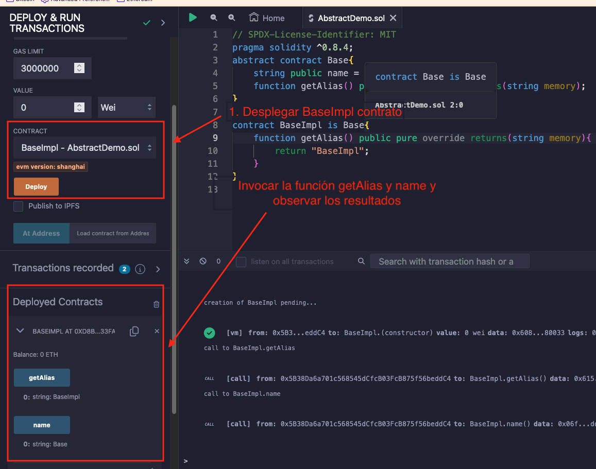

# Tutorial WTF Solidity: 14. Abstracción y Interfaz

Recientemente, he estado revisando Solidity y escribiendo tutoriales en "WTF Solidity" para principiantes.

Twitter: [@0xAA_Science](https://twitter.com/0xAA_Science) | [@WTFAcademy_](https://twitter.com/WTFAcademy_)

Comunidad: [Discord](https://discord.gg/5akcruXrsk)｜[Wechat](https://docs.google.com/forms/d/e/1FAIpQLSe4KGT8Sh6sJ7hedQRuIYirOoZK_85miz3dw7vA1-YjodgJ-A/viewform?usp=sf_link)｜[Sitio web wtf.academy](https://wtf.academy)

La traducción al español ha sido realizada por Jonathan Díaz con el objetivo de hacer estos recursos accesibles a la comunidad de habla hispana.

Twitter: [@jonthdiaz](https://twitter.com/jonthdiaz)

Los códigos y tutoriales están como código abierto en GitHub: [github.com/AmazingAng/WTFSolidity](https://github.com/AmazingAng/WTFSolidity)

-----

En esta sección, se introducirá los contratos `abstract` y `interface` en Solidity, se usara como ejemplo la interfaz `ERC721`. Este tipo de contratos permitir crear plantillas y reducir la redundancia de código.

## Contrato Abstracto

Si un contrato contiene al menos una función no implementada (sin contenido en el cuerpo de la función, `{}`) debe ser marcado con la palabra clave `abstract`; de lo contrario, no se compilará. Además, la función no implementada necesita usar la palabra clave `virtual`
Se toma el contrato [Contrato de Ordenación por Inserción](https://github.com/AmazingAng/WTFSolidity/tree/main/07_InsertionSort) anterior como ejemplo, 
si no se ha descubierto cómo implementar la función de ordenación por inserción, se puede marcar el contrato como `abstract` y permitir que otros lo sobrescriban en el futuro.


```solidity
abstract contract InsertionSort{
    function insertionSort(uint[] memory a) public pure virtual returns(uint[] memory);
}
```

## Interfaz

El contrato de tipo `interface` es similar al contrato de tipo `abstract`, pero requiere que no tenga contenido en el cuerpo de las funciones. Reglas de las interfaces:

1. No puede contener variables de estado.
2. No puede contener constructores.
3. No pueden heredar contratos que no sean de tipo interfaz.
4. Todas las funciones deben ser externas y no pueden tener contenido en el cuerpo de la función.
5. El contrato que hereda del contrato interfaz debe implementar todas las funciones definidas en él.

Aunque la interfaz no implementa ninguna funcionalidad, es el esqueleto de los contratos inteligentes.
La interfaz define qué hace el contrato y cómo interactuar con ellos: si un contrato inteligente implementa una interfaz (como `ERC20` o `ERC721`),
otras Dapps y contratos inteligentes sabrán cómo interactuar con él. Por que proporciona dos piezas importantes de información:

1. El selector `bytes4` para cada función en el contrato, y las firmas de las funciones `function name (parameter type)`.
2. Identificador de la interfaz (ver [EIP165](https://eips.ethereum.org/EIPS/eip-165) para más información).

Además, la interfaz es equivalente al `ABI` del contrato (Interfaz Binaria de Aplicación)
y se pueden convertir uno en el otro: cuando se compila el contrato inteligente de interfaz se mostrará el `ABI` del contrato,
y la herramienta  [abi-to-sol](https://gnidan.github.io/abi-to-sol/) convertirá el `ABI` de nuevo al contrato de la interfaz.

Se toma el contrato `IERC721`, la interfaz estándar creada para el token `ERC721`, cómo ejemplo. La cual consiste en 3 eventos y 9 funciones,
que todos los contratos `ERC721` necesitan implementar. En la interfaz, cada función termina con `;` en lugar del cuerpo de la función `{ }`. Además, cada función en el contrato de interfaz tiene la palabra clave `virtual`, por lo que no necesita etiquetar la función como `virtual` explícitamente.


```solidity
interface IERC721 is IERC165 {
    event Traproved, uint256 indexed tokenId);
    event ApprovalForAll(address indexed owner, address indexed operator, bool approved);
    
    function balanceOf(address owner) external view returns (uint256 balance);

    function ownerOf(uint256 tokenId) external view returns (address owner);

    function safeTransferFrom(address from, address to, uint256 tokenId) external;

    function transferFrom(address from, address to, uint256 tokenId) external;

    function approve(address to, uint256 tokenId) external;

    function getApproved(uint256 tokenId) external view returns (address operator);

    function setApprovalForAll(address operator, bool _approved) external;

    function isApprovedForAll(address owner, address operator) external view returns (bool);

    function safeTransferFrom( address from, address to, uint256 tokenId, bytes calldata data) external;
}
```

### Eventos IERC721
`IERC721` contiene 3 eventos.
- Evento `Transfer`: emitido durante la transferencia, registra la dirección de envió `from`, la dirección de destino `to` y `tokenid`
- Evento `Approval`: emitido durante la aprobación, registra la dirección del propietario del token `owner`, la dirección aprobada `approved` y `tokenid` 
- Evento `ApprovalForAll`: emitido durante la aprobación en lote, registra la dirección del propietario `owner` de la aprobación del lote, la dirección aprobada `operator` y si la aprobación esta habilitada o deshabilitada `approved`.

### Función IERC721
`IERC721` contiene 3 eventos.
- `balanceOf`: Cuenta todos los NFTs que posee un propietario.
- `ownerOf`: Encuentra el propietario de un NFT (`tokenId`).
- `transferFrom`: Transfiere la propiedad de un NFT con `tokenId` de `from` a `to`.
- `safeTransferFrom`: Transfiere la propiedad de un NFT con `tokenId` de `from` a `to`. Verificación extra: si  el receptor es una dirección de contrato, se requerirá que implemente la interfaz `ERC721Receiver`.
- `approve`: Habilita o deshabilita a otra dirección para gestionar el NFT.
- `getApproved`: Obtiene la dirección aprobada para un único NFT.
- `setApprovalForAll`: Habilita o deshabilita la aprobación para que un tercero gestione todos los NFTs del contrato.
- `isApprovedForAll`: Consulta si una dirección es un operador autorizado para otra dirección.
- `safeTransferFrom`: Función sobrecargada para la transferencia segura, contiene `data` en sus parámetros.


### ¿Cuándo usar una interfaz?
Si sabemos que un contrato implementa la interfaz `IERC721`, podemos interactuar con él sin conocer su implementación detallada.

El Bored Ape Yacht Club `BAYC` es un NFT `ERC721` que implementa todas las funciones de la interfaz `IERC721`. Podemos interactuar con el contrato `BAYC` con la interfaz `IERC721` y su dirección de contrato, sin conocer su código fuente.
Por ejemplo, se puede usar `balanceOf()` para consultar el saldo de `BAYC` de una dirección, o usar `safeTransferFrom()` para transferir un NFT `BAYC`.


```solidity
contract interactBAYC {
    // Usar la dirección de BAYC para crear variables en el contrato de interfaz (ETH red principal)
    IERC721 BAYC = IERC721(0xBC4CA0EdA7647A8aB7C2061c2E118A18a936f13D);

    // Llamar a balanceOf de BAYC para consultar el interés abierto a través de la interfaz
    function balanceOfBAYC(address owner) external view returns (uint256 balance){
        return BAYC.balanceOf(owner);
    }

    // Transferencia segura llamanda a safeTransferFrom() de BAYC a través de la interfaz
    function safeTransferFromBAYC(address from, address to, uint256 tokenId) external{
        BAYC.safeTransferFrom(from, to, tokenId);
    }
}
```

## Demo en Remix
1. Ejemplo contracto inteligente abstracto:
  
2. Ejemplo contrato inteligente usando interfaz:
  

## Resumen
En este capítulo, se introdujo los contratos tipo `abstract` e `interface` en Solidity, que se utilizan para escribir plantillas de contratos y reducir la redundancia de código.
También se aprendió la interfaz estándar para el token `ERC721` y cómo interactuar con el contrato `BAYC` usando la interfaz.
