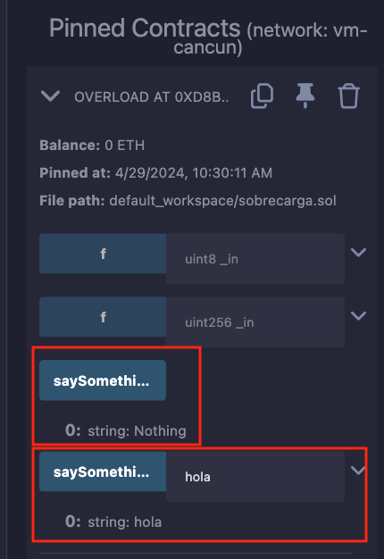

# Tutorial WTF Solidity: 16. Sobrecarga

Recientemente, he estado revisando Solidity y escribiendo tutoriales en "WTF Solidity" para principiantes.

Twitter: [@0xAA_Science](https://twitter.com/0xAA_Science) | [@WTFAcademy_](https://twitter.com/WTFAcademy_)

Comunidad: [Discord](https://discord.gg/5akcruXrsk)｜[Wechat](https://docs.google.com/forms/d/e/1FAIpQLSe4KGT8Sh6sJ7hedQRuIYirOoZK_85miz3dw7vA1-YjodgJ-A/viewform?usp=sf_link)｜[Sitio web wtf.academy](https://wtf.academy)

La traducción al español ha sido realizada por Jonathan Díaz con el objetivo de hacer estos recursos accesibles a la comunidad de habla hispana.

Twitter: [@jonthdiaz](https://twitter.com/jonthdiaz)

Los códigos y tutoriales están como código abierto en GitHub: [github.com/AmazingAng/WTFSolidity](https://github.com/AmazingAng/WTFSolidity)

-----

## Sobrecarga
`solidity` permite la sobrecarga de funciones (`overloading`). Es decir, funciones con el mismo nombre pero diferentes tipos de parámetros de entrada pueden existir al mismo tiempo, 
y se consideran funciones diferentes.
Note que `solidity` no permite la sobrecarga de modificadores (`modifier`).

### Sobrecarga de Funciones
Por ejemplo, se podría definir dos funciones llamadas `saySomething()`:
una sin argumentos y que devuelva `"Nothing"`, la otra que tome un argumento de tipo `string` y devuelva un `string`.

```solidity
function saySomething() public pure returns(string memory){
    return("Nothing");
}

function saySomething(string memory something) public pure returns(string memory){
    return(something);
}
```

Después de compilar, todas las funciones de sobrecarga se convierten en selectores de funciones diferentes debido a los diferentes tipos de parámetros.
Para ver el contenido específico del selector de una función, consultar [WTF Solidity Tutorial: 29. Function Selector](https://github.com/AmazingAng/WTFSolidity/tree/main/29_Selector)

Tomando el contrato `Overloading.sol` como ejemplo, después de compilar y desplegar en Remix.
Después de llamar a las funciones de sobrecarga `saySomething()` y `saySomething(string memory something)` respectivamente,
se pueden ver diferentes resultados, ya que las funciones se consideran diferentes.



### Coincidencia de Argumentos

Cuando se llama a la función de sobrecarga, el tipo de variable se emparejará entre el parámetro de entrada y los parámetros de la función.
Se generará un error si hay múltiples funciones de sobrecarga coincidentes,
El siguiente ejemplo tiene dos funciones llamadas `f()`, una tiene el parámetro `uint8` y la otra tiene `uint256`:

```solidity
    function f(uint8 _in) public pure returns (uint8 out) {
        out = _in;
    }

    function f(uint256 _in) public pure returns (uint256 out) {
        out = _in;
    }
```
El número `50` se puede convertir tanto a `uint8` como a `uint256`, por lo que se generará un error si se llama a `f(50)`.

## Resumen
En esta lección, se presento el uso básico de la función de sobrecarga en `solidity`:
las funciones con el mismo nombre pero diferentes tipos de parámetros de entrada pueden existir al mismo tiempo,
y se consideran funciones diferentes.
