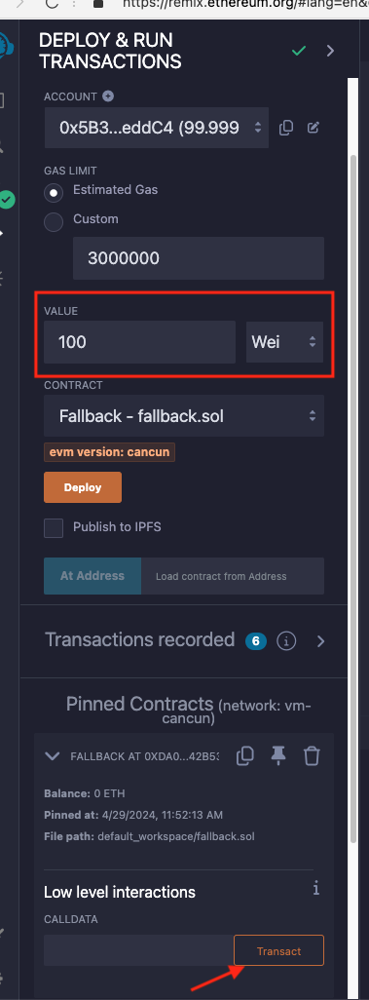
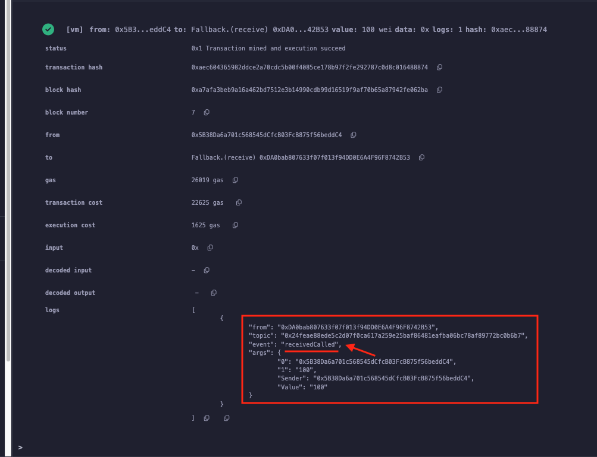
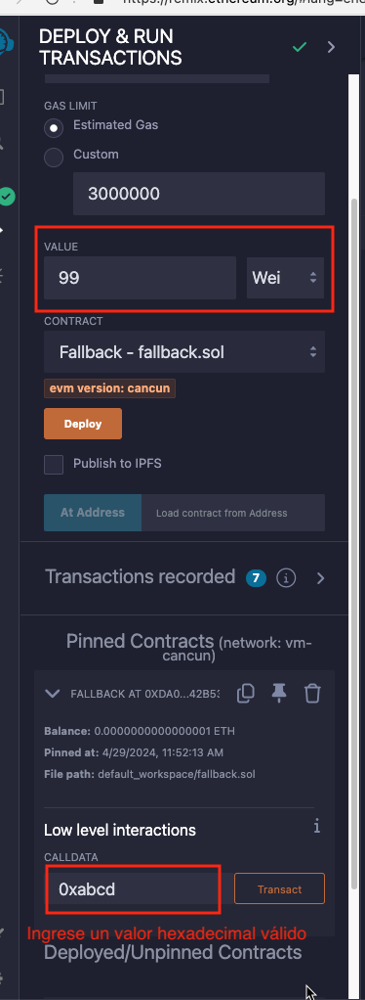
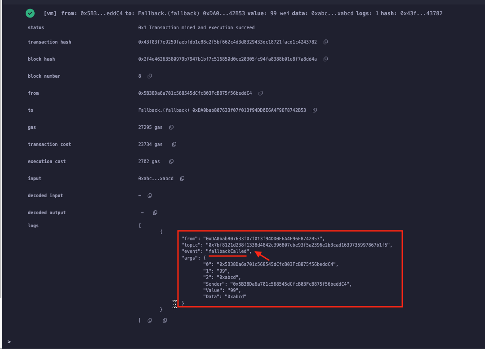

# Tutorial WTF Solidity: 19. Recibir ETH, receive y fallback

Recientemente, he estado revisando Solidity y escribiendo tutoriales en "WTF Solidity" para principiantes.

Twitter: [@0xAA_Science](https://twitter.com/0xAA_Science) | [@WTFAcademy_](https://twitter.com/WTFAcademy_)

Comunidad: [Discord](https://discord.gg/5akcruXrsk)｜[Wechat](https://docs.google.com/forms/d/e/1FAIpQLSe4KGT8Sh6sJ7hedQRuIYirOoZK_85miz3dw7vA1-YjodgJ-A/viewform?usp=sf_link)｜[Sitio web wtf.academy](https://wtf.academy)

La traducción al español ha sido realizada por Jonathan Díaz con el objetivo de hacer estos recursos accesibles a la comunidad de habla hispana.

Twitter: [@jonthdiaz](https://twitter.com/jonthdiaz)

Los códigos y tutoriales están como código abierto en GitHub: [github.com/AmazingAng/WTFSolidity](https://github.com/AmazingAng/WTFSolidity)

-----

`Solidity` tiene dos funciones especiales, `receive()` y `fallback()`, que se utilizan principalmente en dos circunstancias.
1. Recibir Ether
2. Manejar llamadas al contrato si ninguna de las otras funciones coincide con la firma de función dada (por ejemplo, contrato proxy)

Nota⚠️: Antes de la versión 0.6.x de Solidity, solo estaba disponible `fallback()` para recibir Ether y como función de respaldo.
Después de la versión 0.6, `fallback()` se separó en `receive()` y `fallback()`.

Este tutorial estará enfocado en recibir Ether.

## Recibir función ETH: receive()
La función `receive()` se utiliza únicamente para recibir `ETH`. Un contrato puede tener a lo sumo una función `receive()`, 
declarada de manera diferente, no se necesita la palabra clave `function`: `receive() external payable { ... }`. 
Esta función no puede tener argumentos, no puede devolver nada y debe tener visibilidad `external` y mutabilidad de estado `payable`.

`receive()` es ejecutado en transferencias de Ether a un contrato. No se deben realizar demasiadas operaciones en `receive()` al enviar Ether con `send` o `transfer`, 
solo hay 2300 `gas` disponible, y las operaciones complicadas desencadenarán un error `Out of Gas`; en su lugar, se debe usar la función `call` que puede especificar el límite de `gas`.
(Se cubrirán las tres formas de enviar Ether más adelante). 

Se puede enviar un `evento` en la función `receive()`, por ejemplo: 
```solidity
    // Declarar evento
    event Received(address Sender,  uint Value); 
    // Emitir evento Received
    receive() external payable {
        emit Received(msg.sender,  msg.value); 
    }
```

Algunos contratos maliciosos agregan códigos en `receive()` (`fallback()` antes de Solidity 0.6.x), que consumen una gran cantidad de `gas` o hacen que la transacción se revierta.
Así lograrán que algunas funciones de reembolso o transferencia fallen, preste atención a tales riesgos al escribir tales operaciones.

## Función de respaldo: fallback()
La función `fallback()` se ejecuta en una llamada al contrato si ninguna de las otras funciones coincide con la firma de función dada, o si no se suministró ningún dato y no hay una función `receive Ether`. 
Puede usarse para recibir Ether o en `contrato proxy`. `fallback()` se declara sin la palabra clave `function`, y debe tener visibilidad `external`, a menudo tiene mutabilidad de estado `payable`,
que se usa para recibir Ether: `fallback() external payable { ... }`.

Se declara una función `fallback()`, que enviará un evento `fallbackCalled`, con `msg.sender`, `msg.value` y `msg.data` como parámetros:
```solidity
    event fallbackCalled(address Sender,  uint Value,  bytes Data); 
    // fallback
    fallback() external payable{
        emit fallbackCalled(msg.sender,  msg.value,  msg.data); 
    }
```

# Diferencia entre receive y fallback
Ambos `receive` y `fallback` pueden recibir `ETH`, se activan en el siguiente orden:
```
Ejecutar receive() o fallback()?
         Recibir ETH
              |
      msg.data está vacío?
            /  \
          Sí   No
          /      \
¿Tiene receive()?   fallback()
        /          \
        Sí            No
        /              \
receive()           fallback()
```
Para simplificar, cuando un contrato recibe `ETH`, se ejecutará `receive()` si `msg.data` está vacío y la función `receive()` está presente; 
por otro lado, se ejecutará `fallback()` si `msg.data` no está vacío o no hay `receive()` declarado, en tal caso `fallback()` debe ser `payable`.

Si no se declara ni `receive()` ni `fallback()` en el contrato, la recepción de `ETH` fallará.


## Prueba en Remix
1. Primero desplegar "Fallback.sol" en Remix.
2. Colocar el valor (en Wei) que se desea enviar al contrato en "VALUE", luego hacer clic en "Transact".
    
3. La transacción se realizó correctamente y se emitió el evento "receivedCalled".
    
4. Colocar el valor que se desea enviar al contrato en "VALUE", y poner cualquier `msg.data` válido en "CALLDATA", y hacer clic en "Transact".
    
5. La transacción se realizó correctamente y se emitió el evento "fallbackCalled".
    

## Resumen
En este tutorial, se habló sobre dos funciones especiales en `Solidity`, `receive()` y `fallback()`, que se utilizan principalmente para recibir `ETH` y `contrato proxy`.
